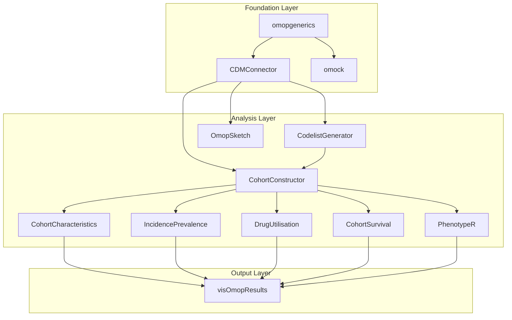

These diagram represent the core architecture of the R package ecosystem that
follows the standardized practices set by the European Medicines Agency (EMA)
DARWIN EU program, showing how different packages work together in a
standardized analytical pipeline for OMOP CDM data analysis. The workflow
follows a five-phase approach from database connection through specialized
epidemiological analyses to standardized result outputs.

# Generic Guide to Executing an Observational Study

This guide provides a generic framework for executing an observational study using the OHDSI framework and tools, based on best practices from existing studies.

## Phase 1: Study Setup and Configuration

The initial phase involves setting up the environment and configuring the study parameters.

### Environment Setup
- **Dependency Management**: Use `renv` to ensure a reproducible environment with consistent package versions. Each major component of the study (e.g., analysis, diagnostics) should have its own `renv.lock` file.

### Database Connection
- **Connection**: Establish a connection to the OMOP CDM database using `CDMConnector`.
- **Configuration**: Store database credentials and connection details in a configuration file (e.g., `CodeToRun.R`) or environment variables.

### Study Parameters
- **Centralized Configuration**: Define all study parameters (e.g., study start/end dates, cohort table names, analysis flags) in a central configuration file. This allows for easy modification and reproducibility.

## Phase 2: Cohort Definition and Instantiation

This phase focuses on defining and creating the patient populations for the study.

### Cohort Definition
- **OHDSI ATLAS**: Use OHDSI ATLAS to create and manage cohort definitions. This provides a standardized and collaborative environment for defining clinical phenotypes.
- **Export to JSON**: Export cohort definitions from ATLAS to JSON format for use in the analysis pipeline.

### Cohort Instantiation
- **Instantiation**: Use `CohortGenerator` to instantiate the JSON cohort definitions in the OMOP CDM database.
- **Cohort Types**: Create cohorts for different purposes:
    - **Exposure Cohorts**: Patients exposed to a drug or vaccine.
    - **Outcome Cohorts**: Patients with specific health outcomes of interest.
    - **Control/Comparator Cohorts**: Patients for comparison (e.g., unexposed, tested negative).

## Phase 3: Data Quality and Attrition

Ensure the quality of the study population by applying exclusion criteria and tracking patient attrition.

- **Attrition Tracking**: Maintain a detailed record of patient exclusions at each step of cohort creation.
- **Exclusion Criteria**: Apply common exclusion criteria:
    - **Age**: e.g., patients must be 18 years or older.
    - **Prior Observation**: e.g., at least 180 days of continuous observation before cohort entry.
    - **Washout Periods**: To prevent multiple entries for the same patient or confounding events.

## Phase 4: Analysis Pipeline

The core of the study, where the main analysis is performed.

- **Orchestration**: Use a main script (e.g., `RunStudy.R`) to orchestrate the entire analysis workflow.
- **Baseline Characteristics**: Generate baseline characteristics of the study population to assess balance between groups.
- **Statistical Analysis**:
    - **Propensity Score Matching/Weighting**: To control for confounding variables.
    - **Survival Analysis**: To estimate the risk of outcomes over time.

## Phase 5: Results Generation

Generate and export the final results of the study.

- **Tables and Figures**: Automatically generate tables and figures for publication and review.
- **Export Results**: Export detailed results to structured formats like CSV for transparency and meta-analysis.

## Phase 6: Diagnostics and Validation

Validate the cohort definitions and the overall study setup.

- **PhenotypeR**: Use the `PhenotypeR` package for comprehensive cohort diagnostics.
- **Interactive Visualization**: Use Shiny applications to interactively explore diagnostic results.
