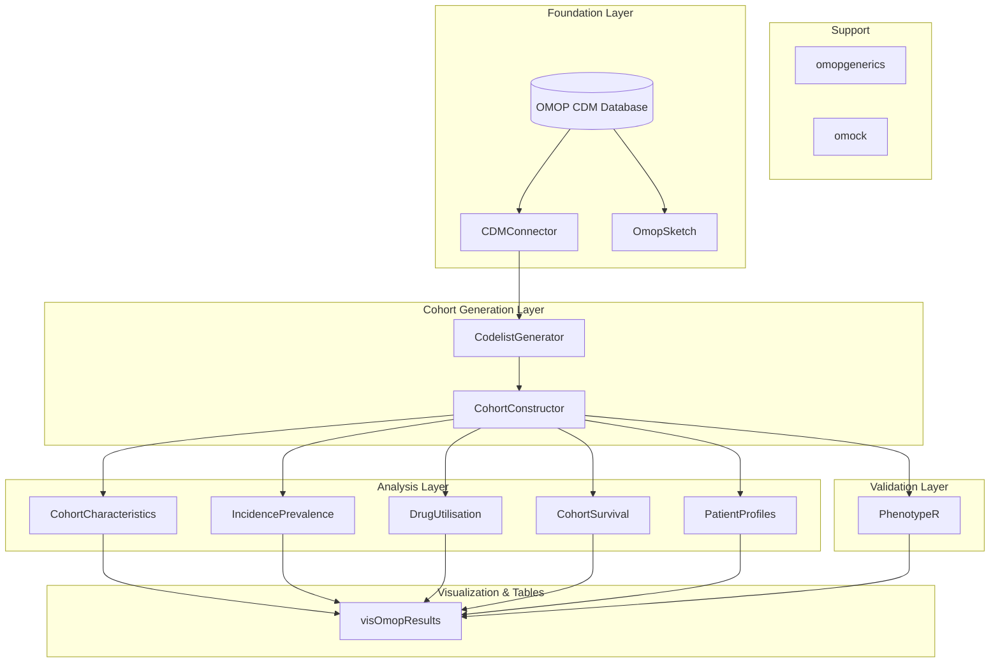
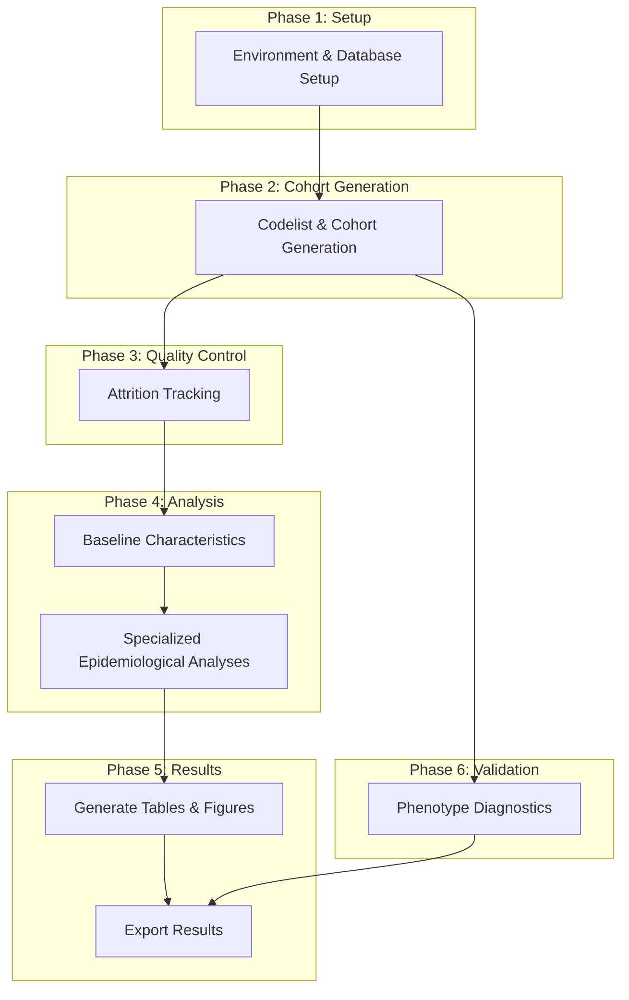

---

layout: default
title: Data Analysis
nav_order: 3
has_children: true

---

# Executing an Observational Study
{: .no_toc }

Observational studies using real-world data (RWD) are essential for
understanding disease, treatment effectiveness, and patient outcomes in a
real-world setting. The OMOP Common Data Model (CDM) provides the global
standard for structuring this data, enabling transparent and reproducible
research across different healthcare databases.

To harness the power of the OMOP CDM, a suite of specialized R packages has
been developed. These packages provide a robust framework for every stage of an
observational study, from defining patient populations to generating final
results. Using this standardized toolkit ensures that research is not only
efficient but also adheres to the highest scientific standards, as promoted by
regulatory bodies like the European Medicines Agency (EMA) through initiatives
such as DARWIN EU.

This guide provides a practical, step-by-step framework for executing an
observational study using these tools. We will walk through the key phases of a
study, using code examples to illustrate each step.

1. TOC
{:toc}


## Package Interconnectivity

The following diagram illustrates how these packages work together in a typical
analysis pipeline. The flow starts from the **Foundation Layer** for data
connection, moves to the **Cohort Generation Layer** to define populations,
proceeds to the **Analysis** and **Validation Layers** for the core scientific
work, and ends with the **Visualization Layer** for reporting.



## Package Categories and Purposes

### Foundation Layer
These are the core packages that establish the connection to the database and
provide the basic infrastructure for all other operations.

| Library | Purpose |
| :--- | :--- |
| **`omopgenerics`** | Provides a common set of classes and methods to ensure interoperability between different OHDSI packages. |
| **`CDMConnector`** | Establishes and manages the connection to an OMOP CDM database, creating the `cdm` object. |
| **`omock`** | A utility for creating mock `cdm` objects for testing and development purposes. |

### Cohort Generation Layer
These packages are used to define and create the patient populations (cohorts)
that form the basis of any study.

| Library | Purpose |
| :--- | :--- |
| **`CodelistGenerator`** | Creates codelists (sets of medical codes) from OMOP concept sets. |
| [**`CohortConstructor`**](./package_reference/cohortconstructor.md) | Builds patient cohorts from codelists and other criteria, such as temporal windows or intersections with other cohorts. |

### Analysis Layer
This layer contains packages that perform specific types of epidemiological or
characterization analyses on the generated cohorts.

| Library | Purpose |
| :--- | :--- |
| **`CohortCharacteristics`** | Summarizes the baseline characteristics of a cohort, including demographics, comorbidities, and other features. |
| **`IncidencePrevalence`** | Calculates the incidence and prevalence of health outcomes within a study population. |
| **`DrugUtilisation`** | Analyzes patterns of drug use, such as treatment pathways and adherence. |
| **`CohortSurvival`** | Performs time-to-event (survival) analysis to estimate the risk of outcomes over time. |
| **`PatientProfiles`** | Adds detailed demographic and clinical features to patient cohorts for in-depth characterization. |
| **`OmopSketch`** | Provides a quick summary or "sketch" of the data in an OMOP CDM instance. |

### Validation Layer
This layer is focused on quality control and ensuring the clinical validity of
the cohort definitions.

| Library | Purpose |
| :--- | :--- |
| **`PhenotypeR`** | Provides a comprehensive suite of diagnostics to evaluate and validate the quality of clinical phenotype definitions. |

### Visualization & Reporting Layer
These packages are used to generate the final outputs of a study, including
tables, figures, and interactive applications.

| Library | Purpose |
| :--- | :--- |
| **`visOmopResults`** | Creates standardized visualizations and tables from the results of other OHDSI packages. |
| **`ggplot2`** | A general-purpose and highly flexible plotting library used for creating custom visualizations. |

# Performing an analysis

The following diagram provides a high-level overview of the sequential phases involved in a typical observational study.



## Phase 1: Study Setup and Configuration

The initial phase involves setting up the R environment and establishing a connection to the database.

### Environment Setup
- **Dependency Management**: It is best practice to use `renv` to ensure a reproducible environment with consistent package versions. This creates a `renv.lock` file that captures the state of your project's dependencies.

### Database Connection
- **Connection**: The first step in your R script is to establish a live connection to the OMOP CDM database using the `CDMConnector` package. This creates a `cdm` object that points to the database tables without loading them into memory. For this example, we'll use a local DuckDB database.

```r
library(CDMConnector)
library(duckdb)

# Connect to a local DuckDB database file
db_file <- "omop_<data_order_id>_<date>.duckdb"

con <- DBI::dbConnect(
  duckdb(),
  dbdir = db_file
)

# Define database schemas to read the data and store the results
cdm_schema <- "cdm"
write_schema <- "analysis"

# Create the cdm object
cdm <- cdmFromCon(
  con = con,
  cdm_schema = cdm_schema,
  write_schema = write_schema
)
```

## Phase 2: Cohort Definition and Instantiation

This phase involves defining the medical concepts of interest and constructing patient cohorts based on these concepts. The `CodelistGenerator` package provides systematic methods for identifying relevant medical concepts, while `CohortConstructor` transforms these concepts into patient cohorts.

Base cohort creation functions:
- `conceptCohort()` - creates cohorts based on clinical concepts
- `demographicsCohort()` - creates cohorts based on demographic criteria
- `measurementCohort()` - creates cohorts based on measurement values
- `deathCohort()` - creates cohorts based on death records


### Codelist and Cohort Generation
- **CodelistGenerator**: Use `CodelistGenerator` to create codelists from concept sets. A codelist is a set of medical codes (e.g., for a disease or a drug) that define a clinical idea.
- **CohortConstructor**: Use `CohortConstructor` to build cohorts from these codelists.

For example, to create a cohort of patients with Hypertrophic Cardiomyopathy (HCM) who have received a first-line therapy:

```r
library(CodelistGenerator)
library(CohortConstructor)

# 1. Get codelists for the disease and treatments
hcm_codes <- get_codelist_from_concept_set(4247, cdm)
beta_blockers_codes <- get_codelist_from_concept_set(4886, cdm)
ccb_non_dhp_codes <- get_codelist_from_concept_set(4887, cdm)

# 2. Combine treatment codes into a single "first-line therapy" codelist
first_line_therapy_codes <- merge_codelists(
  beta_blockers_codes,
  ccb_non_dhp_codes
)

# 3. Create initial cohorts based on the codelists
cdm$hcm <- concept_cohort(cdm, hcm_codes, name = "hcm")
cdm$first_line_therapy <- concept_cohort(cdm, first_line_therapy_codes, name = "first_line_therapy")

# 4. Intersect the cohorts to find patients with HCM who have received the therapy
cdm$hcm_first_line_treated <- cdm$first_line_therapy |>
  require_cohort_intersect(
    target_cohort_table = "hcm",
    window = c(-Inf, 0) # The HCM diagnosis must be on or before the treatment start date
  )
```

## Phase 3: Data Quality and Attrition

After instantiating your cohort, it's crucial to understand how many patients were included or excluded at each step.

- **Attrition Tracking**: The `summarise_cohort_attrition()` function provides a detailed record of patient exclusions. This is often visualized with `plot_cohort_attrition()`.

```r
cdm$hcm_first_line_treated |>
  summarise_cohort_attrition() |>
  plot_cohort_attrition()
```
This plot helps ensure the logic of your cohort definition is working as expected and provides transparency for your final study report.

## Phase 4: Analysis Pipeline

This is the core of the study, where you characterize the study population and perform your main analyses.

### Baseline Characteristics
A critical first step is to generate the baseline characteristics of your study population. The `CohortCharacteristics` package is designed for this purpose.

- **Demographics**: You can easily compute age and sex for your cohort.
- **Comorbidities and Clinical Events**: You can assess the prevalence of various conditions or events in your cohort's history.

```r
library(CohortCharacteristics)

# Example: Summarize age and sex for the study cohort
cdm$hcm_first_line_treated |>
  add_age() |>
  add_sex() |>
  summarise_characteristics(
    demographics = TRUE,
    age_group = list(c(18, 49), c(50, 69), c(70, 150))
  )
```

### Specialized Analyses
Depending on your study's objectives, you can now run various specialized analyses:
- **`IncidencePrevalence`**: To calculate the incidence and prevalence of health outcomes.
- **`DrugUtilisation`**: To study patterns of medication use.
- **`CohortSurvival`**: To perform survival analysis.

## Phase 5: Results Generation

The final phase involves generating and exporting the results in a clear and shareable format.

- **Tables and Figures**: The `visOmopResults` package provides tools to visualize your results. For example, you can create publication-ready tables of baseline characteristics.

```r
library(visOmopResults)

# Generate and table the characteristics summary
results <- cdm$hcm_first_line_treated |>
  add_age() |>
  add_sex() |>
  summarise_characteristics()

table_characteristics(results)
```

- **Export Results**: You can export all results to structured formats like CSV for transparency, meta-analysis, or use in other programs.

## Phase 6: Diagnostics and Validation

Before and after your analysis, it is crucial to validate your cohort definitions.

- **`PhenotypeR`**: The `PhenotypeR` package provides a comprehensive suite of diagnostics to evaluate the quality of your clinical phenotype definitions. This helps ensure that your study cohorts accurately represent the patient populations you intend to study.
