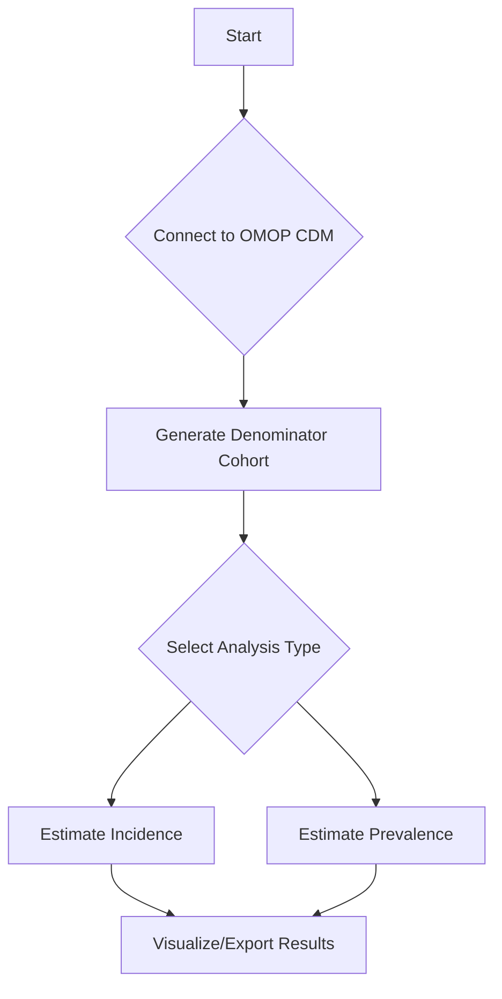

# [IncidencePrevalence](https://darwin-eu.github.io/IncidencePrevalence/)

## Overview

The `IncidencePrevalence` R package provides a set of tools to calculate population-level incidence rates and prevalence of health conditions using data in the OMOP Common Data Model (CDM) format. It is designed to streamline epidemiological studies by offering standardized functions for cohort-based analysis, ensuring reproducibility and comparability across different datasets.

### Key Features:
- **Incidence Rate Calculation**: Estimates incidence rates with support for repeated events, washout periods, and censoring.
- **Prevalence Estimation**: Calculates both point and period prevalence, with options for full contribution and complete database intervals.
- **OMOP CDM Integration**: Seamlessly works with the OMOP CDM through integration with [`CDMConnector`](https://darwin-eu.github.io/CDMConnector/) and [`omopgenerics`](https://darwin-eu.github.io/omopgenerics/).
- **Standardized Outputs**: Produces results in the `summarised_result` format, ensuring compatibility with other OHDSI tools.
- **Visualization**: Includes built-in functions for plotting incidence and prevalence results.

## Installation

You can install the stable version of `IncidencePrevalence` from CRAN:
```r
install.packages("IncidencePrevalence")
```

Alternatively, you can install the development version from GitHub:
```r
# install.packages("remotes")
remotes::install_github("darwin-eu/IncidencePrevalence")
```

## Getting Started

Here is a basic example of how to use the `IncidencePrevalence` package to calculate incidence and prevalence.

### 1. Load Libraries and Create a Mock CDM
First, load the necessary libraries and create a mock CDM object for demonstration purposes.
```r
library([IncidencePrevalence](https://darwin-eu.github.io/IncidencePrevalence/))
library([CDMConnector](https://darwin-eu.github.io/CDMConnector/))

cdm <- [mockIncidencePrevalence](https://darwin-eu.github.io/IncidencePrevalence/)()
```

### 2. Generate a Denominator Cohort
Next, define the population at risk by generating a denominator cohort.
```r
cdm <- generateDenominatorCohortSet(
  cdm = cdm,
  name = "denominator",
  ageGroup = list(c(18, 65)),
  sex = "Both",
  daysPriorObservation = 365
)
```

### 3. Calculate Incidence
With the denominator cohort in place, you can now estimate incidence rates.
```r
incidence_result <- estimateIncidence(
  cdm = cdm,
  denominatorTable = "denominator",
  outcomeTable = "outcome"
)
```

### 4. Calculate Prevalence
Similarly, you can estimate point or period prevalence.
```r
prevalence_result <- estimatePointPrevalence(
  cdm = cdm,
  denominatorTable = "denominator",
  outcomeTable = "outcome"
)
```

### 5. Visualize Results
The package includes plotting functions to easily visualize your results.
```r
plotIncidence(incidence_result)
plotPrevalence(prevalence_result)
```

## Core Concepts

The `IncidencePrevalence` package is built around a few core concepts that are essential for understanding how it works.

### Analysis Workflow
The general workflow for any analysis involves three main steps:
1. **Data Preparation**: Connecting to an OMOP CDM database and ensuring the necessary cohort tables are available.
2. **Denominator Cohort Generation**: Defining the population at risk using `generateDenominatorCohortSet`.
3. **Analysis**: Running `estimateIncidence`, `estimatePointPrevalence`, or `estimatePeriodPrevalence` to calculate the desired measures.



### Denominator vs. Outcome Cohorts
- **Denominator Cohort**: The population at risk. This is the group of people who are eligible to be included in the analysis. It is typically generated using `generateDenominatorCohortSet`.
- **Outcome Cohort**: The group of people who have experienced the health outcome of interest. This cohort must be created before running the analysis.

## Advanced Usage

### Stratified Analysis
You can perform stratified analysis by defining different denominator cohorts based on age, sex, or other criteria.
```r
cdm <- generateDenominatorCohortSet(
  cdm = cdm,
  name = "stratified_denominator",
  ageGroup = list(c(18, 40), c(41, 65)),
  sex = c("Male", "Female")
)

incidence_stratified <- estimateIncidence(
  cdm = cdm,
  denominatorTable = "stratified_denominator",
  outcomeTable = "outcome"
)

plotIncidence(incidence_stratified, facet = c("denominator_age_group", "denominator_sex"))
```

### Time-at-Risk Windows
For more complex study designs, you can define specific time-at-risk windows for target cohorts using `generateTargetDenominatorCohortSet`.

## API Reference

### Main Functions
- `generateDenominatorCohortSet()`: Creates denominator cohorts based on age, sex, and prior observation criteria.
- `estimateIncidence()`: Calculates incidence rates.
- `estimatePointPrevalence()`: Calculates prevalence at specific points in time.
- `estimatePeriodPrevalence()`: Calculates prevalence over a period of time.
- `plotIncidence()`: Generates plots for incidence results.
- `plotPrevalence()`: Generates plots for prevalence results.
- `tableIncidence()`: Creates formatted tables for incidence results.
- `tablePrevalence()`: Creates formatted tables for prevalence results.

## Examples

### Example 1: Calculating Yearly Incidence for Different Age Groups
This example demonstrates how to calculate and visualize yearly incidence rates for two different age groups.
```r
cdm <- generateDenominatorCohortSet(
  cdm = cdm,
  name = "age_groups",
  ageGroup = list(c(0, 50), c(51, 100)),
  sex = "Both",
  daysPriorObservation = 365
)

incidence_by_age <- estimateIncidence(
  cdm = cdm,
  denominatorTable = "age_groups",
  outcomeTable = "outcome",
  interval = "years"
)

plotIncidence(incidence_by_age, facet = "denominator_age_group")
```

### Example 2: Monthly Point Prevalence
This example shows how to calculate monthly point prevalence and visualize the results.
```r
prevalence_monthly <- estimatePointPrevalence(
  cdm = cdm,
  denominatorTable = "denominator",
  outcomeTable = "outcome",
  interval = "months"
)

plotPrevalence(prevalence_monthly)
```
