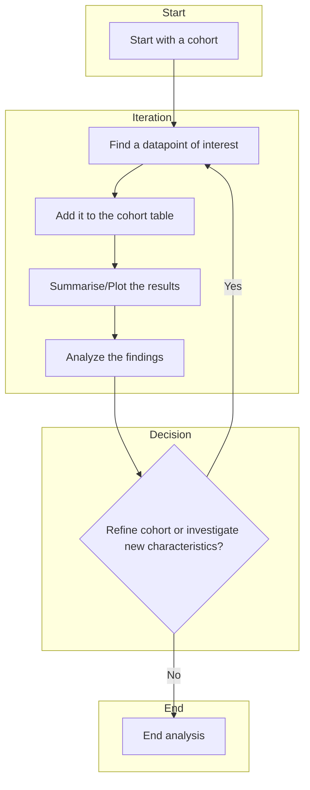
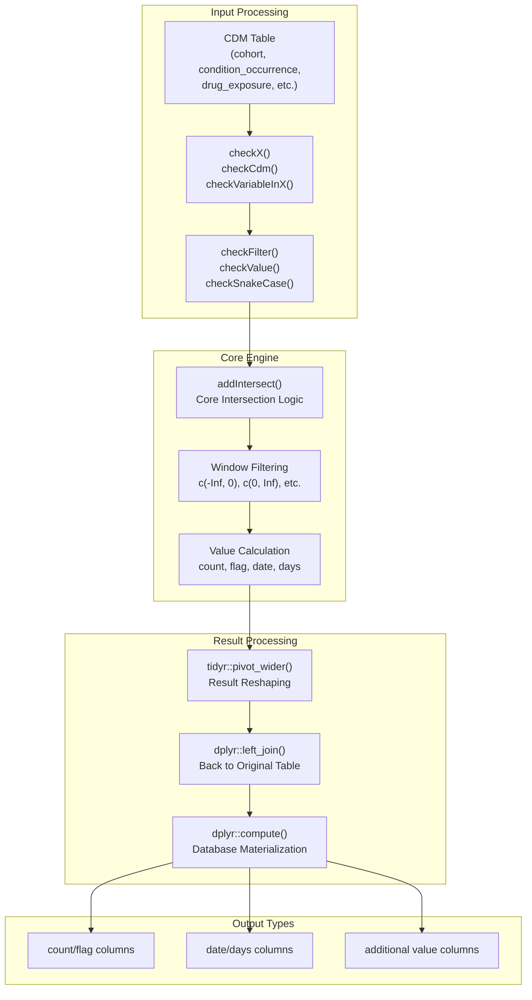
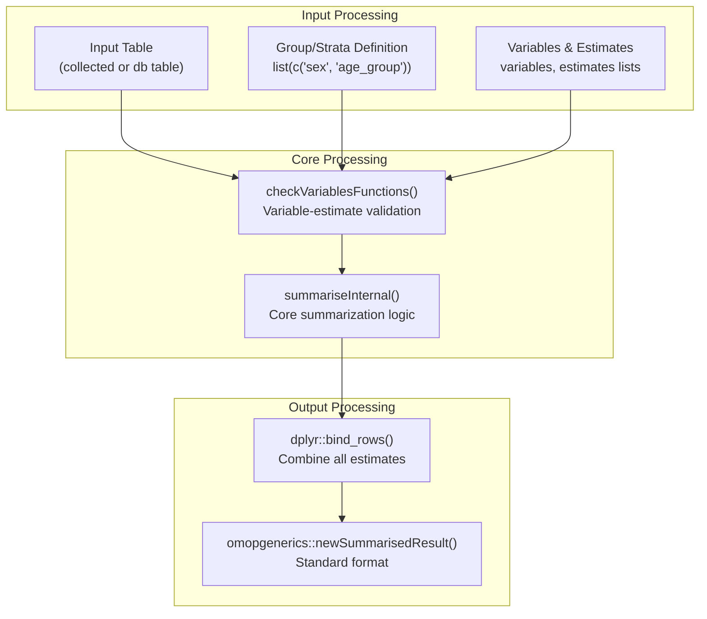

# [PatientProfiles](https://darwin-eu.github.io/PatientProfiles/)
{: .no_toc}

[PatientProfiles](https://darwin-eu.github.io/PatientProfiles/) is an R package designed to help you characterize and analyze patient cohorts within the OMOP Common Data Model (CDM). The main purpose of the package is to facilitate an iterative workflow where you can easily add new data points of interest to a cohort table and then summarize or plot the results. This allows you to progressively build a detailed profile of a patient group, analyze the findings, and use those insights to refine your cohort or investigate new characteristics.

1. TOC
{:toc}


The package follows a layered architecture with core processing engines,
specialized function modules, and external integrations.



## Installation

To install the PatientProfiles package from GitHub, use the following command in R:

```r
# Note: Installation instructions were not found and have been inferred.
# install.packages("devtools")
devtools::install_github("darwin-eu/PatientProfiles")
```

## Getting Started

This tutorial walks through a basic example of how to use PatientProfiles to add demographic information to a cohort.

### 1. Load the Package and Create Mock Data

First, load the package and create a mock CDM database for demonstration purposes.

```r
library(PatientProfiles)
library(dplyr)

# Create a mock database connection
cdm <- mockPatientProfiles()
```

### 2. Add Demographics to a Cohort

Use the `addDemographics()` function to add age, sex, and observation history to your cohort.

```r
# Add demographics to the cohort1 table
cdm$cohort1 <- cdm$cohort1 %>%
  addDemographics(
    indexDate = "cohort_start_date",
    ageGroup = list(c(0, 18), c(19, 65), c(66, 100))
  )

# View the results
glimpse(cdm$cohort1)
```

This will add new columns to your table, such as `age`, `sex`, `prior_observation`, and `future_observation`.

## Core Concepts

### Data Intersection System

The core of PatientProfiles is its unified intersection system, which analyzes temporal relationships between different clinical data sources.



### Statistical Summarization

The `summariseResult()` function provides comprehensive statistical analysis with support for grouping, stratification, and various estimates.



## API Reference / Advanced Usage

### Cohort Intersections

Analyze overlaps between different patient cohorts.

- `addCohortIntersectFlag()`: Check if a patient is in another cohort.
- `addCohortIntersectCount()`: Count occurrences in another cohort.
- `addCohortIntersectDate()`: Get the date of the intersection.
- `addCohortIntersectDays()`: Calculate days to the intersection.

### Concept Intersections

Find intersections with OMOP concept sets across clinical domains.

- `addConceptIntersectFlag()`: Check for the presence of a concept.
- `addConceptIntersectCount()`: Count concept occurrences.
- `addConceptIntersectField()`: Extract a specific field related to a concept.

### Observation Period Management

Handle complex temporal constraints and track observation periods.

- `addInObservation()`: Check if an event occurs within an observation period.
- `addPriorObservation()`: Calculate the amount of prior observation time.
- `addFutureObservation()`: Calculate the amount of future observation time.
- `addObservationPeriodId()`: Assign an ID to each observation period.

### Death Analysis

Incorporate mortality data into your analysis.

- `addDeathDate()`: Add the date of death.
- `addDeathDays()`: Calculate days from an index date to death.
- `addDeathFlag()`: Add a binary flag for death.

## Examples

### Add Age and Sex to a Cohort

```r
cdm$cohort1 <- cdm$cohort1 %>%
  addAge(indexDate = "cohort_start_date") %>%
  addSex()

glimpse(cdm$cohort1)
```

### Add Cohort Intersection Information

Count how many times patients in `cohort1` also appear in `cohort2` within a year.

```r
cdm$cohort1 <- cdm$cohort1 %>%
  addCohortIntersectCount(
    targetCohortTable = "cohort2",
    window = list(c(-365, 365))
  )

glimpse(cdm$cohort1)
```

### Putting it all together: an iterative example
{: .no_toc}

This example demonstrates the iterative workflow of PatientProfiles. We start with a cohort, add some characteristics, summarize the results, and then use those results to ask a new question and iterate.

#### 1. Start with a cohort and add demographics
{: .no_toc}

First, we start with our cohort of interest and add some basic demographic information.

```r
cdm$cohort1 <- cdm$cohort1 %>%
  addDemographics(
    indexDate = "cohort_start_date",
    ageGroup = list(c(0, 18), c(19, 65), c(66, 100))
  )
```

#### 2. Add cohort intersection information and summarize
{: .no_toc}

Now, let's see how many of these patients are in `cohort2` and summarize the results.

```r
cdm$cohort1 <- cdm$cohort1 %>%
  addCohortIntersectCount(
    targetCohortTable = "cohort2",
    window = list(c(-365, 365))
  )

cdm$cohort1 %>%
  summariseResult()
```

#### 3. Analyze the findings and ask a new question
{: .no_toc}

Let's say the summary shows that a significant number of patients in `cohort1` are also in `cohort2`. This might lead us to ask: "What is the time difference between the `cohort1` start date and the `cohort2` start date?"

#### 4. Iterate and refine the analysis
{: .no_toc}

We can now add this new information to our table and re-summarize.

```r
cdm$cohort1 <- cdm$cohort1 %>%
  addCohortIntersectDate(
    targetCohortTable = "cohort2",
    window = list(c(-365, 365)),
    nameStyle = "date_of_cohort2"
  ) %>%
  addCohortIntersectDays(
    targetCohortTable = "cohort2",
    window = list(c(-365, 365)),
    nameStyle = "days_to_cohort2"
  )

cdm$cohort1 %>%
  summariseResult()
```

This iterative process of adding new characteristics and summarizing the results allows you to progressively build a detailed profile of your patient cohort and refine your research questions as you go.


Generate a statistical summary of patient characteristics.

```r
cdm$cohort1 %>%
  addDemographics() %>%
  summariseResult()
```
