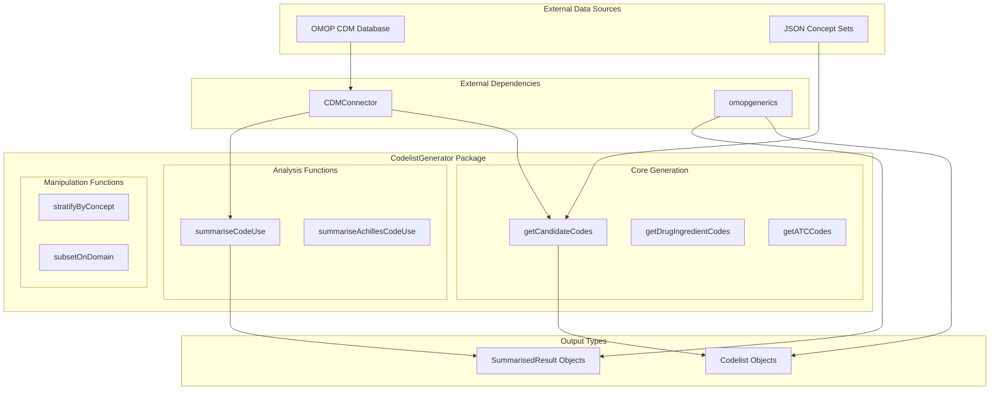

# CodelistGenerator

CodelistGenerator is an R package for generating and evaluating codelists of medical concepts in the Observational Medical Outcomes Partnership (OMOP) Common Data Model (CDM). It provides functions to create codelists from OMOP vocabularies using keyword searches, clinical code hierarchies (e.g., ATC, ICD10), or by importing existing concept set definitions. The package also includes tools for analysing the use of codes in a database, helping researchers to refine and validate their codelists.

## Installation

To install CodelistGenerator, use the following command in R:

```r
install.packages("CodelistGenerator")
```

You can also install the development version from GitHub:

```r
# install.packages("devtools")
devtools::install_github("darwin-eu/CodelistGenerator")
```

## Getting Started

Here is a basic example of how to use CodelistGenerator to create a codelist for "asthma" and analyse its usage in an OMOP CDM database.

```r
# Load the package
library(CodelistGenerator)
library(CDMConnector)

# Connect to a mock CDM database for demonstration
cdm <- mockVocabRef()

# 1. Generate a candidate codelist for asthma
asthma_codes <- getCandidateCodes(
  cdm = cdm,
  keywords = "asthma",
  domains = "Condition"
)

# 2. Summarise the use of these codes in the database
asthma_usage <- summariseCodeUse(
  x = list("asthma" = asthma_codes$concept_id),
  cdm = cdm
)

# 3. View the results
print(asthma_usage)
```

## Core Concepts

CodelistGenerator's functionality is organised around a few core concepts:

*   **Codelist Generation**: Creating lists of concept IDs based on different criteria (keywords, hierarchies).
*   **Codelist Analysis**: Evaluating how codes are used in the database (e.g., frequency, distribution).
*   **Codelist Manipulation**: Filtering, stratifying, and comparing codelists.
*   **OMOP CDM Integration**: The package is designed to work seamlessly with OMOP CDM databases via the `CDMConnector` package.

### System Architecture

The diagram below shows the overall architecture of CodelistGenerator and its interaction with the OMOP CDM.



## API Reference / Advanced Usage

### Key Functions

| Function | Description |
| --- | --- |
| `getCandidateCodes()` | Generate a codelist from keywords. |
| `getDrugIngredientCodes()` | Create codelists from drug ingredients. |
| `getATCCodes()` | Get codes based on ATC classification. |
| `getICD10StandardCodes()` | Get standard concepts from ICD-10 codes. |
| `summariseCodeUse()` | Analyse the usage of codes in the database. |
| `summariseAchillesCodeUse()` | Analyse code usage using Achilles results. |
| `stratifyByConcept()` | Split a codelist into individual concepts. |
| `subsetToCodesInUse()` | Filter a codelist to only include codes present in the database. |
| `codesFromConceptSet()` | Import a codelist from a JSON concept set expression. |

### Advanced Example: Stratifying a Drug Codelist

This example shows how to create a codelist for metformin, stratify it by dose unit, and check the usage of each dose form.

```r
# Load packages
library(CodelistGenerator)
library(CDMConnector)

# Connect to a mock CDM
cdm <- mockVocabRef()

# Generate a codelist for metformin
metformin_codes <- getDrugIngredientCodes(
  cdm = cdm,
  name = "metformin"
)

# Stratify by dose unit
metformin_stratified <- stratifyByDoseUnit(
  x = metformin_codes,
  cdm = cdm
)

# Summarise the usage of each dose unit
metformin_usage <- summariseCodeUse(
  x = metformin_stratified,
  cdm = cdm
)

# View the results
print(metformin_usage)
```

## Examples

### Example 1: Creating a Codelist from Multiple Keywords

You can use multiple keywords to create a more comprehensive codelist.

```r
# Load packages
library(CodelistGenerator)
library(CDMConnector)

# Connect to a mock CDM
cdm <- mockVocabRef()

# Generate a codelist for different types of arthritis
arthritis_codes <- getCandidateCodes(
  cdm = cdm,
  keywords = c("osteoarthritis", "rheumatoid arthritis"),
  domains = "Condition"
)

# View the resulting concepts
print(arthritis_codes)
```

### Example 2: Importing a Codelist from a JSON File

You can import a concept set exported from OHDSI ATLAS.

```r
# Load packages
library(CodelistGenerator)
library(CDMConnector)

# Connect to a mock CDM
cdm <- mockVocabRef()

# Create a temporary JSON file for demonstration
json_file <- tempfile(fileext = ".json")
writeLines(
  '[
    {
      "items": [
        {
          "concept": {
            "CONCEPT_ID": 317009,
            "CONCEPT_NAME": "Asthma",
            "STANDARD_CONCEPT": "S",
            "STANDARD_CONCEPT_CAPTION": "Standard",
            "INVALID_REASON": "V",
            "INVALID_REASON_CAPTION": "Valid",
            "CONCEPT_CODE": "195967001",
            "DOMAIN_ID": "Condition",
            "VOCABULARY_ID": "SNOMED",
            "CONCEPT_CLASS_ID": "Clinical Finding"
          },
          "isExcluded": false,
          "includeDescendants": true,
          "includeMapped": false
        }
      ]
    }
  ]',
  json_file
)

# Import the concept set
asthma_from_json <- codesFromConceptSet(
  path = json_file,
  cdm = cdm
)

# View the imported codelist
print(asthma_from_json)
```