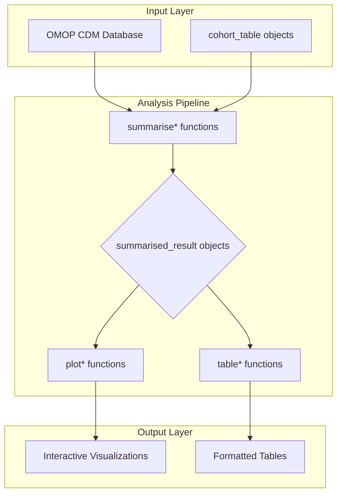

# [CohortCharacteristics](https://darwin-eu.github.io/CohortCharacteristics/)
{: .no_toc}

1. TOC
{:toc}

The `CohortCharacteristics` R package is designed to summarize and visualize the characteristics of patient cohorts within data mapped to the Observational Medical Outcomes Partnership (OMOP) Common Data Model (CDM). It provides a robust toolkit for analyzing patient demographics, cohort overlaps, attrition patterns, and temporal relationships. This package helps researchers understand the composition of their study cohorts, ensuring transparency and reproducibility in observational research.

## Installation

You can install the latest version of `CohortCharacteristics` from CRAN:

```R
install.packages("CohortCharacteristics")
```

Alternatively, to install the development version from GitHub, use the following command:

```R
# install.packages("pak")
pak::pkg_install("darwin-eu/CohortCharacteristics")
```

## Getting Started

Here’s a simple example to get you started with `CohortCharacteristics`. This tutorial walks you through connecting to a mock database, generating a cohort, and summarizing its basic characteristics.

```R
# Load necessary libraries
library(CDMConnector)
library(CohortCharacteristics)
library(dplyr)

# 1. Create a mock CDM instance
cdm <- mockCohortCharacteristics()

# 2. Summarise cohort characteristics
characteristics <- summariseCharacteristics(
  cohort = cdm$cohort1
)

# 3. View the results as a table
tableCharacteristics(characteristics)
```

## Core Concepts

The package follows a standardized three-tier analysis pattern: `summarise*()` → `plot*()` → `table*()`. This ensures a consistent workflow where summarization functions create standardized result objects, which then feed into visualization and table generation functions.



## Summary Functions

### Core Characterization:

- `summariseCharacteristics(strata, cohortId, ageGroup, tableIntersect, cohortIntersect, conceptIntersect)` - Generate comprehensive cohort characteristics.
- `summariseLargeScaleCharacteristics(window, eventInWindow, minimumFrequency)` - Summarize all clinical events in time windows.
- `summariseCohortTiming(restrictToFirstEntry)` - Analyze timing between cohort entries.
- `summariseCohortOverlap()` - Analyze overlap between multiple cohorts.
- `summariseCohortAttrition()` - Generate cohort attrition summaries.

## Table Functions

### Formatted Output:

- `tableCharacteristics(result, header)` - Create formatted characteristic tables.
- `tableLargeScaleCharacteristics(result)` - Format large-scale characteristic results.
- `tableTopLargeScaleCharacteristics(result, topConcepts)` - Show top concepts from large-scale analysis.
- `tableCohortOverlap(result)` - Format cohort overlap tables.
- `tableCohortTiming(result, timeScale, uniqueCombinations)` - Format timing analysis tables.
- `tableCohortAttrition(result)` - Format attrition tables.

## Visualization Functions

### Plotting Capabilities:

- `plotCharacteristics(result, plotStyle, facet, colour)` - Create characteristic plots (boxplot, barplot).
- `plotCohortOverlap(result, uniqueCombinations)` - Visualize cohort overlaps.
- `plotCohortTiming(result, plotType, timeScale, uniqueCombinations)` - Create timing plots (boxplot, densityplot).
- `plotCohortAttrition(result, type)` - Generate attrition flowcharts.
- `plotComparedLargeScaleCharacteristics(result, colour, reference)` - Create comparative scatter plots for large-scale characteristics.
