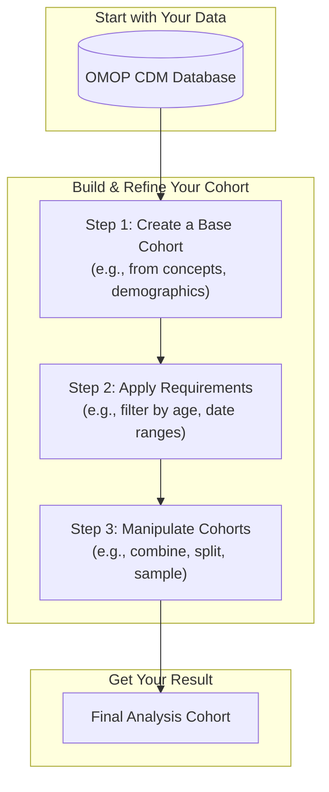
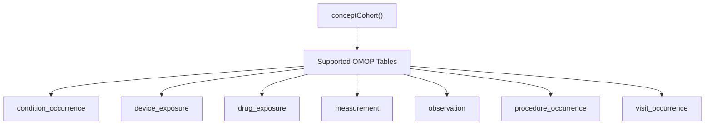
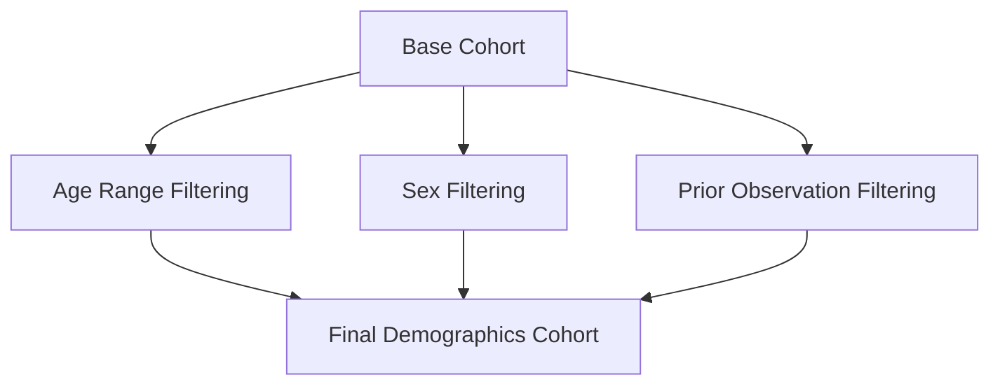
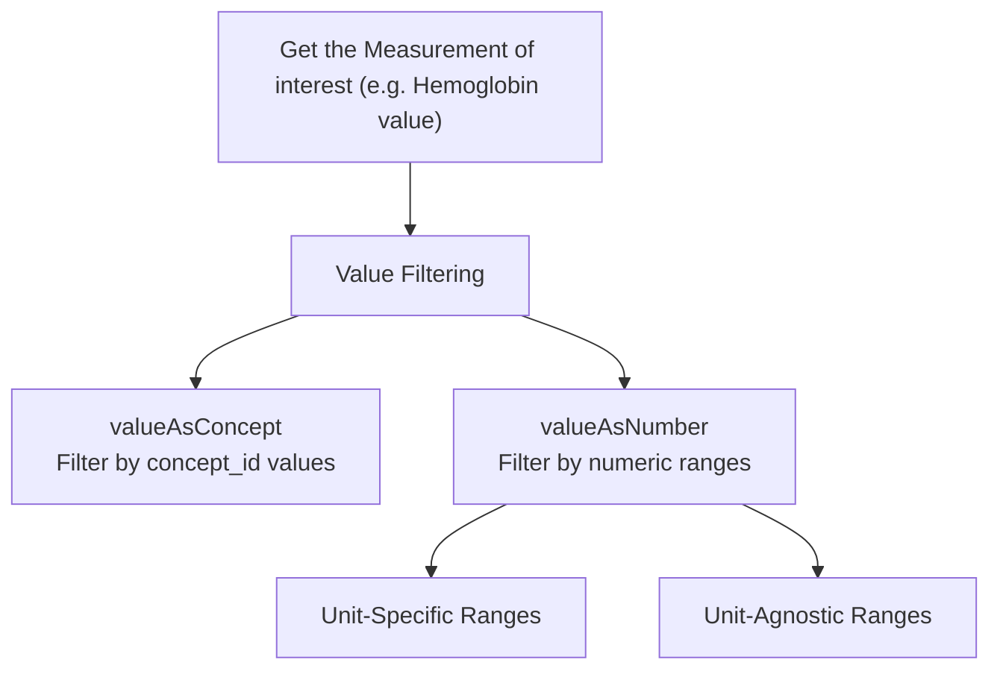
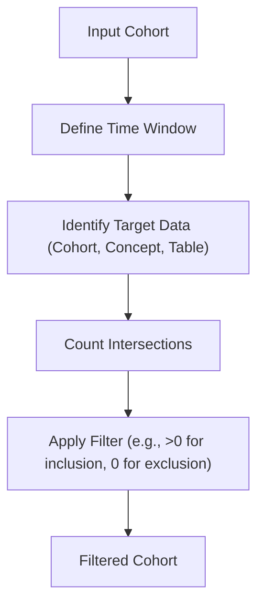
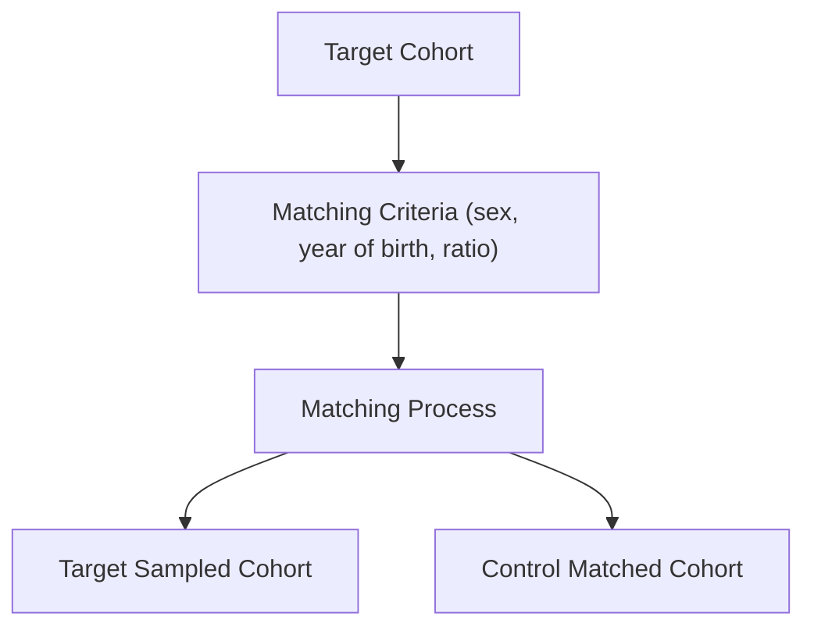

# [CohortConstructor](https://ohdsi.github.io/CohortConstructor/)
{: .no_toc}

This document provides a comprehensive guide to using the `CohortConstructor` R
package, designed to take you from a beginner to an expert user. We will cover
everything from basic setup to advanced cohort manipulation and performance
benchmarking.

1. TOC
{:toc}

## 1. Overview

`CohortConstructor` is an R package for creating and manipulating study cohorts using data mapped to the OMOP Common Data Model (CDM). It is a foundational tool in the OHDSI ecosystem for building research cohorts with full reproducibility and transparent attrition tracking.

### Purpose and Scope

- **Base Cohort Generation**: Create initial cohorts from OMOP concept sets, demographics, measurements, and death records.
- **Requirement Application**: Filter cohorts based on demographic criteria, date ranges, and intersections with other data.
- **Cohort Manipulation**: Combine, split, sample, and transform existing cohorts.
- **Metadata Management**: Track cohort settings, attrition, and provenance.

### System Architecture



## 2. Getting Started

### Installation

```r
# From CRAN
install.packages("CohortConstructor")

# Development version from GitHub
# install.packages("devtools")
devtools::install_github("ohdsi/CohortConstructor")
```

### Prerequisites

- R version 4.1 or higher.
- Key dependencies: `omopgenerics`, `PatientProfiles`, `CDMConnector`, `dbplyr`.

### Setting Up Your Environment

```r
library(omopgenerics)
library(CDMConnector)
library(PatientProfiles)
library(CohortConstructor)
library(dplyr)

# Connect to your OMOP CDM database
con <- DBI::dbConnect(your_database_driver, connection_details)
cdm <- cdmFromCon(con, cdmSchema = "your_cdm_schema",
                  writeSchema = c(prefix = "your_prefix_", schema = "your_write_schema"))

# For testing, use the mock data generator
cdm <- mockCohortConstructor(nPerson = 1000)
```

### Building Your First Cohort: A Simple Example

Let's create a cohort of female patients aged 40-65 who have had a fracture.

```r
# Step 1: Define concept sets for fractures
library(CodelistGenerator)
fx_codes <- getCandidateCodes(cdm, "fracture")
fx_concept_set <- newCodelist(list("fractures" = fx_codes$concept_id))

# Step 2: Create the base cohort
cdm$fractures <- cdm |>
  conceptCohort(conceptSet = fx_concept_set, name = "fractures")

# Step 3: Apply demographic requirements
cdm$fractures <- cdm$fractures |>
  requireDemographics(ageRange = list(c(40, 65)), sex = "Female")

# Step 4: Check the results
cohortCount(cdm$fractures)
attrition(cdm$fractures)
```

## 3. Core Cohort Building

There are four main ways to build a base cohort.

### a. `conceptCohort()`

This is the most common method, creating cohorts from concept sets across multiple clinical domains (conditions, drugs, procedures, etc.).



**Key Parameters:**
- `exit`: How to define the cohort end date (`"event_end_date"` or `"event_start_date"`).
- `overlap`: How to handle overlapping records (`"merge"` or `"extend"`).

### b. `demographicsCohort()`

Creates cohorts based on patient characteristics like age, sex, and observation period.



### c. `measurementCohort()`

Extends `conceptCohort()` with value-based filtering for measurements.



### d. `deathCohort()`

Creates cohorts based on death records.

## 4. Applying Requirements and Filters

Once you have a base cohort, you can refine it using `require` functions.

### a. Demographic Requirements

Filter by age, sex, and prior/future observation time.

- `requireDemographics()`: Apply multiple demographic filters at once.
- `requireAge()`, `requireSex()`, `requirePriorObservation()`, `requireFutureObservation()`: Apply individual filters.

### b. Date Range Requirements

- `requireInDateRange()`: Keep records where an index date falls within a specified range.
- `trimToDateRange()`: Adjust cohort start/end dates to fit within a range.

### c. Intersection Requirements

Filter based on the presence or absence of events in other tables.

- `requireCohortIntersect()`: Intersection with another cohort.
- `requireConceptIntersect()`: Intersection with events from a concept set.
- `requireTableIntersect()`: Intersection with records in any OMOP table.

**Intersection Logic:**


## 5. Cohort Manipulation Operations

Transform and combine existing cohorts.

### a. Combining Cohorts

- `unionCohorts()`: Creates a cohort of individuals present in *any* of the input cohorts.
- `intersectCohorts()`: Creates a cohort of individuals present in *all* of the input cohorts.

### b. Collapsing and Sampling

- `collapseCohorts()`: Merges adjacent or overlapping cohort entries for the same person.
- `sampleCohorts()`: Randomly samples a specified number of individuals from a cohort.

### c. Stratifying and Splitting

- `stratifyCohorts()`: Splits a cohort into multiple new cohorts based on categorical variables (e.g., age group, sex).
- `yearCohorts()`: Splits cohort entries by calendar year.

## 6. Date and Time Operations

Modify cohort entry and exit dates.

### a. Exit and Entry Date Modifications

- `exitAtFirstDate()`, `exitAtLastDate()`: Set the cohort end date to the earliest or latest date from a set of columns.
- `entryAtFirstDate()`, `entryAtLastDate()`: Set the cohort start date similarly.
- `exitAtObservationEnd()`: Set the end date to the end of the observation period.
- `exitAtDeath()`: Set the end date to the patient's death date.

### b. Demographic-Based Date Trimming

- `trimDemographics()`: Adjusts cohort start and end dates to ensure demographic requirements (like age) are met throughout the entire cohort duration.

## 7. Advanced Features

### a. Cohort Matching (`matchCohorts()`)

Generate matched control cohorts based on demographic characteristics like sex and year of birth.



### b. Performance Benchmarking (`benchmarkCohortConstructor()`)

Compare the performance of `CohortConstructor` against the traditional CIRCE/ATLAS cohort generation system. The package includes pre-computed benchmark results (`benchmarkData`) across multiple databases.


## Validation System

A strong validation system ensures data integrity and user-friendly error messages.
- **Input Validation**: Functions like `validateCohortColumn()`, `validateDateRange()`, and `validateDemographicRequirements()` check inputs at the start of each function call.
- **Error Handling**: Uses `cli::cli_abort()` for clear and informative error messages.
- **Integration with `omopgenerics`**: Leverages standard validation functions from the `omopgenerics` package.
