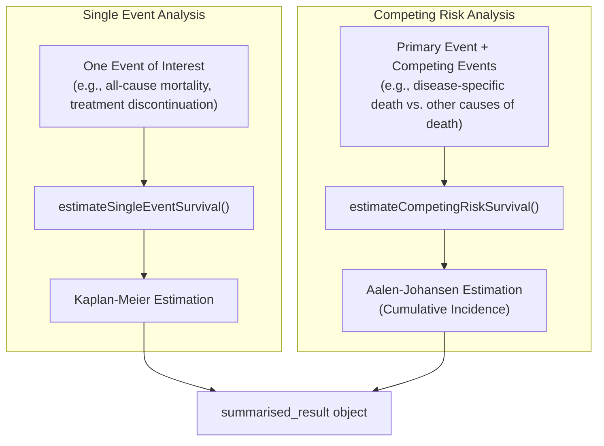

# [CohortSurvival](https://darwin-eu-dev.github.io/CohortSurvival/)

## Overview

For clinical researchers, especially those with a background in traditional trial statistics (using tools like SAS or SPSS), **time-to-event analysis** is a cornerstone of assessing outcomes. The `CohortSurvival` package provides a robust and standardized way to perform these analyses on observational data within the OMOP CDM framework.

Think of it as the OHDSI equivalent of `PROC LIFETEST` in SAS. It is designed to answer fundamental research questions:
- How long does it take for a specific event (e.g., death, disease progression, treatment discontinuation) to occur after an index event (e.g., diagnosis, first treatment exposure)?
- How do survival probabilities differ between patient subgroups (e.g., stratified by age, sex, or other baseline characteristics)?
- How do we handle situations where a patient might experience one of several different outcomes (competing risks)?

This package is built to be intuitive for those new to R but powerful enough for experienced analysts, providing a clear, three-step process:
1.  **Define Cohorts**: Use `CohortConstructor` to define your patient population (target cohort) and outcome events (outcome cohorts).
2.  **Estimate Survival**: Run one of the core `CohortSurvival` functions to calculate survival probabilities.
3.  **Visualize & Report**: Use the built-in plotting and tabulation functions to interpret and share your results.

## Core Concepts

`CohortSurvival` supports two primary types of survival analysis, each suited to different research questions.



### Single Event Survival Analysis

This is the classic time-to-event analysis used when you are interested in a single, primary outcome. Patients are followed from their cohort start date until they either experience the event or are "censored" (meaning their follow-up ends for other reasons, such as the end of the study period or loss to follow-up).

-   **Method**: Uses the **Kaplan-Meier estimator**.
-   **Key Function**: `estimateSingleEventSurvival()`
-   **Clinical Use Case**: Calculating the 5-year survival rate after a cancer diagnosis, where the single event is all-cause mortality.

### Competing Risk Survival Analysis

This method is essential when a patient can experience more than one type of event, and the occurrence of one event prevents the others from happening. For example, if you are studying death due to a specific cancer, death from cardiovascular disease is a competing risk—a patient who dies from a heart attack can no longer die from cancer.

-   **Method**: Uses the **Aalen-Johansen estimator** to calculate the cumulative incidence of each event.
-   **Key Function**: `estimateCompetingRiskSurvival()`
-   **Clinical Use Case**: Assessing the probability of disease progression in a patient population where death is a common outcome that "competes" with progression.

## Getting Started: A Practical Example

To illustrate the package's functionality, we will use the built-in `mockMGUS2cdm()` function. This creates a mock CDM dataset based on the well-known `mgus2` dataset from the `survival` package in R.

**Clinical Context (for Montse)**: This dataset follows patients with monoclonal gammopathy of undetermined significance (MGUS), a benign plasma cell disorder that has a risk of progressing to multiple myeloma (a type of cancer). The primary outcomes of interest are progression to myeloma and death.

### 1. Mock Data Setup

First, we load the necessary libraries and create the mock CDM object.

```r
# Load key libraries
library(CDMConnector)
library(CohortSurvival)
library(dplyr)
library(ggplot2)

# Create a mock CDM with MGUS2 survival data
cdm <- CohortSurvival::mockMGUS2cdm()

# Verify the cohort tables are available
names(cdm)
# Expected output includes: "mgus_diagnosis", "progression", "death_cohort"
```

Our `cdm` object now contains three key cohort tables:
-   `mgus_diagnosis`: Our target cohort of patients at the start of follow-up.
-   `progression`: An outcome cohort for patients who progressed to multiple myeloma.
-   `death_cohort`: An outcome cohort for patients who died.

### 2. Basic Single Event Analysis: Time to Death

Let's estimate the overall survival (time to death) for patients diagnosed with MGUS.

```r
# Estimate survival from MGUS diagnosis to death
mgus_death_surv <- estimateSingleEventSurvival(
  cdm = cdm,
  targetCohortTable = "mgus_diagnosis",
  outcomeCohortTable = "death_cohort"
)
```

### 3. Visualize and Tabulate Results

With the survival estimates calculated, we can now easily plot the Kaplan-Meier curve and generate a summary table.

```r
# Plot the survival curve
plotSurvival(mgus_death_surv)

# Display a summary table with survival probabilities at specific time points
tableSurvival(mgus_death_surv, times = c(365, 1825, 3650), timeScale = "days")
```

This provides a clear, interpretable summary of the survival experience of the entire cohort.

## Advanced Usage

### Stratified Analysis

A key strength of survival analysis is comparing outcomes between different subgroups. We can do this by adding stratification variables to our target cohort. The `mockMGUS2cdm` data already includes `age_group` and `sex`.

```r
# Estimate survival stratified by age group and sex
mgus_death_stratified <- estimateSingleEventSurvival(
  cdm = cdm,
  targetCohortTable = "mgus_diagnosis",
  outcomeCohortTable = "death_cohort",
  strata = list(
    c("age_group"),
    c("sex"),
    c("age_group", "sex")
  )
)

# Plot the results, faceting by sex and coloring by age group
plotSurvival(mgus_death_stratified,
             facet = "sex",
             colour = "age_group",
             riskTable = TRUE) # Add a risk table for more detail
```

### Competing Risk Analysis Example

Now, let's address a more complex question: What is the probability of progressing to myeloma, considering that death is a competing risk?

```r
# Estimate cumulative incidence for progression, with death as a competing risk
mgus_competing_risk <- estimateCompetingRiskSurvival(
  cdm = cdm,
  targetCohortTable = "mgus_diagnosis",
  outcomeCohortTable = "progression",
  competingOutcomeCohortTable = "death_cohort"
)

# Plot the cumulative failure probability for both outcomes
plotSurvival(mgus_competing_risk,
             cumulativeFailure = TRUE, # Plot incidence, not survival
             colour = "variable_level")
```
This plot correctly shows the probability of each event occurring over time, accounting for the fact that they are competing.

### Preparing Data for Further Modeling

While `CohortSurvival` focuses on descriptive analysis, it also provides a crucial function, `addCohortSurvival()`, to prepare your data for more advanced modeling (e.g., Cox proportional hazards regression) with other packages like `survival`.

This function adds two columns to your target cohort table:
-   `time`: The follow-up time in days.
-   `status`: An indicator of the event (1 = event, 0 = censored).

```r
# Add time-to-event information for the death outcome
model_data <- cdm$mgus_diagnosis %>%
  addCohortSurvival(
    cdm = cdm,
    outcomeCohortTable = "death_cohort"
  ) %>%
  collect() # Bring the data into R's memory for modeling

# Now, you can use this data frame in other modeling functions
# Example: Fit a Cox Proportional Hazards model
library(survival)
cox_model <- coxph(Surv(time, status) ~ age + sex, data = model_data)
summary(cox_model)
```
This workflow provides a seamless bridge from standardized, descriptive survival analysis to more complex, inferential modeling, a critical step for drawing robust conclusions from observational data.

## API Reference

### Core Estimation Functions

| Function | Purpose |
| --- | --- |
| `estimateSingleEventSurvival()` | Estimates survival for a single event of interest using the Kaplan-Meier method. |
| `estimateCompetingRiskSurvival()` | Estimates cumulative incidence for an outcome in the presence of a competing risk using the Aalen-Johansen method. |

### Visualization and Tabulation

| Function | Purpose |
| --- | --- |
| `plotSurvival()` | Produces Kaplan-Meier or cumulative incidence curves with extensive customization options (`facet`, `colour`, `riskTable`). |
| `tableSurvival()` | Summarizes survival estimates (median survival, probability at specific times) in a formatted table. |
| `riskTable()` | Displays the number of patients at risk, events, and censored counts at different time intervals. |

### Data Preparation

| Function | Purpose |
| --- | --- |
| `addCohortSurvival()` | Adds `time` and `status` columns to a cohort table, preparing it for use in external modeling packages. |
