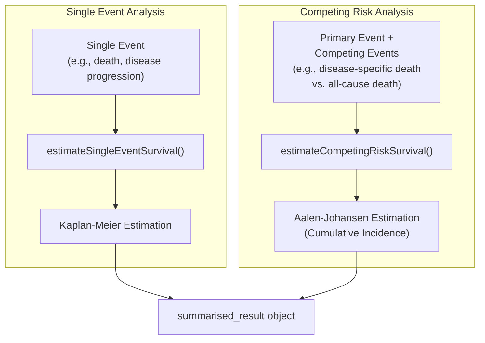

# [CohortSurvival](https://darwin-eu-dev.github.io/CohortSurvival/)

## Overview

This document provides a comprehensive overview of the [CohortSurvival](https://darwin-eu-dev.github.io/CohortSurvival/) package, an R package designed for performing survival analysis on data structured according to the Observational Medical Outcomes Partnership (OMOP) Common Data Model (CDM). The package enables researchers to estimate survival probabilities, generate survival curves, and perform competing risk analyses using standardized cohort data.

## Installation

### CRAN Installation

CohortSurvival is available on CRAN and can be installed using the standard R package installation method:

```r
install.packages("CohortSurvival")
```

This installs the stable release version along with all required dependencies automatically.

### Development Installation

For the latest development version with cutting-edge features:

```r
# Install from GitHub (requires devtools)
devtools::install_github("darwin-eu/CohortSurvival")
```

## Getting Started

### Mock Data Setup for Testing

For development and testing purposes, CohortSurvival provides the `mockMGUS2cdm()` function:

```r
# Create mock CDM with MGUS2 survival data
cdm <- [CohortSurvival](https://darwin-eu.github.io/CohortSurvival/)::mockMGUS2cdm()

# Verify cohort tables are available
names(cdm)
# Expected: "mgus_diagnosis", "progression", "death_cohort"
```

### Basic Single Event Analysis

```r
cdm <- mockMGUS2cdm()
surv <- estimateSingleEventSurvival(
  cdm = cdm,
  targetCohortTable = "mgus_diagnosis",
  targetCohortId = 1,
  outcomeCohortTable = "death_cohort",
  outcomeCohortId = 1,
  eventGap = 7
)
```

## Core Concepts

### Single Event Survival Analysis

Uses the `estimateSingleEventSurvival()` function to perform Kaplan-Meier survival analysis for scenarios where participants can experience at most one event of interest.

**Typical Use Case**: Time from diagnosis to death, where death is the single event of interest.



### Competing Risk Survival Analysis

Uses the `estimateCompetingRiskSurvival()` function to perform Aalen-Johansen estimation for scenarios where multiple competing events can occur.

**Typical Use Case**: Time from diagnosis to disease progression, where death acts as a competing risk.

## API Reference / Advanced Usage

### `estimateSingleEventSurvival()`

| Parameter | Purpose | Default |
| --- | --- | --- |
| `targetCohortTable`| Cohort table name for analysis population| Required |
| `outcomeCohortTable`| Cohort table name for outcome events| Required |
| `outcomeDateVariable`| Date variable for outcome ("cohort_start_date" or "cohort_end_date")| "cohort_start_date" |
| `outcomeWashout`| Days of washout for outcome events| Inf |
| `censorOnCohortExit`| Whether to censor at cohort exit| FALSE |
| `followUpDays`| Maximum follow-up period| Inf |
| `eventGap`| Days for event aggregation| 30 |
| `strata`| List of stratification variables| NULL |

### `estimateCompetingRiskSurvival()`

| Parameter | Purpose | Default |
| --- | --- | --- |
| `targetCohortTable`| Cohort table name for analysis population| Required |
| `outcomeCohortTable`| Cohort table name for outcome events| Required |
| `competingOutcomeCohortTable`| Cohort table name for competing outcome events| Required |
| `outcomeDateVariable`| Date variable for outcome ("cohort_start_date" or "cohort_end_date")| "cohort_start_date" |
| `outcomeWashout`| Days of washout for outcome events| Inf |
| `censorOnCohortExit`| Whether to censor at cohort exit| FALSE |
| `followUpDays`| Maximum follow-up period| Inf |
| `eventGap`| Days for event aggregation| 30 |
| `strata`| List of stratification variables| NULL |

### Visualization Functions

- `plotSurvival()`: Produces Kaplan-Meier curves with options for `ribbon`, `facet`, `colour`, `cumulativeFailure`, and `riskTable`
- `riskTable()`: Displays number at risk, events, and censored by time intervals
- `tableSurvival()`: Summarizes survival estimates at specified time points

## Examples

### Stratified Analysis

```r
surv_stratified <- estimateSingleEventSurvival(
  cdm = cdm,
  targetCohortTable = "mgus_diagnosis",
  targetCohortId = 1,
  outcomeCohortTable = "death_cohort",
  outcomeCohortId = 1,
  strata = list(
    "age_group" = c("age"),
    "sex" = c("sex"),
    "age_and_sex" = c("age", "sex")
  )
)
```

### Competing Risk Analysis

```r
# Basic competing risk analysis
result <- estimateCompetingRiskSurvival(
  cdm = cdm,
  targetCohortTable = "mgus_diagnosis",
  outcomeCohortTable = "progression",
  competingOutcomeCohortTable = "death_cohort",
  targetCohortId = 1,
  outcomeCohortId = 1,
  competingOutcomeCohortId = 1
)
```
