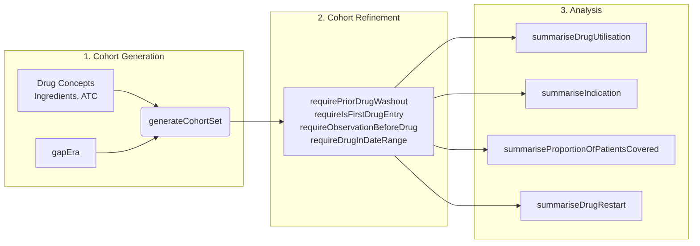

# [DrugUtilisation](https://darwin-eu.github.io/DrugUtilisation/)

## Overview

The `DrugUtilisation` package is a standardized toolset designed to conduct such studies using data mapped to the OMOP Common Data Model.

The package provides the tools to answer critical questions about how medicines are used in the real world:
- Who is being prescribed a certain drug?
- For what indications is it being used?
- How long do patients stay on treatment?
- What are the patterns of switching to other therapies?

This package offers a structured, reproducible workflow. It begins by creating
analysis-ready "drug user cohorts" and then applies a series of standardized
functions to characterize them, similar to a series of SAS macros designed for
a specific reporting pipeline.

The package is designed around a logical, sequential workflow:
1.  **Generate Drug Cohorts**: Create cohorts of patients based on their exposure to specific drugs, using ingredients, ATC codes, or custom concept sets.
2.  **Refine Cohorts**: Apply inclusion and exclusion criteria to define a precise study population (e.g., new users only, specific observation windows).
3.  **Summarise & Analyse**: Execute a range of standardized analyses to describe drug use patterns, indications, treatment persistence, and more.

## Core Concepts

### The `gapEra` Parameter

A fundamental concept in drug utilisation studies is consolidating multiple drug exposures into a single, continuous "episode" or "era" of treatment. The `gapEra` parameter controls this by defining the maximum number of days allowed between the end of one exposure record and the start of the next for them to be considered part of the same treatment episode.

Consider an individual with four prescription records for the same drug:

```
Record 1: Day 1 -> Day 20
Record 2: Day 15 -> Day 30
Record 3: Day 31 -> Day 38
Record 4: Day 45 -> Day 55
```

-   If `gapEra = 0`, records must overlap to be joined. This would result in **3 distinct episodes**.
-   If `gapEra` is between 1 and 6, the small gap between records 3 and 4 is bridged. This results in **2 episodes**.
-   If `gapEra >= 7`, the larger gap between the first two joined records and the last two is also bridged, resulting in **1 single, continuous episode**.

Choosing an appropriate `gapEra` is a critical study design decision that should be clinically informed.

### The Analysis Workflow

The package follows a clear, sequential process. You start with a broad cohort of drug users and progressively refine it before performing the final analysis.



**Crucially, the order of the refinement steps matters.** Applying a date range filter *before* identifying the first drug entry will yield a different result than the other way around. The recommended order is:
1.  **Washout / First Use**: `requirePriorDrugWashout()` or `requireIsFirstDrugEntry()`.
2.  **Prior Observation**: `requireObservationBeforeDrug()`.
3.  **Date Range**: `requireDrugInDateRange()`.

### Understanding the Refinement Steps

- **Washout Period (`requirePriorDrugWashout`)**: This is how we identify "new users" of a drug. A washout period is a specified duration (e.g., 365 days) before the start of a drug exposure during which the patient must *not* have had any prior exposure to the same drug. This helps ensure we are studying incident (new) treatment episodes, not prevalent (ongoing) ones. It's crucial for avoiding biases in studies looking at the effects of starting a new therapy.

- **Prior Observation (`requireObservationBeforeDrug`)**: This ensures that we have enough medical history for a patient *before* they start the drug. A requirement of 365 days of prior observation means the patient has been enrolled in the database for at least a year before their first prescription. This is vital for assessing baseline characteristics and comorbidities and ensuring data completeness.

- **Date Range (`requireDrugInDateRange`)**: This restricts the study to a specific calendar period (e.g., January 1, 2015, to December 31, 2020). This is important for defining a study period that might correspond to a specific version of a clinical guideline, the availability of a drug on the market, or a particular public health event.

## Getting Started: A Complete Example

This example demonstrates a typical workflow, from creating a cohort to analysing its characteristics.

### 1. Setup and Cohort Generation

First, we create a mock CDM reference and generate a cohort of acetaminophen users, collapsing any records separated by 30 days or less.

```r
library(DrugUtilisation)
library(CDMConnector)
library(dplyr)

# Create a mock CDM for demonstration
cdm <- mockDrugUtilisation(numberIndividuals = 100, seed = 1)

# Generate a cohort of acetaminophen users with a 30-day gap era
cdm <- generateIngredientCohortSet(
  cdm = cdm,
  name = "acetaminophen_users",
  ingredient = "acetaminophen",
  gapEra = 30
)
```

### 2. Refine the Cohort

Next, we apply inclusion criteria to define our study population as **new users** with at least 365 days of prior observation.

```r
# Refine the cohort
cdm$acetaminophen_users <- cdm$acetaminophen_users %>%
  requireIsFirstDrugEntry() %>%
  requireObservationBeforeDrug(days = 365)
```

### 3. Perform Analyses

Now we can run our desired analyses on the refined cohort.

```r
# a) Summarise drug utilisation metrics
drug_summary <- cdm$acetaminophen_users %>%
  summariseDrugUtilisation(
    ingredientConceptId = 1125315 # Concept ID for acetaminophen
  )

# b) Summarise indications (requires pre-defined indication cohorts)
# First, create indication cohorts for headache and influenza
indications <- list(headache = 378253, influenza = 4266367)
cdm <- generateConceptCohortSet(cdm, name = "indication_cohorts", conceptSet = indications)

# Now, summarise indications within a 30-day window before the drug start date
indication_summary <- cdm$acetaminophen_users %>%
  summariseIndication(
    indicationCohortName = "indication_cohorts",
    indicationWindow = list(c(-30, 0))
  )

# c) Summarise treatment persistence over 1 year
persistence_summary <- cdm$acetaminophen_users %>%
  summariseProportionOfPatientsCovered(followUpDays = 365)
```

### 4. View and Report Results

The package provides easy-to-use functions for tabulating and plotting the results.

```r
# View the drug utilisation summary table
tableDrugUtilisation(drug_summary)

# Plot the indication summary
plotIndication(indication_summary)

# Plot treatment persistence
plotProportionOfPatientsCovered(persistence_summary)
```

## Key Analyses in Detail

### Drug Utilisation (`summariseDrugUtilisation`)
This is the workhorse function for characterising drug use. It calculates a wide range of metrics, including:
-   Number of exposures and eras
-   Duration of exposure (days exposed)
-   Quantity and dose (initial and cumulative)

### Indications (`summariseIndication`)
This function helps identify *why* a drug was prescribed by looking for diagnoses (as cohorts) in a specified time window around the drug initiation date. It correctly handles mutually exclusive indications.

### Treatment Persistence (`summariseProportionOfPatientsCovered`)
This analysis measures what proportion of the initial cohort is still on treatment over time. It provides a simple, powerful way to visualize treatment adherence and discontinuation patterns.

### Treatment Switching & Restarting (`summariseDrugRestart`)
For cohorts that discontinue treatment, this function allows you to analyse what happens next. You can assess:
-   The proportion of patients who **restart** the same medication.
-   The proportion who **switch** to a different, pre-defined therapy.
-   The proportion who remain untreated within specified follow-up windows.

## API Reference

A summary of the most important functions in the typical workflow.

| Category | Function | Purpose |
| --- | --- | --- |
| **Cohort Generation** | `generateIngredientCohortSet` | Creates drug user cohorts based on ingredient concepts. |
| | `generateAtcCohortSet` | Creates cohorts based on ATC classification. |
| **Cohort Refinement** | `requireIsFirstDrugEntry` | Restricts to the first drug episode per person. |
| | `requirePriorDrugWashout` | Enforces a washout period of non-exposure. |
| | `requireObservationBeforeDrug` | Requires a minimum duration of prior observation time. |
| **Analysis** | `summariseDrugUtilisation` | Calculates key metrics like dose, quantity, and duration. |
| | `summariseIndication` | Identifies and counts indications for drug use. |
| | `summariseProportionOfPatientsCovered` | Analyzes treatment persistence over time. |
| | `summariseDrugRestart` | Analyzes restarting and switching patterns after discontinuation. |
| **Reporting** | `table...`, `plot...` | A suite of functions to create formatted tables and plots from analysis results. |
