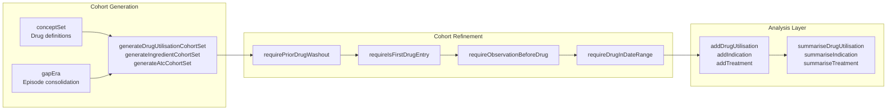

# DrugUtilisation

## Overview

The DrugUtilisation package is designed to summarize patient-level drug utilization cohorts using data mapped to the Observational Medical Outcomes Partnership (OMOP) Common Data Model. The package supports the creation of both new user and prevalent user cohorts, enabling comprehensive characterization of drug use patterns, indications, and treatment outcomes.

**Core Objectives:**
- Generate and refine drug utilization cohorts from OMOP CDM data
- Calculate standardized drug utilization metrics (exposures, eras, doses, quantities)
- Analyze treatment patterns, persistence, and discontinuation
- Identify medical indications for drug use
- Provide standardized output formats for reproducible research

## Installation

Install the DrugUtilisation package from CRAN or the development version from GitHub:

```r
# From CRAN (stable version)
install.packages("DrugUtilisation")

# From GitHub (development version)
# install.packages("devtools")
devtools::install_github("darwin-eu/DrugUtilisation")
```

Load the package along with required dependencies:

```r
library(DrugUtilisation)
library(CDMConnector)
library(omopgenerics)
library(dplyr)
```

## Getting Started

The fastest way to explore DrugUtilisation functionality is using the built-in mock data generator. The `mockDrugUtilisation()` function creates a complete OMOP CDM environment with synthetic drug exposure data.

Here is a complete example demonstrating the typical DrugUtilisation workflow:

### 1. Create CDM Reference
```r
# Start with mock data for learning
cdm <- mockDrugUtilisation(numberIndividuals = 100, seed = 1)
```

### 2. Generate Drug Cohort
```r
# Create acetaminophen users cohort
cdm <- generateIngredientCohortSet(
  cdm = cm,
  name = "acetaminophen_users",
  ingredient = "acetaminophen",
  gapEra = 7
)
```

### 3. Apply Inclusion Criteria
```r
# Refine cohort with inclusion criteria
cdm$acetaminophen_users <- cdm$acetaminophen_users |>
  requireIsFirstDrugEntry() |>
  requireObservationBeforeDrug(days = 30)
```

### 4. Perform Analysis
```r
# Analyze drug utilization patterns
drug_results <- cdm$acetaminophen_users |>
  summariseDrugUtilisation(
    ingredientConceptId = 1125315,
    gapEra = 7
  )

# Analyze indications
indication_results <- cdm$acetaminophen_users |>
  summariseIndication(
    indicationCohortName = "condition_cohorts",
    indicationWindow = list(c(-30, 0))
  )
```

### 5. Generate Output
```r
# Combine results and suppress small counts
final_results <- bind(drug_results, indication_results) |>
  suppress(minCellCount = 5)

# Create formatted table
tableDrugUtilisation(drug_results)

# Create visualization  
plotDrugUtilisation(drug_results)
```

## Core Concepts

The DrugUtilisation package is built around the **Observational Medical Outcomes Partnership (OMOP) Common Data Model**. All functionality assumes data is structured according to OMOP CDM specifications.

The core analytical paradigm is **cohort-centric**: all drug utilization analysis begins with defining patient cohorts that represent specific study populations. Cohorts are then refined through inclusion criteria and analyzed for drug utilization patterns.



## Advanced Usage

### Cohort Management

The package provides functions for generating, refining, and processing patient cohorts based on drug exposure records in the OMOP CDM.

- **`generateIngredientCohortSet`, `generateDrugUtilisationCohortSet`, `generateAtcCohortSet`**: Create drug user cohorts based on ingredients, ATC codes, or custom concept sets.
- **`requirePriorDrugWashout`, `requireIsFirstDrugEntry`, `requireObservationBeforeDrug`**: Apply inclusion/exclusion criteria and washout periods.

### Drug Utilisation Analysis

This is the core functionality for calculating and summarizing drug utilization metrics.

- **`summariseDrugUtilisation`, `addDrugUtilisation`**: Calculate exposures, eras, doses, quantities, and durations.

### Specialized Analysis

These functions enable investigation of drug indications, treatment patterns, restart behaviors, and patient coverage over time.

- **`summariseIndication`**: Analyze indications for drug use.
- **`summariseTreatment`**: Analyze treatment patterns and switching.
- **`summariseDrugRestart`**: Analyze drug switching and restart patterns.

## Examples

### Incident Drug Users
```r
cdm$drug_cohort |>
  requirePriorDrugWashout(days = 365) |>
  requireObservationBeforeDrug(days = 365)
```

### First Treatment Episodes
```r
cdm$drug_cohort |>
  requireIsFirstDrugEntry() |>
  requireObservationBeforeDrug(days = 30)
```

### Period-Restricted Analysis
```r
cdm$drug_cohort |>
  requireDrugInDateRange(dateRange = as.Date(c("2018-01-01", "2022-12-31")))
```
