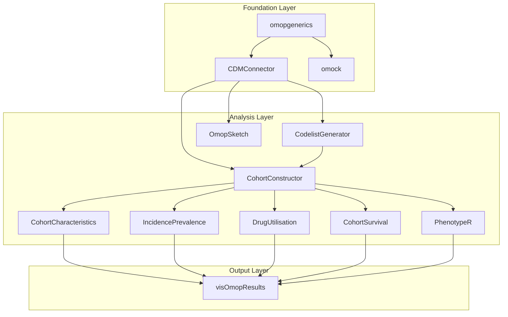

# R Package Reference

This document provides comprehensive reference documentation for the R package ecosystem used in the IOMED Data Space Platform. The ecosystem consists of interrelated packages designed for analyzing OMOP Common Data Model (CDM) databases, from initial database connection through specialized epidemiological analyses.

For information about the educational materials and practical exercises, see [Educational Materials](../../docs/educational_materials). For technical deployment and development setup, see [Development and Deployment](../../docs/development_and_deployment).

## Package Ecosystem Overview

The R package ecosystem follows a layered architecture where foundation packages provide core functionality, and specialized packages build upon them for domain-specific analyses.

## Foundation Packages
- [omopgenerics](./omopgenerics)
- [CDMConnector](./cdmconnector)
- [omock](./omock)

## Core Analytics Packages
- [CohortConstructor](./cohortconstructor)
- [CohortCharacteristics](./cohortcharacteristics)
- [OmopSketch](./omopsketch)

## Specialized Analytics Packages
- [CodelistGenerator](./codelistgenerator)
- [DrugUtilisation](./drugutilisation)
- [CohortSurvival](./cohortsurvival)
- [IncidencePrevalence](./incidenceprevalence)
- [PhenotypeR](./phenotyper)

This diagram represents the core architecture of the R package ecosystem. The workflow follows a five-phase approach from database connection through specialized epidemiological analyses to standardized result outputs.
