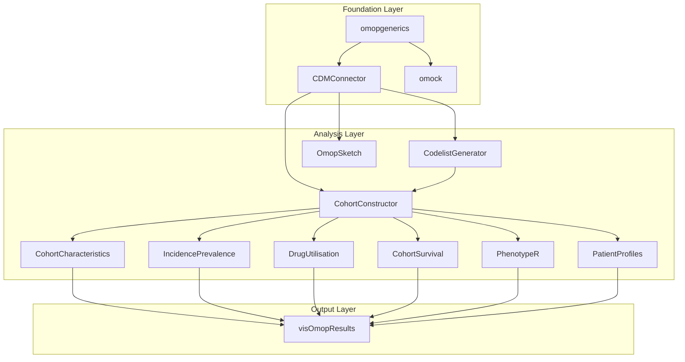

# OHDSI/DARWIN-EU R Packages
{: .no_toc}

Every observational study begins with a clinical question. The power of a
well-structured data ecosystem lies in its ability to provide a clear and
efficient path from that question to a robust, reproducible answer.

The core set of R packages maintained by the global OHDSI community is called
[**HADES**](https://ohdsi.github.io/Hades/) (Health Analytics Data-to-Evidence
Suite). HADES represents years of foundational work and contains a vast array
of tools for large-scale analytics.

The [**DARWIN-EU**](https://www.darwin-eu.org/index.php/methods/standardised-analytics)
packages are a focused collection of tools optimized for conducting
regulatory-grade studies within the European Medicines Agency (EMA) DARWIN EU
network. This guide focuses on the DARWIN-EU toolkit, but it is important to
recognize that the packages you learn here are transferable to the wider OHDSI
ecosystem, and a rich collection of additional tools is available in HADES for
more specialized analytic needs.

1. TOC
{:toc}

## Package Ecosystem Overview

The R package ecosystem follows a layered architecture where foundation packages provide core functionality, and specialized packages build upon them for domain-specific analyses. The following diagram represents the core architecture and dependencies of the toolkit.

---

## Descriptive Analyses: "Painting the Picture"

**Research Goal:** To characterize populations and describe the frequency and distribution of diseases, treatments, and outcomes. These studies describe the "what" and "who" and are the foundation of nearly all observational research.

### Cohort Characterization

*   **Clinical Questions:**
    *   "Who are the patients in my study population?"
    *   "What are their baseline demographics, comorbidities, and prior medications?"
    *   "How does my treatment group compare to my control group before the study begins?" (Generating "Table 1")

*   **Primary Tool:** [**`CohortCharacteristics`**](./cohortcharacteristics)
    *   This package is purpose-built to generate the detailed "Table 1" summaries that are a cornerstone of clinical research, allowing for easy comparison across different study groups.

### Incidence and Prevalence

*   **Clinical Questions:**
    *   "How common is this disease in the population?" (Prevalence)
    *   "How many new cases of this disease occur over a given time period?" (Incidence)

*   **Primary Tool:** [**`IncidencePrevalence`**](./IncidencePrevalence)
    *   This package provides a standardized, validated methodology for calculating incidence and prevalence, which is critical for disease epidemiology and burden-of-illness studies.

### Drug Utilization

*   **Clinical Questions:**
    *   "How are medications being used in a real-world setting?"
    *   "How long do patients typically stay on this therapy?" (Persistence)
    *   "What are the common treatment pathways or sequences of drugs for this condition?"

*   **Primary Tool:** [**`DrugUtilisation`**](./drugutilisation)
    *   This package is essential for studying real-world prescribing patterns and patient behaviors related to medication use.

## Analytic & Comparative Studies: "Asking Why"

**Research Goal:** To compare the effects of different exposures (e.g., treatments, risk factors) on health outcomes. This is where we move from describing to inferring relationships. The central challenge in this type of study is controlling for **confounding**.

### Comparative Effectiveness & Safety

*   **Clinical Questions:**
    *   "Is Treatment A more effective than Treatment B at preventing heart attacks?"
    *   "Does Exposure X increase the risk of a specific side effect compared to no exposure?"

*   **Primary Tools:**
*   [**`CohortConstructor`**](./cohortconstructor): The essential first step. This package allows you to build the highly specific treatment (target) and control (comparator) cohorts needed for the comparison. Its powerful temporal features are critical for defining new-user cohorts and applying washout periods.
*   [**`CohortSurvival`**](./cohortsurvival): The primary tool for performing time-to-event (survival) analysis after you have constructed your cohorts. It allows you to calculate adjusted Hazard Ratios to compare outcomes over time.

### Feature Engineering for Adjustment

In a Randomized Controlled Trial (RCT), randomization is the powerful mechanism that ensures the treatment and control groups are, on average, comparable at baseline. In observational research, we have no such guarantee. The groups we wish to compare are often systematically different—a phenomenon known as **confounding by indication**. For example, sicker patients may be more likely to receive a newer drug, making a simple comparison of outcomes misleading.

To address this, we use statistical methods to balance the baseline characteristics of the groups, making them more comparable and allowing us to isolate the effect of the treatment. The most common and powerful technique for this is the **propensity score**.

A propensity score is the predicted probability of a patient receiving a specific treatment, given their baseline characteristics. By using this score, we can design an observational study that more closely mimics an RCT. There are two primary ways to use propensity scores:

**Propensity Score Matching (PSM)**

*   **What it is:** For each patient in the treatment group, we find one or more patients in the control group who have a very similar propensity score. This creates smaller, "matched" cohorts where the baseline characteristics are well-balanced.
*   **When to use it:**
    *   When you have a large pool of potential controls to draw from.
    *   When you want to create a study population that is easy to describe and understand, as it closely mimics the structure of a 1:1 or 1:N randomized trial.
    *   When you believe the treatment effect is similar across all types of patients (a concept known as a homogeneous treatment effect).
*   **The Trade-off:** You may have to discard a large number of control (and sometimes treatment) subjects who cannot be matched, potentially reducing the sample size and generalizability of your results.
*   **Tooling in R:** After creating your features with [**`PatientProfiles`**](./package_reference/PatientProfiles) and your initial cohorts with [**`CohortConstructor`**](./package_reference/cohortconstructor), the matching itself is typically performed with well-established R packages like **`MatchIt`** or **`Matching`**. You can find extensive documentation on [CRAN](https://cran.r-project.org/web/packages/MatchIt/vignettes/MatchIt.html).

**Propensity Score Weighting (IPTW)**

*   **What it is:** Rather than discarding subjects, we use the propensity score to assign a statistical weight to each person in the analysis. Individuals who received a treatment that was "surprising" given their baseline characteristics (e.g., a very healthy person who received an aggressive therapy) are given more weight. This creates a "pseudo-population" where the baseline characteristics are balanced between the groups.
*   **When to use it:**
    *   When you want to retain all or most of your study subjects to maximize statistical power and generalizability.
    *   When you want to estimate the average treatment effect on the entire population (ATE) rather than just the treated population.
    *   When matching is difficult due to a small number of controls or poor overlap in propensity scores between the groups.
*   **The Trade-off:** The methodology can be less intuitive than matching, and in cases where some individuals have extreme propensity scores, the weights can become very large, potentially leading to unstable estimates.
*   **Tooling in R:** The process is similar to matching. You first generate features with [**`PatientProfiles`**](./package_reference/PatientProfiles). The propensity score model is a standard logistic regression model (using the `glm()` function in R). The weighting is then applied in the final outcome model, for example, within the `coxph()` function from the **`survival`** package. The **`WeightIt`** package on [CRAN](https://cran.r-project.org/web/packages/WeightIt/vignettes/WeightIt.html) can also streamline this process.

*   **Clinical Question:** "To properly compare my two groups, what patient characteristics do I need to account for in my statistical model?"

*   **Core Method:** Creating a rich set of predictor variables (features) for each patient that can be used in a multivariable model to control for confounding.

*   **Primary Tool:** [**`PatientProfiles`**](./package_reference/PatientProfiles)
    *   This package is used to generate the detailed patient-level features (e.g., Charlson Comorbidity Index, presence of specific prior conditions, medication history) that are the inputs for multivariable regression models.

## Prediction Modeling

**Research Goal:** To develop a model that predicts the future risk of an outcome for an individual patient based on their characteristics.

*   **Clinical Questions:**
    *   "Can we identify patients at high risk of developing a certain disease in the next five years?"
    *   "What is this specific patient's probability of being hospitalized in the next year?"

*   **Core Method:** Using statistical or machine learning models (e.g., Logistic Regression, Gradient Boosting) to learn patterns from the data and make predictions. This requires creating a very large number of potential predictor variables (features).

*   **Primary Tools for Prediction:**
    *   [**`PatientProfiles`**](./package_reference/PatientProfiles): As with comparative studies, this is the ideal tool for the initial **feature engineering** step, where you create a curated set of potential predictors.
    *   [**`PatientLevelPrediction`**](https://ohdsi.github.io/PatientLevelPrediction/): This is the primary, end-to-end framework for building, evaluating, and validating patient-level prediction models. It is designed to work seamlessly with the outputs of `CohortConstructor`.

### The Prediction Workflow: From Cohorts to a Validated Model

The OHDSI toolkit provides a powerful and standardized workflow for prediction studies that ensures best practices are followed.

1.  **Define the Prediction Problem with `CohortConstructor`**: The first step is always to define your populations. For a prediction study, you need two key cohorts:
    *   **Target Cohort (T):** The population you want to make predictions for (e.g., "patients newly diagnosed with atrial fibrillation").
    *   **Outcome Cohort (O):** The patients who experience the outcome you want to predict (e.g., "patients who have an ischemic stroke").

2.  **Build and Validate the Model with `PatientLevelPrediction` (PLP)**: Once your cohorts are defined, you use the PLP framework to handle the entire modeling pipeline. You provide the cohort IDs for T and O, and PLP orchestrates the rest:
    *   **Feature Extraction:** PLP automatically generates thousands of potential predictor variables from the OMOP CDM for the patients in your target cohort.
    *   **Model Training:** It trains a variety of machine learning models (e.g., LASSO-regularized logistic regression, gradient boosting) to learn the relationship between the features and the outcome.
    *   **Rigorous Evaluation:** It automatically evaluates the model's performance on a separate test set, providing key metrics like the Area Under the ROC Curve (AUC) and detailed calibration plots.
    *   **External Validation:** Crucially, the framework is designed to make it easy to transport your final model and validate its performance on entirely new OMOP datasets from different hospitals or countries, which is the gold standard for proving a prediction model is robust and generalizable.

In summary, **`CohortConstructor`** is your tool for defining the "who" and "what" of your prediction question, and **`PatientLevelPrediction`** is your specialized framework for building and rigorously validating the model itself.

## Phenotype Development and Validation

**Research Goal:** To ensure that the way we define a disease or condition in the database is clinically accurate and valid. This is a foundational quality-control step for all other analyses.

*   **Clinical Questions:**
    *   "Does my algorithm for identifying 'myocardial infarction' in this database correctly capture the true cases?"
    *   "What is the positive predictive value (PPV) of my cohort definition compared to a gold standard?"

*   **Primary Tool:** [**`PhenotypeR`**](./phenotyper)
    *   This package is a specialized diagnostic toolkit designed to rigorously test and validate your phenotype definitions, ensuring your study is built on a solid foundation.
