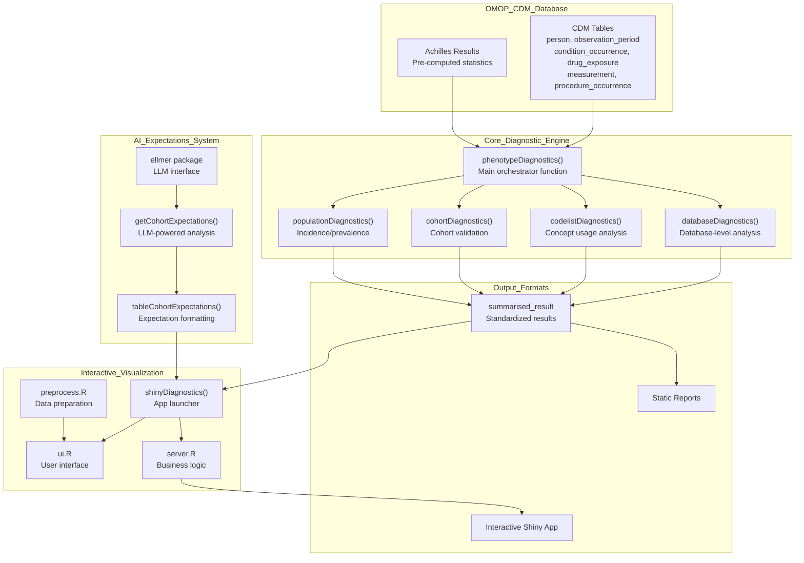

# [PhenotypeR](https://ohdsi.github.io/PhenotypeR/)

## Overview

[PhenotypeR](https://ohdsi.github.io/PhenotypeR/) is a comprehensive diagnostic system for assessing the research-readiness of study cohorts defined within OMOP Common Data Model (CDM) databases. The system performs multi-level analysis across database, codelist, cohort, and population dimensions to validate phenotype definitions and ensure cohorts meet quality standards for observational health research.

### Key Features:
- **Multi-level Assessment**: Database, codelist, cohort, and population-level diagnostics.
- **OMOP CDM Integration**: Native integration with OMOP standardized vocabularies and data structures.
- **AI-Powered Expectations**: LLM-generated expected values for comparison with actual results.
- **Interactive Visualization**: Web-based Shiny application for exploration and reporting.
- **Scalable Processing**: Sampling strategies and preprocessing for large healthcare datasets.
- **Research-Ready Output**: Standardized `summarised_result` format compatible with OHDSI tools.

## Installation

To install PhenotypeR, you can use the following command in R:

```r
# Install from GitHub
remotes::install_github("OHDSI/PhenotypeR")
```

## Getting Started

Here is a simple example of how to get started with PhenotypeR:

```r
library([PhenotypeR](https://ohdsi.github.io/PhenotypeR/))
library([CDMConnector](https://darwin-eu.github.io/CDMConnector/))
library([CohortConstructor](https://ohdsi.github.io/CohortConstructor/))
library(dplyr)

# 1. Connect to a mock CDM
cdm <- [mockPhenotypeR](https://ohdsi.github.io/PhenotypeR/)()

# 2. Create a cohort
cdm$my_cohort <- conceptCohort(
  cdm = cdm,
  conceptSet = list("acetaminophen" = 1125315),
  name = "my_cohort"
)

# 3. Run diagnostics
result <- phenotypeDiagnostics(cohort = cdm$my_cohort)

# 4. View results in an interactive Shiny app
shinyDiagnostics(result)
```

## Core Concepts

PhenotypeR's architecture is modular, with four primary subsystems working together.



## API Reference / Advanced Usage

### `phenotypeDiagnostics()`
This is the main orchestrator function.

**Parameters:**
- `cohort`: A cohort table in the CDM.
- `diagnostics`: A character vector of diagnostics to run.
- `survival`: A boolean to indicate if survival analysis should be run.
- `cohortSample`: The number of people to sample from the cohort.
- `matchedSample`: The number of people to sample for the matched cohort.
- `populationSample`: The number of people to sample for the population.
- `populationDateRange`: The date range for the population.

### `getCohortExpectations()`
This function generates AI-powered expectations for a cohort.

**Parameters:**
- `chat`: An `ellmer` chat object.
- `phenotypes`: A character vector of phenotype names or a `summarised_result` object.

### `shinyDiagnostics()`
This function launches the interactive Shiny application.

**Parameters:**
- `result`: A `summarised_result` object.
- `directory`: The directory to create the Shiny app in.
- `minCellCount`: The minimum cell count to display.
- `open`: A boolean to indicate if the app should be opened automatically.
- `expectations`: An optional data frame of expectations.

## Examples

For more detailed examples and tutorials, please see the package vignettes.