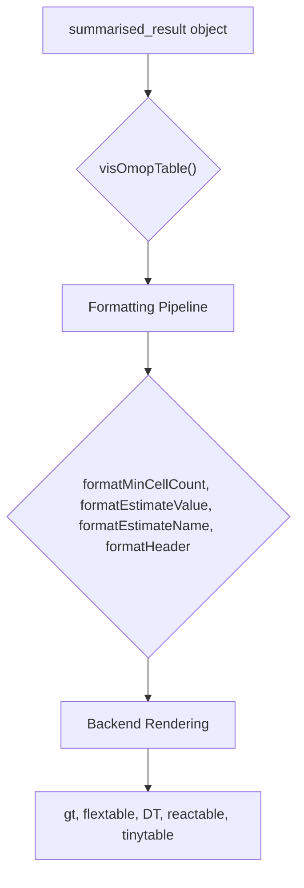
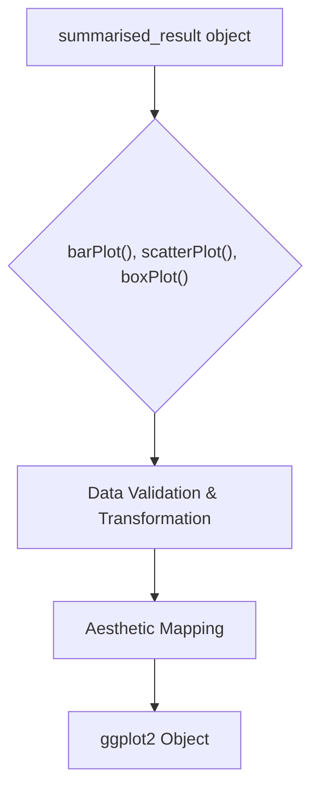

# [visOmopResults](https://darwin-eu.github.io/visOmopResults/)

## Overview

The `[visOmopResults](https://darwin-eu.github.io/visOmopResults/)` R package is designed to transform OMOP analysis results into publication-ready tables and plots. It serves as a visualization layer for the OMOP (Observational Medical Outcomes Partnership) ecosystem, specializing in converting `summarised_result` objects from various analysis packages into formatted outputs suitable for research publications, reports, and interactive applications.

### Key Features:
- **Multi-Backend Table Generation**: Create tables rendered with `gt`, `flextable`, `DT`, `reactable`, and `tinytable`.
- **Publication-Ready Plots**: Generate `ggplot2` visualizations, including bar plots, scatter plots, and box plots.
- **OMOP Integration**: Works seamlessly with `summarised_result` objects from packages like `IncidencePrevalence`, `CohortCharacteristics`, and `DrugUtilisation`.
- **Customizable Formatting**: Offers extensive options for table styling, header creation, and estimate formatting.
- **Standardized Themes**: Includes default themes for professional and consistent styling (`themeVisOmop`, `themeDarwin`).

## Installation

You can install the development version of `visOmopResults` from GitHub:
```r
# install.packages("remotes")
remotes::install_github("darwin-eu/visOmopResults")
```

## Getting Started

Here is a basic example of how to use `visOmopResults` to create a formatted table from a mock `summarised_result` object.

### 1. Load Libraries and Create Mock Data
First, load the necessary libraries and generate a mock result object.
```r
library(visOmopResults)
library(dplyr)

result <- mockSummarisedResult()
```

### 2. Create a Formatted Table
Use `visOmopTable()` to generate a table with multi-level headers and formatted estimates.
```r
visOmopTable(
  result,
  header = c("strata", "group"),
  estimateName = c("N (%)" = "<count> (<percentage>%)"),
  type = "gt"
)
```

### 3. Generate a Plot
Create a plot from the same result object.
```r
barPlot(
  result = result,
  x = "group_level",
  y = "estimate_value",
  facet = "strata_level",
  colour = "variable_name"
)
```

## Core Concepts

The package is built around two primary systems: table generation and plot generation. Both systems are designed to work with `summarised_result` objects, providing a consistent interface for visualization.

### Table Generation System

The table system processes data through a sequential formatting pipeline, allowing for detailed customization at each step before rendering to the chosen backend.



### Plot Generation System

The plotting system uses a similar pipeline to transform data and map it to `ggplot2` aesthetics, providing a consistent way to create common research plots.



## Advanced Usage

### Custom Table Formatting
The `.options` parameter in `visOmopTable()` allows for fine-grained control over table formatting.

```r
visOmopTable(
  result,
  header = "strata",
  estimateName = c("N" = "<count>", "Mean (SD)" = "<mean> (<sd>)"),
  type = "gt",
  .options = list(
    decimals = c(count = 0, mean = 2, sd = 2),
    bigMark = ",",
    na = "-"
  )
)
```

### Faceted Plots
The plotting functions support faceting to create stratified visualizations.

```r
scatterPlot(
  result = result,
  x = "group_level",
  y = "estimate_value",
  facet = c("strata_level", "variable_name"),
  colour = "estimate_type"
)
```

## API Reference

### Main Functions
- `visOmopTable()`: Main function for creating formatted tables from `summarised_result` objects.
- `visTable()`: Generic function for creating tables from any data frame.
- `barPlot()`: Creates bar plots.
- `scatterPlot()`: Creates scatter plots with lines, points, and ribbons.
- `boxPlot()`: Creates box and whisker plots.
- `themeVisOmop()`: The default plot theme for the package.
- `themeDarwin()`: The DARWIN EU plot theme.

## Examples

### Example 1: Creating a Flextable for Word Documents
This example shows how to create a table formatted for a Word document, with custom styling.

```r
visOmopTable(
  result,
  header = c("group", "strata"),
  estimateName = c("N (%)" = "<count> (<percentage>%)"),
  type = "flextable",
  style = "default",
  .options = list(
    title = "Patient Characteristics",
    subtitle = "Stratified by Age and Sex"
  )
)
```

### Example 2: Stratified Box Plot
This example demonstrates how to create a box plot to visualize distributions across different groups.

```r
# Filter for distribution estimates
distribution_result <- result %>%
  filter(estimate_type %in% c("min", "q25", "median", "q75", "max"))

boxPlot(
  result = distribution_result,
  x = "group_level",
  facet = "strata_level",
  colour = "variable_name"
)
```
