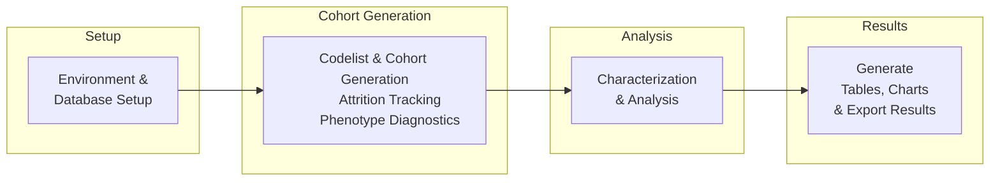

---

layout: default
title: Performing an Analysis
parent: Data Analysis
nav_order: 3

---

# Performing an Analysis
{: .no_toc}

This guide walks you through the process of executing a study in the OMOP/R ecosystem. Think of your R script as a dynamic, executable **Statistical Analysis Plan (SAP)**, where your cohort definitions, variable derivations, and analyses are all documented and run in a single, reproducible workflow.

The following diagram provides a high-level overview of the sequential phases involved in this workflow.



## Phase 1: Study Setup and Configuration

The initial phase involves setting up the R environment and establishing a connection to the database.

### Environment Setup
- **Dependency Management**: It is best practice to use `renv` to ensure a reproducible environment. `renv` creates a lockfile that captures the exact versions of all R packages used in your project. This is like ensuring every statistician on your team is using the exact same version of SAS and its modules, preventing "it works on my machine" problems.

### Database Connection
- **Connection**: The first step in your R script is to establish a live connection to the OMOP CDM database using the [`CDMConnector`](https://darwin-eu.github.io/CDMConnector/) package. This creates a `cdm` object that points to the database tables without loading them into memory.
- **Schemas**: When connecting, you will define a `cdm_schema` and a `write_schema`. Think of `cdm_schema` as your input library (like a `libname` for your SDTM data) and `write_schema` as your output library (for your analysis datasets and results).

```r
library(CDMConnector)
library(duckdb)

# Connect to a local DuckDB database file
db_file <- "omop_<data_order_id>_<date>.duckdb"

con <- DBI::dbConnect(
  duckdb(),
  dbdir = db_file
)

# Define database schemas to read the data and store the results
cdm_schema <- "cdm"
write_schema <- "analysis"

# Create the cdm object
cdm <- cdmFromCon(
  con = con,
  cdm_schema = cdm_schema,
  write_schema = write_schema
)
```

## Phase 2: Cohort Definition and Instantiation

This phase involves defining the medical concepts of interest and constructing patient cohorts based on these concepts. The [`CodelistGenerator`](https://darwin-eu.github.io/CodelistGenerator/) package provides systematic methods for identifying relevant medical concepts, while [`CohortConstructor`](https://ohdsi.github.io/CohortConstructor/) transforms these concepts into patient cohorts.

Base cohort creation functions:
- `conceptCohort()` - creates cohorts based on clinical concepts
- `demographicsCohort()` - creates cohorts based on demographic criteria
- `measurementCohort()` - creates cohorts based on measurement values
- `deathCohort()` - creates cohorts based on death records


### Codelist and Cohort Generation
- **[`CodelistGenerator`](https://darwin-eu.github.io/CodelistGenerator/)**: Use `CodelistGenerator` to create codelists from concept sets. A codelist is a set of medical codes (e.g., for a disease or a drug) that define a clinical idea.
- **[`CohortConstructor`](https://ohdsi.github.io/CohortConstructor/)**: Use `CohortConstructor` to build cohorts from these codelists.

For example, to create a cohort of patients with Hypertrophic Cardiomyopathy (HCM) who have received a first-line therapy:

```r
library(CodelistGeneratoror)
library(CohortConstructor)

# 1. Get codelists for the disease and treatments
hcm_codes <- getCodelistFromConceptSet(4247, cdm)
beta_blockers_codes <- getCodelistFromConceptSet(4886, cdm)
ccb_non_dhp_codes <- getCodelistFromConceptSet(4887, cdm)

# 2. Combine treatment codes into a single "first-line therapy" codelist
first_line_therapy_codes <- merge_codelists(
  beta_blockers_codes,
  ccb_non_dhp_codes
)

# 3. Create initial cohorts based on the codelists
cdm$hcm <- concept_cohort(cdm, hcm_codes, name = "hcm")
cdm$first_line_therapy <- concept_cohort(cdm, first_line_therapy_codes, name = "first_line_therapy")

# 4. Intersect the cohorts to find patients with HCM who have received the therapy
cdm$hcm_first_line_treated <- cdm$first_line_therapy |>
  require_cohort_intersect(
    target_cohort_table = "hcm",
    window = c(-Inf, 0) # The HCM diagnosis must be on or before the treatment start date
  )
```

## Phase 3: Cohort Attrition Tracking

After instantiating your cohort, it's crucial to understand how many patients were included or excluded at each step.

- **Attrition Tracking**: The `summarise_cohort_attrition()` function provides a detailed record of patient exclusions. This is often visualized with `plot_cohort_attrition()`.

```r
cdm$hcm_first_line_treated |>
  summarise_cohort_attrition() |>
  plot_cohort_attrition()
```
This plot helps ensure the logic of your cohort definition is working as expected and provides transparency for your final study report.

## Phase 4: Phenotype and Cohort Validation

Before proceeding to analysis, it is essential to validate that your cohort definition has captured the correct patient population. The [`PhenotypeR`](https://ohdsi.github.io/PhenotypeR/) package provides tools to "diagnose" your cohort, allowing you to review the clinical characteristics of the selected patients to ensure they align with the clinical understanding of the phenotype. This is a powerful quality step that goes beyond simple inclusion/exclusion counts.

- **[`PhenotypeR`](https://ohdsi.github.io/PhenotypeR/)**: This package provides a comprehensive suite of diagnostics to evaluate the quality of your clinical phenotype definitions. This helps ensure that your study cohorts accurately represent the patient populations you intend to study.

## Phase 5: Analysis Pipeline

This is the core of the study, where you characterize the study population and perform your main analyses.

### Baseline Characteristics
A critical first step is to generate the baseline characteristics of your study population. The [`CohortCharacteristics`](https://darwin-eu.github.io/CohortCharacteristics/) package is designed for this purpose. Functions like `add_age()` and `add_sex()` are standardized helpers from the `PatientProfiles` package that add common demographic variables to your cohort table. By default, age is calculated at the `cohort_start_date`, but this can be configured.

- **Demographics**: You can easily compute age and sex for your cohort.
- **Comorbidities and Clinical Events**: You can assess the prevalence of various conditions or events in your cohort's history.

```r
library([`CohortCharacteristics`](https://darwin-eu.github.io/CohortCharacteristics/))

# Example: Summarize age and sex for the study cohort
cdm$hcm_first_line_treated |>
  add_age() |>
  add_sex() |>
  summarise_characteristics(
    demographics = TRUE,
    age_group = list(c(18, 49), c(50, 69), c(70, 150))
  )
```

### Specialized Analyses
Depending on your study's objectives, you can now run various specialized analyses:
- **[`IncidencePrevalence`](https://darwin-eu.github.io/IncidencePrevalence/)**: To calculate the incidence and prevalence of health outcomes.
- **[`DrugUtilisation`](https://darwin-eu.github.io/DrugUtilisation/)**: To study patterns of medication use.
- **[`CohortSurvival`](https://darwin-eu-dev.github.io/CohortSurvival/)**: To perform survival analysis.

## Phase 6: Results Generation

The final phase involves generating and exporting the results in a clear and shareable format.

- **Tables and Figures**: The [`visOmopResults`](https://darwin-eu.github.io/visOmopResults/) package provides tools to visualize your results. For example, you can create publication-ready tables of baseline characteristics.

```r
library(visOmopResults)

# Generate and table the characteristics summary
results <- cdm$hcm_first_line_treated |>
  add_age() |>
  add_sex() |>
  summarise_characteristics()

table_characteristics(results)
```

- **Export Results**: You can export all results to structured formats like CSV for transparency, meta-analysis, or use in other programs.
