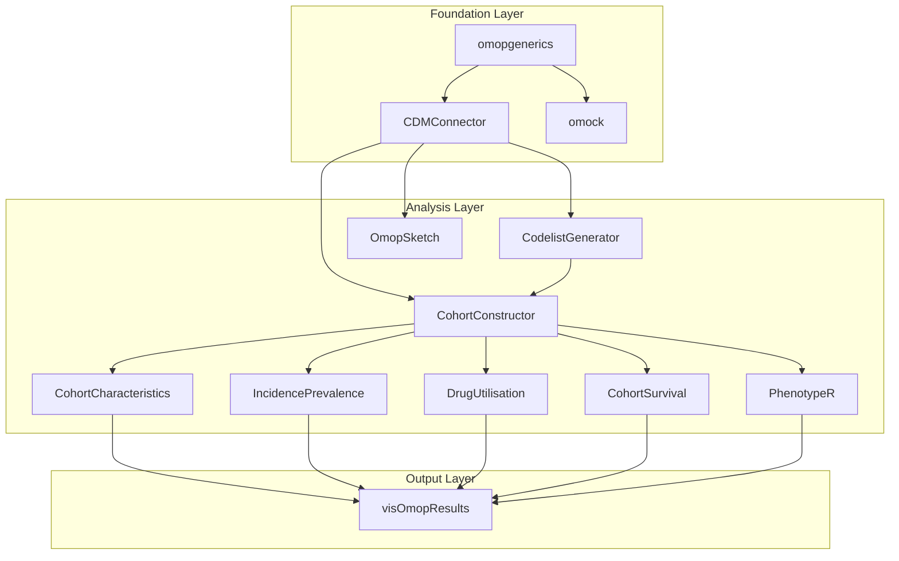

# Health Data Space Platform

Clinical data generated during routine patient care is a primary source of real-world evidence. However, its direct use in research is impeded by three fundamental, widely recognized challenges:

1.  **Lack of Standardization:** Clinical data is captured in diverse, unstructured formats across different healthcare systems. This heterogeneity makes it impossible to aggregate and analyze the data
at scale. A single condition, for instance, may be recorded using dozens of non-standard local terms.
2.  **Patient Privacy Requirements:** Health records contain sensitive personal information protected by stringent regulations like GDPR. Any use for research requires the removal of all identifiers—a
complex and specialized process.
3.  **Operational Barriers:** Preparing data for research demands significant technical expertise, time, and resources, which are often beyond the scope of individual healthcare or research institutions.

IOMED provides the infrastructure and processes to bridge this gap, converting raw clinical data into a standardized, privacy-compliant resource for scientific investigation.

### For Healthcare Institutions (Data Holders)

Our platform provides hospitals and other data custodians with the tools to prepare their data for research while ensuring it never leaves their secure environment. We enable institutions to:

*   **Standardize Clinical Data:** We process and map disparate data from electronic health records to the OMOP Common Data Model, a global standard for observational research. This creates a uniform
structure, allowing for consistent interpretation and analysis.
*   **Protect Patient Privacy:** Our system applies robust anonymization techniques to remove all personally identifiable information. This process ensures the resulting dataset complies with data
protection regulations.
*   **Ensure Data Integrity:** We implement a multi-layered Quality Assurance framework with automated checks and expert validation to verify the accuracy, completeness, and plausibility of the data.
*   **Maintain Control and Compliance:** The entire data preparation process is auditable and governed by clear protocols, giving institutions full oversight and ensuring regulatory adherence.

### For Research Organizations (Data Users)

We provide researchers with a streamlined and compliant method to access the specific data required for their work. Our platform allows them to:

*   **Define and Request Datasets:** Researchers can construct precise queries to define patient cohorts and specify the exact variables needed for their study, requesting access to a dataset tailored to
their research question.
*   **Access Research-Ready Data:** We deliver fully anonymized, standardized, and quality-checked datasets. This allows research teams to proceed directly to analysis, confident that the data is
reliable and has been sourced ethically and legally.

## Health Data Mediation and Data Analysis

Executing a Data Mediation with IOMED follows a structured, multi-phase
approach designed to ensure data integrity, regulatory compliance, and
scientific rigor. The process as a **Data User**, begins with data preparation,
which includes establishing partnerships with **Data Holders**, securing
ethical approvals, and integrating disparate data sources into a standardized
format.

Following data preparation, the Data Mediation execution phase focuses on
defining the research objectives, defining the patient cohorts and the
data of interest, and verifying data quality. Advanced Artificial Intelligence
(AI) driven techniques, including Natural Language Processing (NLP) and
Automated Terminology Mapping (ATM), enhance the completeness of
extracted information.

This documentation page serves as a comprehensive educational site for the Data Mediation process and the Data Analysis. This includes a comprehensive introduction and tutorial to the R package ecosystem for executing real-world evidence studies using the OMOP Common Data Model (CDM).

These diagram represent the core architecture of the R package ecosystem that
follows the standardized practices set by the European Medicines Agency (EMA)
DARWIN EU program, showing how different packages work together in a
standardized analytical pipeline for OMOP CDM data analysis. The workflow
follows a five-phase approach from database connection through specialized
epidemiological analyses to standardized result outputs.
