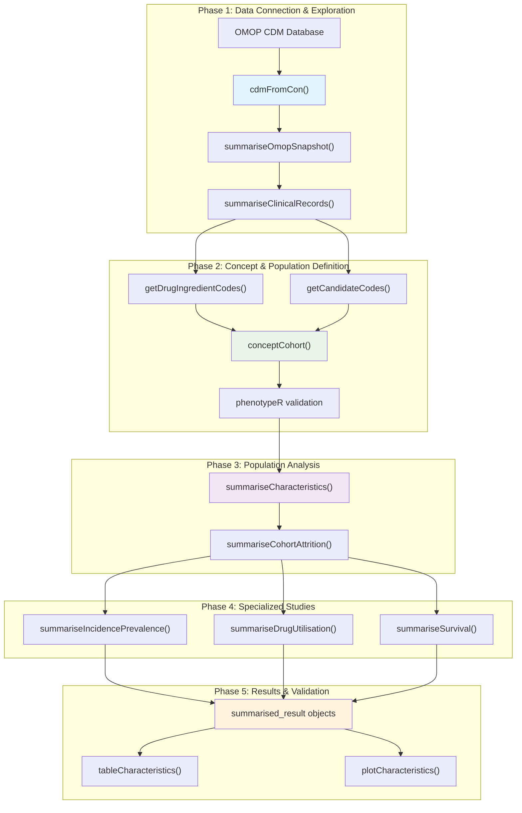

# OMOP Analytics Workflow Documentation

A comprehensive documentation site introducing the analytics workflow for the
Observational Medical Outcomes Partnership (OMOP) Common Data Model

## Overview

This repository contains educational materials and documentation for conducting
real-world evidence studies using the OMOP CDM format. The site introduces a
complete analytics ecosystem of R packages designed for observational health
data analysis.

## Core Analytics Workflow

The OMOP analytics workflow follows a standardized pipeline for real-world
evidence studies. The workflow transforms raw OMOP CDM data into validated
research results through standardized phases that build upon each other.

### Foundation Packages
- **CDMConnector**: Database connectivity and CDM object management
- **OmopSketch**: Database characterization and profiling
- **CodelistGenerator**: Medical concept definition and code mapping

### Cohort Management
- **CohortConstructor**: Patient population definition and inclusion criteria
- **PhenotypeR**: Cohort validation and diagnostic assessment
- **CohortCharacteristics**: Population characterization and baseline analysis

### Specialized Analytics
- **DrugUtilisation**: Drug utilization studies and medication patterns
- **IncidencePrevalence**: Epidemiological rate estimation
- **CohortSurvival**: Time-to-event and survival analysis

This diagram represents the five-phase pipeline used in for Real World Evidence
Generation with the R package ecosystem for conducting studies with OMOP Common
Data Model databases

