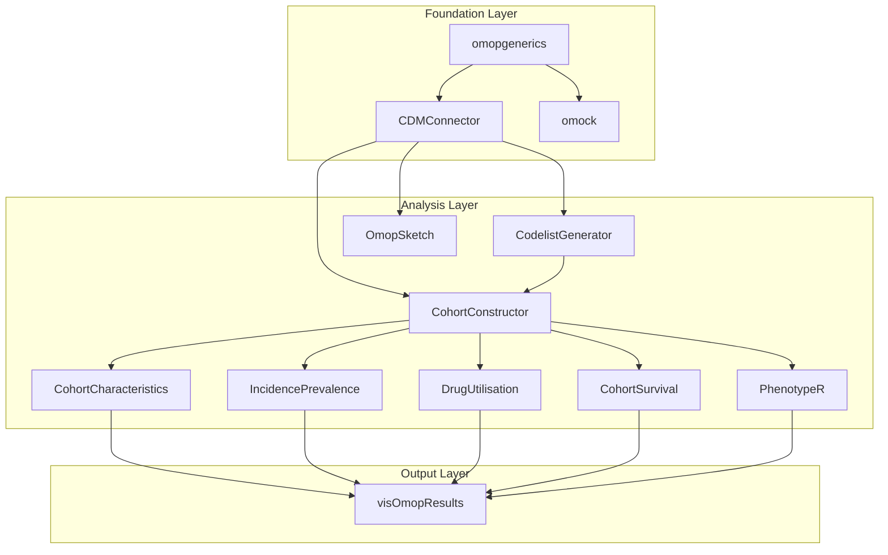

# Overview

The IOMED Data Space Platform repository serves as a comprehensive educational
platform and R package ecosystem for teaching real-world evidence analytics
using the OMOP Common Data Model (CDM). This repository combines instructional
materials, interactive presentations, practical exercises, and a suite of
specialized R packages designed for epidemiological research and healthcare
data analysis.

The repository encompasses both the educational content delivery system and the
underlying analytics infrastructure, providing a hands-on experience in
conducting descriptive analyses, building patient cohorts, and performing
specialized studies using standardized healthcare data formats.

These diagram represent the core architecture of the R package ecosystem that
follows the standardized practices set by the European Medicines Agency (EMA)
DARWIN EU program, showing how different packages work together in a
standardized analytical pipeline for OMOP CDM data analysis. The workflow
follows a five-phase approach from database connection through specialized
epidemiological analyses to standardized result outputs.

