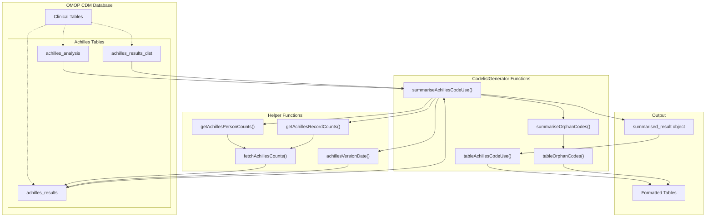
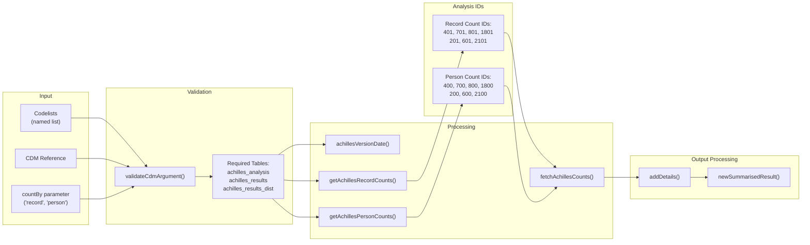
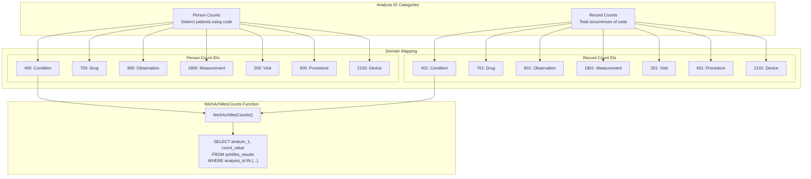
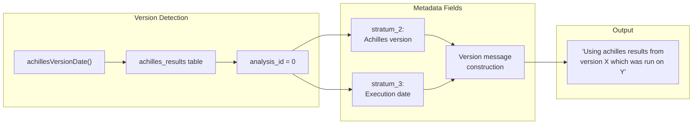

# Page: Achilles Integration

# Achilles Integration

Relevant source files

The following files were used as context for generating this wiki page:

- [R/summariseAchillesCodeUse.R](R/summariseAchillesCodeUse.R)
- [R/tableAchillesCodeUse.R](R/tableAchillesCodeUse.R)
- [man/tableAchillesCodeUse.Rd](man/tableAchillesCodeUse.Rd)
- [man/tableOrphanCodes.Rd](man/tableOrphanCodes.Rd)
- [tests/testthat/test-summariseAchillesCodeUse.R](tests/testthat/test-summariseAchillesCodeUse.R)
- [tests/testthat/test-tableAchillesCodeUse.R](tests/testthat/test-tableAchillesCodeUse.R)
- [tests/testthat/test-tableCodeUse.R](tests/testthat/test-tableCodeUse.R)

This section documents the integration between CodelistGenerator and Achilles, which provides pre-computed usage statistics for OMOP CDM concept codes. The Achilles integration enables efficient analysis of code usage patterns without requiring real-time queries against large clinical tables.

For general code usage analysis using direct database queries, see [Code Usage Summarization](#3.1). For detecting unused codes in codelists, see [Orphan Code Detection](#3.3).

## Overview

The Achilles integration leverages pre-computed statistics stored in Achilles result tables to provide rapid code usage analysis. Achilles is an R package that generates descriptive statistics about OMOP CDM databases, storing results in standardized tables that can be queried efficiently.

Sources: [R/summariseAchillesCodeUse.R:1-191](), [R/tableAchillesCodeUse.R:1-178]()

## Core Integration Workflow

The Achilles integration follows a structured workflow that validates database requirements, fetches pre-computed statistics, and formats results for analysis.

Sources: [R/summariseAchillesCodeUse.R:19-126](), [R/summariseAchillesCodeUse.R:146-190]()

## Achilles Analysis Mappings

The integration uses specific Achilles analysis IDs that correspond to different OMOP CDM domains and count types. Each analysis ID represents pre-computed statistics for a particular combination of domain and aggregation level.

| Domain | Person Count ID | Record Count ID | OMOP Table |
|--------|----------------|-----------------|------------|
| Condition | 400 | 401 | condition_occurrence |
| Drug | 700 | 701 | drug_exposure |
| Observation | 800 | 801 | observation |
| Measurement | 1800 | 1801 | measurement |
| Visit | 200 | 201 | visit_occurrence |
| Procedure | 600 | 601 | procedure_occurrence |
| Device | 2100 | 2101 | device_exposure |

Sources: [R/summariseAchillesCodeUse.R:146-170](), [R/summariseAchillesCodeUse.R:172-190]()

## Function Components

### Core Analysis Function

The `summariseAchillesCodeUse()` function serves as the primary interface for Achilles-based code usage analysis.

**Function Signature:**
- **Input:** Named list of concept IDs, CDM reference, count type specification
- **Processing:** Validates CDM, fetches Achilles statistics, aggregates results
- **Output:** `summarised_result` object with standardized format

**Key Processing Steps:**
1. Database validation using `omopgenerics::validateCdmArgument()`
2. Version information retrieval via `achillesVersionDate()`
3. Concept detail enrichment through `addDetails()`
4. Statistical aggregation across multiple domains
5. Result standardization with `omopgenerics::newSummarisedResult()`

Sources: [R/summariseAchillesCodeUse.R:19-126]()

### Table Formatting Function

The `tableAchillesCodeUse()` function transforms analysis results into formatted tables using the `visOmopResults` package.

**Formatting Features:**
- Multiple output formats (gt, flextable, tibble)
- Configurable headers and grouping columns
- Column hiding capabilities
- Integration with `visOmopResults::visOmopTable()`

**Standard Column Mappings:**
- `variable_level` → Standard concept ID
- `variable_name` → Standard concept name
- `domain_id` → OMOP domain
- `vocabulary_id` → Vocabulary identifier

Sources: [R/tableAchillesCodeUse.R:25-59](), [R/tableAchillesCodeUse.R:127-166]()

## Version and Metadata Handling

The integration includes robust version tracking and metadata extraction from Achilles results.

The `achillesVersionDate()` function queries analysis ID 0, which contains Achilles execution metadata, providing transparency about the currency and provenance of usage statistics.

Sources: [R/summariseAchillesCodeUse.R:128-144]()

## Error Handling and Edge Cases

The Achilles integration includes comprehensive error handling for common scenarios:

**Database Validation:**
- Validates presence of required Achilles tables
- Checks CDM reference validity
- Ensures proper parameter specifications

**Data Availability:**
- Handles empty codelists gracefully
- Manages missing concept statistics
- Provides informative messages for zero-result scenarios

**Result Processing:**
- Aggregates statistics across multiple domains
- Handles duplicate concept IDs through summation
- Maintains data type consistency

Sources: [R/summariseAchillesCodeUse.R:31-37](), [R/summariseAchillesCodeUse.R:92-97](), [tests/testthat/test-summariseAchillesCodeUse.R:34-56]()