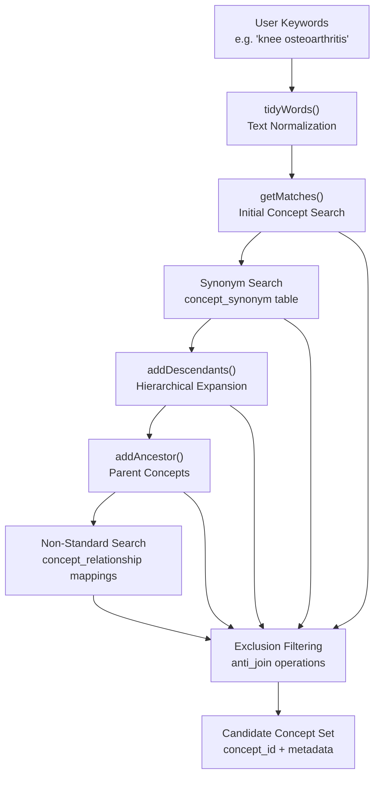
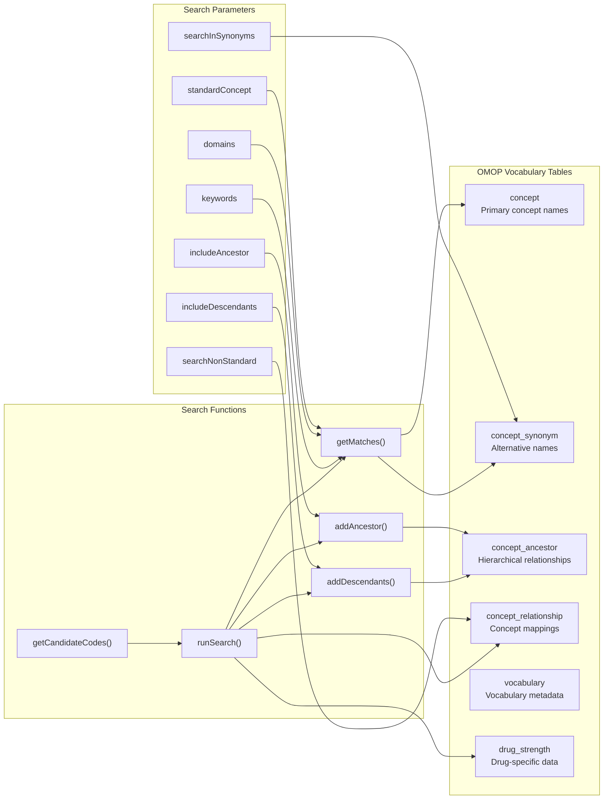
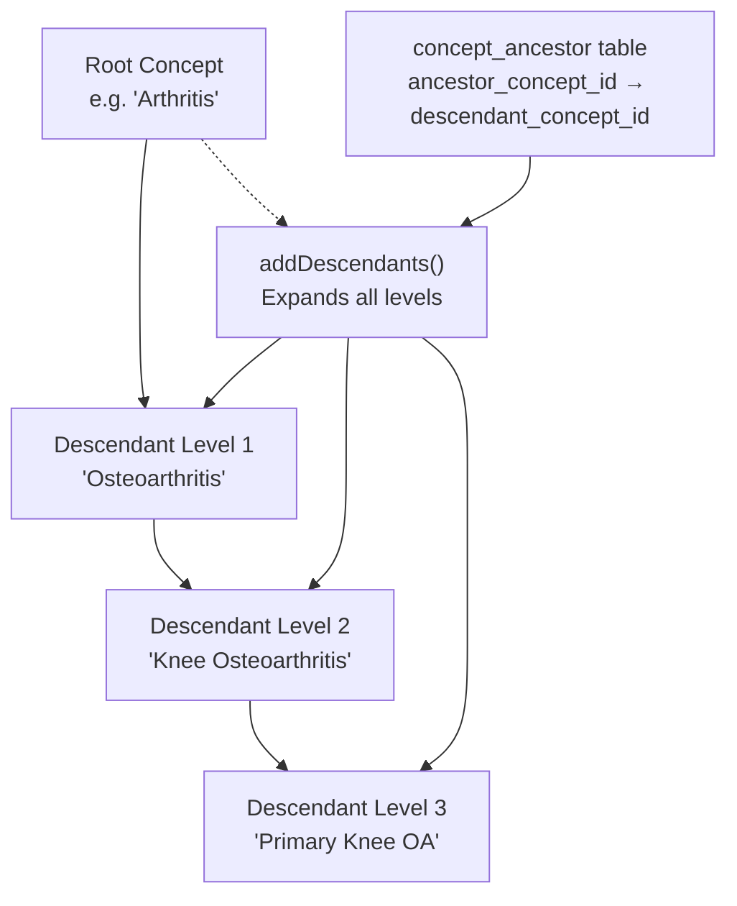
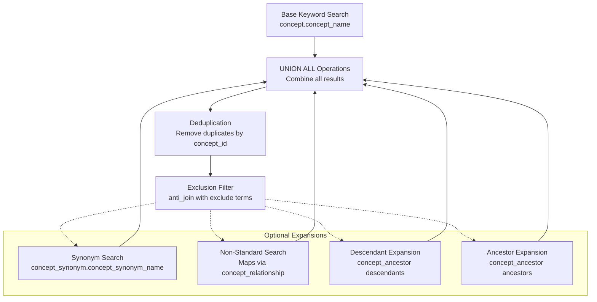
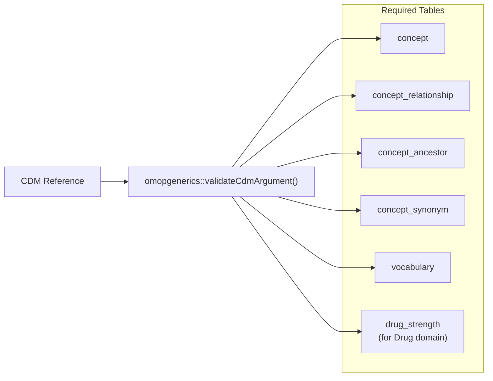

# Page: Candidate Code Search

# Candidate Code Search

Relevant source files

The following files were used as context for generating this wiki page:

- [R/getCandidateCodes.R](R/getCandidateCodes.R)
- [R/runSearch.R](R/runSearch.R)
- [man/getCandidateCodes.Rd](man/getCandidateCodes.Rd)
- [tests/testthat/test-getCandidateCodes.R](tests/testthat/test-getCandidateCodes.R)

## Purpose and Scope

The Candidate Code Search system provides keyword-based concept discovery functionality for generating OMOP CDM codelists. This system enables users to search for relevant medical concepts using natural language terms and automatically expands the search using OMOP vocabulary relationships and hierarchies.

This document covers the `getCandidateCodes()` function and its supporting search infrastructure. For drug-specific code generation, see [Drug-Specific Code Generation](#2.2). For importing codes from existing concept sets, see [JSON Concept Set Processing](#5.1).

## Core Search Architecture

The candidate code search system operates through a multi-stage pipeline that transforms user keywords into OMOP concept identifiers using various search strategies and vocabulary relationships.

### Search Pipeline Overview

**Sources:** [R/getCandidateCodes.R:100-125](), [R/runSearch.R:17-381]()

### Database Table Integration

**Sources:** [R/runSearch.R:34-38](), [R/runSearch.R:83-89](), [R/getCandidateCodes.R:83-88]()

## Search Algorithm Implementation

### Text Processing and Matching

The search system implements sophisticated text normalization and pattern matching to handle variations in medical terminology.

| Function | Purpose | Implementation |
|----------|---------|----------------|
| `tidyWords()` | Text normalization | Removes punctuation, handles UTF-8, converts to lowercase |
| `getMatches()` | Pattern matching | Uses SQL LIKE queries with word splitting for flexible matching |

The `tidyWords()` function performs comprehensive text cleaning:

**Sources:** [R/runSearch.R:385-404]()

The `getMatches()` function implements flexible multi-word searching by splitting keywords and requiring all words to appear in concept names, regardless of order:

**Sources:** [R/runSearch.R:406-452]()

### Hierarchical Expansion

The system leverages OMOP's concept hierarchy through the `concept_ancestor` table to expand search results both upward and downward in the taxonomy.

#### Descendant Inclusion

**Sources:** [R/runSearch.R:454-474]()

#### Ancestor Inclusion

The `addAncestor()` function includes only direct parent concepts (min_levels_of_separation == 1) to avoid over-expansion:

**Sources:** [R/runSearch.R:476-501]()

### Multi-Domain Search Support

The system supports searching across multiple OMOP domains simultaneously, with domain-specific optimizations for drug concepts.

| Domain | Special Handling | Required Tables |
|--------|------------------|-----------------|
| Condition | Standard processing | concept, concept_ancestor |
| Drug | drug_strength integration | concept, drug_strength |
| Procedure | Standard processing | concept, concept_ancestor |
| Device | Standard processing | concept, concept_ancestor |
| Observation | Standard processing | concept, concept_ancestor |
| Measurement | Standard processing | concept, concept_ancestor |

**Sources:** [R/runSearch.R:84-96](), [R/getCandidateCodes.R:70-76]()

## Search Parameters and Options

### Core Parameters

The `getCandidateCodes()` function accepts the following configuration parameters:

| Parameter | Type | Default | Purpose |
|-----------|------|---------|---------|
| `keywords` | character vector | required | Search terms to find in concept names |
| `exclude` | character vector | NULL | Terms to exclude from results |
| `domains` | character vector | "Condition" | OMOP domains to search |
| `standardConcept` | character vector | "Standard" | Concept types to include |
| `searchInSynonyms` | logical | FALSE | Include concept_synonym table in search |
| `searchNonStandard` | logical | FALSE | Map from non-standard concepts |
| `includeDescendants` | logical | TRUE | Include child concepts in hierarchy |
| `includeAncestor` | logical | FALSE | Include parent concepts in hierarchy |

**Sources:** [R/getCandidateCodes.R:56-64]()

### Search Strategy Combinations

**Sources:** [R/runSearch.R:198-341]()

## Output Format and Metadata

The function returns a tibble with the following structure:

| Column | Type | Description |
|--------|------|-------------|
| `concept_id` | integer | OMOP concept identifier |
| `concept_name` | character | Primary concept name |
| `domain_id` | character | OMOP domain (Condition, Drug, etc.) |
| `vocabulary_id` | character | Source vocabulary (SNOMED, RxNorm, etc.) |
| `standard_concept` | character | Standard concept flag |
| `found_from` | character | How the concept was discovered |

The `found_from` field tracks the search method that identified each concept:

| Value | Search Method |
|-------|---------------|
| "From initial search" | Direct keyword match |
| "In synonyms" | Found via concept_synonym |
| "From descendants" | Hierarchical expansion downward |
| "From ancestor" | Hierarchical expansion upward |
| "From non-standard" | Mapped from non-standard concept |

**Sources:** [R/runSearch.R:343-371]()

## Error Handling and Validation

The system implements comprehensive input validation and error handling:

### Input Validation

- Keywords must be character vectors (non-null, non-NA)
- Domains must be valid OMOP domain names
- Standard concept flags must be valid options
- CDM reference must contain required vocabulary tables

**Sources:** [R/getCandidateCodes.R:69-88]()

### Database Requirements

The function validates the presence of required OMOP vocabulary tables:

**Sources:** [R/getCandidateCodes.R:83-88]()