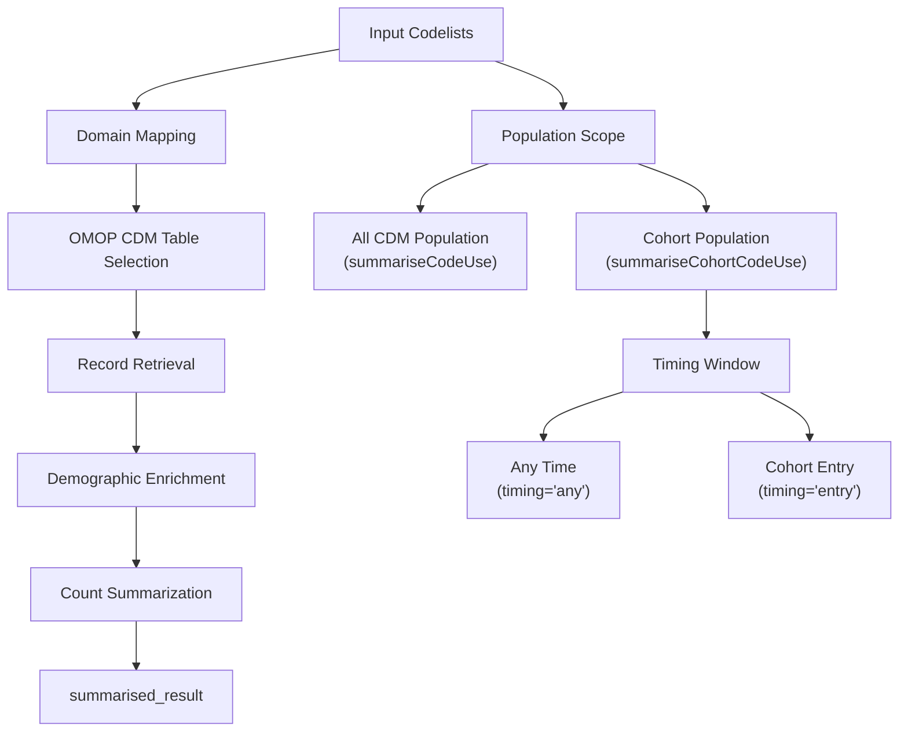
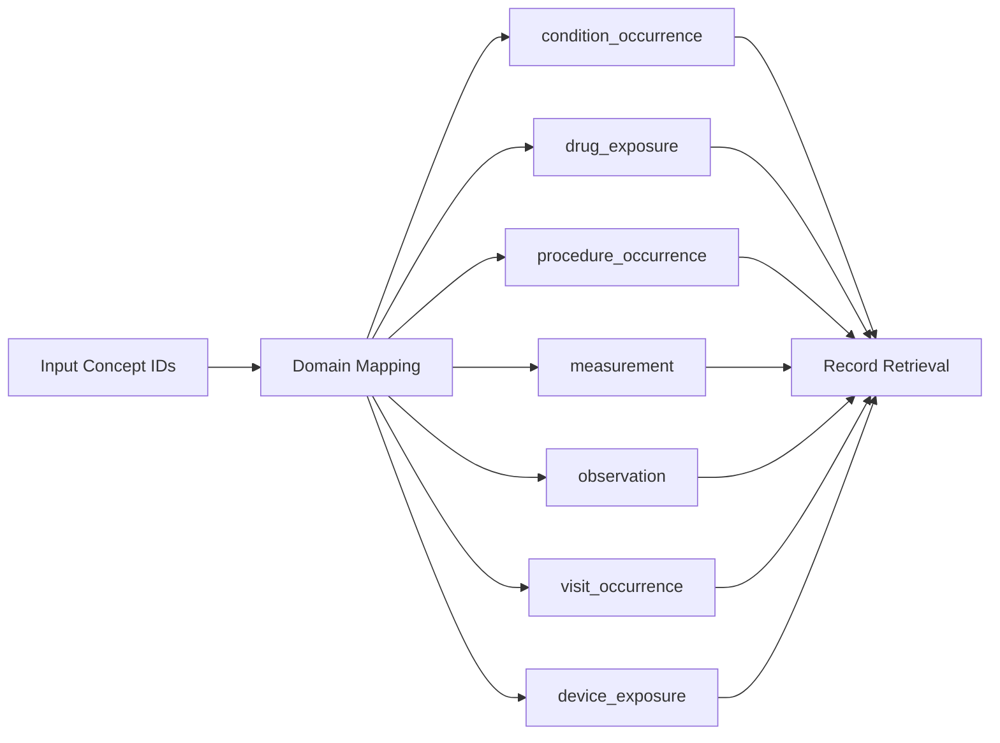
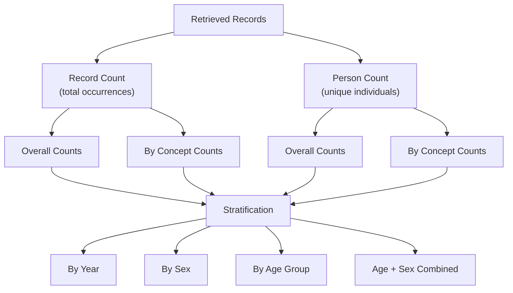
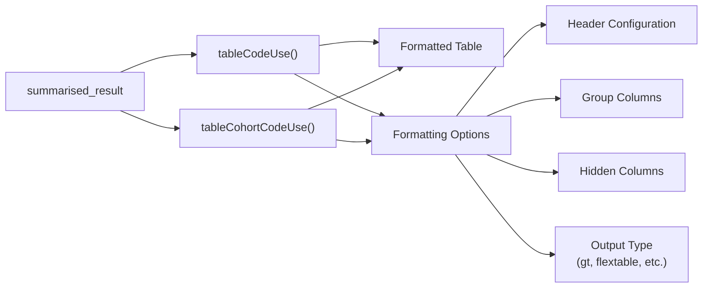

# Page: Code Usage Summarization

# Code Usage Summarization

Relevant source files

The following files were used as context for generating this wiki page:

- [DESCRIPTION](DESCRIPTION)
- [NEWS.md](NEWS.md)
- [R/mockVocabRef.R](R/mockVocabRef.R)
- [R/summariseCodeUse.R](R/summariseCodeUse.R)
- [R/tableCodeUse.R](R/tableCodeUse.R)
- [man/summariseCodeUse.Rd](man/summariseCodeUse.Rd)
- [man/summariseCohortCodeUse.Rd](man/summariseCohortCodeUse.Rd)
- [man/tableCodeUse.Rd](man/tableCodeUse.Rd)
- [man/tableCohortCodeUse.Rd](man/tableCohortCodeUse.Rd)
- [tests/testthat/test-summariseCodeUse.R](tests/testthat/test-summariseCodeUse.R)

This document covers the code usage analysis functionality in CodelistGenerator, specifically the `summariseCodeUse()` and `summariseCohortCodeUse()` functions that analyze the frequency and patterns of concept code usage within OMOP CDM patient-level data. For information about Achilles-based code usage analysis, see [Achilles Integration](#3.2). For orphan code detection functionality, see [Orphan Code Detection](#3.3).

## Purpose and Core Functions

The code usage summarization system provides two primary functions for analyzing how frequently clinical concepts appear in OMOP CDM databases:

- `summariseCodeUse()` - Analyzes code usage across the entire CDM database population
- `summariseCohortCodeUse()` - Analyzes code usage within specific cohorts, with options for different timing windows

Both functions return standardized `summarised_result` objects that can be formatted into tables using companion presentation functions.

**Code Usage Analysis Workflow**

Sources: [R/summariseCodeUse.R:53-103](), [R/summariseCodeUse.R:150-216]()

## Function Parameters and Configuration

### Core Parameters

Both functions share common stratification parameters that control how usage statistics are calculated and grouped:

| Parameter | Type | Description |
|-----------|------|-------------|
| `countBy` | character | `"record"` for record-level counts, `"person"` for person-level counts |
| `byConcept` | logical | Whether to stratify results by individual concepts |
| `byYear` | logical | Whether to stratify by calendar year |
| `bySex` | logical | Whether to stratify by patient sex |
| `ageGroup` | list | Age group categories for stratification |
| `dateRange` | Date vector | Date range to filter records (summariseCodeUse only) |

**Cohort-Specific Parameters**

`summariseCohortCodeUse()` includes additional parameters for cohort-based analysis:

| Parameter | Type | Description |
|-----------|------|-------------|
| `cohortTable` | character | Name of cohort table in CDM |
| `cohortId` | numeric | Specific cohort IDs to analyze |
| `timing` | character | `"any"` for any-time usage, `"entry"` for index-date only |

Sources: [R/summariseCodeUse.R:53-60](), [R/summariseCodeUse.R:150-159]()

## Data Processing Workflow

The code usage analysis follows a multi-stage pipeline implemented in the internal `getCodeUse()` function:

**Domain Mapping and Table Selection**

The system uses the `conceptDomainsData` mapping to determine which OMOP CDM tables contain records for each concept domain. This mapping is created in `getCodeUse()` and associates domain IDs with their corresponding table names, concept ID column names, and date column names.

Sources: [R/summariseCodeUse.R:262-278](), [R/summariseCodeUse.R:427-583]()

**Record Retrieval Process**

The `getRelevantRecords()` function implements the core logic for extracting matching records:

1. **Concept Filtering**: Joins input concepts with relevant OMOP CDM tables
2. **Cohort Restriction**: Filters to cohort members if `cohortTable` is specified  
3. **Timing Application**: Applies timing constraints for cohort entry analysis
4. **Multi-Domain Union**: Combines records across multiple domain tables
5. **Concept Enrichment**: Adds concept names and metadata

**Demographic Stratification**

When demographic stratification is requested, the system uses `PatientProfiles::addDemographicsQuery()` to enrich records with:
- Age calculations relative to the record date
- Age group assignments based on provided categories  
- Sex information from the person table

Sources: [R/summariseCodeUse.R:296-307](), [R/summariseCodeUse.R:427-583]()

## Count Summarization Logic

The `getSummaryCounts()` function generates usage statistics with multiple stratification levels:

**Base Count Types**

**Stratification Implementation**

The system generates counts for each requested stratification level:
- **Overall**: Aggregate counts across all records/persons
- **By Concept**: Counts broken down by individual concept IDs
- **By Year**: Counts grouped by calendar year of the record
- **By Sex**: Counts grouped by patient sex
- **By Age Group**: Counts grouped by age categories
- **Combined**: Cross-tabulations of age groups and sex

Sources: [R/summariseCodeUse.R:592-725](), [R/summariseCodeUse.R:727-785]()

## Output Structure and Format

Both functions return `summarised_result` objects following the omopgenerics standard structure:

**Core Result Columns**

| Column | Description |
|--------|-------------|
| `group_name` | Always `"codelist_name"` (and `"cohort_name"` for cohort analysis) |
| `group_level` | Name of the codelist being analyzed |
| `strata_name` | Stratification category (`"overall"`, `"year"`, `"sex"`, etc.) |
| `strata_level` | Specific stratum value |
| `variable_name` | Concept name or `"overall"` for aggregate counts |
| `variable_level` | Concept ID as character |
| `estimate_name` | `"record_count"` or `"person_count"` |
| `estimate_value` | Count value as character |

**Additional Information**

The `additional_name` and `additional_level` columns contain supplementary concept information:
- Source concept names and IDs
- Source concept values (for non-standard concepts)
- Domain ID information

Sources: [R/summariseCodeUse.R:325-343]()

## Presentation Functions

The package provides specialized table formatting functions for presenting code usage results:

**Table Generation Functions**

Both table functions support extensive customization through:
- `header`: Elements to include in table headers
- `groupColumn`: Variables for row grouping  
- `hide`: Columns to exclude from display
- `type`: Output format (gt, flextable, etc.)
- `.options`: Additional formatting parameters

The functions automatically filter results to the appropriate result type (`"code_use"` or `"cohort_code_use"`) and apply consistent formatting conventions.

Sources: [R/tableCodeUse.R:32-66](), [R/tableCodeUse.R:107-148](), [R/tableCodeUse.R:150-194]()