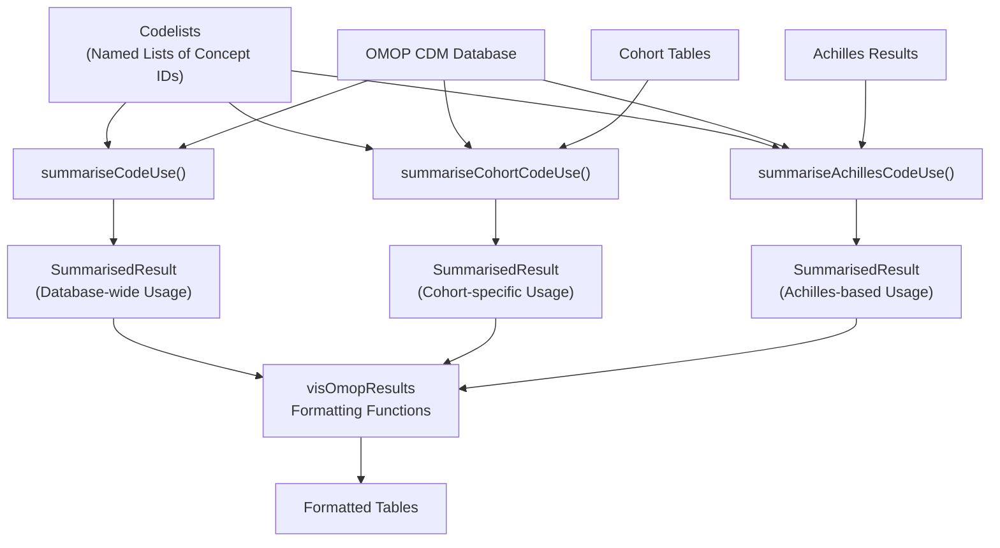
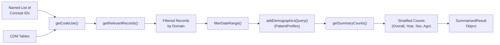
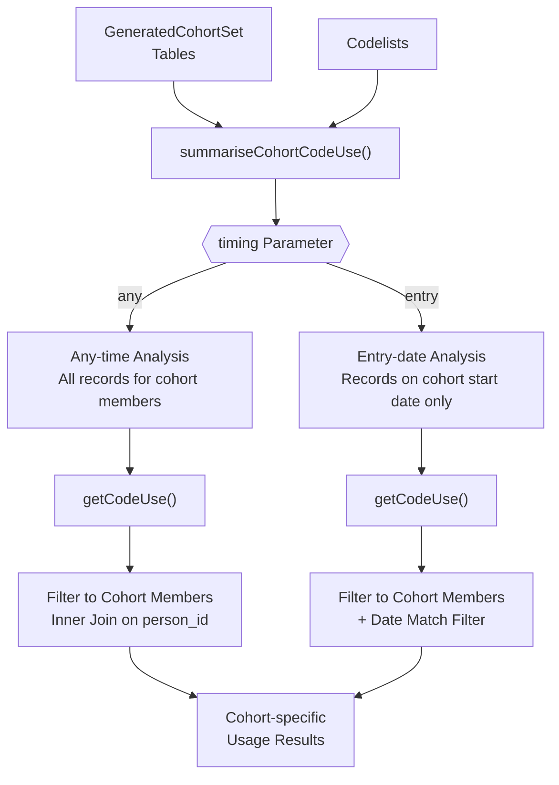
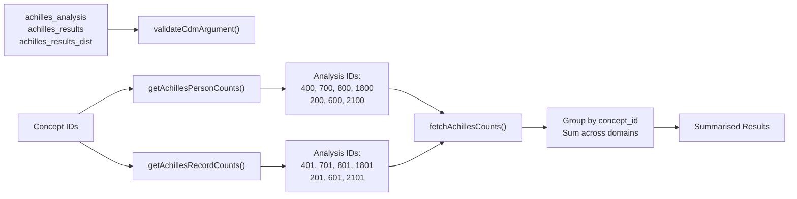
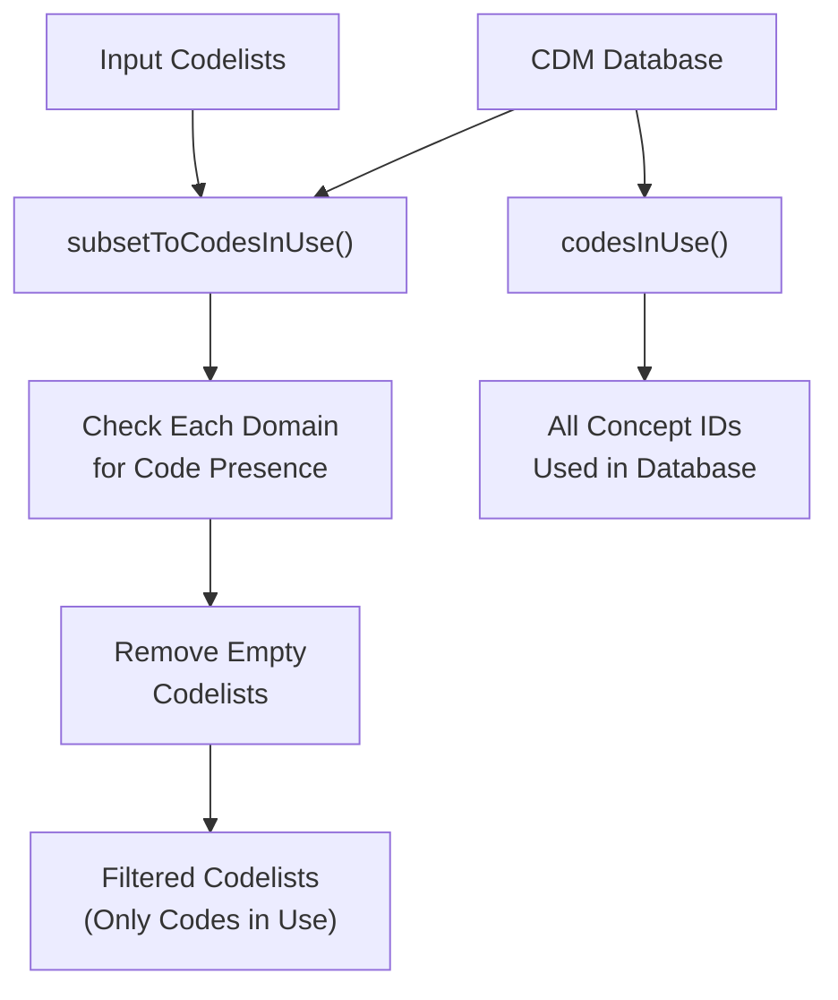
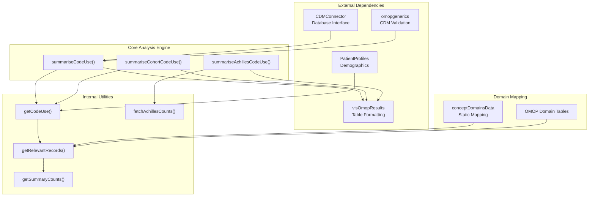

# Page: Codelist Analysis and Usage

# Codelist Analysis and Usage

<details>
<summary>Relevant source files</summary>

The following files were used as context for generating this wiki page:

- [DESCRIPTION](DESCRIPTION)
- [NEWS.md](NEWS.md)
- [R/mockVocabRef.R](R/mockVocabRef.R)
- [R/summariseAchillesCodeUse.R](R/summariseAchillesCodeUse.R)
- [R/summariseCodeUse.R](R/summariseCodeUse.R)
- [tests/testthat/test-codesInUse.R](tests/testthat/test-codesInUse.R)
- [tests/testthat/test-summariseAchillesCodeUse.R](tests/testthat/test-summariseAchillesCodeUse.R)
- [tests/testthat/test-summariseCodeUse.R](tests/testthat/test-summariseCodeUse.R)

</details>


This section documents the functions for analyzing how clinical codes are used within OMOP CDM databases. The package provides comprehensive tools for summarizing code usage patterns, both across entire databases and within specific patient cohorts, with optional integration with Achilles results for improved performance.

For information about generating codelists, see [Core Codelist Generation](#2). For functions that manipulate existing codelists, see [Codelist Manipulation](#4).

## Analysis Workflow Overview

The CodelistGenerator package provides three primary approaches for analyzing code usage patterns in OMOP CDM data:

**Analysis Workflow**


Sources: [R/summariseCodeUse.R:53-102](), [R/summariseAchillesCodeUse.R:19-125](), [DESCRIPTION:45-64]()

## Database-wide Code Usage Analysis

The `summariseCodeUse()` function provides comprehensive analysis of how codes are used across an entire OMOP CDM database. It supports multiple stratification options and counting methods.

**Core Function Signature**
```r
summariseCodeUse(x, cdm, countBy = c("record", "person"), 
                byConcept = TRUE, byYear = FALSE, bySex = FALSE, 
                ageGroup = NULL, dateRange = as.Date(c(NA, NA)))
```

**Analysis Pipeline Architecture**


The function automatically maps concept IDs to their appropriate OMOP domain tables using the internal `conceptDomainsData` mapping at [R/summariseCodeUse.R:266]().

**Key Features:**
- **Multi-domain Support**: Automatically handles concepts from condition_occurrence, drug_exposure, observation, measurement, visit_occurrence, procedure_occurrence, and device_exposure tables
- **Flexible Counting**: Supports both record-level and person-level counts via the `countBy` parameter
- **Stratification Options**: Can stratify results by year, sex, age groups, or combinations thereof
- **Date Filtering**: Optional `dateRange` parameter to restrict analysis to specific time periods

Sources: [R/summariseCodeUse.R:17-102](), [R/summariseCodeUse.R:218-361](), [R/summariseCodeUse.R:427-583]()

## Cohort-specific Code Usage Analysis

The `summariseCohortCodeUse()` function analyzes code usage patterns within specific patient cohorts, supporting both "any-time" and "entry-date" analysis strategies.

**Function Architecture**


**Timing Options:**
- **`timing = "any"`**: Analyzes all code usage by cohort members throughout their observation period
- **`timing = "entry"`**: Analyzes only codes used on the cohort entry date, useful for index event validation

The function supports multiple cohorts simultaneously by iterating through cohort definition IDs at [R/summariseCodeUse.R:176-191]().

Sources: [R/summariseCodeUse.R:105-216](), [R/summariseCodeUse.R:442-455](), [R/summariseCodeUse.R:515-524]()

## Achilles Integration for Performance

The `summariseAchillesCodeUse()` function leverages pre-computed Achilles results for rapid code usage analysis, particularly useful for large databases where real-time analysis would be computationally expensive.

**Achilles Analysis Architecture**


**Supported Analysis Types:**
- **Person Counts** (Analysis IDs: 400, 700, 800, 1800, 200, 600, 2100): Number of unique persons with each concept
- **Record Counts** (Analysis IDs: 401, 701, 801, 1801, 201, 601, 2101): Total number of records for each concept

The function automatically detects Achilles version and run date using analysis ID 0 at [R/summariseAchillesCodeUse.R:135-143]().

Sources: [R/summariseAchillesCodeUse.R:19-125](), [R/summariseAchillesCodeUse.R:146-190](), [R/mockVocabRef.R:372-394]()

## Code Filtering and Usage Utilities

The package provides utility functions for identifying which codes are actually used in the database and filtering codelists accordingly.

**Code Usage Detection Functions**


**Key Utility Functions:**
- **`subsetToCodesInUse()`**: Filters codelists to retain only codes that appear in the database
- **`codesInUse()`**: Returns all concept IDs that are used across all domain tables
- **`summariseOrphanCodes()`**: Identifies vocabulary concepts that exist but are never used in patient data (mentioned in [NEWS.md:3]())

These functions are particularly useful for:
- **Performance optimization**: Removing unused codes before analysis
- **Data quality assessment**: Understanding vocabulary coverage
- **Codelist validation**: Ensuring codelists contain relevant codes for the specific database

Sources: [tests/testthat/test-codesInUse.R:12-28](), [NEWS.md:15](), [NEWS.md:3]()

## Implementation Architecture

The code usage analysis system is built on a modular architecture that integrates with the broader OMOP ecosystem:

**System Integration Architecture**


**Key Implementation Details:**
- **Database Agnostic**: Works with any CDMConnector-supported database backend
- **Memory Efficient**: Uses lazy evaluation and database-side computation where possible
- **Temporary Tables**: Creates intermediate tables with unique names using `omopgenerics::uniqueTableName()` and properly cleans them up
- **Error Handling**: Comprehensive validation of inputs and graceful handling of empty results
- **Standardized Output**: All functions return `summarised_result` objects compatible with the omopgenerics framework

The system handles domain-specific logic by mapping concept domains to their corresponding OMOP CDM tables and column names, with support for standard concept IDs, source concept IDs, and date fields across all domains.

Sources: [R/summariseCodeUse.R:244-278](), [R/summariseCodeUse.R:352-359](), [R/summariseAchillesCodeUse.R:24-27](), [DESCRIPTION:33-48]()