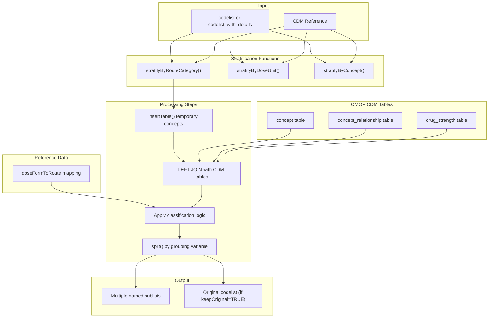
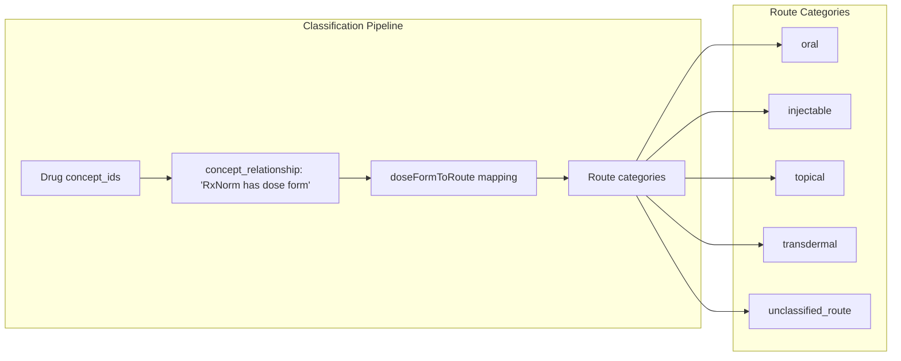
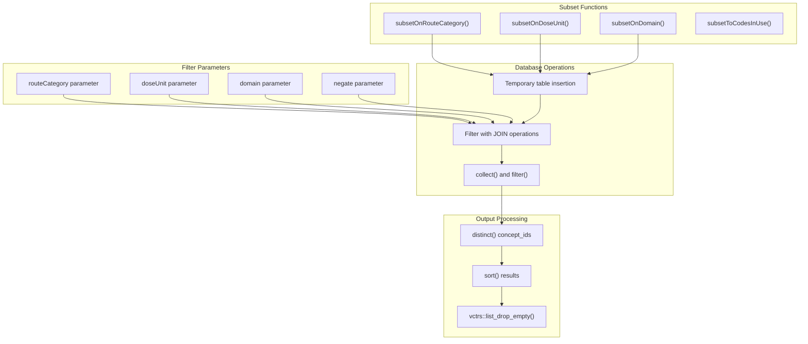
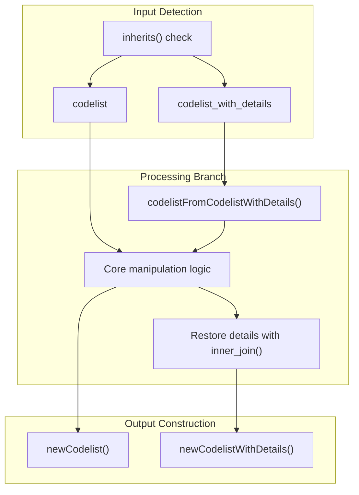

# Page: Codelist Manipulation

# Codelist Manipulation

Relevant source files

The following files were used as context for generating this wiki page:

- [CRAN-SUBMISSION](CRAN-SUBMISSION)
- [R/getRoutes.R](R/getRoutes.R)
- [R/stratifyByConcept.R](R/stratifyByConcept.R)
- [R/stratifyByDoseUnit.R](R/stratifyByDoseUnit.R)
- [R/stratifyByRoute.R](R/stratifyByRoute.R)
- [R/subsetOnDoseUnit.R](R/subsetOnDoseUnit.R)
- [R/subsetOnRouteCategory.R](R/subsetOnRouteCategory.R)
- [man/CodelistGenerator-package.Rd](man/CodelistGenerator-package.Rd)
- [man/stratifyByConcept.Rd](man/stratifyByConcept.Rd)
- [man/stratifyByDoseUnit.Rd](man/stratifyByDoseUnit.Rd)
- [man/stratifyByRouteCategory.Rd](man/stratifyByRouteCategory.Rd)
- [man/subsetOnDoseUnit.Rd](man/subsetOnDoseUnit.Rd)
- [tests/testthat/test-dbms.R](tests/testthat/test-dbms.R)
- [tests/testthat/test-stratifyByConcept.R](tests/testthat/test-stratifyByConcept.R)
- [tests/testthat/test-stratifyByDoseUnit.R](tests/testthat/test-stratifyByDoseUnit.R)
- [tests/testthat/test-stratifyByRouteCategory.R](tests/testthat/test-stratifyByRouteCategory.R)
- [tests/testthat/test-subsetOnDoseUnit.R](tests/testthat/test-subsetOnDoseUnit.R)

This page documents the functions and workflows for manipulating existing codelists within the CodelistGenerator package. These functions allow users to filter, stratify, and transform codelists based on various criteria such as drug route categories, dose units, domains, and individual concepts.

The manipulation functions operate on codelists that have already been generated through the core generation functions documented in [Core Codelist Generation](#2). For information about analyzing code usage patterns, see [Codelist Analysis and Usage](#3). For importing codelists from external sources, see [Data Import and Export](#5).

## Overview of Manipulation Operations

The CodelistGenerator package provides two primary types of codelist manipulation operations:

### Stratification Functions
Stratification functions split existing codelists into multiple sublists based on specific criteria, creating new named elements in the result. These functions include:

- `stratifyByRouteCategory` - divides drug codes by route categories (e.g., oral, injectable, topical)
- `stratifyByDoseUnit` - divides drug codes by dose units (e.g., milligram, percent)  
- `stratifyByConcept` - creates separate sublists for each individual concept

### Filtering/Subset Functions  
Filtering functions reduce codelists to only those concepts that meet specified criteria:

- `subsetOnRouteCategory` - retains only codes with specific route categories
- `subsetOnDoseUnit` - retains only codes with specific dose units
- `subsetOnDomain` - retains only codes from specific OMOP domains
- `subsetToCodesInUse` - retains only codes that appear in the CDM data

## Stratification Workflow

The following diagram illustrates how stratification functions process codelists by querying OMOP CDM tables and applying classification logic:

**Sources**: [R/stratifyByRoute.R:37-141](), [R/stratifyByDoseUnit.R:37-148](), [R/stratifyByConcept.R:37-101]()

## Route Category Stratification

The `stratifyByRouteCategory` function uses the RxNorm dose form relationships to classify drug concepts by their administration routes.

### Route Classification Process

The function queries the `concept_relationship` table for relationships with `relationship_id == "RxNorm has dose form"`, then maps the resulting dose form concept IDs to route categories using the `doseFormToRoute` reference data. Drug concepts without mappings are classified as `"unclassified_route"`.

**Sources**: [R/stratifyByRoute.R:70-94](), [R/getRoutes.R:39-68]()

## Dose Unit Stratification 

The `stratifyByDoseUnit` function processes drug concepts by examining their strength information in the `drug_strength` table.

### Dose Unit Processing Logic

| Field | Source Table | Target Column | Processing |
|-------|--------------|---------------|------------|
| `amount_unit_concept_id` | `drug_strength` | `amount_concept_name` | Direct concept name lookup |
| `numerator_unit_concept_id` | `drug_strength` | `numerator_concept_name` | Direct concept name lookup |
| Final unit group | Processed | `unit_group` | `toSnakeCase()` transformation |

The function prioritizes `amount_concept_name` over `numerator_concept_name` when both are available. Drug concepts without strength information are classified as `"unkown_dose_unit"`.

**Sources**: [R/stratifyByDoseUnit.R:59-101]()

## Filtering Functions

Filtering functions use similar database queries but apply filter conditions instead of grouping operations.

### Subset Function Architecture

**Sources**: [R/subsetOnRouteCategory.R:40-116](), [R/subsetOnDoseUnit.R:40-125]()

## Data Type Support

The manipulation functions support both `codelist` and `codelist_with_details` objects:

### Object Type Handling

When processing `codelist_with_details` objects, the functions extract the concept IDs for manipulation, then restore the detailed information through inner joins with the original data.

**Sources**: [R/stratifyByRoute.R:44-47,95-99](), [R/stratifyByDoseUnit.R:44-47,102-106]()

## Common Parameters and Options

All manipulation functions support standard parameters for controlling behavior:

| Parameter | Type | Purpose | Default |
|-----------|------|---------|---------|
| `x` | `list`/`codelist` | Input codelist to manipulate | Required |
| `cdm` | `cdm_reference` | OMOP CDM database connection | Required |
| `keepOriginal` | `logical` | Retain original codelist in output | `FALSE` |
| `negate` | `logical` | Invert filter logic (subset functions) | `FALSE` |

The `keepOriginal` parameter uses `purrr::list_flatten()` to combine original and manipulated codelists. The `negate` parameter allows exclusion-based filtering instead of inclusion-based filtering.

**Sources**: [R/stratifyByRoute.R:125-127](), [R/subsetOnRouteCategory.R:89-95]()