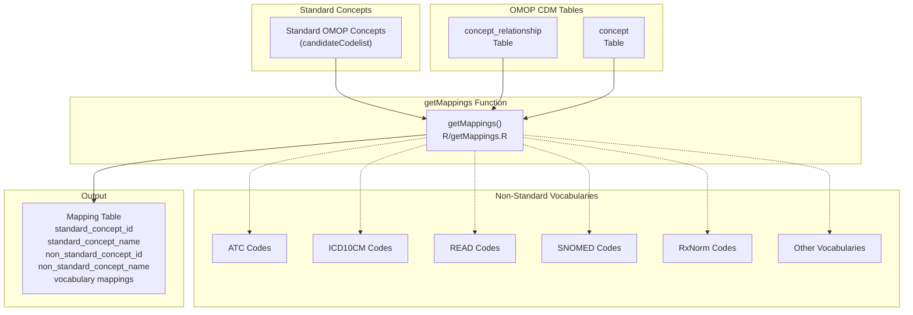
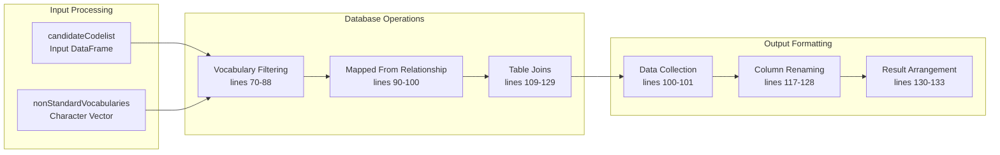
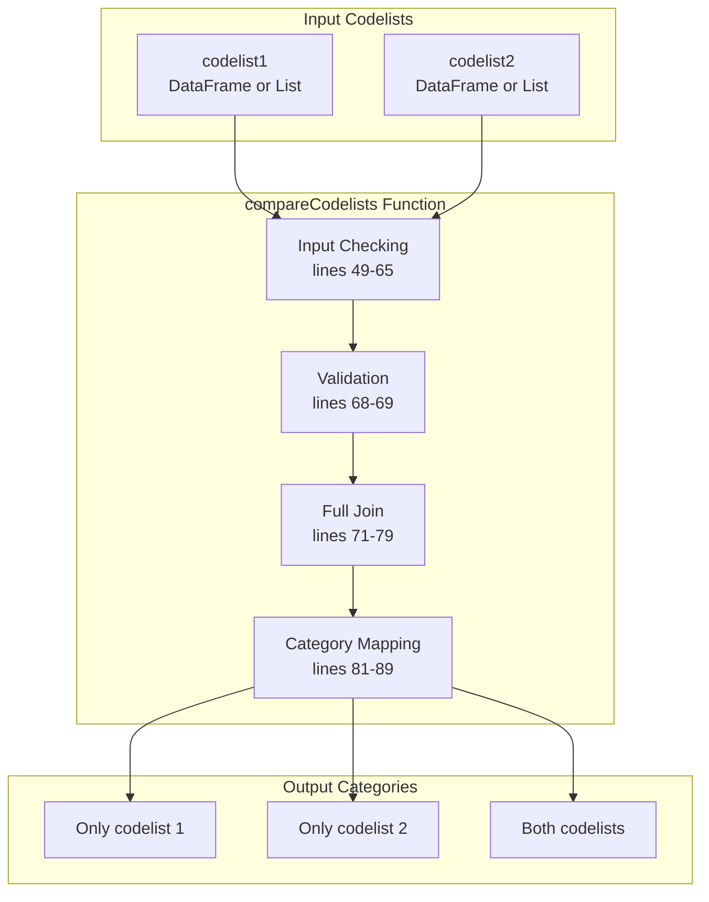
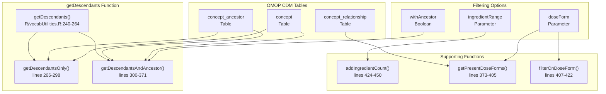
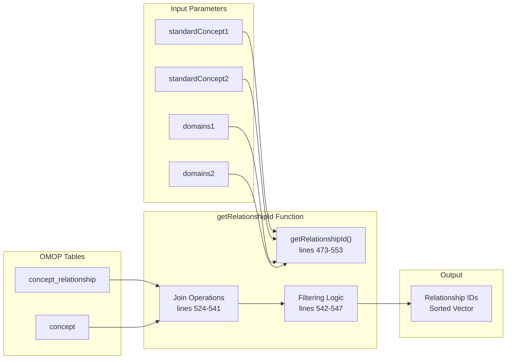
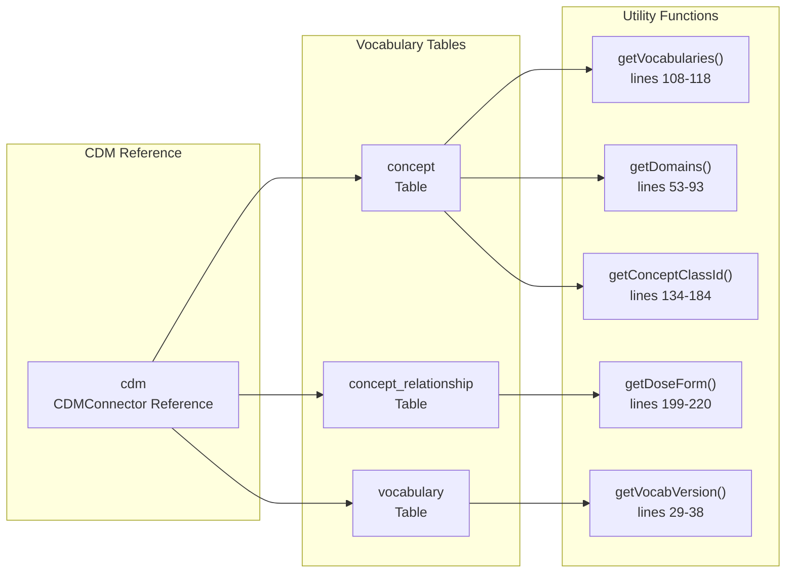

# Page: Concept Mappings and Comparisons

# Concept Mappings and Comparisons

Relevant source files

The following files were used as context for generating this wiki page:

- [R/compareCodelists.R](R/compareCodelists.R)
- [R/getMappings.R](R/getMappings.R)
- [R/vocabUtilities.R](R/vocabUtilities.R)
- [man/getMappings.Rd](man/getMappings.Rd)
- [tests/testthat/test-compareCodelists.R](tests/testthat/test-compareCodelists.R)
- [tests/testthat/test-getMappings.R](tests/testthat/test-getMappings.R)
- [tests/testthat/test-mockVocabRef.R](tests/testthat/test-mockVocabRef.R)
- [tests/testthat/test-vocabUtilities.R](tests/testthat/test-vocabUtilities.R)

This document covers functionality for mapping between different OMOP vocabulary standards and comparing codelists. The core capabilities include retrieving mappings from standard to non-standard vocabularies, performing overlap analysis between codelists, and exploring concept relationships and hierarchies within the OMOP CDM vocabulary structure.

For general vocabulary exploration functions like getting available domains and vocabularies, see [Vocabulary Exploration](#6.1). For codelist manipulation and filtering operations, see [Filtering and Subsetting](#4.2).

## Vocabulary Mappings

The `getMappings` function provides the primary interface for discovering mappings between standard OMOP concepts and their corresponding non-standard vocabulary representations. This is essential for understanding how concepts are represented across different coding systems.

### Mapping Architecture

The `getMappings` function uses the "Mapped from" relationship in the `concept_relationship` table to identify non-standard concepts that map to standard concepts in the input codelist.

**Sources:** [R/getMappings.R:1-135](), [tests/testthat/test-getMappings.R:1-74]()

### Mapping Process Flow

**Sources:** [R/getMappings.R:41-135]()

## Codelist Comparison

The `compareCodelists` function enables systematic comparison of two codelists to identify overlaps, unique concepts, and differences between different approaches to concept selection.

### Comparison Workflow

The function accepts both DataFrame inputs (from functions like `getCandidateCodes`) and list inputs (from `omopgenerics::newCodelist`), automatically converting list formats to the required DataFrame structure.

**Sources:** [R/compareCodelists.R:1-91](), [tests/testthat/test-compareCodelists.R:1-151]()

### Comparison Categories

| Category | Description | Logic |
|----------|-------------|-------|
| `Only codelist 1` | Concepts present only in the first codelist | `!is.na(codelist_1) & is.na(codelist_2)` |
| `Only codelist 2` | Concepts present only in the second codelist | `is.na(codelist_1) & !is.na(codelist_2)` |
| `Both` | Concepts present in both codelists | `!is.na(codelist_1) & !is.na(codelist_2)` |

**Sources:** [R/compareCodelists.R:82-88]()

## Concept Hierarchies and Relationships

The vocabulary utilities provide functions for navigating concept hierarchies and exploring relationships between concepts within the OMOP vocabulary structure.

### Descendant Retrieval Architecture

**Sources:** [R/vocabUtilities.R:222-450]()

### Relationship Discovery

The `getRelationshipId` function enables exploration of available concept relationships within specific domains and concept types:

**Sources:** [R/vocabUtilities.R:453-553]()

## Vocabulary Exploration Utilities

Several utility functions support the mapping and comparison operations by providing access to vocabulary metadata and structure.

### Core Utility Functions

| Function | Purpose | Output |
|----------|---------|--------|
| `getVocabularies` | List available vocabularies in CDM | Character vector of vocabulary IDs |
| `getDomains` | List available domains | Character vector of domain IDs |
| `getConceptClassId` | Get concept classes for domains | Character vector of concept class IDs |
| `getDoseForm` | Get available dose forms for drugs | Character vector of dose form names |
| `getVocabVersion` | Get vocabulary version information | Character string of version |

**Sources:** [R/vocabUtilities.R:17-220]()

### Vocabulary Structure Query Pattern

All utility functions follow a consistent pattern of CDM validation, database querying, and result collection, ensuring reliable access to vocabulary metadata across different database backends.

**Sources:** [R/vocabUtilities.R:17-220](), [tests/testthat/test-vocabUtilities.R:1-138]()