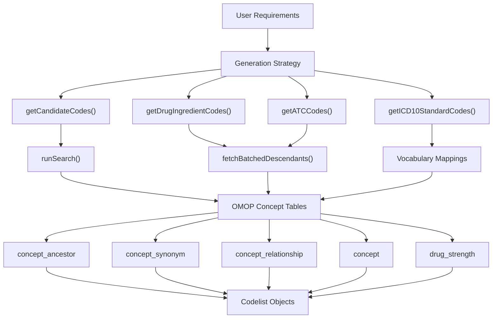
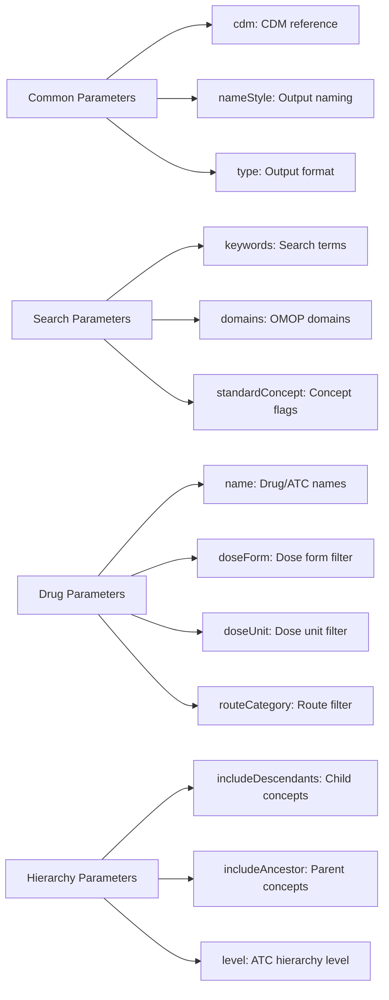
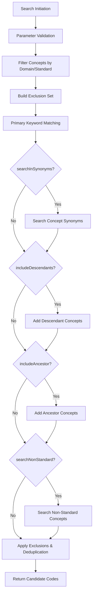
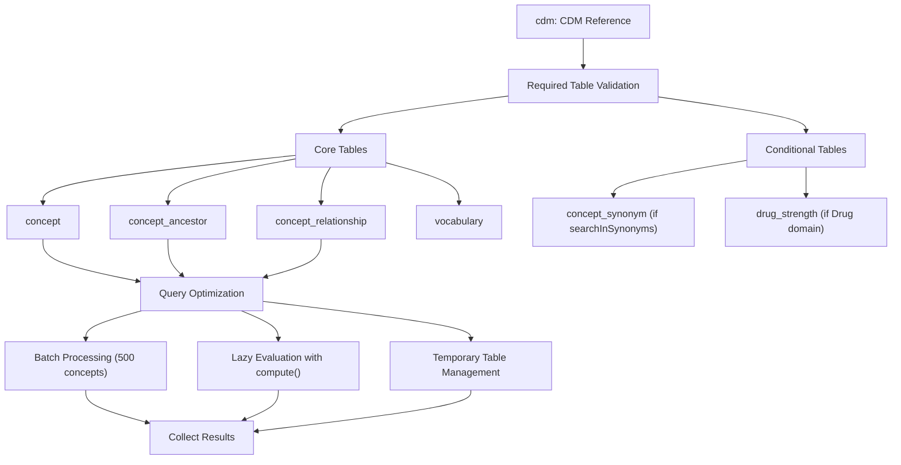
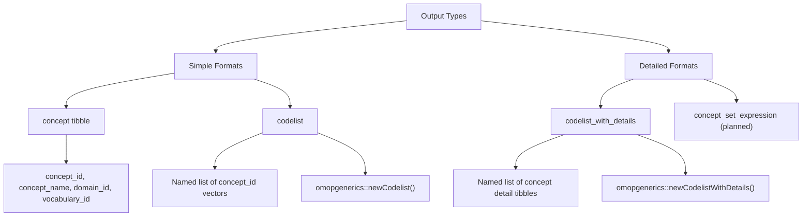
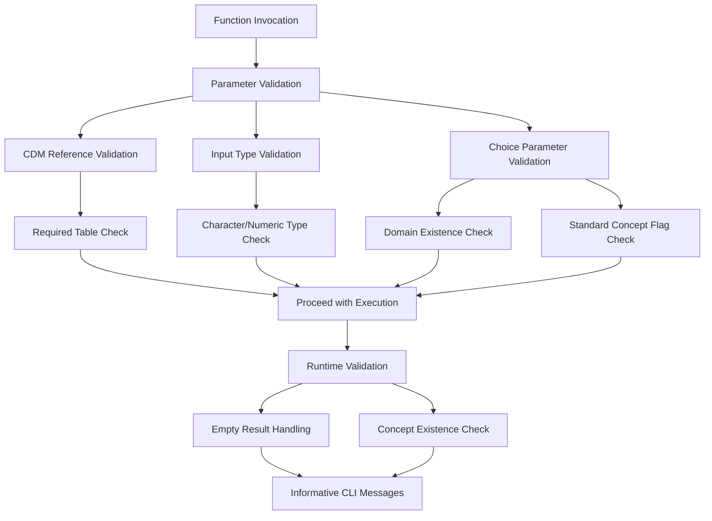

# Page: Core Codelist Generation

# Core Codelist Generation

Relevant source files

The following files were used as context for generating this wiki page:

- [R/drugCodes.R](R/drugCodes.R)
- [R/getCandidateCodes.R](R/getCandidateCodes.R)
- [R/runSearch.R](R/runSearch.R)
- [man/getATCCodes.Rd](man/getATCCodes.Rd)
- [man/getCandidateCodes.Rd](man/getCandidateCodes.Rd)
- [man/getDrugIngredientCodes.Rd](man/getDrugIngredientCodes.Rd)
- [tests/testthat/test-drugCodes.R](tests/testthat/test-drugCodes.R)
- [tests/testthat/test-getCandidateCodes.R](tests/testthat/test-getCandidateCodes.R)

This document covers the primary functions for generating codelists from OMOP CDM vocabularies. These functions form the foundation of the CodelistGenerator package by providing multiple approaches to identify relevant concept codes based on different search strategies and vocabulary hierarchies.

For information about manipulating existing codelists, see [Codelist Manipulation](#4). For analysis of code usage patterns, see [Codelist Analysis and Usage](#3). For importing codes from external sources, see [Data Import and Export](#5).

## Purpose and Scope

The core codelist generation functions provide systematic approaches to identify OMOP concepts of interest through:

- **Keyword-based searching** across concept names and synonyms
- **Drug-specific generation** using ingredient and ATC classification hierarchies  
- **Vocabulary-specific functions** for standardized classifications like ICD-10
- **Hierarchical expansion** through ancestor and descendant relationships

These functions output standardized codelist objects that can be further manipulated, analyzed, or exported for use in clinical studies.

## Generation Architecture

The codelist generation system operates through a multi-layered architecture that transforms user requirements into OMOP concept sets:

**Generation Flow Architecture**

Sources: [R/getCandidateCodes.R:56-125](), [R/drugCodes.R:39-148](), [R/drugCodes.R:173-299](), [R/runSearch.R:17-381]()

## Primary Generation Functions

The package provides four main generation functions, each optimized for different use cases:

| Function | Primary Use Case | Search Method | Output Format |
|----------|------------------|---------------|---------------|
| `getCandidateCodes` | Keyword-based concept discovery | Text matching with hierarchy expansion | Concept tibble |
| `getDrugIngredientCodes` | Drug ingredient-based codelists | Ingredient hierarchy traversal | Codelist or CodelistWithDetails |
| `getATCCodes` | ATC classification-based drugs | ATC level descendant expansion | Codelist or CodelistWithDetails |
| `getICD10StandardCodes` | ICD-10 standard mappings | Vocabulary-specific mappings | Codelist format |

**Function Parameter Patterns**

Sources: [man/getCandidateCodes.Rd:6-17](), [man/getDrugIngredientCodes.Rd:6-16](), [man/getATCCodes.Rd:6-16]()

## Search Strategy Implementation

The core search functionality is implemented through a sophisticated multi-step process that handles various search strategies and filtering requirements:

**Search Process Flow**

Sources: [R/runSearch.R:100-380](), [R/getCandidateCodes.R:90-124]()

## Database Integration Patterns

All generation functions follow consistent patterns for database interaction and performance optimization:

**Database Access Architecture**

Sources: [R/getCandidateCodes.R:83-88](), [R/drugCodes.R:311-341](), [R/runSearch.R:32-38]()

## Output Format Standardization

The generation functions produce standardized output formats that integrate with the broader omopgenerics ecosystem:

**Output Type Hierarchy**

Sources: [R/drugCodes.R:116-132](), [R/drugCodes.R:269-284](), [R/getCandidateCodes.R:343-371]()

## Error Handling and Validation

The generation functions implement comprehensive validation and error handling patterns:

**Validation Workflow**

Sources: [R/getCandidateCodes.R:69-88](), [R/drugCodes.R:48-59](), [R/drugCodes.R:187-205](), [tests/testthat/test-getCandidateCodes.R:220-257]()

The core generation functions provide a robust foundation for systematic codelist creation, with detailed functionality documented in the following sub-sections: [Candidate Code Search](#2.1), [Drug-Specific Code Generation](#2.2), and [ICD-10 and Other Standards](#2.3).