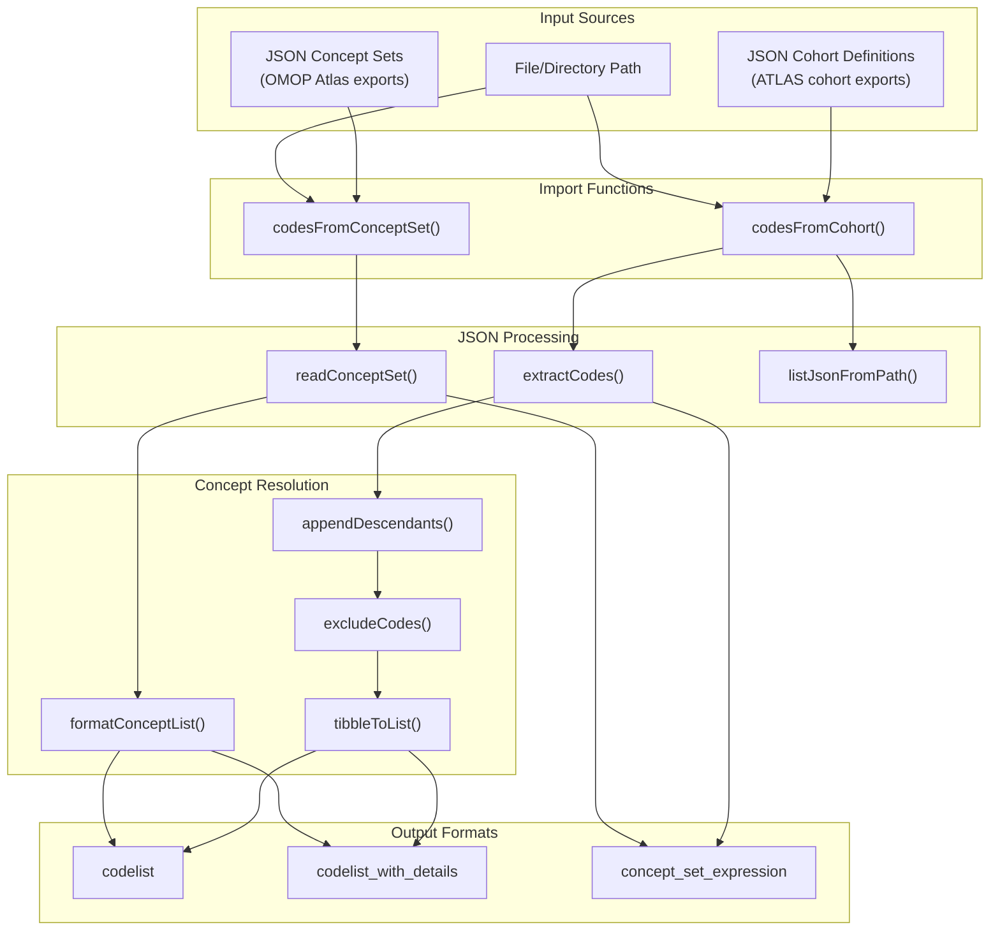
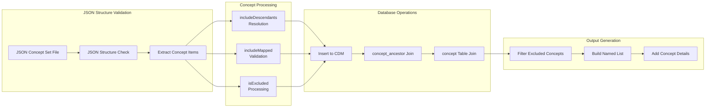
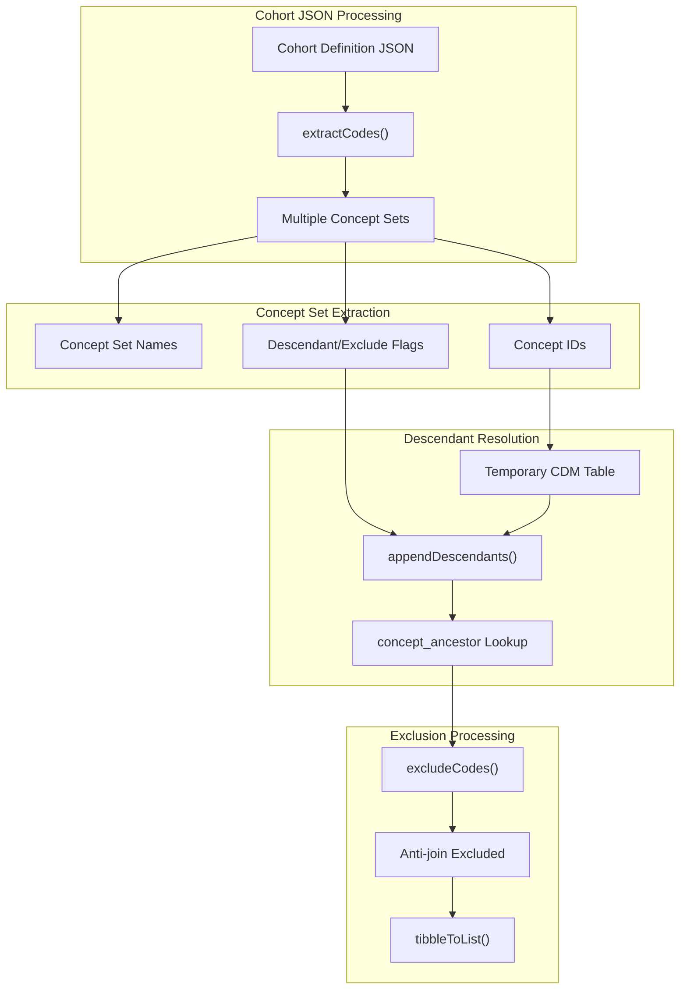
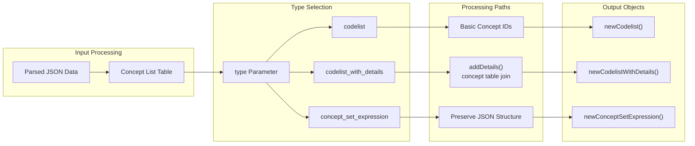
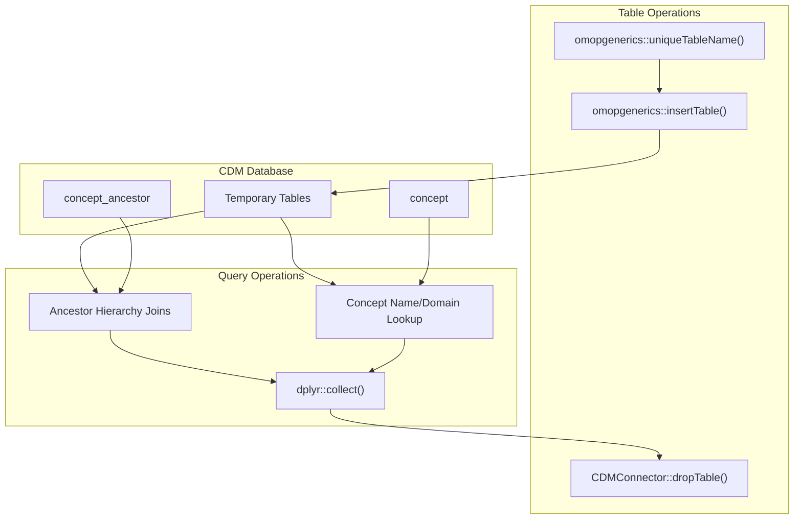

# Page: Data Import and Export

# Data Import and Export

Relevant source files

The following files were used as context for generating this wiki page:

- [NAMESPACE](NAMESPACE)
- [R/codesFromConceptSet.R](R/codesFromConceptSet.R)
- [R/tableUnmappedCodes.R](R/tableUnmappedCodes.R)
- [_pkgdown.yml](_pkgdown.yml)
- [cran-comments.md](cran-comments.md)
- [man/codesFromConceptSet.Rd](man/codesFromConceptSet.Rd)
- [tests/testthat/test-codesFrom.R](tests/testthat/test-codesFrom.R)
- [tests/testthat/test-findUnmappedCodes.R](tests/testthat/test-findUnmappedCodes.R)

This document covers the data import and export functionality within CodelistGenerator, specifically focusing on importing concept codes from JSON files and exporting codelists in various formats. This functionality enables seamless integration with OMOP concept set expressions and cohort definitions created in external tools.

For information about codelist manipulation after import, see [Codelist Manipulation](#4). For details about the various output types and formats supported, see [Package Structure and Development](#8).

## JSON Import Architecture

The CodelistGenerator package provides comprehensive support for importing concept codes from JSON files containing either OMOP concept set expressions or cohort definitions. The import system is built around two primary functions that handle different JSON structures while sharing common processing logic.

**Sources:** [R/codesFromConceptSet.R:1-550](), [NAMESPACE:7-8]()

## Concept Set Import Processing

The `codesFromConceptSet` function handles JSON files containing OMOP concept set expressions, which are typically exported from ATLAS or other OMOP tools. The processing pipeline validates JSON structure, resolves concept hierarchies, and handles inclusion/exclusion logic.

**Sources:** [R/codesFromConceptSet.R:36-134](), [R/codesFromConceptSet.R:493-549]()

## Cohort Definition Import Processing

The `codesFromCohort` function processes JSON cohort definitions that contain embedded concept sets. This function extracts all concept sets from cohort definitions and processes them through a similar pipeline, with additional logic for handling multiple concept sets per cohort.

**Sources:** [R/codesFromConceptSet.R:154-236](), [R/codesFromConceptSet.R:251-294](), [R/codesFromConceptSet.R:296-316]()

## Export Functionality

The package provides export capabilities through functions imported from the `omopgenerics` package. These functions enable converting codelists back to standardized formats for sharing and archival purposes.

| Function | Purpose | Output Format |
|----------|---------|---------------|
| `exportCodelist` | Export codelist objects | JSON or CSV format |
| `exportConceptSetExpression` | Export concept set expressions | OMOP-compliant JSON |
| `importCodelist` | Import previously exported codelists | Codelist object |
| `importConceptSetExpression` | Import concept set expressions | ConceptSetExpression object |

**Sources:** [NAMESPACE:12-13](), [NAMESPACE:28-29](), [NAMESPACE:53-56]()

## Output Type Processing

The import functions support three distinct output types, each serving different use cases within the OMOP ecosystem. The `type` parameter controls which format is returned.

**Sources:** [R/codesFromConceptSet.R:120-128](), [R/codesFromConceptSet.R:366-431](), [R/codesFromConceptSet.R:75-94]()

## Database Integration and Temporary Tables

The import process heavily utilizes the CDM database connection for concept resolution and hierarchy traversal. Temporary tables are created and managed to efficiently process large concept sets and perform complex joins.

**Sources:** [R/codesFromConceptSet.R:110-118](), [R/codesFromConceptSet.R:201-215](), [R/codesFromConceptSet.R:384-415]()

## Error Handling and Validation

The import system includes comprehensive validation to ensure JSON files conform to expected OMOP structures and that unsupported features are properly flagged.

| Validation Check | Function | Error Condition |
|------------------|----------|-----------------|
| Path validation | `checkInputs` | Non-existent paths or invalid file types |
| JSON structure | `readConceptSet` | Malformed OMOP concept set JSON |
| Mapped concepts | Multiple locations | `includeMapped = TRUE` (unsupported) |
| Duplicate names | `tibbleToList` | Same concept set name with different definitions |
| Empty results | Multiple functions | No concepts found in input files |

**Sources:** [R/codesFromConceptSet.R:40-44](), [R/codesFromConceptSet.R:66-73](), [R/codesFromConceptSet.R:97-103](), [R/codesFromConceptSet.R:356-361]()