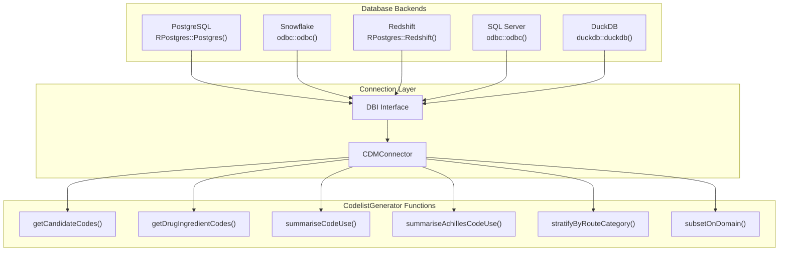
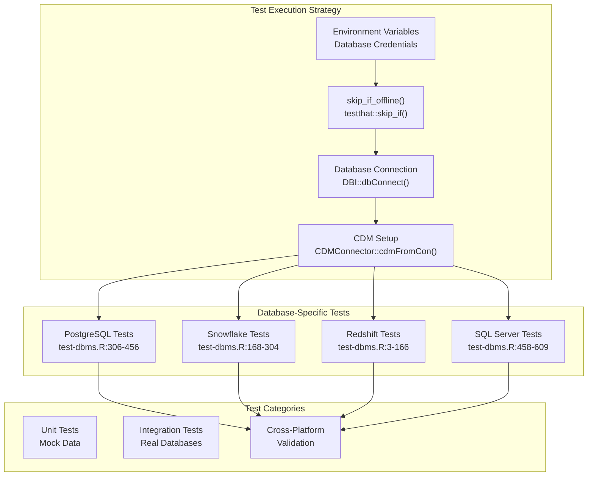
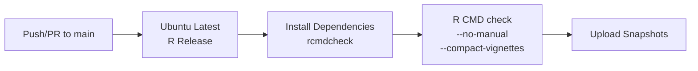
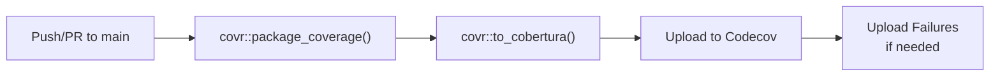
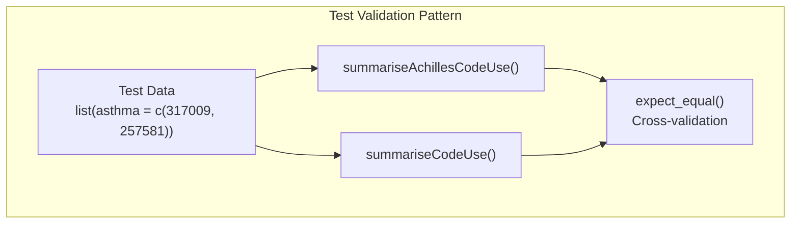

# Page: Database Integration and Testing

# Database Integration and Testing

<details>
<summary>Relevant source files</summary>

The following files were used as context for generating this wiki page:

- [.github/workflows/R-CMD-check.yaml](.github/workflows/R-CMD-check.yaml)
- [.github/workflows/test-coverage.yaml](.github/workflows/test-coverage.yaml)
- [CRAN-SUBMISSION](CRAN-SUBMISSION)
- [R/getRoutes.R](R/getRoutes.R)
- [R/stratifyByRoute.R](R/stratifyByRoute.R)
- [R/subsetOnDomain.R](R/subsetOnDomain.R)
- [R/subsetOnRouteCategory.R](R/subsetOnRouteCategory.R)
- [man/CodelistGenerator-package.Rd](man/CodelistGenerator-package.Rd)
- [tests/testthat/test-dbms.R](tests/testthat/test-dbms.R)

</details>


This page documents CodelistGenerator's multi-database architecture and comprehensive testing framework. The package supports multiple database backends through a unified interface and employs sophisticated testing strategies to ensure cross-platform compatibility and reliability.

For information about mock data utilities used in testing, see [Mock Data and Testing Utilities](#8.2). For package architecture details, see [Package Architecture](#8.1).

## Database Integration Architecture

CodelistGenerator integrates with OMOP CDM databases through a layered architecture that abstracts database-specific implementations while maintaining performance and functionality across platforms.

### Connection and Interface Layer



Sources: [tests/testthat/test-dbms.R:1-609](), [R/stratifyByRoute.R:37-141](), [R/getRoutes.R:39-68]()

### Database-Agnostic Query Patterns

The package employs consistent patterns for database operations across all supported backends:

| Operation Pattern | Implementation | Example Functions |
|------------------|----------------|-------------------|
| Temporary table creation | `omopgenerics::insertTable()` | `stratifyByRouteCategory()`, `subsetOnDomain()` |
| Join operations | `dplyr` verbs with `collect()` | Route categorization, domain filtering |
| Cleanup operations | `CDMConnector::dropTable()` | All functions using temporary tables |
| Schema management | `cdmFromCon()` with schema parameters | Multi-schema database support |

Sources: [R/stratifyByRoute.R:62-67](), [R/subsetOnDomain.R:54-58](), [R/subsetOnRouteCategory.R:67-70]()

## Testing Framework

### Multi-Platform Testing Strategy



Sources: [tests/testthat/test-dbms.R:1-609]()

### Test Execution Flow

Each database platform follows a standardized test pattern:

1. **Environment Check**: Verify required environment variables exist
2. **Connection Setup**: Establish database connection with platform-specific drivers
3. **CDM Initialization**: Create CDM reference with appropriate schemas
4. **Function Testing**: Execute core package functions
5. **Validation**: Compare results across platforms for consistency
6. **Cleanup**: Disconnect and clean up resources

Sources: [tests/testthat/test-dbms.R:5-6](), [tests/testthat/test-dbms.R:170-171](), [tests/testthat/test-dbms.R:308-309]()

## Database Platform Support

### PostgreSQL Integration

PostgreSQL support uses the `RPostgres` driver with comprehensive testing of core functionality:

```r
# Connection pattern from test-dbms.R:311-322
db <- DBI::dbConnect(RPostgres::Postgres(),
                     dbname = Sys.getenv("CDM5_POSTGRESQL_DBNAME"),
                     host = Sys.getenv("CDM5_POSTGRESQL_HOST"),
                     user = Sys.getenv("CDM5_POSTGRESQL_USER"),
                     password = Sys.getenv("CDM5_POSTGRESQL_PASSWORD"))
```

Key tested functionality includes:
- Orphan code detection with `summariseOrphanCodes()`
- Domain subsetting with `subsetOnDomain()`
- Drug stratification with `stratifyByDoseUnit()` and `stratifyByRouteCategory()`
- Candidate code search with `getCandidateCodes()`

Sources: [tests/testthat/test-dbms.R:306-456]()

### Snowflake Integration

Snowflake uses ODBC connectivity with multi-part schema handling:

```r
# Connection pattern from test-dbms.R:173-187
con <- DBI::dbConnect(odbc::odbc(),
                      SERVER = Sys.getenv("SNOWFLAKE_SERVER"),
                      UID = Sys.getenv("SNOWFLAKE_USER"),
                      PWD = Sys.getenv("SNOWFLAKE_PASSWORD"),
                      DATABASE = Sys.getenv("SNOWFLAKE_DATABASE"),
                      WAREHOUSE = Sys.getenv("SNOWFLAKE_WAREHOUSE"))

cdm_schema <- strsplit(Sys.getenv("SNOWFLAKE_CDM_SCHEMA"), "\\.")[[1]]
write_schema <- strsplit(Sys.getenv("SNOWFLAKE_SCRATCH_SCHEMA"), "\\.")[[1]]
```

Sources: [tests/testthat/test-dbms.R:168-304]()

### Redshift Integration

Redshift leverages PostgreSQL compatibility through `RPostgres::Redshift()`:

```r
# Connection pattern from test-dbms.R:8-18
db <- DBI::dbConnect(RPostgres::Redshift(),
                     dbname   = Sys.getenv("CDM5_REDSHIFT_DBNAME"),
                     host     = Sys.getenv("CDM5_REDSHIFT_HOST"),
                     port     = Sys.getenv("CDM5_REDSHIFT_PORT"),
                     user     = Sys.getenv("CDM5_REDSHIFT_USER"),
                     password = Sys.getenv("CDM5_REDSHIFT_PASSWORD"))
```

Special handling includes:
- `concept_id` type conversion to `integer64` for large identifier support
- Comprehensive validation of Achilles integration results

Sources: [tests/testthat/test-dbms.R:3-166]()

### SQL Server Integration

SQL Server uses ODBC with driver specification and multi-part schema names:

```r
# Connection pattern from test-dbms.R:464-475
db <- DBI::dbConnect(odbc::odbc(),
                     Driver   = Sys.getenv("SQL_SERVER_DRIVER"),
                     Server   = Sys.getenv("CDM5_SQL_SERVER_SERVER"),
                     Database = Sys.getenv("CDM5_SQL_SERVER_CDM_DATABASE"))

cdm <- CDMConnector::cdmFromCon(db,
                                cdmSchema = c("CDMV54", "dbo"),
                                achillesSchema = c("CDMV54", "dbo"),
                                writeSchema = c("ohdsi", "dbo"))
```

Sources: [tests/testthat/test-dbms.R:458-609]()

## Continuous Integration and Testing

### GitHub Actions Workflows

The package employs two primary CI workflows:

#### R CMD Check Workflow



Configuration details:
- Runs on Ubuntu latest with R release version
- Uses public RSPM for faster package installation
- Includes snapshot uploads for test debugging

Sources: [.github/workflows/R-CMD-check.yaml:1-49]()

#### Test Coverage Workflow



Features:
- Comprehensive test coverage analysis
- Cobertura XML format for reporting
- Failure artifact collection for debugging
- Integration with Codecov for coverage tracking

Sources: [.github/workflows/test-coverage.yaml:1-62]()

### Environment Variable Management

Database testing relies on environment variables for secure credential management:

| Database | Required Variables | Example Usage |
|----------|-------------------|---------------|
| PostgreSQL | `CDM5_POSTGRESQL_*` | Host, database, user, password, schemas |
| Snowflake | `SNOWFLAKE_*` | Server, user, password, database, warehouse |
| Redshift | `CDM5_REDSHIFT_*` | Host, port, database, user, password, schemas |
| SQL Server | `CDM5_SQL_SERVER_*`, `SQL_SERVER_DRIVER` | Server, database, user, password, driver |

Sources: [tests/testthat/test-dbms.R:5](), [tests/testthat/test-dbms.R:170](), [tests/testthat/test-dbms.R:308](), [tests/testthat/test-dbms.R:460-461]()

## Cross-Platform Validation

### Consistency Testing

The testing framework validates that core functions produce consistent results across database platforms:



Key validation areas include:
- Record count consistency between Achilles and direct CDM queries
- Person count validation across different analysis methods
- Concept set processing accuracy across platforms
- Route categorization consistency

Sources: [tests/testthat/test-dbms.R:82-102](), [tests/testthat/test-dbms.R:118-138](), [tests/testthat/test-dbms.R:222-242]()