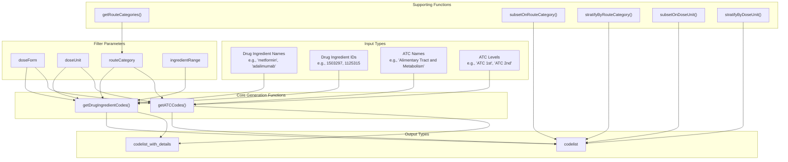
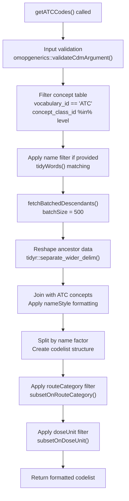
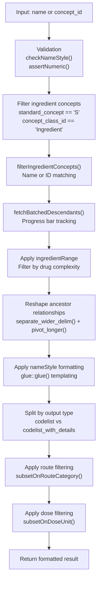
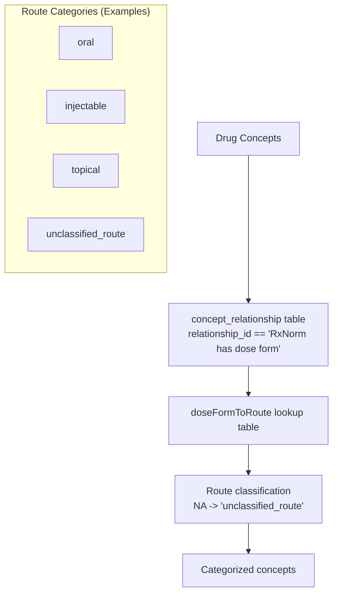
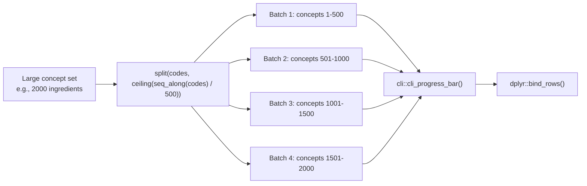

# Page: Drug-Specific Code Generation

# Drug-Specific Code Generation

<details>
<summary>Relevant source files</summary>

The following files were used as context for generating this wiki page:

- [CRAN-SUBMISSION](CRAN-SUBMISSION)
- [R/drugCodes.R](R/drugCodes.R)
- [R/getRoutes.R](R/getRoutes.R)
- [R/stratifyByRoute.R](R/stratifyByRoute.R)
- [R/subsetOnRouteCategory.R](R/subsetOnRouteCategory.R)
- [man/CodelistGenerator-package.Rd](man/CodelistGenerator-package.Rd)
- [man/getATCCodes.Rd](man/getATCCodes.Rd)
- [man/getDrugIngredientCodes.Rd](man/getDrugIngredientCodes.Rd)
- [tests/testthat/test-dbms.R](tests/testthat/test-dbms.R)
- [tests/testthat/test-drugCodes.R](tests/testthat/test-drugCodes.R)

</details>


This page documents the drug-specific code generation functionality in CodelistGenerator, covering the generation of drug ingredient codes, ATC (Anatomical Therapeutic Chemical) classification codes, and drug-related filtering and stratification capabilities. These functions provide specialized tools for working with pharmaceutical concepts in OMOP CDM vocabularies.

For general concept searching across all domains, see [Candidate Code Search](#2.1). For ICD-10 and other non-drug vocabularies, see [ICD-10 and Other Standards](#2.3).

## Core Drug Functions Overview

The drug-specific functionality is centered around two primary generation functions and several supporting utilities for filtering and stratification:



**Sources:** [R/drugCodes.R:39-148](), [R/drugCodes.R:173-299](), [R/getRoutes.R:39-68](), [R/stratifyByRoute.R:37-141](), [R/subsetOnRouteCategory.R:40-116]()

## ATC Code Generation

The `getATCCodes()` function generates codelists based on Anatomical Therapeutic Chemical (ATC) classification codes, which provide a hierarchical classification system for drugs.

### Function Signature and Parameters

| Parameter | Type | Description | Example |
|-----------|------|-------------|---------|
| `cdm` | cdm_reference | OMOP CDM database connection | Required |
| `level` | character | ATC classification level | `"ATC 1st"`, `"ATC 2nd"` |
| `name` | character | ATC group name to search | `"Alimentary Tract and Metabolism"` |
| `nameStyle` | character | Output naming pattern | `"{concept_code}_{concept_name}"` |
| `doseForm` | character | Dose form filter | `"injection"`, `"tablet"` |
| `doseUnit` | character | Dose unit filter | `"milligram"`, `"microgram"` |
| `routeCategory` | character | Route category filter | `"oral"`, `"injectable"` |
| `type` | character | Output format | `"codelist"`, `"codelist_with_details"` |

### Implementation Flow



**Sources:** [R/drugCodes.R:39-148](), [R/drugCodes.R:311-341]()

## Drug Ingredient Code Generation

The `getDrugIngredientCodes()` function is the primary tool for generating codelists based on drug ingredients, supporting both name-based and concept ID-based searches.

### Input Flexibility

The function accepts multiple input formats for specifying ingredients:

| Input Type | Example | Usage |
|------------|---------|--------|
| Character names | `c("metformin", "adalimumab")` | Most common approach |
| Numeric concept IDs | `c(1503297, 1125315)` | Direct concept ID specification |
| Mixed inputs | Not supported | Use one type per call |

### Ingredient Range Filtering

The `ingredientRange` parameter controls the number of active ingredients in returned drug concepts:

| Range | Description | Use Case |
|-------|-------------|----------|
| `c(1, 1)` | Monotherapy only | Single-ingredient drugs |
| `c(2, Inf)` | Combination therapy | Multi-ingredient formulations |
| `c(1, Inf)` | All drugs (default) | No ingredient count restriction |

### Processing Pipeline



**Sources:** [R/drugCodes.R:173-299](), [R/drugCodes.R:301-309]()

## Route Category Management

Route categories classify drugs by their administration route based on dose form mappings. The system uses a predefined lookup table `doseFormToRoute` to categorize concepts.

### Available Route Functions

| Function | Purpose | Return Type |
|----------|---------|-------------|
| `getRouteCategories()` | List available routes in database | character vector |
| `subsetOnRouteCategory()` | Filter codelist by route | codelist |
| `stratifyByRouteCategory()` | Split codelist by route | named codelist |

### Route Classification Process



### Route Stratification Example

The `stratifyByRouteCategory()` function transforms a single codelist into multiple route-specific codelists:

```
Input:  list("drug_name" = c(1001, 1002, 1003))
Output: list(
  "drug_name_oral" = c(1001, 1003),
  "drug_name_injectable" = c(1002)
)
```

**Sources:** [R/getRoutes.R:39-68](), [R/stratifyByRoute.R:37-141](), [R/subsetOnRouteCategory.R:40-116]()

## Dose Form and Unit Filtering

Both ATC and ingredient code generation support filtering by dose forms and units, enabling precise therapeutic focus.

### Dose Form Integration

Dose forms are linked to drug concepts via the `concept_relationship` table using the `"RxNorm has dose form"` relationship. Common dose forms include:

- `"injection"`
- `"tablet"` 
- `"capsule"`
- `"topical"`

### Filtering Workflow

The dose form and unit filtering occurs at two stages:

1. **During Generation**: Applied in `fetchBatchedDescendants()` via the `doseForm` parameter
2. **Post-Generation**: Applied via `subsetOnDoseUnit()` and `subsetOnRouteCategory()`

**Sources:** [R/drugCodes.R:311-341](), [tests/testthat/test-drugCodes.R:77-90]()

## Implementation Details

### Batched Processing

Large concept sets are processed in batches to prevent memory issues:



### Name Style Templating

The `nameStyle` parameter uses `glue::glue()` templating with available fields:

| Template | Example Output | Source Field |
|----------|----------------|--------------|
| `{concept_name}` | `"metformin"` | concept.concept_name |
| `{concept_code}` | `"6809"` | concept.concept_code |
| `{concept_id}` | `"1503297"` | concept.concept_id |
| `{concept_code}_{concept_name}` | `"6809_metformin"` | Combined fields |

**Sources:** [R/drugCodes.R:311-341](), [R/drugCodes.R:262-267]()

## Database Integration

The drug-specific functions integrate with multiple OMOP CDM tables and work across different database backends.

### Required OMOP Tables

| Table | Purpose | Key Relationships |
|-------|---------|-------------------|
| `concept` | Core concept definitions | Standard concepts, vocabularies |
| `concept_ancestor` | Hierarchical relationships | Descendant lookups |
| `concept_relationship` | Concept mappings | Dose form relationships |
| `drug_strength` | Dosage information | Ingredient strength data |

### Multi-Database Testing

The functionality is tested across multiple database platforms:

| Backend | Test Coverage | Connection Method |
|---------|---------------|-------------------|
| PostgreSQL | Full integration tests | `RPostgres::Postgres()` |
| Redshift | Full integration tests | `RPostgres::Redshift()` |
| Snowflake | Core functionality tests | `odbc::odbc()` |
| SQL Server | Full integration tests | `odbc::odbc()` |
| DuckDB | Development/testing | `duckdb::duckdb()` |

**Sources:** [tests/testthat/test-dbms.R:50-69](), [tests/testthat/test-dbms.R:208-210](), [tests/testthat/test-dbms.R:360-361](), [tests/testthat/test-dbms.R:513-514]()