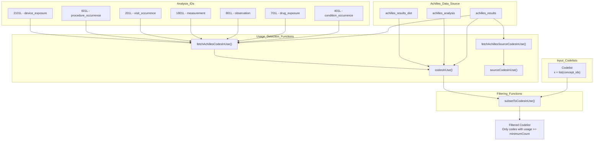
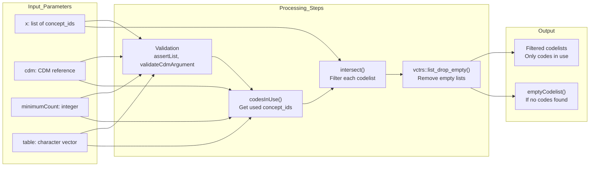
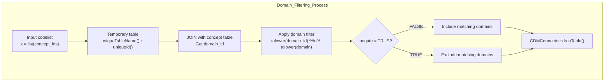
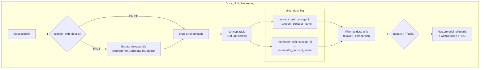
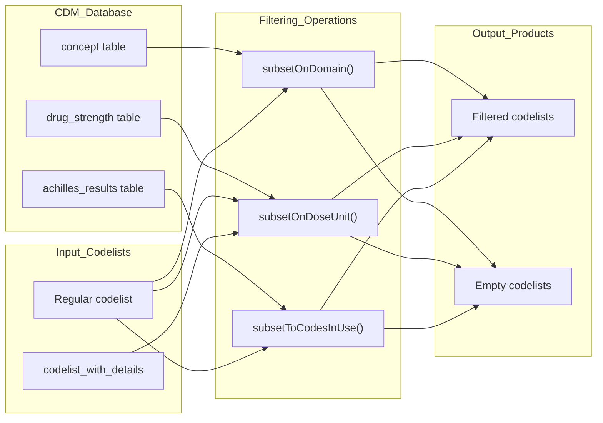

# Page: Filtering and Subsetting

# Filtering and Subsetting

Relevant source files

The following files were used as context for generating this wiki page:

- [.github/workflows/R-CMD-check.yaml](.github/workflows/R-CMD-check.yaml)
- [.github/workflows/test-coverage.yaml](.github/workflows/test-coverage.yaml)
- [R/codesInUse.R](R/codesInUse.R)
- [R/subsetOnDomain.R](R/subsetOnDomain.R)
- [R/subsetOnDoseUnit.R](R/subsetOnDoseUnit.R)
- [man/codesInUse.Rd](man/codesInUse.Rd)
- [man/sourceCodesInUse.Rd](man/sourceCodesInUse.Rd)
- [man/stratifyByDoseUnit.Rd](man/stratifyByDoseUnit.Rd)
- [man/subsetOnDoseUnit.Rd](man/subsetOnDoseUnit.Rd)
- [tests/testthat/test-restrictToCodesInUse.R](tests/testthat/test-restrictToCodesInUse.R)

This document covers functions that filter codelists by removing unwanted concepts based on various criteria including domain, dose unit, route, or actual usage in patient data. These functions reduce the size of codelists by eliminating concepts that don't meet specified requirements.

For information about splitting codelists into multiple stratified groups, see [Stratification Functions](#4.1). For broader codelist manipulation approaches, see the parent section [Codelist Manipulation](#4).

## Overview

Filtering and subsetting functions in CodelistGenerator provide targeted reduction of codelist content based on specific criteria. These functions operate on existing codelists to produce refined versions that meet particular requirements.

The filtering functions fall into three main categories:

| Category | Purpose | Key Functions |
|----------|---------|---------------|
| Usage-based | Filter to codes actually used in patient records | `subsetToCodesInUse`, `codesInUse` |
| Domain-based | Filter by OMOP domain classification | `subsetOnDomain` |
| Drug attribute-based | Filter by pharmaceutical properties | `subsetOnDoseUnit` |

Sources: [R/codesInUse.R:17-87](), [R/subsetOnDomain.R:17-92](), [R/subsetOnDoseUnit.R:17-125]()

## Usage-Based Filtering Architecture

The usage-based filtering system leverages Achilles analysis results to determine which concepts are actually present in patient records. The `fetchAchillesCodesInUse` function queries specific analysis IDs that correspond to different OMOP CDM tables.

Sources: [R/codesInUse.R:213-239](), [R/codesInUse.R:41-87]()

## Core Filtering Functions

### Usage-Based Filtering

The `subsetToCodesInUse` function filters codelists to retain only concepts that appear in patient records with sufficient frequency:

The function supports filtering across multiple OMOP CDM tables and respects minimum count thresholds for concept usage frequency.

Sources: [R/codesInUse.R:41-87](), [R/codesInUse.R:105-126]()

### Domain-Based Filtering

The `subsetOnDomain` function filters codelists based on OMOP domain classifications:

The function creates temporary tables for efficient database operations and supports both inclusive and exclusive filtering through the `negate` parameter.

Sources: [R/subsetOnDomain.R:40-92]()

### Dose Unit Filtering

The `subsetOnDoseUnit` function filters drug codelists based on dose unit specifications:

The function supports both `codelist` and `codelist_with_details` formats and performs case-insensitive dose unit matching against both amount and numerator units.

Sources: [R/subsetOnDoseUnit.R:40-125]()

## Achilles Integration

The filtering system extensively uses Achilles analysis results to determine code usage patterns:

| Analysis ID | Table | Purpose |
|-------------|-------|---------|
| 401L | condition_occurrence | Standard condition concepts |
| 701L | drug_exposure | Standard drug concepts |
| 801L | observation | Standard observation concepts |
| 1801L | measurement | Standard measurement concepts |
| 201L | visit_occurrence | Standard visit concepts |
| 601L | procedure_occurrence | Standard procedure concepts |
| 2101L | device_exposure | Standard device concepts |
| 425L, 725L, 825L, etc. | Various | Source concept usage |

The `fetchAchillesCodesInUse` function queries these analysis IDs to retrieve concept usage statistics with configurable minimum count thresholds.

Sources: [R/codesInUse.R:213-261]()

## Data Flow and Integration

All filtering functions integrate with the OMOP CDM database structure and handle both regular codelists and enhanced `codelist_with_details` formats. The functions automatically manage temporary table creation and cleanup for efficient database operations.

Sources: [R/subsetOnDomain.R:50-88](), [R/subsetOnDoseUnit.R:65-121](), [R/codesInUse.R:61-85]()