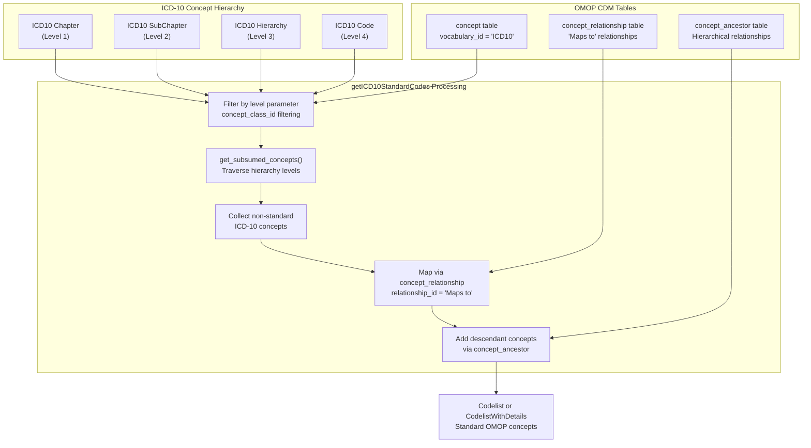
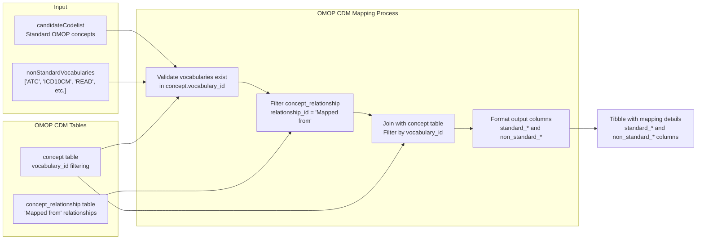
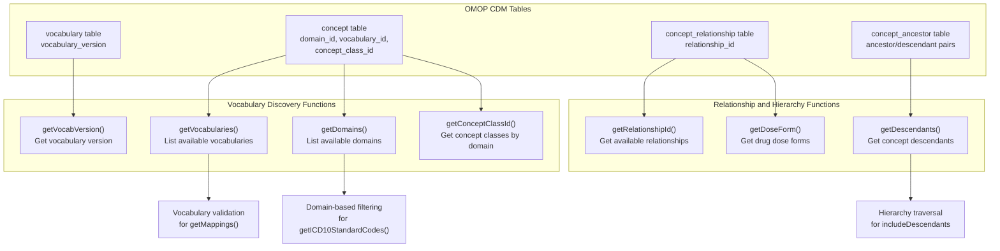
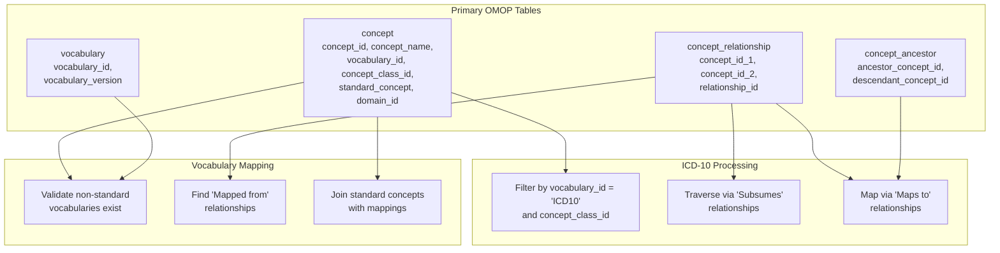

# Page: ICD-10 and Other Standards

# ICD-10 and Other Standards

Relevant source files

The following files were used as context for generating this wiki page:

- [R/compareCodelists.R](R/compareCodelists.R)
- [R/getICD10StandardCodes.R](R/getICD10StandardCodes.R)
- [R/getMappings.R](R/getMappings.R)
- [R/vocabUtilities.R](R/vocabUtilities.R)
- [man/getICD10StandardCodes.Rd](man/getICD10StandardCodes.Rd)
- [man/getMappings.Rd](man/getMappings.Rd)
- [tests/testthat/test-compareCodelists.R](tests/testthat/test-compareCodelists.R)
- [tests/testthat/test-getICD10StandardCodes.R](tests/testthat/test-getICD10StandardCodes.R)
- [tests/testthat/test-getMappings.R](tests/testthat/test-getMappings.R)
- [tests/testthat/test-mockVocabRef.R](tests/testthat/test-mockVocabRef.R)
- [tests/testthat/test-vocabUtilities.R](tests/testthat/test-vocabUtilities.R)

This document covers vocabulary-specific codelist generation functions that work with standardized medical classification systems, particularly ICD-10, and utilities for mapping between different vocabulary standards within the OMOP CDM framework.

The primary focus is on generating standard OMOP concept codes from ICD-10 hierarchical classifications and establishing mappings between non-standard and standard vocabularies. For keyword-based concept searching, see [Candidate Code Search](#2.1). For drug-specific code generation including ATC codes, see [Drug-Specific Code Generation](#2.2).

## ICD-10 Standard Code Generation

The `getICD10StandardCodes()` function generates standard OMOP concept codes from International Classification of Diseases (ICD-10) hierarchical levels. This function traverses the ICD-10 concept hierarchy and maps non-standard ICD-10 codes to their corresponding standard OMOP concepts.

### ICD-10 Hierarchy Processing Workflow

The function supports four hierarchical levels defined by `concept_class_id` values in the OMOP concept table:

| Level | Concept Class ID | Description |
|-------|------------------|-------------|
| `ICD10 Chapter` | ICD10 Chapter | Top-level disease categories |
| `ICD10 SubChapter` | ICD10 SubChapter | Disease subcategories |
| `ICD10 Hierarchy` | ICD10 Hierarchy | Intermediate hierarchical levels |
| `ICD10 Code` | ICD10 Code | Specific diagnostic codes |

The core processing logic in [R/getICD10StandardCodes.R:183-366]() implements separate workflows for each level, using the `get_subsumed_concepts()` helper function to traverse the concept relationships via the "Subsumes" relationship type.

### Function Parameters and Output Types

The `getICD10StandardCodes()` function accepts several key parameters:

- `level`: Vector specifying which ICD-10 hierarchy levels to include
- `name`: Optional filter for specific concept names
- `nameStyle`: Template for naming output codelists using `{concept_code}`, `{concept_name}`, or `{concept_id}` placeholders
- `includeDescendants`: Boolean controlling whether to include descendant concepts
- `type`: Output format - either "codelist" or "codelist_with_details"

The function returns either a `Codelist` object (concept IDs only) or `CodelistWithDetails` object (including concept metadata) depending on the `type` parameter.

Sources: [R/getICD10StandardCodes.R:40-179](), [tests/testthat/test-getICD10StandardCodes.R:1-108]()

## Vocabulary Mappings and Non-Standard Vocabularies

The `getMappings()` function provides visibility into how standard OMOP concepts map to non-standard vocabulary codes, enabling researchers to understand the relationship between their source data vocabularies and standardized concepts.

### Vocabulary Mapping Workflow

The function supports a comprehensive set of non-standard vocabularies by default, including:

| Vocabulary | Description |
|------------|-------------|
| `ATC` | Anatomical Therapeutic Chemical Classification |
| `ICD10CM` | ICD-10 Clinical Modification |
| `ICD10PCS` | ICD-10 Procedure Coding System |
| `ICD9CM` | ICD-9 Clinical Modification |
| `Read` | Read Clinical Terms |
| `SNOMED` | SNOMED Clinical Terms |
| `LOINC` | Logical Observation Identifiers Names and Codes |

The mapping process uses the "Mapped from" relationship type in the `concept_relationship` table to identify connections between standard and non-standard concepts, as implemented in [R/getMappings.R:90-134]().

Sources: [R/getMappings.R:41-135](), [tests/testthat/test-getMappings.R:1-75]()

## Vocabulary Utility Functions

The vocabulary utilities module provides essential functions for exploring and working with OMOP vocabulary structures. These functions support the ICD-10 and mapping workflows by enabling vocabulary discovery and validation.

### Core Utility Functions

### Key Utility Functions

The `getDescendants()` function plays a crucial role in both ICD-10 and mapping workflows by retrieving concept hierarchies. It supports optional parameters for ingredient filtering and dose form restrictions, as shown in [R/vocabUtilities.R:240-264]().

The `getRelationshipId()` function enables discovery of available concept relationships between domains and standard concept types, supporting the relationship-based logic used in mapping functions. The implementation in [R/vocabUtilities.R:473-553]() provides filtering by standard concept types and domains.

### Domain and Standard Concept Filtering

The vocabulary utilities implement consistent handling of standard concept classifications:

- `"S"` maps to `"standard"`
- `"C"` maps to `"classification"` 
- `NULL` maps to `"non-standard"`

This standardization supports filtering operations across all vocabulary functions and ensures consistent behavior when working with different concept types.

Sources: [R/vocabUtilities.R:17-553](), [tests/testthat/test-vocabUtilities.R:1-139]()

## Integration with OMOP CDM Structure

The ICD-10 and vocabulary mapping functions integrate closely with the OMOP CDM structure through standardized table relationships and concept hierarchies.

### OMOP CDM Table Dependencies

The integration follows OMOP CDM conventions for vocabulary relationships:

- **Hierarchical relationships**: "Subsumes" for ICD-10 hierarchy traversal
- **Mapping relationships**: "Maps to" and "Mapped from" for vocabulary translations
- **Standard concept identification**: `standard_concept` field values of 'S', 'C', or NULL

### Database Abstraction and Performance

The functions implement database-agnostic SQL generation through the CDMConnector framework, supporting multiple database backends including PostgreSQL, SQL Server, and Snowflake. Performance optimization includes:

- Use of `dplyr::compute()` for intermediate result materialization
- Temporary table creation via `omopgenerics::insertTable()` for complex joins
- Chunked processing for large concept hierarchies

The database abstraction layer ensures consistent behavior across different OMOP CDM implementations while maintaining performance for large vocabulary operations.

Sources: [R/getICD10StandardCodes.R:101-176](), [R/getMappings.R:51-135](), [R/vocabUtilities.R:29-553]()