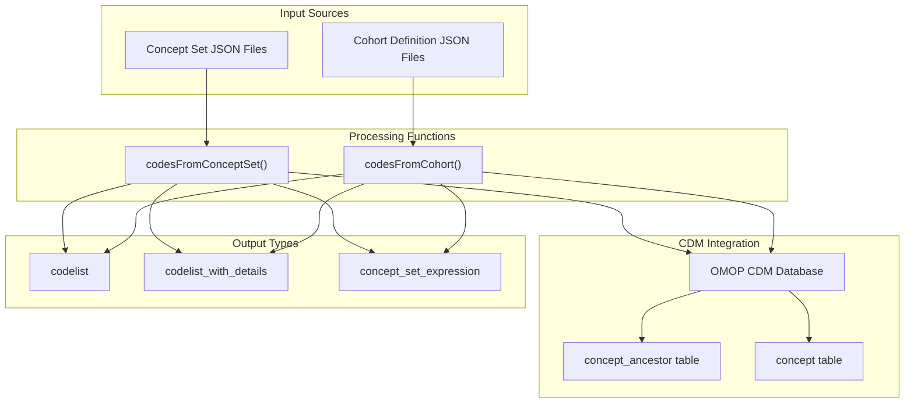
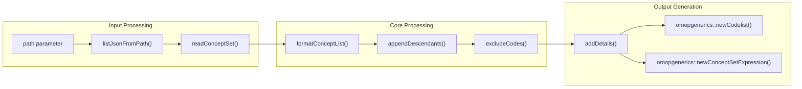
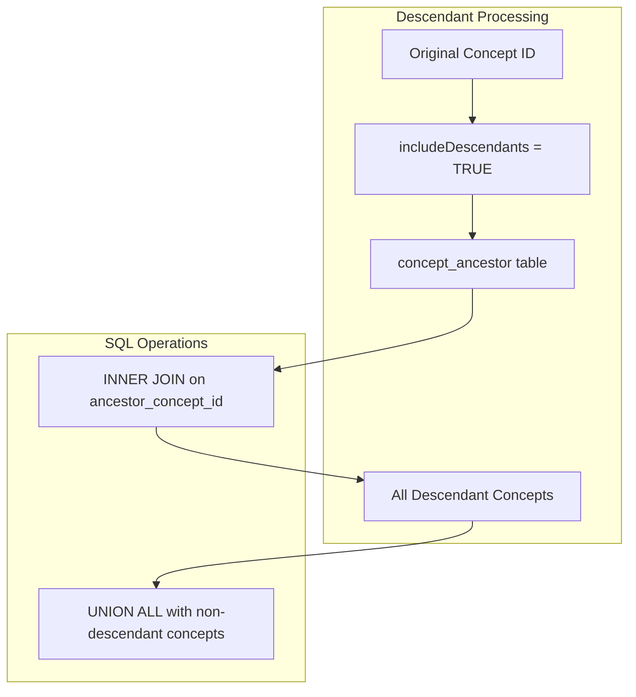
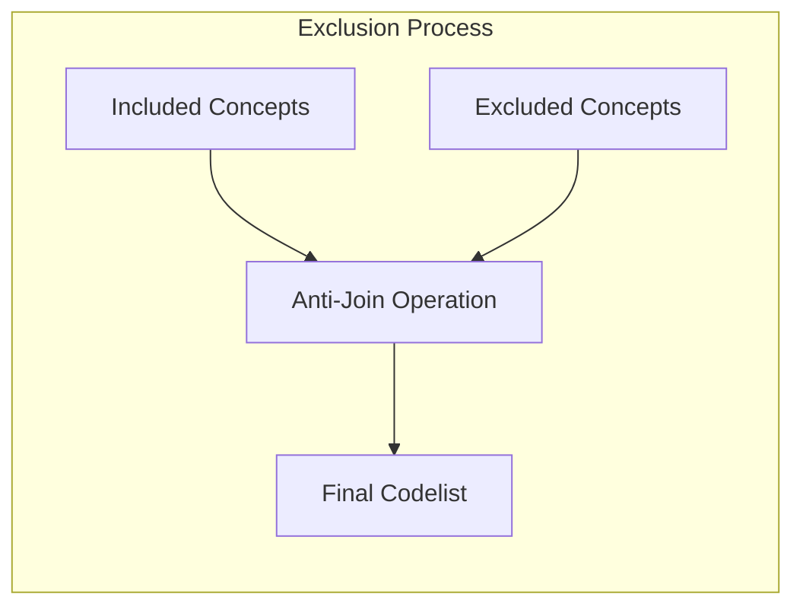

# Page: JSON Concept Set Processing

# JSON Concept Set Processing

Relevant source files

The following files were used as context for generating this wiki page:

- [R/codesFromConceptSet.R](R/codesFromConceptSet.R)
- [man/codesFromConceptSet.Rd](man/codesFromConceptSet.Rd)
- [tests/testthat/test-codesFrom.R](tests/testthat/test-codesFrom.R)
- [tests/testthat/test-findUnmappedCodes.R](tests/testthat/test-findUnmappedCodes.R)

## Purpose and Scope

This document covers the functionality for importing and processing concept lists from JSON files in OMOP standard formats. The system supports two primary JSON formats: standalone concept set expressions and concept sets embedded within cohort definitions. For information about generating new codelists from scratch, see [Core Codelist Generation](#2). For analyzing existing codelists, see [Codelist Analysis and Usage](#3).

## Overview

The JSON concept set processing system provides two main entry points for converting OMOP-formatted JSON files into usable codelists within the R environment. The system handles complex concept relationships including descendant expansion and exclusion logic while maintaining compatibility with OMOP CDM vocabulary standards.

**Sources:** [R/codesFromConceptSet.R:1-134](), [R/codesFromConceptSet.R:136-236]()

## Core Functions

### codesFromConceptSet Function

The `codesFromConceptSet()` function processes JSON files containing OMOP concept set expressions. It accepts either individual files or directories containing multiple JSON files.

| Parameter | Type | Description |
|-----------|------|-------------|
| `path` | character | Path to JSON file or directory |
| `cdm` | cdm_reference | CDM database connection |
| `type` | character | Output format: "codelist", "codelist_with_details", or "concept_set_expression" |

**Sources:** [R/codesFromConceptSet.R:36-134](), [R/codesFromConceptSet.R:493-549]()

### codesFromCohort Function

The `codesFromCohort()` function extracts concept sets from cohort definition JSON files, which contain concept sets nested within the broader cohort structure.

```mermaid
graph LR
    subgraph "JSON_Parsing" ["JSON Parsing"]
        COHORT_JSON["Cohort JSON"]
        EXTRACT_CODES["extractCodes()"]
        CONCEPT_SETS["ConceptSets array"]
    end
    
    subgraph "Processing_Pipeline" ["Processing Pipeline"]
        APPEND_DESC2["appendDescendants()"]
        EXCLUDE_CODES2["excludeCodes()"]
        TIBBLE_TO_LIST["tibbleToList()"]
    end
    
    subgraph "Validation" ["Validation"]
        CHECK_CONSISTENT["Consistency Check"]
        DEDUP["Deduplication"]
    end
    
    COHORT_JSON --> EXTRACT_CODES
    EXTRACT_CODES --> CONCEPT_SETS
    CONCEPT_SETS --> APPEND_DESC2
    APPEND_DESC2 --> EXCLUDE_CODES2
    EXCLUDE_CODES2 --> TIBBLE_TO_LIST
    TIBBLE_TO_LIST --> CHECK_CONSISTENT
    CHECK_CONSISTENT --> DEDUP
```

**Sources:** [R/codesFromConceptSet.R:154-236](), [R/codesFromConceptSet.R:251-294]()

## JSON Format Support

### Concept Set JSON Structure

The system expects OMOP-standard concept set JSON files with the following key elements:

- `items`: Array of concept definitions
- `concept`: Nested concept information including `CONCEPT_ID`
- `isExcluded`: Boolean flag for exclusion logic
- `includeDescendants`: Boolean flag for hierarchy expansion
- `includeMapped`: Boolean flag (not supported - causes error)

### Cohort Definition JSON Structure

Cohort JSON files contain concept sets within a nested structure:

- `ConceptSets`: Array of concept set definitions
- `name`: Concept set identifier
- `expression`: Contains the concept set logic
- `items`: Array of individual concepts

**Sources:** [R/codesFromConceptSet.R:251-294](), [R/codesFromConceptSet.R:493-549]()

## Processing Logic

### Descendant Expansion

The system uses the OMOP `concept_ancestor` table to expand concepts when `includeDescendants` is true.

**Sources:** [R/codesFromConceptSet.R:296-316](), [R/codesFromConceptSet.R:441-485]()

### Exclusion Logic

Concepts marked with `isExcluded = TRUE` are removed from the final codelist using anti-join operations.

**Sources:** [R/codesFromConceptSet.R:318-327](), [R/codesFromConceptSet.R:467-476]()

## Output Types

### Codelist Format

The basic `codelist` output provides a named list where each element contains concept IDs as character vectors.

### Codelist with Details Format

The `codelist_with_details` format includes additional concept information from the OMOP `concept` table:

- `concept_id`: OMOP concept identifier
- `concept_name`: Human-readable concept name
- `domain_id`: OMOP domain classification
- `vocabulary_id`: Source vocabulary identifier
- `standard_concept`: Standardization status

### Concept Set Expression Format

The `concept_set_expression` format preserves the original JSON logic structure for re-use in other OMOP tools:

- `concept_id`: OMOP concept identifier
- `excluded`: Exclusion flag
- `descendants`: Descendant inclusion flag
- `mapped`: Mapping inclusion flag (always FALSE)

**Sources:** [R/codesFromConceptSet.R:366-431](), [R/codesFromConceptSet.R:75-94](), [R/codesFromConceptSet.R:178-198]()

## Error Handling and Limitations

### Mapped Concepts Restriction

The system explicitly rejects JSON files with `includeMapped = TRUE`, throwing an error when encountered. This limitation exists because mapped concept processing requires additional complexity not currently supported.

### Duplicate Concept Set Validation

When processing cohort definitions, the system validates that concept sets with identical names have identical definitions across files. Inconsistencies trigger validation errors.

### File Format Validation

The system performs comprehensive JSON structure validation and provides informative error messages for malformed files.

**Sources:** [R/codesFromConceptSet.R:97-103](), [R/codesFromConceptSet.R:271-275](), [R/codesFromConceptSet.R:356-358]()

## Database Integration

The processing functions require active CDM database connections for:

- Descendant expansion via `concept_ancestor` table queries
- Concept detail enrichment via `concept` table joins
- Temporary table operations for complex processing

The system supports all CDMConnector-compatible database backends including PostgreSQL, SQL Server, Snowflake, and others.

**Sources:** [R/codesFromConceptSet.R:110-118](), [R/codesFromConceptSet.R:384-415]()