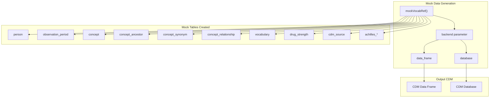
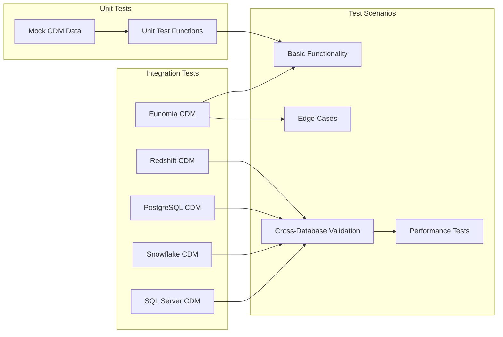
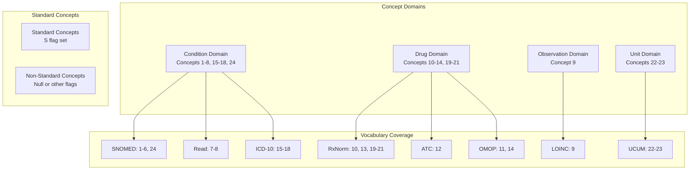
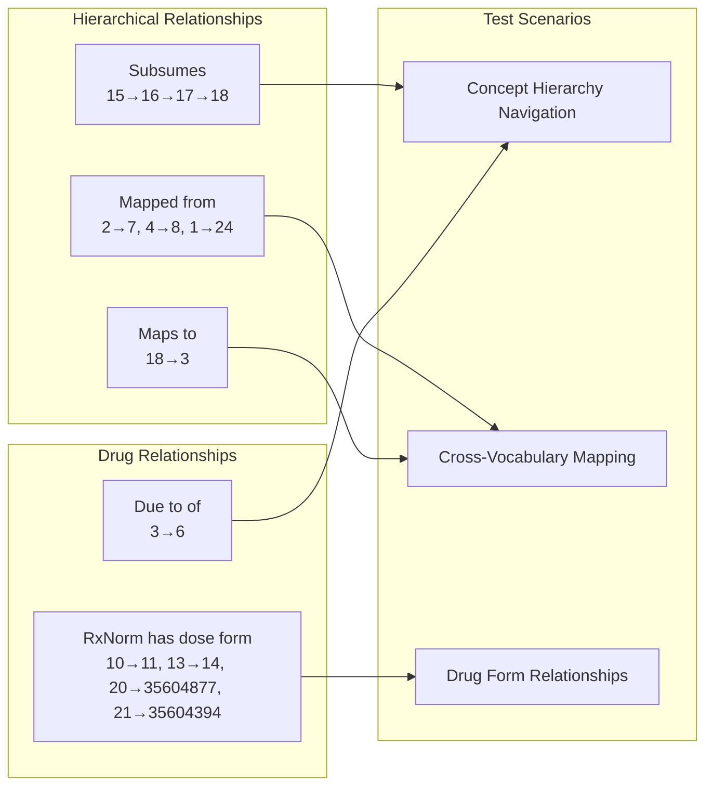
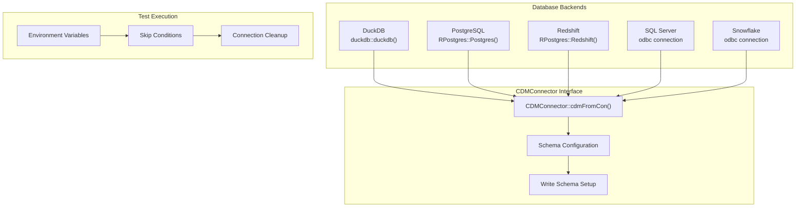

# Page: Mock Data and Testing Utilities

# Mock Data and Testing Utilities

<details>
<summary>Relevant source files</summary>

The following files were used as context for generating this wiki page:

- [.gitignore](.gitignore)
- [DESCRIPTION](DESCRIPTION)
- [NEWS.md](NEWS.md)
- [R/mockVocabRef.R](R/mockVocabRef.R)
- [R/summariseCodeUse.R](R/summariseCodeUse.R)
- [tests/testthat/test-summariseCodeUse.R](tests/testthat/test-summariseCodeUse.R)

</details>


This document covers the mock data generation and testing infrastructure used in CodelistGenerator for development, unit testing, and integration testing. For information about the overall package architecture, see [Package Architecture](#8.1).

## Purpose and Scope

The CodelistGenerator package provides comprehensive testing utilities to support development and validation across multiple database backends. The mock data system creates lightweight vocabulary references for rapid testing, while the testing framework validates functionality against both mock and real OMOP CDM databases.

## Mock Vocabulary Reference

### Core Function: `mockVocabRef`

The `mockVocabRef()` function creates a complete mock OMOP CDM with vocabulary tables for testing purposes. It supports two backend modes: in-memory data frames for unit tests and DuckDB databases for integration tests.



Sources: [R/mockVocabRef.R:30-423]()

### Mock Concept Hierarchy

The mock vocabulary contains a structured concept hierarchy designed to test various CodelistGenerator functions:

```mermaid
graph TB
    subgraph "Condition Domain"
        MUSC_DIS[1: "Musculoskeletal disorder"]
        OSTEOART[2: "Osteoarthrosis"]
        ARTHRITIS[3: "Arthritis"]
        KNEE_OA[4: "Osteoarthritis of knee"]
        HIP_OA[5: "Osteoarthritis of hip"]
        OSTEONECROSIS[6: "Osteonecrosis"]
        DEG_ARTHROP[7: "Degenerative arthropathy"]
        KNEE_OA_ALT[8: "Knee osteoarthritis"]
    end
    
    subgraph "Drug Domain"
        ADALIMUMAB[10: "Adalimumab"]
        INJECTION[11: "Injection"]
        DESC_DRUG[13: "Descendant drug"]
        INJECTABLE[14: "Injectable"]
    end
    
    subgraph "Vocabularies"
        SNOMED["SNOMED CT"]
        RXNORM["RxNorm"]
        READ["Read Codes"]
        ICD10["ICD-10"]
        ATC["ATC"]
    end
    
    MUSC_DIS --> OSTEOART
    MUSC_DIS --> ARTHRITIS
    ARTHRITIS --> KNEE_OA
    ARTHRITIS --> HIP_OA
    ADALIMUMAB --> DESC_DRUG
    
    MUSC_DIS -.-> SNOMED
    ADALIMUMAB -.-> RXNORM
    DEG_ARTHROP -.-> READ
```

Sources: [R/mockVocabRef.R:54-125](), [R/mockVocabRef.R:127-206]()

## Testing Framework Architecture

### Multi-Database Testing Strategy

The package implements a comprehensive testing strategy that validates functionality across multiple database backends:



Sources: [tests/testthat/test-summariseCodeUse.R:1-867]()

### Test Data Strategies

The testing framework uses different data strategies for different types of tests:

| Test Type | Data Source | Purpose | Examples |
|-----------|-------------|---------|----------|
| Unit Tests | `mockVocabRef()` | Fast isolated testing | Function parameter validation |
| Integration Tests | Eunomia CDM | Real data scenarios | End-to-end workflows |
| Cross-Platform Tests | Multiple DBs | Database compatibility | SQL dialect differences |
| Performance Tests | Large datasets | Scalability validation | Query optimization |

Sources: [tests/testthat/test-summariseCodeUse.R:4-5](), [tests/testthat/test-summariseCodeUse.R:364-365](), [tests/testthat/test-summariseCodeUse.R:557-568]()

## Mock Data Table Structure

### Concept Table Design

The mock concept table contains 26 concepts spanning multiple domains and vocabularies:



Sources: [R/mockVocabRef.R:54-125]()

### Relationship Testing Data

The mock data includes concept relationships to test mapping and hierarchy functions:



Sources: [R/mockVocabRef.R:220-284]()

### Achilles Test Data

The mock CDM includes Achilles results tables for testing usage analysis functions:

| Analysis ID | Stratum 1 | Count Value | Purpose |
|-------------|-----------|-------------|---------|
| 401 | 4 (Knee OA) | 400 | High usage concept |
| 401 | 5 (Hip OA) | 200 | Medium usage concept |
| 401 | 9 (Observation) | 100 | Low usage concept |

Sources: [R/mockVocabRef.R:372-378]()

## Database Backend Integration

### Connection Management

The testing framework manages connections to multiple database types through a unified interface:



Sources: [tests/testthat/test-summariseCodeUse.R:4-5](), [tests/testthat/test-summariseCodeUse.R:557-568]()

## Usage Patterns and Best Practices

### Mock Data Usage

For unit testing and development:

- Use `mockVocabRef("data_frame")` for fast, lightweight tests
- Use `mockVocabRef("database")` for database interaction testing  
- Leverage predefined concept hierarchies for relationship testing
- Use Achilles mock data for usage analysis testing

### Integration Testing

For comprehensive validation:

- Use Eunomia CDM for realistic data scenarios
- Test specific concept IDs: acetaminophen (1125315, 1127433, etc.), poliovirus vaccine (40213160)
- Validate edge cases: empty cohorts, missing concepts, null source concept IDs
- Test cross-database compatibility using environment variable configuration

Sources: [tests/testthat/test-summariseCodeUse.R:7-11](), [tests/testthat/test-summariseCodeUse.R:867-883]()