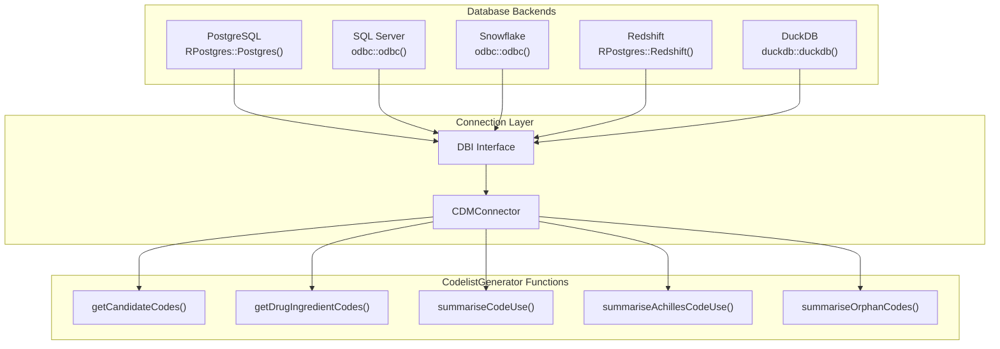
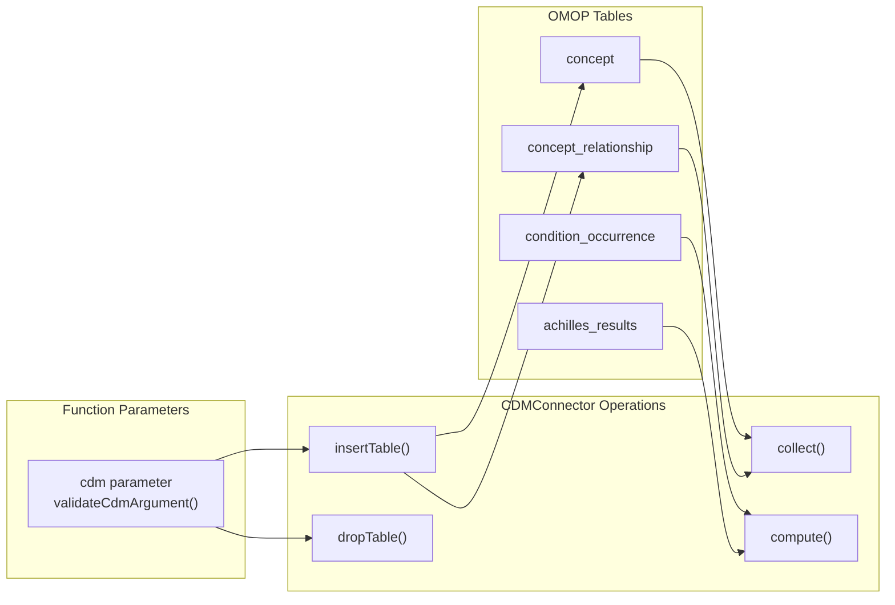
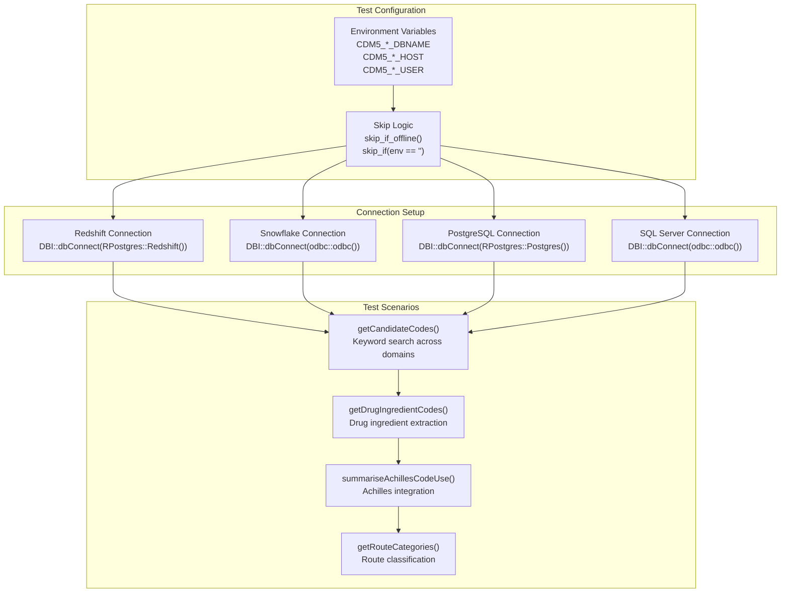
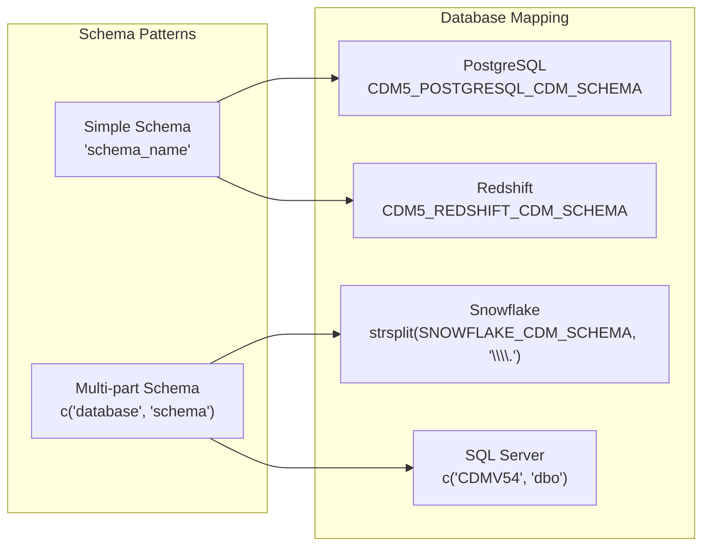
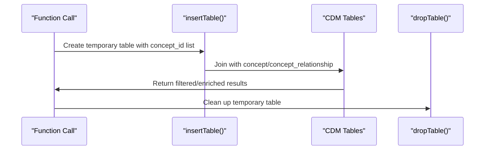

# Page: Multi-Database Support

# Multi-Database Support

<details>
<summary>Relevant source files</summary>

The following files were used as context for generating this wiki page:

- [CRAN-SUBMISSION](CRAN-SUBMISSION)
- [R/getRoutes.R](R/getRoutes.R)
- [R/stratifyByRoute.R](R/stratifyByRoute.R)
- [R/subsetOnRouteCategory.R](R/subsetOnRouteCategory.R)
- [man/CodelistGenerator-package.Rd](man/CodelistGenerator-package.Rd)
- [tests/testthat/test-dbms.R](tests/testthat/test-dbms.R)

</details>


## Purpose and Scope

This document covers CodelistGenerator's support for multiple database management systems (DBMS) in OMOP CDM environments. The package provides a unified interface that works consistently across PostgreSQL, SQL Server, Snowflake, Redshift, and other database backends through database abstraction layers. For information about testing framework specifics, see [Testing Framework and CI/CD](#7.2).

## Supported Database Backends

CodelistGenerator supports the following database management systems for OMOP CDM data:

| Database | Driver | Connection Method | Test Coverage |
|----------|--------|------------------|---------------|
| PostgreSQL | `RPostgres::Postgres()` | Native R driver | Full |
| SQL Server | `odbc::odbc()` | ODBC connection | Full |
| Snowflake | `odbc::odbc()` | ODBC connection | Full |
| Redshift | `RPostgres::Redshift()` | PostgreSQL-compatible | Full |
| DuckDB | `duckdb::duckdb()` | Native R driver | Mock testing |

**Database Backend Architecture**



Sources: [tests/testthat/test-dbms.R:3-609]()

## Database Abstraction Layer

CodelistGenerator achieves database independence through `CDMConnector`, which provides a unified interface for OMOP CDM operations. All database-specific SQL generation and execution is handled transparently by this abstraction layer.

**CDMConnector Integration Pattern**



Key abstraction mechanisms:

- **Table Operations**: `omopgenerics::insertTable()` and `CDMConnector::dropTable()` handle temporary table creation across databases
- **Query Building**: `dplyr` verbs generate database-appropriate SQL via `dbplyr` 
- **Data Collection**: `collect()` and `compute()` methods handle result materialization
- **Schema Management**: `cdmFromCon()` establishes schema mappings for different database layouts

Sources: [R/stratifyByRoute.R:62-66](), [R/subsetOnRouteCategory.R:66-70]()

## Cross-Platform Testing Strategy

The package employs comprehensive cross-platform testing to ensure consistent behavior across all supported database backends.

**Testing Architecture**



### Test Coverage Matrix

Each database backend undergoes identical test scenarios:

| Test Category | Functions Tested | Validation Points |
|---------------|------------------|-------------------|
| Code Generation | `getCandidateCodes()`, `getDrugIngredientCodes()` | Result consistency, error handling |
| Usage Analysis | `summariseCodeUse()`, `summariseAchillesCodeUse()` | Count accuracy, performance |
| Manipulation | `stratifyByRouteCategory()`, `subsetOnDomain()` | Filtering logic, data integrity |
| Vocabulary | `getRouteCategories()`, `getDoseUnit()` | Reference data access |

Sources: [tests/testthat/test-dbms.R:21-48](), [tests/testthat/test-dbms.R:190-206](), [tests/testthat/test-dbms.R:327-329](), [tests/testthat/test-dbms.R:480-482]()

## Configuration and Connection Management

### Environment Variable Configuration

Database connections are configured through environment variables following a standardized naming convention:

**Redshift Configuration**
```
CDM5_REDSHIFT_DBNAME
CDM5_REDSHIFT_HOST  
CDM5_REDSHIFT_PORT
CDM5_REDSHIFT_USER
CDM5_REDSHIFT_PASSWORD
CDM5_REDSHIFT_CDM_SCHEMA
CDM5_REDSHIFT_SCRATCH_SCHEMA
```

**Snowflake Configuration**
```
SNOWFLAKE_SERVER
SNOWFLAKE_USER
SNOWFLAKE_PASSWORD  
SNOWFLAKE_DATABASE
SNOWFLAKE_WAREHOUSE
SNOWFLAKE_DRIVER
SNOWFLAKE_CDM_SCHEMA
SNOWFLAKE_SCRATCH_SCHEMA
```

**PostgreSQL Configuration**
```
CDM5_POSTGRESQL_DBNAME
CDM5_POSTGRESQL_HOST
CDM5_POSTGRESQL_USER
CDM5_POSTGRESQL_PASSWORD
CDM5_POSTGRESQL_CDM_SCHEMA
CDM5_POSTGRESQL_SCRATCH_SCHEMA
```

**SQL Server Configuration**
```
CDM5_SQL_SERVER_SERVER
CDM5_SQL_SERVER_CDM_DATABASE
CDM5_SQL_SERVER_USER
CDM5_SQL_SERVER_PASSWORD
SQL_SERVER_DRIVER
CDM5_SQL_SERVER_PORT
```

Sources: [tests/testthat/test-dbms.R:8-13](), [tests/testthat/test-dbms.R:173-179](), [tests/testthat/test-dbms.R:311-315](), [tests/testthat/test-dbms.R:464-471]()

### Schema Handling

Different databases require different schema specification approaches:

- **Single Schema**: PostgreSQL, Redshift use simple schema strings
- **Multi-part Schema**: Snowflake, SQL Server use `c("database", "schema")` format  
- **Write Prefixes**: Some databases require table name prefixes for temporary tables



Sources: [tests/testthat/test-dbms.R:181-182](), [tests/testthat/test-dbms.R:473-475]()

## Implementation Details

### Temporary Table Management

CodelistGenerator uses temporary tables for complex operations that require joining user-provided concept lists with CDM tables. The abstraction handles database-specific temporary table syntax automatically.

**Temporary Table Lifecycle**



### Database-Specific Adaptations

While the API remains consistent, some database-specific adaptations occur:

- **Data Type Handling**: Redshift requires `as.integer64()` conversion for concept IDs
- **Driver Variations**: ODBC vs native drivers require different connection parameters
- **Performance Optimizations**: Query patterns optimized for each database's strengths

Sources: [tests/testthat/test-dbms.R:28-30](), [R/stratifyByRoute.R:56-66](), [R/subsetOnRouteCategory.R:62-70]()

### Error Handling and Fallbacks

The package includes robust error handling for database connectivity:

- **Connection Validation**: `validateCdmArgument()` ensures valid CDM references
- **Graceful Skipping**: Tests skip automatically when database credentials unavailable  
- **Consistent Error Messages**: Standardized error handling across database backends

Sources: [tests/testthat/test-dbms.R:5-6](), [R/stratifyByRoute.R:41-42]()