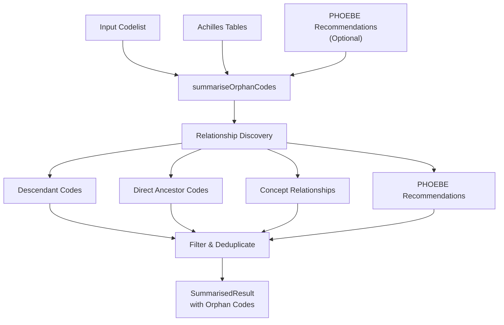
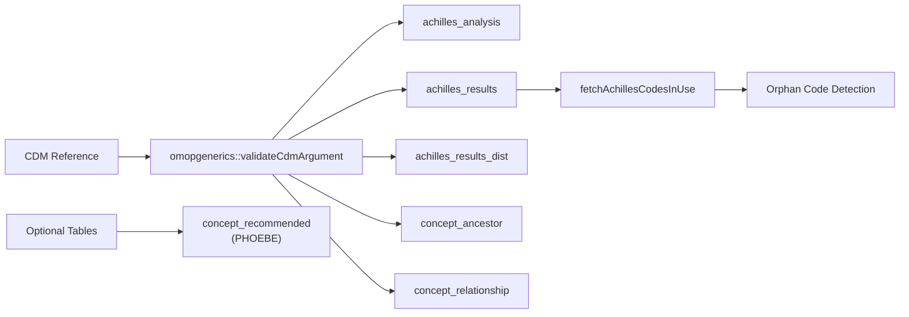
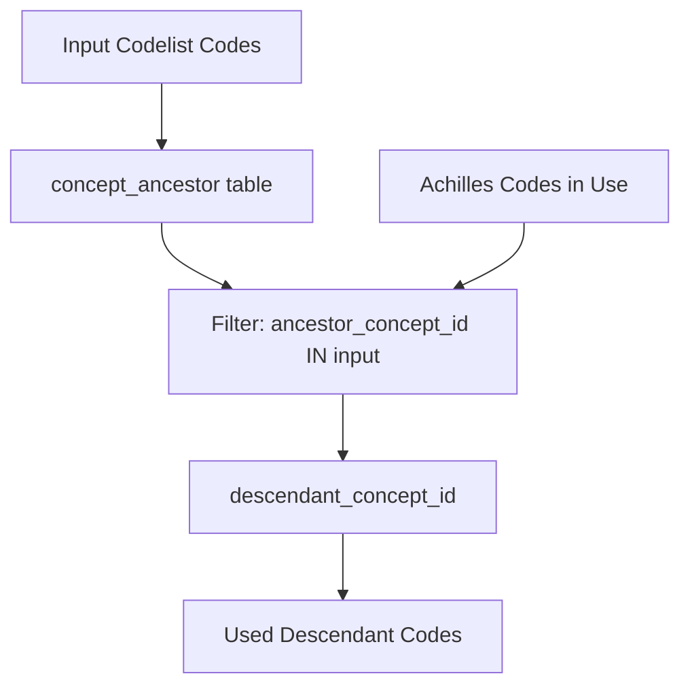
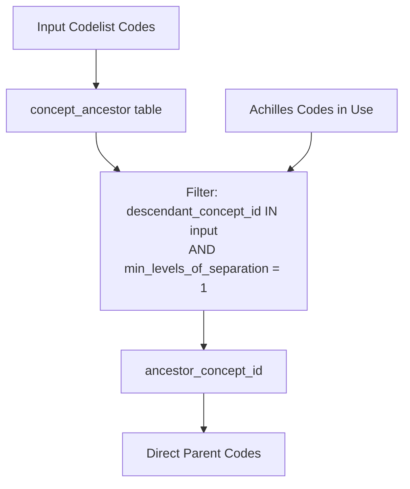
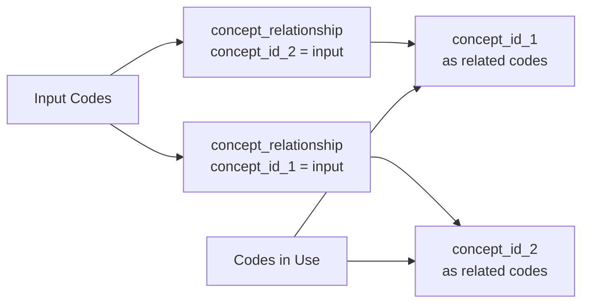
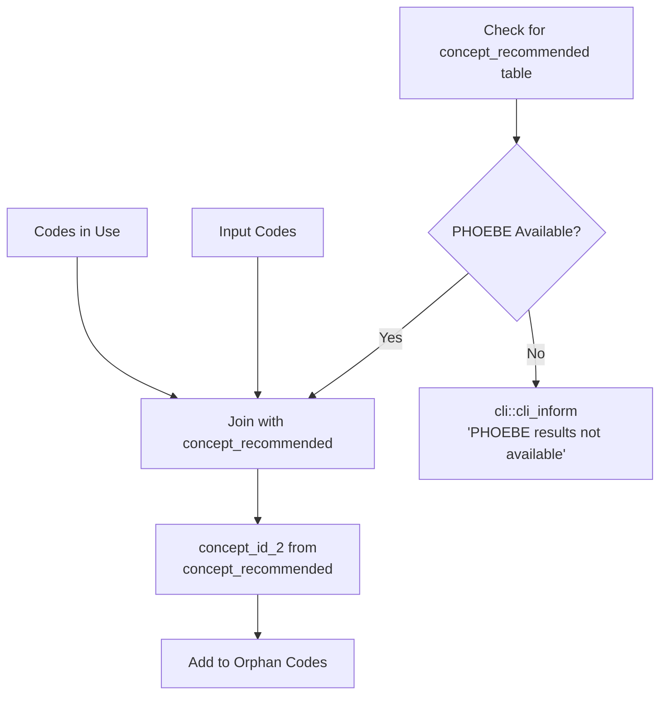
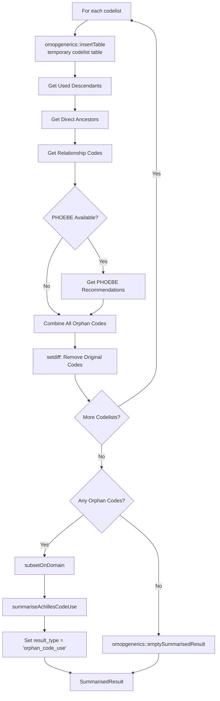
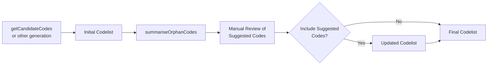

# Page: Orphan Code Detection

# Orphan Code Detection

Relevant source files

The following files were used as context for generating this wiki page:

- [R/summariseOrphanCodes.R](R/summariseOrphanCodes.R)
- [man/summariseOrphanCodes.Rd](man/summariseOrphanCodes.Rd)
- [tests/testthat/test-codesInUse.R](tests/testthat/test-codesInUse.R)
- [tests/testthat/test-summariseOrphanCodes.R](tests/testthat/test-summariseOrphanCodes.R)

This document covers the orphan code detection functionality in CodelistGenerator, which identifies concept codes that are related to a given codelist but are not explicitly included in it. This helps researchers discover potentially missing codes that may be relevant to their clinical definitions.

For information about general code usage analysis, see [Code Usage Summarization](#3.1). For Achilles-based analysis workflows, see [Achilles Integration](#3.2).

## Purpose and Scope

Orphan code detection addresses the common problem where researchers create codelists but may miss related concepts that are actually used in their database. The `summariseOrphanCodes` function analyzes concept relationships and database usage patterns to suggest codes that might be missing from a codelist but are semantically related to the included concepts.

Sources: [R/summariseOrphanCodes.R:1-25]()

## Core Functionality

The primary function `summariseOrphanCodes` takes a codelist and identifies related codes through multiple relationship pathways:

| Parameter | Type | Description |
|-----------|------|-------------|
| `x` | Codelist | Input codelist to analyze for orphan codes |
| `cdm` | CDM reference | Database connection with required Achilles tables |
| `domain` | Character vector | OMOP domains to restrict results to |

The function returns a `SummarisedResult` object containing frequency information for identified orphan codes.

Sources: [R/summariseOrphanCodes.R:26-41](), [man/summariseOrphanCodes.Rd:8-27]()

## Data Dependencies and Requirements

The orphan code detection requires specific database tables and validates their presence:

The function requires Achilles tables to be present and populated, as these provide the usage statistics that determine which codes are actually used in the database.

Sources: [R/summariseOrphanCodes.R:35-46]()

## Relationship Discovery Methods

The orphan code detection employs multiple strategies to find related codes:

### Descendant Code Discovery

This method finds more specific concepts that are children of the input codes in the OMOP vocabulary hierarchy.

### Ancestor Code Discovery

This method identifies direct parent concepts that are one level above the input codes in the hierarchy.

### Concept Relationship Discovery

The function examines bidirectional concept relationships to find related codes:

Sources: [R/summariseOrphanCodes.R:47-59](), [R/summariseOrphanCodes.R:84-123]()

## PHOEBE Integration

When available, the function integrates with PHOEBE (Phenotype Operations to Harmonize Evidence-Based Estimates) concept recommendations:

PHOEBE provides machine learning-based concept recommendations that can identify semantically related concepts not captured through traditional vocabulary relationships.

Sources: [R/summariseOrphanCodes.R:60-69](), [R/summariseOrphanCodes.R:126-137]()

## Processing Pipeline and Output

The complete orphan code detection pipeline processes each codelist and produces standardized output:

The output follows the `omopgenerics::SummarisedResult` format with `result_type` set to `"orphan_code_use"` and includes usage frequency statistics from Achilles.

Sources: [R/summariseOrphanCodes.R:75-165](), [tests/testthat/test-summariseOrphanCodes.R:15-22]()

## Usage Patterns and Examples

The function is typically used after initial codelist generation to identify potentially missing concepts:

The function helps in the iterative refinement of codelists by suggesting related concepts that researchers might want to consider including.

Sources: [man/summariseOrphanCodes.Rd:33-46](), [tests/testthat/test-summariseOrphanCodes.R:5-23]()