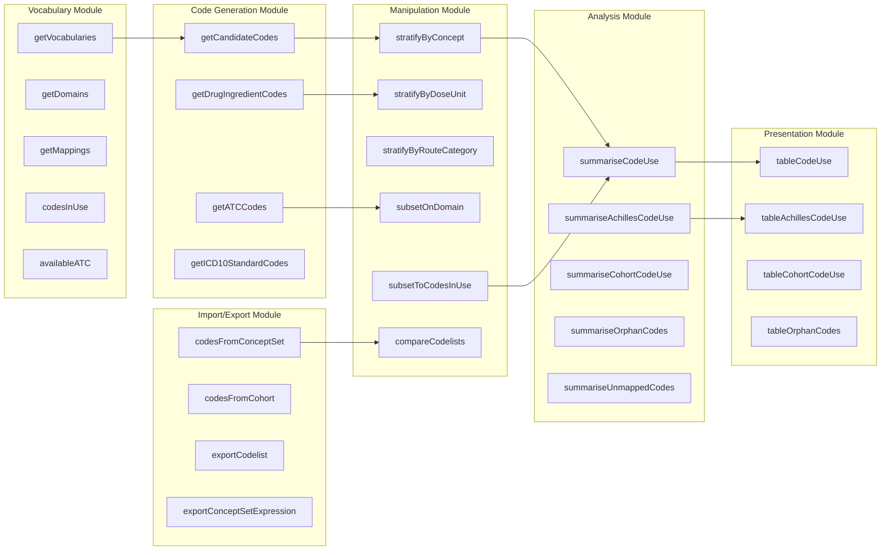
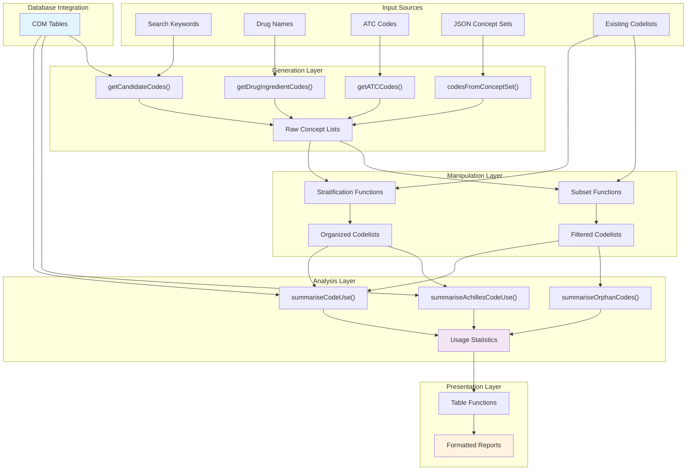
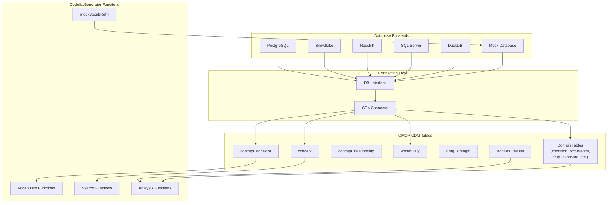
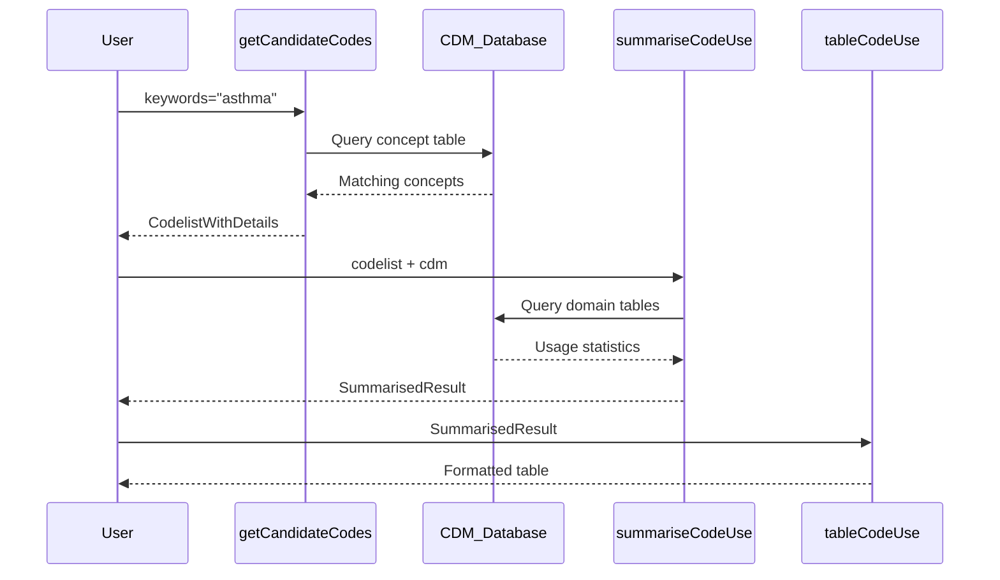

# Page: Overview

# Overview

Relevant source files

The following files were used as context for generating this wiki page:

- [DESCRIPTION](DESCRIPTION)
- [NAMESPACE](NAMESPACE)
- [NEWS.md](NEWS.md)
- [R/mockVocabRef.R](R/mockVocabRef.R)
- [R/summariseCodeUse.R](R/summariseCodeUse.R)
- [R/tableUnmappedCodes.R](R/tableUnmappedCodes.R)
- [README.Rmd](README.Rmd)
- [README.md](README.md)
- [_pkgdown.yml](_pkgdown.yml)
- [cran-comments.md](cran-comments.md)
- [tests/testthat/test-summariseCodeUse.R](tests/testthat/test-summariseCodeUse.R)

This document provides a comprehensive overview of the CodelistGenerator R package, covering its architecture, core functionality, and integration within the OMOP CDM ecosystem. CodelistGenerator is designed to identify relevant clinical codes from OMOP Common Data Model vocabularies and evaluate their usage patterns in observational health data.

For detailed information about specific functional areas, see [Core Codelist Generation](#2), [Codelist Analysis and Usage](#3), [Codelist Manipulation](#4), [Data Import and Export](#5), [Vocabulary Utilities](#6), [Database Integration and Testing](#7), and [Package Structure and Development](#8).

## Purpose and Scope

CodelistGenerator serves as a comprehensive toolkit for working with clinical codes in OMOP CDM databases. The package enables systematic identification of relevant concept codes through vocabulary-based searches, supports extraction of domain-specific codelists, and provides extensive functionality for analyzing code usage patterns in patient-level data.

The package addresses three primary use cases:
1. **Code Discovery**: Systematic search and identification of clinical codes using keyword-based searches via `getCandidateCodes`
2. **Vocabulary-Based Codelist Generation**: Automated extraction of codes based on established medical classifications using functions like `getDrugIngredientCodes`, `getATCCodes`, and `getICD10StandardCodes`
3. **Usage Analysis**: Comprehensive evaluation of code utilization patterns in CDM data through `summariseCodeUse`, `summariseAchillesCodeUse`, and related functions

Sources: [DESCRIPTION:1-70](), [README.md:1-146](), [_pkgdown.yml:10-68]()

## System Architecture

**CodelistGenerator Architecture Overview**

```mermaid
graph TB
    subgraph "External Data Sources"
        CDM_DB["OMOP CDM Database"]
        JSON_CS["JSON Concept Sets"]
        JSON_CH["JSON Cohort Definitions"]
        VOCAB_TABLES["Vocabulary Tables"]
    end
    
    subgraph "CodelistGenerator Package"
        subgraph "Core Generation"
            GET_CANDIDATE["getCandidateCodes"]
            GET_DRUG["getDrugIngredientCodes"]
            GET_ATC["getATCCodes"]
            GET_ICD10["getICD10StandardCodes"]
        end
        
        subgraph "Import Functions"
            CODES_CONCEPT["codesFromConceptSet"]
            CODES_COHORT["codesFromCohort"]
        end
        
        subgraph "Analysis Functions"
            SUMMARISE_USE["summariseCodeUse"]
            SUMMARISE_ACHILLES["summariseAchillesCodeUse"]
            SUMMARISE_COHORT["summariseCohortCodeUse"]
            SUMMARISE_ORPHAN["summariseOrphanCodes"]
        end
        
        subgraph "Manipulation Functions"
            STRATIFY_CONCEPT["stratifyByConcept"]
            STRATIFY_DOSE["stratifyByDoseUnit"]
            STRATIFY_ROUTE["stratifyByRouteCategory"]
            SUBSET_DOMAIN["subsetOnDomain"]
            SUBSET_CODES["subsetToCodesInUse"]
        end
        
        subgraph "Presentation Functions"
            TABLE_USE["tableCodeUse"]
            TABLE_ACHILLES["tableAchillesCodeUse"]
            TABLE_ORPHAN["tableOrphanCodes"]
        end
        
        subgraph "Vocabulary Utilities"
            GET_VOCABS["getVocabularies"]
            GET_DOMAINS["getDomains"]
            GET_MAPPINGS["getMappings"]
            MOCK_VOCAB["mockVocabRef"]
        end
    end
    
    subgraph "External Dependencies"
        CDM_CONNECTOR["CDMConnector"]
        OMOP_GENERICS["omopgenerics"]
        VIS_OMOP["visOmopResults"]
        PATIENT_PROFILES["PatientProfiles"]
    end
    
    subgraph "Output Types"
        CODELIST["Codelist Objects"]
        CODELIST_DETAILS["CodelistWithDetails Objects"]
        SUMMARISED_RESULT["SummarisedResult Objects"]
        FORMATTED_TABLES["Formatted Tables"]
    end

    CDM_DB --> CDM_CONNECTOR
    JSON_CS --> CODES_CONCEPT
    JSON_CH --> CODES_COHORT
    VOCAB_TABLES --> GET_CANDIDATE
    
    CDM_CONNECTOR --> GET_CANDIDATE
    CDM_CONNECTOR --> GET_DRUG
    CDM_CONNECTOR --> SUMMARISE_USE
    
    OMOP_GENERICS --> CODELIST
    OMOP_GENERICS --> CODELIST_DETAILS
    OMOP_GENERICS --> SUMMARISED_RESULT
    
    VIS_OMOP --> TABLE_USE
    VIS_OMOP --> FORMATTED_TABLES
    
    PATIENT_PROFILES --> SUMMARISE_USE
    
    SUMMARISE_USE --> SUMMARISED_RESULT
    GET_CANDIDATE --> CODELIST_DETAILS
    TABLE_USE --> FORMATTED_TABLES
```

This architecture demonstrates how CodelistGenerator integrates with the OMOP CDM ecosystem through standardized interfaces while providing comprehensive functionality for code identification, analysis, and presentation.

Sources: [NAMESPACE:1-63](), [DESCRIPTION:31-64](), [_pkgdown.yml:10-68]()

## Core Functional Areas

**Functional Module Organization**

The package organizes functionality into six primary modules, each handling specific aspects of the codelist generation and analysis workflow. The Code Generation Module provides the core search and vocabulary-based extraction capabilities, while the Analysis Module focuses on usage pattern evaluation.

Sources: [NAMESPACE:3-51](), [_pkgdown.yml:11-67]()

## Data Flow Architecture

**CodelistGenerator Data Processing Pipeline**

The data flow demonstrates how inputs are processed through generation, manipulation, analysis, and presentation layers. The CDM database serves as both a source for code discovery and a reference for usage analysis.

Sources: [R/summariseCodeUse.R:53-103](), [README.md:61-146]()

## Database and CDM Integration

**OMOP CDM Ecosystem Integration**

CodelistGenerator supports multiple database backends through a unified CDMConnector interface, enabling seamless operation across different database platforms while maintaining consistent access to OMOP CDM vocabulary and clinical data tables.

Sources: [DESCRIPTION:51-58](), [R/mockVocabRef.R:30-423](), [tests/testthat/test-summariseCodeUse.R:553-689]()

## Key Data Structures and Objects

The package works with several standardized object types that facilitate interoperability within the OMOP ecosystem:

| Object Type | Constructor Function | Purpose |
|-------------|---------------------|---------|
| `Codelist` | `newCodelist()` | Simple named lists of concept IDs |
| `CodelistWithDetails` | `newCodelistWithDetails()` | Codelists with additional concept metadata |
| `ConceptSetExpression` | `newConceptSetExpression()` | JSON-compatible concept set definitions |
| `SummarisedResult` | `omopgenerics::newSummarisedResult()` | Standardized analysis results |

**Core Usage Pattern Example**

Sources: [NAMESPACE:52-59](), [R/summariseCodeUse.R:53-216]()