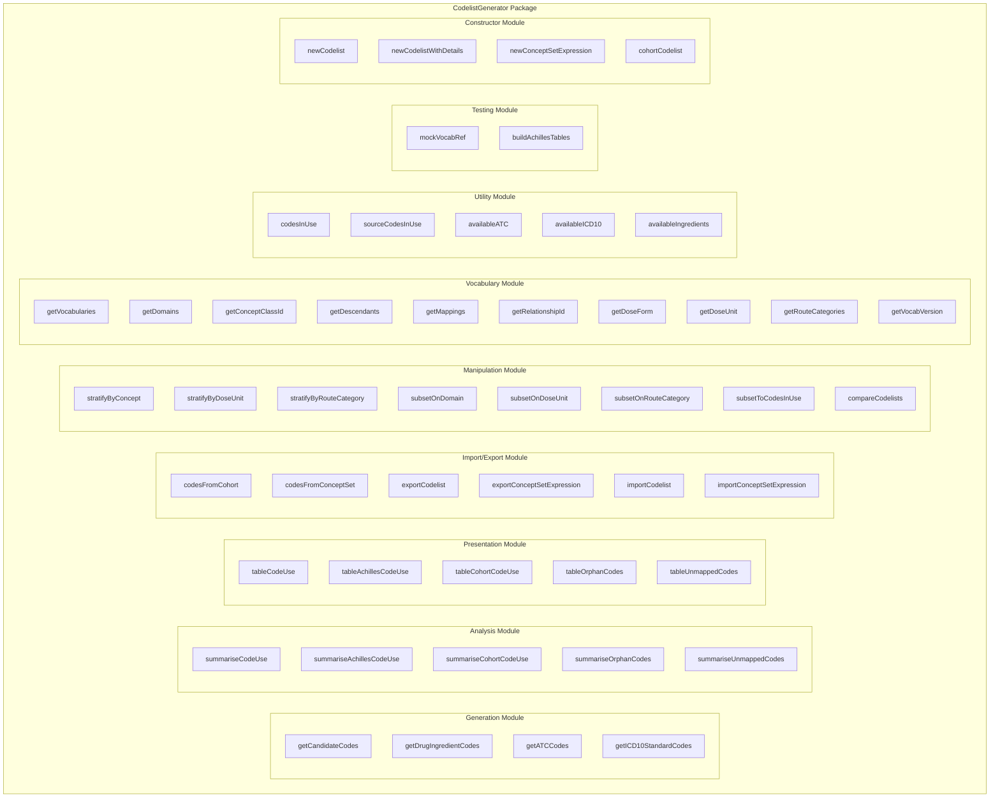
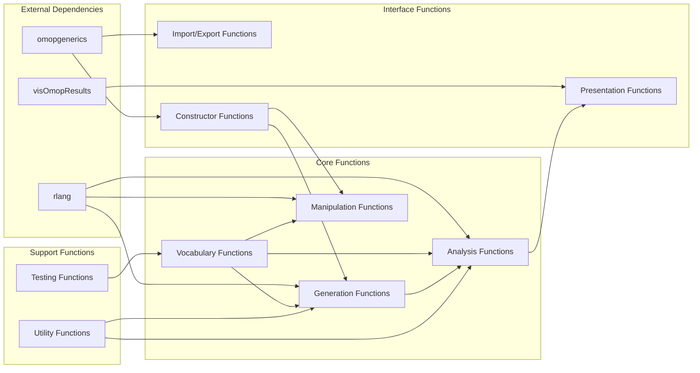
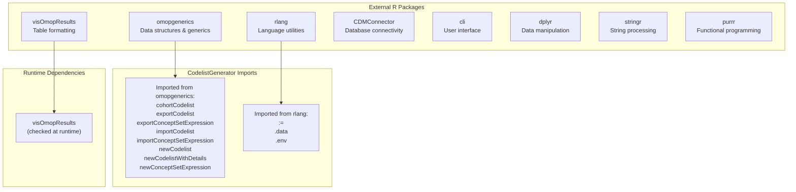
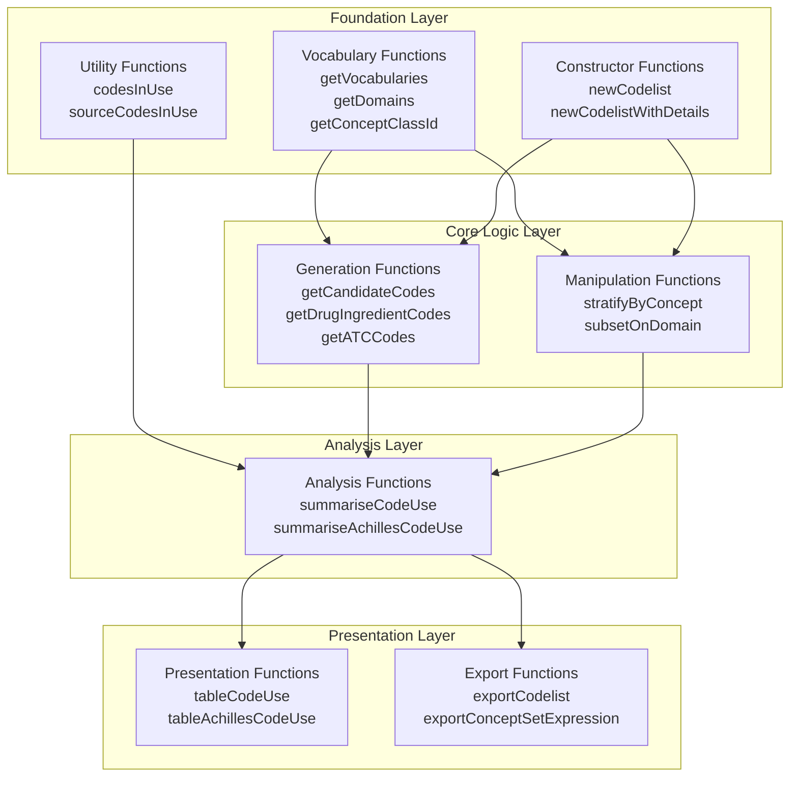
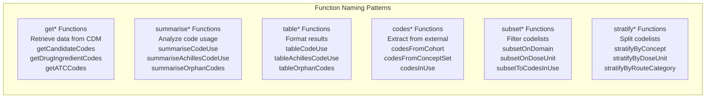
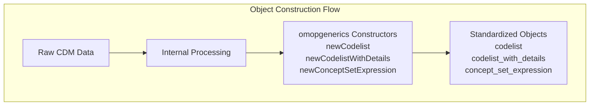

# Page: Package Architecture

# Package Architecture

Relevant source files

The following files were used as context for generating this wiki page:

- [NAMESPACE](NAMESPACE)
- [R/tableUnmappedCodes.R](R/tableUnmappedCodes.R)
- [_pkgdown.yml](_pkgdown.yml)
- [cran-comments.md](cran-comments.md)

This document provides a comprehensive overview of the CodelistGenerator R package structure, including its modular organization, exported functions, dependency relationships, and internal architecture. It covers the package's 51 exported functions organized into 8 functional modules, dependency management through `omopgenerics` and other packages, and the overall design patterns used throughout the codebase.

For information about specific functionality within each module, see the related pages: [Core Codelist Generation](#2), [Codelist Analysis and Usage](#3), [Codelist Manipulation](#4), [Data Import and Export](#5), and [Vocabulary Utilities](#6).

## Package Structure Overview

The CodelistGenerator package is organized into distinct functional modules that work together to provide comprehensive OMOP CDM codelist generation and analysis capabilities.

### Core Module Architecture

Sources: [NAMESPACE:1-63](), [_pkgdown.yml:10-68]()

## Exported Function Organization

The package exports 51 functions organized into logical groupings that reflect different stages of the codelist workflow.

### Function Export Breakdown

| Module | Function Count | Primary Purpose |
|--------|----------------|-----------------|
| Generation | 4 | Create new codelists from vocabulary searches |
| Analysis | 5 | Analyze code usage patterns in CDM data |
| Presentation | 5 | Format analysis results into tables |
| Import/Export | 6 | Handle JSON concept sets and codelist serialization |
| Manipulation | 8 | Transform and filter existing codelists |
| Vocabulary | 10 | Explore vocabulary structure and relationships |
| Utility | 5 | Support functions for code availability and usage |
| Testing | 2 | Mock data generation for development |
| Constructor | 4 | Create standardized data objects |
| Other | 2 | Additional exported functions |

### Function Dependencies by Category

Sources: [NAMESPACE:3-51](), [NAMESPACE:52-62](), [R/tableUnmappedCodes.R:57]()

## Dependency Architecture

The package follows a layered dependency architecture with external packages providing foundational capabilities and internal modules building upon each other.

### External Package Dependencies

Sources: [NAMESPACE:52-62](), [R/tableUnmappedCodes.R:57]()

### Internal Module Dependencies

The internal architecture follows a clear hierarchy where lower-level modules provide services to higher-level ones.

Sources: [NAMESPACE:3-51](), [_pkgdown.yml:11-68]()

## Package Documentation Structure

The package documentation is organized to reflect the functional architecture, with clear groupings that help users understand the workflow from generation to analysis to presentation.

### Documentation Organization

| Documentation Group | Functions Included | Purpose |
|---------------------|-------------------|---------|
| Search for codes | `getCandidateCodes` | Systematic vocabulary searching |
| Create vocabulary-based codelists | `getDrugIngredientCodes`, `getATCCodes`, `getICD10StandardCodes` | Specialized codelist generation |
| Run codelist diagnostics | `summariseAchillesCodeUse`, `summariseCodeUse`, `summariseCohortCodeUse`, `summariseOrphanCodes`, `summariseUnmappedCodes` | Usage analysis and validation |
| Present diagnostics in tables | `tableAchillesCodeUse`, `tableCodeUse`, `tableCohortCodeUse`, `tableOrphanCodes`, `tableUnmappedCodes` | Formatted output generation |
| Extract from JSON files | `codesFromCohort`, `codesFromConceptSet` | External data integration |
| Codelist utilities | `compareCodelists`, `subsetToCodesInUse`, `stratifyByRouteCategory`, etc. | Codelist manipulation |
| Vocabulary utilities | `getVocabVersion`, `getVocabularies`, `getDomains`, etc. | Vocabulary exploration |
| Mock dataset creation | `mockVocabRef`, `buildAchillesTables` | Testing and development |

Sources: [_pkgdown.yml:11-68]()

## Design Patterns and Conventions

The package follows consistent design patterns that enhance maintainability and user experience.

### Function Naming Conventions

Sources: [NAMESPACE:3-51]()

### Object Construction Pattern

The package leverages `omopgenerics` for standardized object construction, ensuring consistency with the broader OMOP ecosystem.

Sources: [NAMESPACE:52-59]()

This architecture ensures that CodelistGenerator integrates seamlessly with other packages in the DARWIN EU ecosystem while maintaining clear separation of concerns and consistent user interfaces across all functionality.