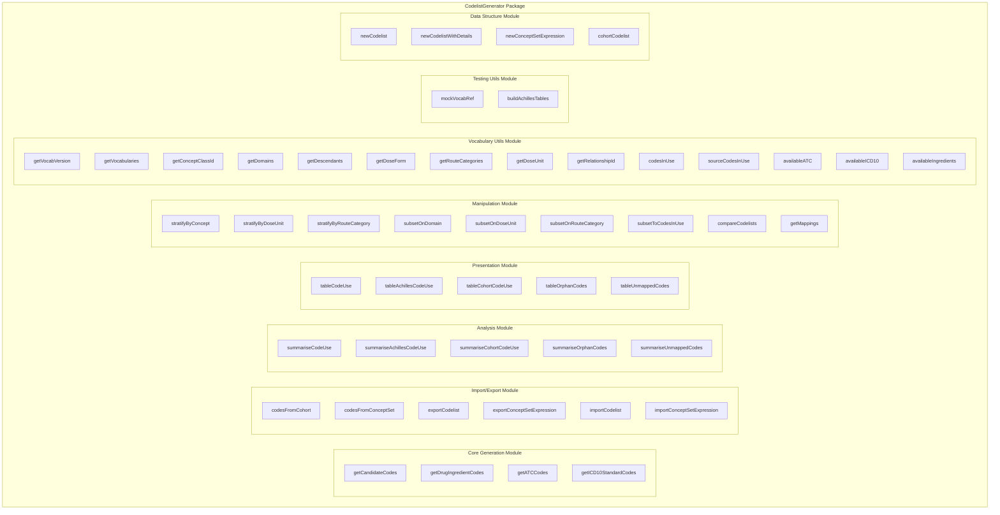
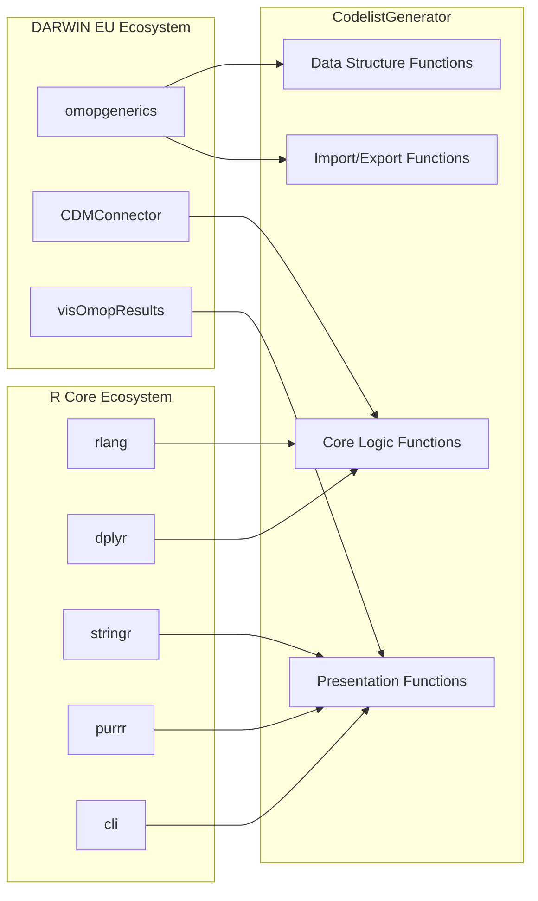
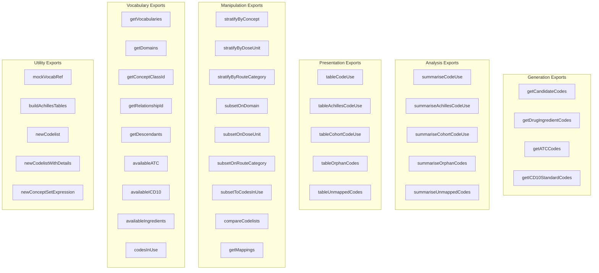
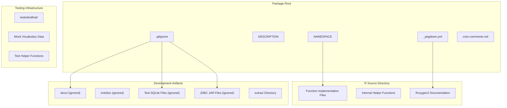

# Page: Package Structure and Development

# Package Structure and Development

Relevant source files

The following files were used as context for generating this wiki page:

- [.gitignore](.gitignore)
- [NAMESPACE](NAMESPACE)
- [R/tableUnmappedCodes.R](R/tableUnmappedCodes.R)
- [_pkgdown.yml](_pkgdown.yml)
- [cran-comments.md](cran-comments.md)

This document covers the internal architecture of the CodelistGenerator R package, including its modular organization, exported function structure, dependency relationships, and development setup. For information about specific functional capabilities, see the individual module documentation pages ([2](#2) through [7](#7)).

## Package Architecture Overview

The CodelistGenerator package is structured as a collection of specialized modules that work together to provide comprehensive codelist generation and analysis capabilities for OMOP CDM data. The package follows R packaging best practices with clear separation of concerns and well-defined interfaces.

### Package Module Structure

**Package Module Organization**: The package exports 49 functions organized into 7 logical modules. Each module has a specific responsibility: generation creates new codelists, analysis summarizes usage patterns, presentation formats results, manipulation transforms existing codelists, vocabulary utilities provide OMOP vocabulary operations, testing utilities support development, and data structures provide object constructors.

Sources: [NAMESPACE:1-63](), [_pkgdown.yml:10-68]()

## Dependency Architecture

The CodelistGenerator package integrates with the broader DARWIN EU ecosystem through well-defined dependency relationships and import patterns.

### External Dependencies

**Dependency Structure**: The package imports 9 functions from `omopgenerics` for data structure compatibility, uses `:=`, `.data`, and `.env` from `rlang` for safe evaluation, and integrates with `visOmopResults` for table formatting. Database connectivity is provided through the broader ecosystem via `CDMConnector`.

Sources: [NAMESPACE:52-62](), [R/tableUnmappedCodes.R:57]()

### Function Import Pattern

| Package | Imported Functions | Purpose |
|---------|-------------------|---------|
| `omopgenerics` | `cohortCodelist`, `exportCodelist`, `exportConceptSetExpression`, `importCodelist`, `importConceptSetExpression`, `newCodelist`, `newCodelistWithDetails`, `newConceptSetExpression`, `sourceCodesInUse` | OMOP data structure compatibility |
| `rlang` | `:=`, `.data`, `.env` | Safe non-standard evaluation |
| `visOmopResults` | (conditional) | Table formatting and presentation |

Sources: [NAMESPACE:52-62](), [R/tableUnmappedCodes.R:57]()

## Exported Function Organization

The package exports are organized following a systematic functional grouping that reflects the package's modular architecture.

### Export Categories

**Export Organization**: The 49 exported functions follow a consistent naming pattern where analysis functions use `summarise*` prefix, presentation functions use `table*` prefix, manipulation functions use `stratify*` or `subset*` prefixes, and utility functions have descriptive names. This creates a predictable API surface.

Sources: [NAMESPACE:3-51](), [_pkgdown.yml:11-67]()

## Development Structure

The package follows standard R package development practices with additional configurations for CRAN submission and continuous integration.

### Development File Structure

**Development Configuration**: The package uses `roxygen2` for documentation generation, `pkgdown` for website generation, and maintains CRAN-ready structure. Development artifacts like documentation builds, test databases, and JDBC drivers are excluded from version control.

Sources: [.gitignore:1-23](), [_pkgdown.yml:1-68](), [cran-comments.md:1-4]()

### Testing and Mock Data Strategy

The package includes comprehensive testing infrastructure with mock vocabulary references for development and testing without requiring full OMOP CDM database access.

| Component | Purpose | Files |
|-----------|---------|-------|
| `mockVocabRef` | Creates mock vocabulary tables for testing | Exported function |
| `buildAchillesTables` | Creates Achilles tables for testing | Exported function |
| Test SQLite files | Local test databases (ignored in git) | `vocab.sqlite`, `db.sqlite` |
| JDBC drivers | Database connectivity for integration tests | `*.jar` files (ignored) |

**Mock Data Architecture**: The `mockVocabRef` and `buildAchillesTables` functions provide complete mock OMOP vocabulary and Achilles table structures, enabling comprehensive testing without requiring access to real OMOP CDM databases. This supports both unit testing and development workflows.

Sources: [NAMESPACE:30](), [NAMESPACE:6](), [.gitignore:4-6](), [.gitignore:13-14]()