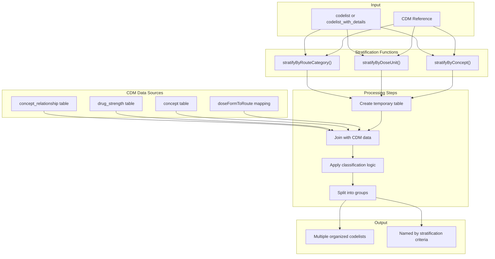
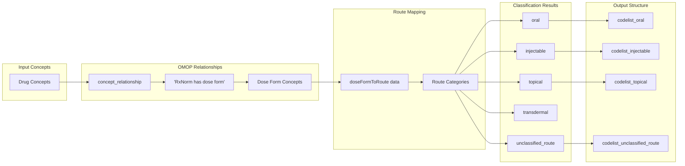
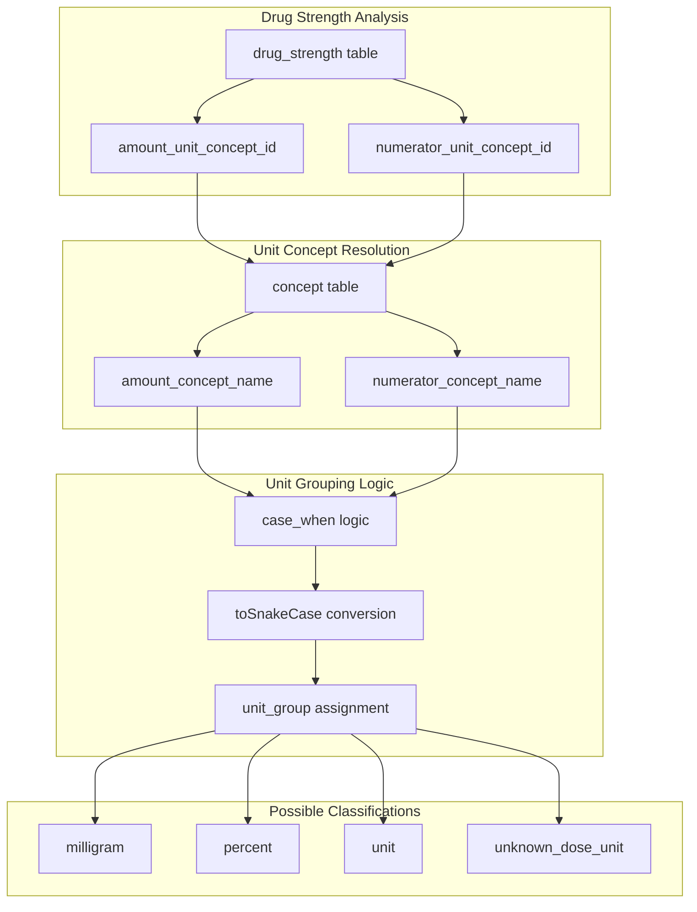
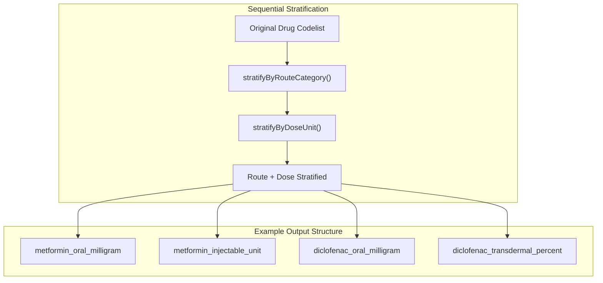

# Page: Stratification Functions

# Stratification Functions

<details>
<summary>Relevant source files</summary>

The following files were used as context for generating this wiki page:

- [CRAN-SUBMISSION](CRAN-SUBMISSION)
- [R/getRoutes.R](R/getRoutes.R)
- [R/stratifyByConcept.R](R/stratifyByConcept.R)
- [R/stratifyByDoseUnit.R](R/stratifyByDoseUnit.R)
- [R/stratifyByRoute.R](R/stratifyByRoute.R)
- [R/subsetOnRouteCategory.R](R/subsetOnRouteCategory.R)
- [man/CodelistGenerator-package.Rd](man/CodelistGenerator-package.Rd)
- [man/stratifyByConcept.Rd](man/stratifyByConcept.Rd)
- [man/stratifyByRouteCategory.Rd](man/stratifyByRouteCategory.Rd)
- [tests/testthat/test-dbms.R](tests/testthat/test-dbms.R)
- [tests/testthat/test-stratifyByConcept.R](tests/testthat/test-stratifyByConcept.R)
- [tests/testthat/test-stratifyByDoseUnit.R](tests/testthat/test-stratifyByDoseUnit.R)
- [tests/testthat/test-stratifyByRouteCategory.R](tests/testthat/test-stratifyByRouteCategory.R)
- [tests/testthat/test-subsetOnDoseUnit.R](tests/testthat/test-subsetOnDoseUnit.R)

</details>


## Purpose and Scope

This document covers the stratification functions in CodelistGenerator that split existing codelists into multiple sub-codelists based on various criteria. These functions enable users to organize drug concepts by route category, dose unit, or individual concepts within a codelist. For filtering and subsetting operations that reduce codelists rather than splitting them, see [Filtering and Subsetting](#4.2).

The stratification functions are primarily designed for drug domain concepts and leverage OMOP CDM vocabulary relationships to determine grouping criteria.

## Overview of Stratification Functions

CodelistGenerator provides three main stratification functions that take a single codelist and return multiple organized codelists:

| Function | Purpose | Primary Use Case |
|----------|---------|------------------|
| `stratifyByRouteCategory` | Split by drug administration route | Organize drugs by oral, injectable, topical, etc. |
| `stratifyByDoseUnit` | Split by dose unit measurements | Group by milligram, percent, unit, etc. |
| `stratifyByConcept` | Split by individual concepts | Create separate codelists for each concept |

All stratification functions support both `codelist` and `codelist_with_details` objects and include a `keepOriginal` parameter to retain the source codelist alongside the stratified results.

Sources: [R/stratifyByRoute.R:18-141](), [R/stratifyByDoseUnit.R:18-148](), [R/stratifyByConcept.R:18-101]()

## Stratification Workflow



Sources: [R/stratifyByRoute.R:56-141](), [R/stratifyByDoseUnit.R:54-148](), [R/stratifyByConcept.R:42-101]()

## Route Category Stratification

The `stratifyByRouteCategory` function splits drug codelists based on administration routes using the classification system described in [doi.org/10.1002/pds.5809](https://doi.org/10.1002/pds.5809).

### Route Classification Process



The function uses the `concept_relationship` table to find dose forms associated with drug concepts via the "RxNorm has dose form" relationship [R/stratifyByRoute.R:74-76](). These dose forms are then mapped to route categories using the internal `doseFormToRoute` dataset [R/stratifyByRoute.R:55]().

```r
# Example usage
drug_codes <- getDrugIngredientCodes(cdm, name = c("metformin", "diclofenac"))
stratified_codes <- stratifyByRouteCategory(drug_codes, cdm = cdm)
```

Non-drug domain concepts that cannot be classified are filtered out, resulting in empty codelists for non-drug inputs [R/stratifyByRoute.R:85-89]().

Sources: [R/stratifyByRoute.R:37-141](), [tests/testthat/test-stratifyByRouteCategory.R:1-38](), [tests/testthat/test-dbms.R:363-366]()

## Dose Unit Stratification

The `stratifyByDoseUnit` function organizes drug concepts by their dose unit measurements using information from the `drug_strength` table.

### Dose Unit Classification Logic



The stratification logic prioritizes `amount_concept_name` over `numerator_concept_name` and assigns "unknown_dose_unit" to drug domain concepts without dose information [R/stratifyByDoseUnit.R:93-100]().

```r
# Example usage  
drug_codes <- getDrugIngredientCodes(cdm, name = c("metformin", "diclofenac"))
dose_stratified <- stratifyByDoseUnit(drug_codes, cdm = cdm)
```

Sources: [R/stratifyByDoseUnit.R:37-148](), [tests/testthat/test-stratifyByDoseUnit.R:1-22](), [tests/testthat/test-dbms.R:408-417]()

## Concept-Based Stratification

The `stratifyByConcept` function creates individual codelists for each concept within the input codelist, using concept names to generate meaningful codelist names.

### Concept Stratification Process

```mermaid
graph LR
    subgraph "Input Processing"
        ICL["Input Codelist"]
        ADD["addDetails() if needed"]
        CWD["codelist_with_details"]
    end
    
    subgraph "Name Generation"
        CN["concept_name"]
        SCN["toSnakeCase()"]
        NCN["new_c_name generation"]
    end
    
    subgraph "Splitting Logic"
        MUT["Mutate with names"]
        RB["list_rbind()"]
        SPL["split() by new_c_name"]
    end
    
    subgraph "Output Format"
        IND["Individual codelists"]
        SORT["Sorted by name"]
        TYPE["Preserve input type"]
    end
    
    ICL --> ADD
    ADD --> CWD
    CWD --> CN
    CN --> SCN
    SCN --> NCN
    
    NCN --> MUT
    MUT --> RB
    RB --> SPL
    
    SPL --> IND
    IND --> SORT
    SORT --> TYPE
```



The function automatically adds concept details if working with a basic `codelist` [R/stratifyByConcept.R:48-50]() and handles missing concept names by dropping those concepts with a warning [R/stratifyByConcept.R:61-66]().

```r
# Example usage
drug_codes <- getDrugIngredientCodes(cdm, name = c("metformin", "diclofenac"))
concept_stratified <- stratifyByConcept(drug_codes, cdm = cdm)
```

Sources: [R/stratifyByConcept.R:37-101](), [tests/testthat/test-stratifyByConcept.R:1-39](), [tests/testthat/test-dbms.R:526-527]()

## Combined Stratification Workflows

Stratification functions can be chained together to create complex organizational structures:



```r
# Combined stratification example
drug_codes <- getDrugIngredientCodes(cdm, name = c("metformin", "diclofenac"))
combined_stratified <- drug_codes |>
  stratifyByRouteCategory(cdm = cdm) |>
  stratifyByDoseUnit(cdm = cdm)
```

Sources: [tests/testthat/test-dbms.R:418-422](), [tests/testthat/test-dbms.R:571-575]()

## Technical Implementation Details

### Common Function Structure

All stratification functions follow a consistent pattern:

1. **Input Validation**: Check codelist format and CDM reference [R/stratifyByRoute.R:40-42]()
2. **Type Detection**: Handle `codelist_with_details` vs basic `codelist` [R/stratifyByRoute.R:44-51]()
3. **Temporary Table Creation**: Insert concept IDs for joining [R/stratifyByRoute.R:56-66]()
4. **CDM Data Joining**: Connect with relevant vocabulary tables [R/stratifyByRoute.R:70-94]()
5. **Classification Logic**: Apply stratification criteria [R/stratifyByRoute.R:85-100]()
6. **Result Assembly**: Split and name output codelists [R/stratifyByRoute.R:101-127]()
7. **Cleanup**: Drop temporary tables [R/stratifyByRoute.R:129]()

### keepOriginal Parameter

The `keepOriginal` parameter allows users to retain the source codelist alongside stratified results:

```r
# With keepOriginal = TRUE
result <- stratifyByRouteCategory(codes, cdm, keepOriginal = TRUE)
# Returns: original codelists + stratified codelists

# With keepOriginal = FALSE  
result <- stratifyByRouteCategory(codes, cdm, keepOriginal = FALSE)
# Returns: only stratified codelists
```

Sources: [R/stratifyByRoute.R:125-127](), [R/stratifyByDoseUnit.R:132-134](), [R/stratifyByConcept.R:87-89]()

### Cross-Database Compatibility

The stratification functions are tested across multiple database platforms including PostgreSQL, SQL Server, Snowflake, and Redshift, ensuring consistent behavior across different OMOP CDM implementations.

Sources: [tests/testthat/test-dbms.R:3-609]()