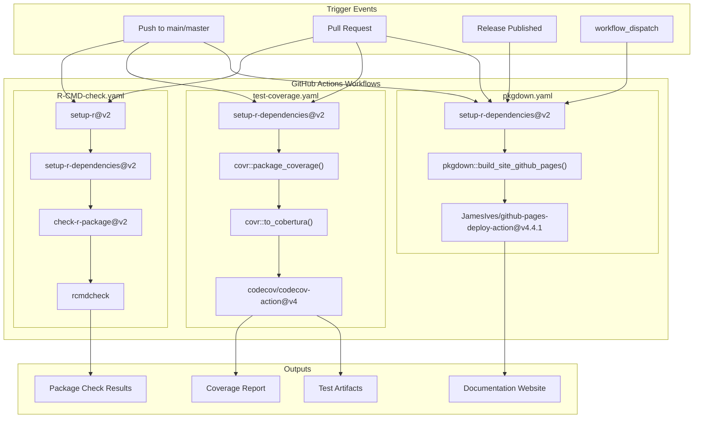
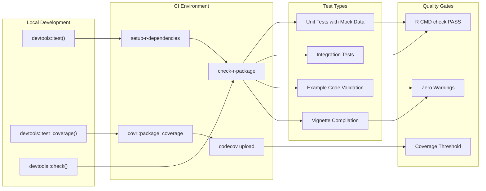
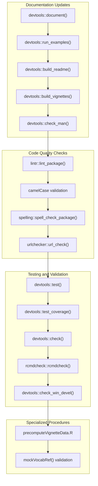

# Page: Testing Framework and CI/CD

# Testing Framework and CI/CD

Relevant source files

The following files were used as context for generating this wiki page:

- [.github/.gitignore](.github/.gitignore)
- [.github/CONTRIBUTING.md](.github/CONTRIBUTING.md)
- [.github/ISSUE_TEMPLATE/bug_report.md](.github/ISSUE_TEMPLATE/bug_report.md)
- [.github/ISSUE_TEMPLATE/feature_request.md](.github/ISSUE_TEMPLATE/feature_request.md)
- [.github/workflows/R-CMD-check.yaml](.github/workflows/R-CMD-check.yaml)
- [.github/workflows/pkgdown.yaml](.github/workflows/pkgdown.yaml)
- [.github/workflows/test-coverage.yaml](.github/workflows/test-coverage.yaml)
- [R/subsetOnDomain.R](R/subsetOnDomain.R)

## Purpose and Scope

This document covers the comprehensive testing framework and continuous integration/continuous deployment (CI/CD) infrastructure for the CodelistGenerator package. It details the automated testing pipelines, code quality assurance processes, and development workflows that ensure package reliability across multiple database backends and R environments.

For information about multi-database support architecture, see [Multi-Database Support](#7.1). For details about mock data utilities used in testing, see [Mock Data and Testing Utilities](#8.2).

## CI/CD Pipeline Architecture

The CodelistGenerator package employs a robust CI/CD pipeline built on GitHub Actions with three primary workflows that provide comprehensive validation and deployment automation.

**CI/CD Pipeline Overview**

The pipeline consists of three specialized workflows that run on Ubuntu environments:

| Workflow | Purpose | Triggers | Key Actions |
|----------|---------|----------|-------------|
| `R-CMD-check` | Package validation | Push, PR | `rcmdcheck`, dependency resolution |
| `test-coverage` | Code coverage analysis | Push, PR | `covr`, Codecov reporting |
| `pkgdown` | Documentation deployment | Push, PR, Release | Site building, GitHub Pages |

Sources: [.github/workflows/R-CMD-check.yaml:1-49](), [.github/workflows/test-coverage.yaml:1-62](), [.github/workflows/pkgdown.yaml:1-47]()

## Testing Strategy and Framework

The testing framework employs a multi-layered approach that combines unit testing, integration testing, and cross-platform validation to ensure package functionality across diverse database environments.

### Core Testing Components

The testing strategy is built around several key components:

- **`devtools::test()`** - Primary test runner for the testthat framework
- **`devtools::test_coverage()`** - Local coverage analysis during development  
- **`covr::package_coverage()`** - CI coverage computation with detailed reporting
- **Mock data utilities** - Isolated testing with `mockVocabRef()` and related functions

### Test Execution Workflow

**Test Coverage and Reporting**

The coverage workflow uses `covr::package_coverage()` with specific configuration for comprehensive analysis, including clean installation paths and Cobertura XML output for integration with Codecov services.

Sources: [.github/workflows/test-coverage.yaml:32-39](), [.github/CONTRIBUTING.md:24-35]()

## Development Workflow and Quality Assurance

The development workflow integrates multiple quality assurance checkpoints that developers must satisfy before contributing code changes.

### Pre-Contribution Requirements

Before submitting pull requests, developers must execute a comprehensive validation sequence:

**Code Style and Linting Standards**

The package enforces strict code style requirements using `lintr::lint_package()` with camelCase naming conventions. The linting configuration specifically validates object naming patterns to ensure consistency across the codebase.

**Vignette Data Precomputation**

For vignettes requiring database connectivity, the package includes a specialized precomputation script that generates results against full vocabulary databases, ensuring reproducible documentation without requiring live database connections during builds.

Sources: [.github/CONTRIBUTING.md:12-70](), [.github/CONTRIBUTING.md:40-46]()

## Issue Tracking and Bug Reporting

The testing framework is supported by structured issue tracking templates that facilitate systematic bug reporting and feature requests.

### Bug Report Template Structure

The bug report template includes standardized sections for:
- **Reproduction steps** - Detailed sequence for reproducing issues
- **Expected behavior** - Clear specification of intended functionality  
- **Environment details** - OS, browser, and version information
- **Additional context** - Supporting information and screenshots

### Feature Request Process

Feature requests follow a structured template requiring:
- **Problem description** - Clear articulation of the underlying issue
- **Proposed solution** - Detailed description of desired functionality
- **Alternative considerations** - Evaluation of alternative approaches

The contributing guidelines emphasize that CodelistGenerator is developed as part of the DARWIN EU project and is closed to external contributions, requiring issue-based coordination before any development work.

Sources: [.github/ISSUE_TEMPLATE/bug_report.md:1-39](), [.github/ISSUE_TEMPLATE/feature_request.md:1-21](), [.github/CONTRIBUTING.md:1-11]()

## Artifact Management and Failure Handling

The CI/CD pipeline includes comprehensive artifact management and failure recovery mechanisms to facilitate debugging and maintain development velocity.

### Test Failure Artifact Collection

When tests fail, the coverage workflow automatically collects diagnostic artifacts:

- **Test output files** - Complete testthat execution logs from `testthat.Rout*` files
- **Package installation artifacts** - Full package installation directory for post-mortem analysis
- **Coverage data** - Detailed coverage reports even for failed runs

### Continuous Integration Permissions and Security

The workflows operate with `read-all` permissions and use GitHub Personal Access Tokens (`GITHUB_PAT`) and Codecov tokens (`CODECOV_TOKEN`) for secure access to external services while maintaining minimal privilege requirements.

Sources: [.github/workflows/test-coverage.yaml:49-62](), [.github/workflows/R-CMD-check.yaml:11-28]()