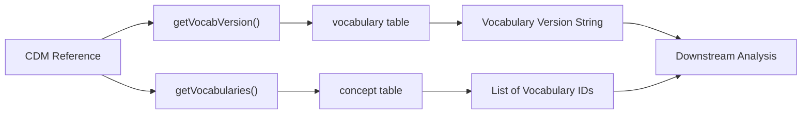
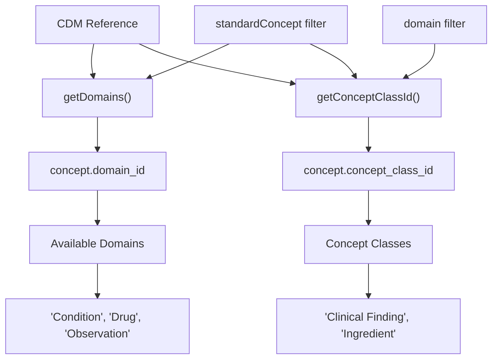
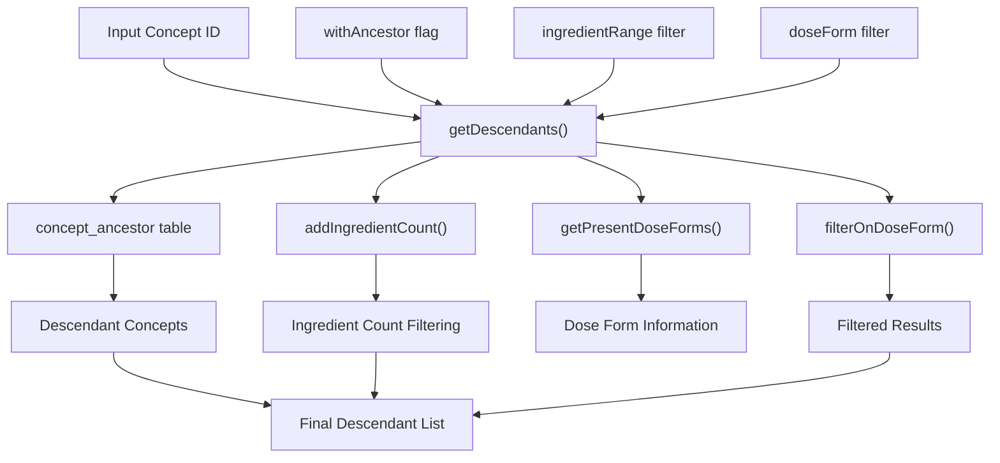
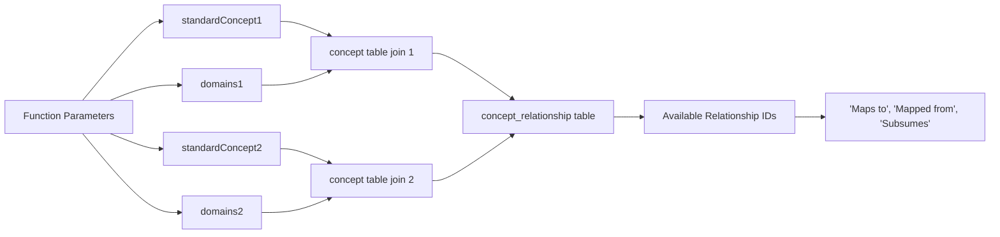
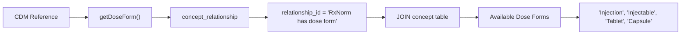
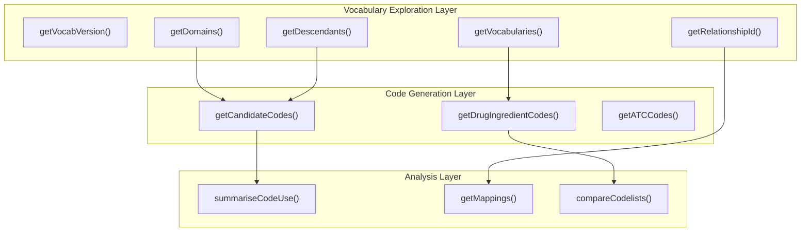

# Page: Vocabulary Exploration

# Vocabulary Exploration

Relevant source files

The following files were used as context for generating this wiki page:

- [R/compareCodelists.R](R/compareCodelists.R)
- [R/getMappings.R](R/getMappings.R)
- [R/vocabUtilities.R](R/vocabUtilities.R)
- [man/getDescendants.Rd](man/getDescendants.Rd)
- [man/getDomains.Rd](man/getDomains.Rd)
- [man/getMappings.Rd](man/getMappings.Rd)
- [man/getVocabVersion.Rd](man/getVocabVersion.Rd)
- [man/getVocabularies.Rd](man/getVocabularies.Rd)
- [man/mockVocabRef.Rd](man/mockVocabRef.Rd)
- [tests/testthat/test-compareCodelists.R](tests/testthat/test-compareCodelists.R)
- [tests/testthat/test-getMappings.R](tests/testthat/test-getMappings.R)
- [tests/testthat/test-mockVocabRef.R](tests/testthat/test-mockVocabRef.R)
- [tests/testthat/test-vocabUtilities.R](tests/testthat/test-vocabUtilities.R)

This document covers functions for exploring and understanding the structure of OMOP CDM vocabularies within the CodelistGenerator package. These utilities provide foundational information about available vocabularies, domains, concept relationships, and hierarchical structures that inform downstream codelist generation and analysis activities.

For codelist generation using vocabulary exploration results, see [Core Codelist Generation](#2). For vocabulary mappings between standard and non-standard vocabularies, see [Concept Mappings and Comparisons](#6.2).

## Purpose and Scope

The vocabulary exploration functionality serves as the foundational layer for understanding OMOP CDM vocabulary structure. These functions query the `concept`, `vocabulary`, `concept_relationship`, and `concept_ancestor` tables to provide metadata about available vocabularies, domains, concept classes, and hierarchical relationships. This information enables informed decision-making when generating codelists and understanding the scope of available medical concepts.

**Sources:** [R/vocabUtilities.R:1-554]()

## Core Vocabulary Information Functions

### Vocabulary Version and Available Vocabularies

The `getVocabVersion()` function retrieves the vocabulary version from the CDM, while `getVocabularies()` returns all available vocabulary identifiers.

**Vocabulary Version Discovery Process**

The `getVocabVersion()` function queries the `vocabulary` table for the "None" vocabulary entry to extract version information:

| Function | Purpose | Returns |
|----------|---------|---------|
| `getVocabVersion()` | Extract vocabulary version | Character string with version |
| `getVocabularies()` | List available vocabularies | Sorted character vector of vocabulary IDs |

**Sources:** [R/vocabUtilities.R:29-38](), [R/vocabUtilities.R:108-118](), [tests/testthat/test-vocabUtilities.R:8-14]()

### Domain and Concept Class Exploration

The `getDomains()` and `getConceptClassId()` functions provide insight into the categorical organization of concepts within the vocabulary.

**Domain and Class Filtering**

Both functions support filtering by `standardConcept` parameter with values:
- **"Standard"**: Standard concepts (S flag)
- **"Non-standard"**: Non-standard concepts (no flag)
- **"Classification"**: Classification concepts (C flag)

**Sources:** [R/vocabUtilities.R:53-93](), [R/vocabUtilities.R:134-184](), [tests/testthat/test-vocabUtilities.R:16-27]()

## Concept Hierarchy and Relationship Exploration

### Descendant Concept Discovery

The `getDescendants()` function navigates the concept hierarchy using the `concept_ancestor` table to find all descendant concepts for a given concept ID.

**Descendant Query Modes**

| Mode | Function | Returns |
|------|----------|---------|
| Basic | `getDescendantsOnly()` | Descendant concepts only |
| With Ancestor | `getDescendantsAndAncestor()` | Descendants plus ancestor information |

The function supports filtering by:
- **Ingredient Range**: Restricts results to concepts with specific ingredient counts
- **Dose Form**: Filters by pharmaceutical dose forms (e.g., "Injection", "Tablet")

**Sources:** [R/vocabUtilities.R:240-264](), [R/vocabUtilities.R:266-298](), [R/vocabUtilities.R:300-371](), [tests/testthat/test-vocabUtilities.R:29-70]()

### Relationship Discovery

The `getRelationshipId()` function identifies available concept relationships between different vocabulary domains and standard concept types.

**Relationship Query Parameters**

The function filters relationships based on:
- **Source and target standard concept types**: Standard, Non-standard, Classification
- **Source and target domains**: Condition, Drug, Observation, etc.
- **Case-insensitive matching**: Input parameters are normalized to lowercase

**Sources:** [R/vocabUtilities.R:473-553](), [tests/testthat/test-vocabUtilities.R:77-111]()

## Drug-Specific Vocabulary Exploration

### Dose Form Discovery

The `getDoseForm()` function specifically explores pharmaceutical dose forms available in the vocabulary using RxNorm relationships.

**Sources:** [R/vocabUtilities.R:199-220](), [tests/testthat/test-vocabUtilities.R:73-74]()

## Integration with Vocabulary System

### Relationship to Other Package Components

The vocabulary exploration functions serve as foundational utilities for other package components:

### Mock Vocabulary Support

The package includes `mockVocabRef()` for testing and development, which creates a simplified vocabulary structure that supports all exploration functions:

| Mock Component | Purpose |
|----------------|---------|
| Mock concept table | Basic concept hierarchy with test data |
| Mock vocabulary table | Version information |
| Mock concept_ancestor | Hierarchical relationships |
| Mock concept_relationship | Test relationships including RxNorm dose forms |

**Sources:** [tests/testthat/test-mockVocabRef.R:1-13](), [tests/testthat/test-vocabUtilities.R:1-138]()

## Function Reference Summary

| Function | Primary Purpose | Key Parameters | Returns |
|----------|----------------|----------------|---------|
| `getVocabVersion()` | Vocabulary version | `cdm` | Character string |
| `getVocabularies()` | Available vocabularies | `cdm` | Character vector |
| `getDomains()` | Available domains | `cdm`, `standardConcept` | Character vector |
| `getConceptClassId()` | Concept classes | `cdm`, `standardConcept`, `domain` | Character vector |
| `getDoseForm()` | Drug dose forms | `cdm` | Character vector |
| `getDescendants()` | Concept hierarchy | `cdm`, `conceptId`, `withAncestor` | Data frame |
| `getRelationshipId()` | Concept relationships | `cdm`, domain and standard filters | Character vector |

**Sources:** [R/vocabUtilities.R:1-554](), [man/getDomains.Rd:1-28](), [man/getVocabularies.Rd:1-24](), [man/getDescendants.Rd:1-45]()