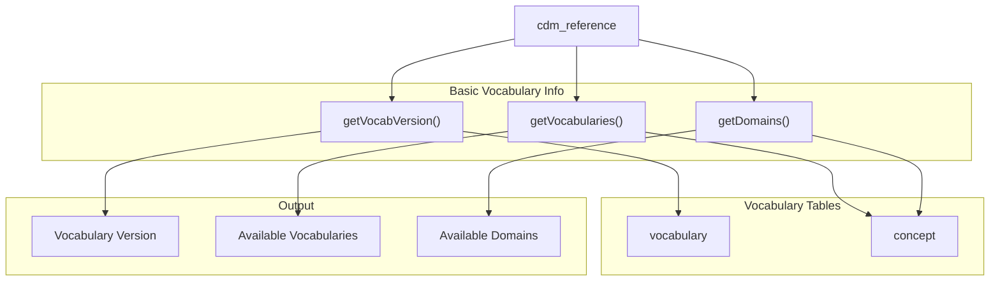
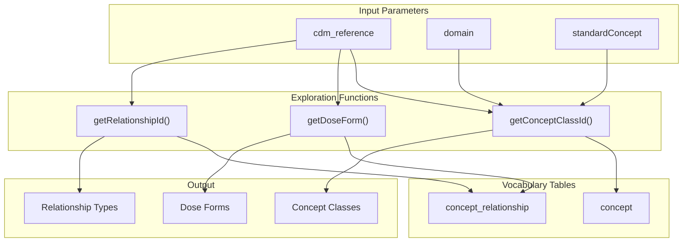
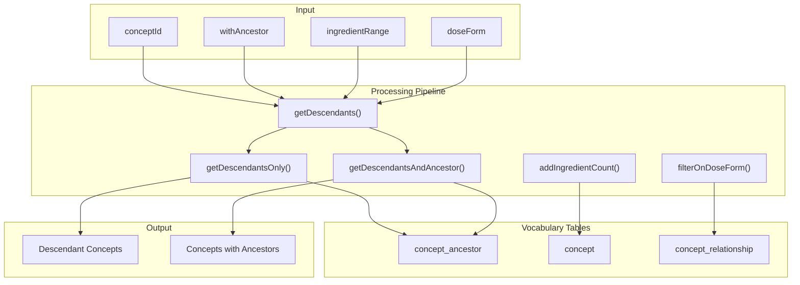
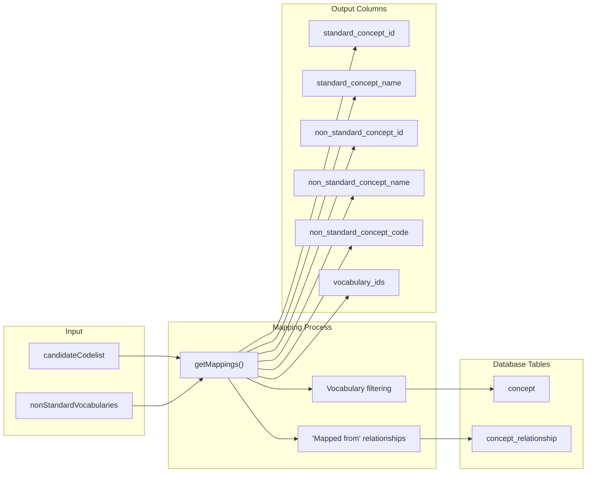
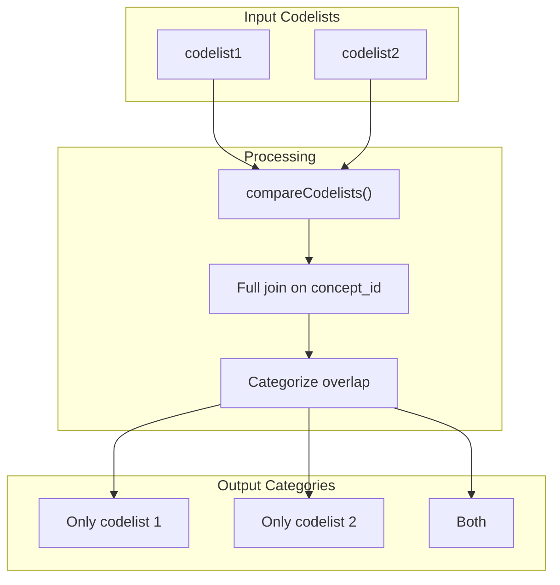
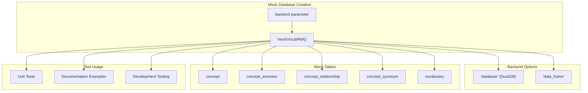

# Page: Vocabulary Utilities

# Vocabulary Utilities

Relevant source files

The following files were used as context for generating this wiki page:

- [R/compareCodelists.R](R/compareCodelists.R)
- [R/getMappings.R](R/getMappings.R)
- [R/vocabUtilities.R](R/vocabUtilities.R)
- [man/getDescendants.Rd](man/getDescendants.Rd)
- [man/getDomains.Rd](man/getDomains.Rd)
- [man/getMappings.Rd](man/getMappings.Rd)
- [man/getVocabVersion.Rd](man/getVocabVersion.Rd)
- [man/getVocabularies.Rd](man/getVocabularies.Rd)
- [man/mockVocabRef.Rd](man/mockVocabRef.Rd)
- [tests/testthat/test-compareCodelists.R](tests/testthat/test-compareCodelists.R)
- [tests/testthat/test-getMappings.R](tests/testthat/test-getMappings.R)
- [tests/testthat/test-mockVocabRef.R](tests/testthat/test-mockVocabRef.R)
- [tests/testthat/test-vocabUtilities.R](tests/testthat/test-vocabUtilities.R)

This document covers utility functions for exploring OMOP CDM vocabularies, analyzing concept relationships, and comparing codelists. These functions provide foundational services for understanding vocabulary structure and concept mappings within the OMOP standardized vocabularies.

For codelist generation from vocabularies, see [Core Codelist Generation](#2). For analyzing code usage patterns, see [Codelist Analysis and Usage](#3).

## Vocabulary Exploration Functions

The CodelistGenerator package provides several functions to explore the structure and content of OMOP vocabularies. These functions help users understand what vocabularies, domains, and concept relationships are available in their CDM instance.

### Basic Vocabulary Information

The package offers functions to retrieve fundamental information about the vocabulary structure:

The `getVocabVersion()` function extracts the vocabulary version from the vocabulary table by filtering for vocabulary_id "None" [R/vocabUtilities.R:29-38](). The `getVocabularies()` function returns all unique vocabulary identifiers from the concept table [R/vocabUtilities.R:108-118](). The `getDomains()` function retrieves all available domains, with optional filtering by standard concept type [R/vocabUtilities.R:53-93]().

**Sources:** [R/vocabUtilities.R:17-93](), [tests/testthat/test-vocabUtilities.R:8-18]()

### Concept Class and Relationship Exploration

The package provides functions to explore concept classes and relationships within domains:

The `getConceptClassId()` function returns concept classes for specified domains and standard concept types [R/vocabUtilities.R:134-184](). The `getDoseForm()` function specifically retrieves drug dose forms using the "RxNorm has dose form" relationship [R/vocabUtilities.R:199-220](). The `getRelationshipId()` function explores available relationships between concept domains [R/vocabUtilities.R:473-553]().

**Sources:** [R/vocabUtilities.R:120-220](), [R/vocabUtilities.R:453-553](), [tests/testthat/test-vocabUtilities.R:20-112]()

### Concept Hierarchy Navigation

The `getDescendants()` function provides powerful functionality for navigating concept hierarchies:

The function supports filtering by ingredient count for drug concepts [R/vocabUtilities.R:424-450]() and dose form filtering [R/vocabUtilities.R:407-422](). When `withAncestor = TRUE`, it returns ancestor information alongside descendants [R/vocabUtilities.R:300-371]().

**Sources:** [R/vocabUtilities.R:222-451](), [tests/testthat/test-vocabUtilities.R:29-71]()

## Concept Mappings and Comparisons

### Vocabulary Mappings

The `getMappings()` function provides mappings between standard and non-standard vocabularies:

The function uses "Mapped from" relationships to connect standard concepts with their non-standard equivalents [R/getMappings.R:90-100](). It supports multiple non-standard vocabularies including ATC, ICD10CM, Read codes, and others [R/getMappings.R:43-49]().

**Sources:** [R/getMappings.R:18-135](), [tests/testthat/test-getMappings.R:1-74]()

### Codelist Comparison

The `compareCodelists()` function analyzes overlap between two codelists:

| Comparison Result | Description |
|------------------|-------------|
| "Only codelist 1" | Concepts present only in the first codelist |
| "Only codelist 2" | Concepts present only in the second codelist |
| "Both" | Concepts present in both codelists |

The function supports both data frame codelists and `omopgenerics::codelist` objects [R/compareCodelists.R:49-65](). It performs a full join on concept_id and concept_name to identify overlapping and unique concepts [R/compareCodelists.R:71-91]().

**Sources:** [R/compareCodelists.R:18-91](), [tests/testthat/test-compareCodelists.R:1-151]()

## Testing and Development Utilities

### Mock Vocabulary Reference

The `mockVocabRef()` function creates a test vocabulary database for development and testing:

The mock database provides consistent test data across different backend implementations, supporting both in-memory data frames and database connections [tests/testthat/test-mockVocabRef.R:1-13]().

**Sources:** [tests/testthat/test-mockVocabRef.R:1-13](), [man/mockVocabRef.Rd:1-25]()