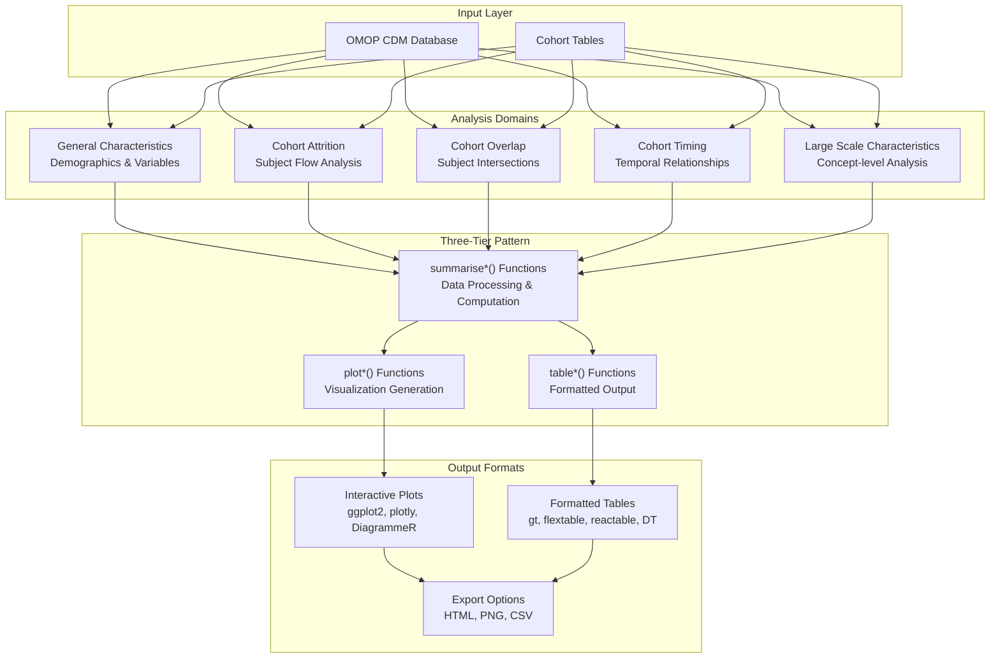
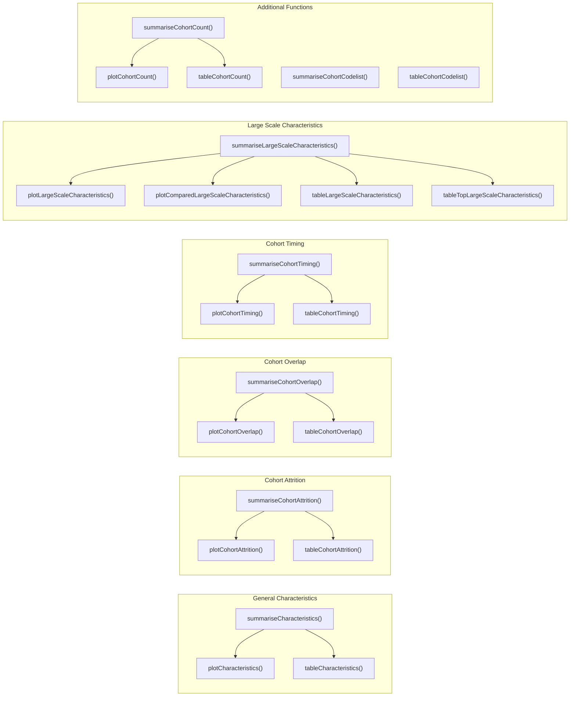
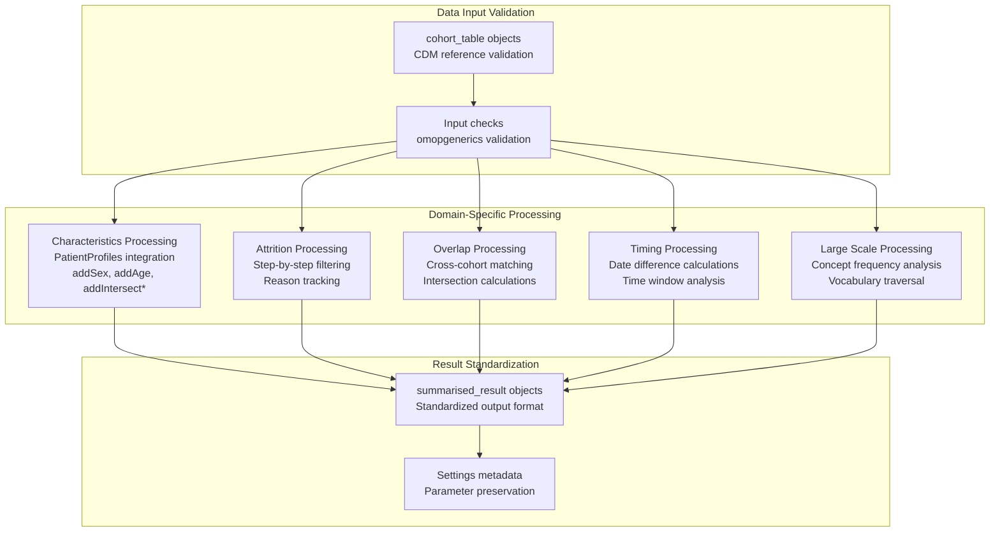
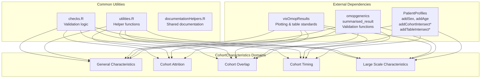

# Page: Analysis Domains

# Analysis Domains

Relevant source files

The following files were used as context for generating this wiki page:

- [MD5](MD5)
- [NAMESPACE](NAMESPACE)

This document provides an overview of the five core analysis domains supported by the CohortCharacteristics package. Each domain addresses specific analytical questions about OMOP CDM cohorts and follows a consistent three-tier pattern: summarization → visualization → tabulation. For detailed implementation of each domain, see the individual sections: General Characteristics ([3.1](#3.1)), Cohort Attrition ([3.2](#3.2)), Cohort Overlap ([3.3](#3.3)), Cohort Timing ([3.4](#3.4)), and Large Scale Characteristics ([3.5](#3.5)). For information about the underlying workflow patterns, see Core Analysis Workflow ([2](#2)).

## Analysis Domain Architecture

The CohortCharacteristics package organizes analytical capabilities into distinct domains, each targeting specific research questions about cohort composition, flow, relationships, and temporal patterns.

**Analysis Domain Function Architecture**

Sources: [NAMESPACE:1-57](), [R/summariseCharacteristics.R](), [R/summariseCohortAttrition.R](), [R/summariseCohortOverlap.R](), [R/summariseCohortTiming.R](), [R/summariseLargeScaleCharacteristics.R]()

## Function Mapping by Domain

Each analysis domain implements the consistent three-tier pattern through specific function families, providing a standardized interface across different analytical approaches.

**Function Implementation Mapping**

Sources: [NAMESPACE:23-38](), [R/plotCharacteristics.R](), [R/plotCohortAttrition.R](), [R/plotCohortOverlap.R](), [R/plotCohortTiming.R](), [R/plotLargeScaleCharacteristics.R](), [R/tableCharacteristics.R](), [R/tableCohortAttrition.R](), [R/tableCohortOverlap.R](), [R/tableCohortTiming.R](), [R/tableLargeScaleCharacteristics.R]()

## Domain Characteristics and Use Cases

Each analysis domain addresses specific research questions and analytical needs within cohort studies.

| Domain | Primary Function | Key Capabilities | Output Types |
|--------|-----------------|------------------|--------------|
| **General Characteristics** | `summariseCharacteristics()` | Demographics, intersections, custom variables | Bar charts, scatter plots, summary tables |
| **Cohort Attrition** | `summariseCohortAttrition()` | Subject flow tracking, exclusion analysis | Flow diagrams, attrition tables |
| **Cohort Overlap** | `summariseCohortOverlap()` | Cross-cohort subject intersections | Bar charts, Venn-style visualizations |
| **Cohort Timing** | `summariseCohortTiming()` | Time-to-event, temporal relationships | Box plots, density plots, timing tables |
| **Large Scale Characteristics** | `summariseLargeScaleCharacteristics()` | Concept frequency, vocabulary analysis | Concept plots, comparison charts, top concept tables |

## Data Processing Flow

The domains share a common data processing pattern while implementing domain-specific analytical logic.

**Domain Processing Architecture**

Sources: [R/checks.R](), [R/summariseCharacteristics.R](), [R/summariseCohortAttrition.R](), [R/summariseCohortOverlap.R](), [R/summariseCohortTiming.R](), [R/summariseLargeScaleCharacteristics.R]()

## Domain Integration Points

All domains integrate with the broader OMOP ecosystem through standardized interfaces and data structures.

**Integration Architecture**

Sources: [R/utilities.R](), [R/checks.R](), [R/documentationHelpers.R](), [NAMESPACE:40-52]()

Each domain builds upon this common foundation while implementing specialized analytical logic. The consistent three-tier pattern ensures that users can apply the same workflow principles across different types of cohort analysis, while domain-specific functions provide the analytical depth required for each research question.