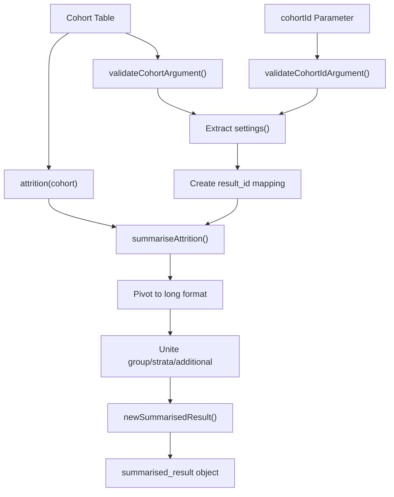
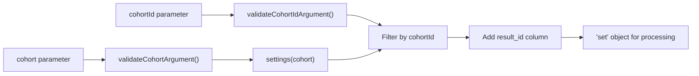
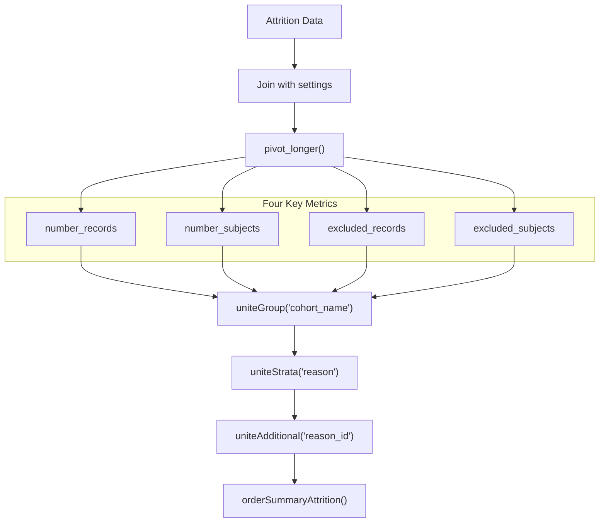
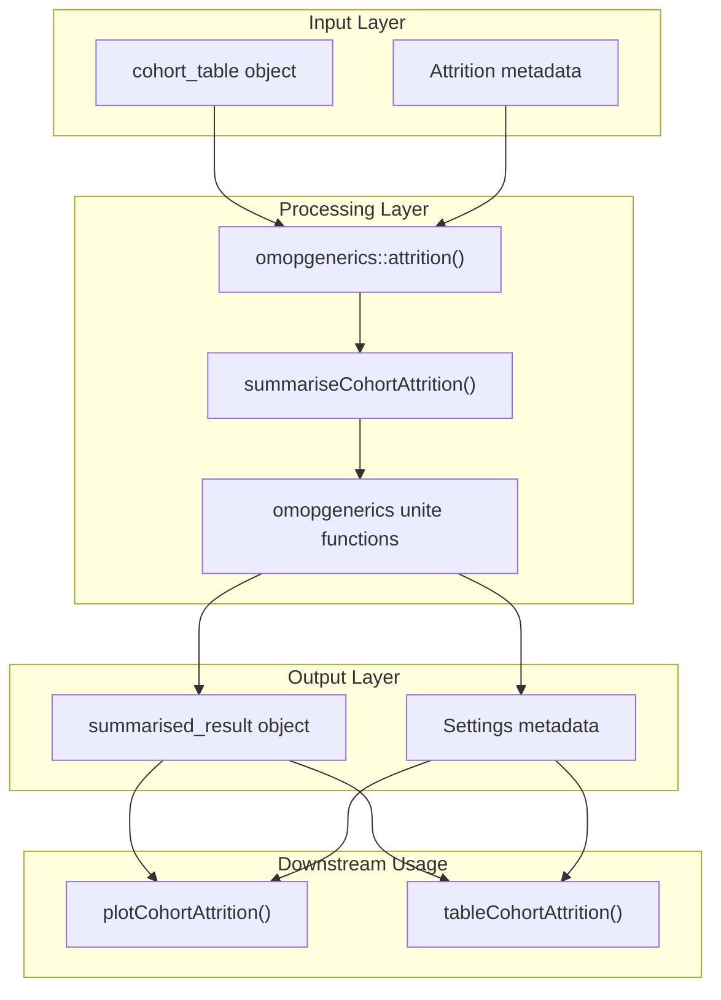

# Page: Attrition Summarization

# Attrition Summarization

Relevant source files

The following files were used as context for generating this wiki page:

- [R/plotComparedLargeScaleCharacteristics.R](R/plotComparedLargeScaleCharacteristics.R)
- [R/summariseCohortAttrition.R](R/summariseCohortAttrition.R)
- [tests/testthat/test-plotCohortAttrition.R](tests/testthat/test-plotCohortAttrition.R)

This document covers the `summariseCohortAttrition()` function and its associated data processing pipeline for extracting and standardizing cohort attrition information. This function transforms raw attrition data from cohort tables into standardized `summarised_result` objects for downstream visualization and reporting.

For attrition visualization, see [Attrition Visualization](#3.2.2). For attrition table generation, see [Attrition Tables](#3.2.3). For the broader attrition analysis workflow, see [Cohort Attrition Analysis](#3.2).

## Overview

The attrition summarization system extracts subject flow information from cohort tables that have been processed with attrition tracking. It converts this information into a standardized format compatible with the OMOP `summarised_result` object structure, enabling consistent reporting across different analysis types.

The core function `summariseCohortAttrition()` processes attrition metadata that has been recorded during cohort construction, typically through calls to `omopgenerics::recordCohortAttrition()`. This metadata tracks how many subjects and records are excluded at each step of cohort definition.

**Function Flow and Data Transformation**

Sources: [R/summariseCohortAttrition.R:38-53]()

## Function Interface

The primary entry point is `summariseCohortAttrition()` with a minimal parameter set:

| Parameter | Type | Description |
|-----------|------|-------------|
| `cohort` | `cohort_table` | OMOP cohort table with recorded attrition |
| `cohortId` | `integer` (optional) | Specific cohort IDs to summarize; defaults to all |

The function follows standard OMOP validation patterns, using `omopgenerics::validateCohortArgument()` and `omopgenerics::validateCohortIdArgument()` to ensure input integrity.

**Parameter Processing**

Sources: [R/summariseCohortAttrition.R:40-45]()

## Data Processing Pipeline

The core processing occurs in the `summariseAttrition()` helper function, which transforms attrition data through several standardization steps:

1. **Settings Integration**: Links attrition records to cohort metadata through `cohort_definition_id`
2. **Data Transformation**: Pivots four key metrics into long format
3. **Column Structuring**: Applies OMOP result conventions using `omopgenerics` unite functions
4. **Result Creation**: Constructs standardized `summarised_result` object

**Attrition Metrics Processing**

Sources: [R/summariseCohortAttrition.R:68-94]()

## Result Object Structure

The output follows the standard `summarised_result` format with specific adaptations for attrition data:

| Column | Content | Example |
|--------|---------|---------|
| `result_id` | Sequential identifier for each cohort | 1, 2, 3 |
| `cdm_name` | Database identifier | "Eunomia" |
| `group_name` | Cohort identifier | "cohort_name" |
| `group_level` | Cohort name | "my_cohort" |
| `strata_name` | Attrition step identifier | "reason" |
| `strata_level` | Attrition step description | "Initial qualifying events" |
| `variable_name` | Metric type | "number_subjects" |
| `estimate_name` | Estimate type | "count" |
| `estimate_value` | Numeric value | "1500" |

The `orderSummaryAttrition()` function ensures consistent ordering by converting `reason_id` to numeric for proper sequencing of attrition steps.

Sources: [R/summariseCohortAttrition.R:111-124]()

## Integration with OMOP Ecosystem

The attrition summarization system integrates tightly with the broader OMOP ecosystem through several key components:

**OMOP Ecosystem Integration**

Sources: [R/summariseCohortAttrition.R:47-49](), [R/summariseCohortAttrition.R:90-92]()

## Usage Patterns

The function is typically used in analysis workflows where cohort construction has included attrition tracking:

1. **Cohort Construction with Attrition**: Use `omopgenerics::recordCohortAttrition()` during filtering
2. **Attrition Summarization**: Call `summariseCohortAttrition()` on the final cohort
3. **Visualization/Reporting**: Pass results to plotting or table functions

The function handles edge cases such as empty cohorts and missing attrition data by generating appropriate warnings while maintaining the standard result structure.

Sources: [tests/testthat/test-plotCohortAttrition.R:4-11](), [tests/testthat/test-plotCohortAttrition.R:28-31]()