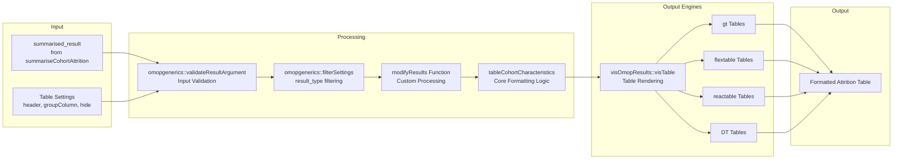
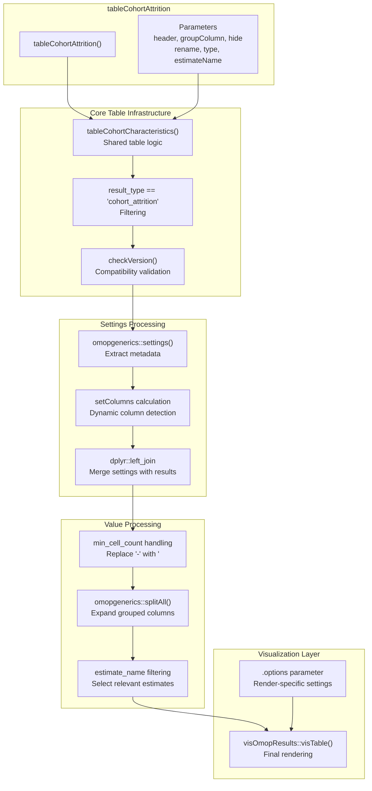
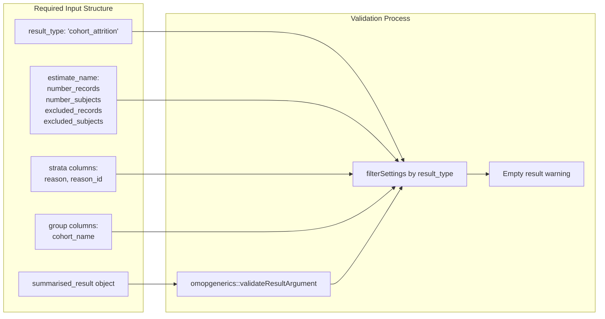
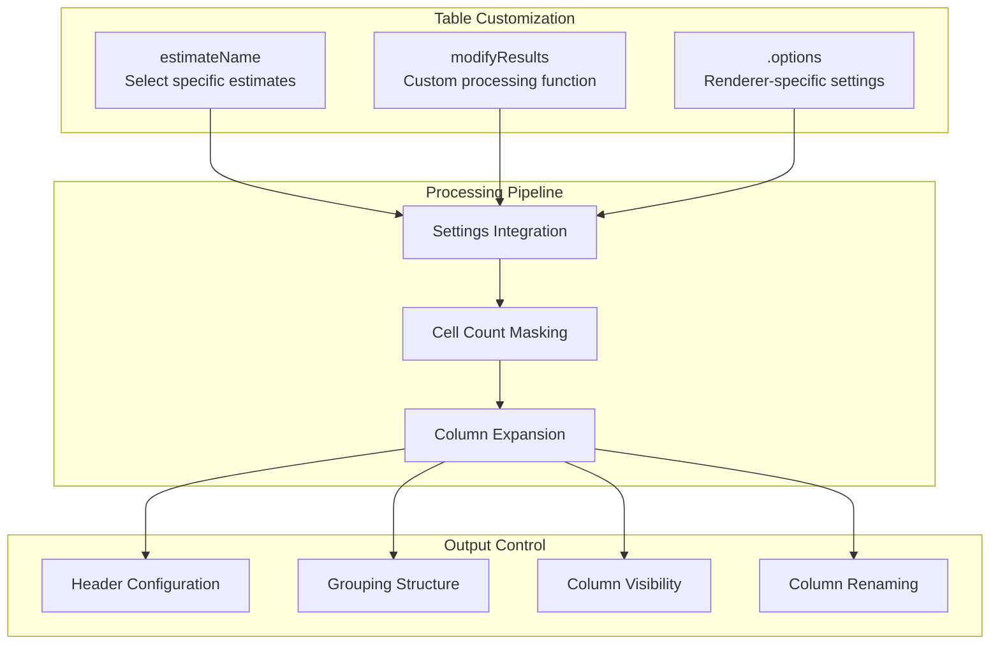
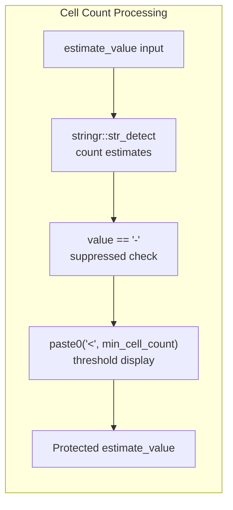
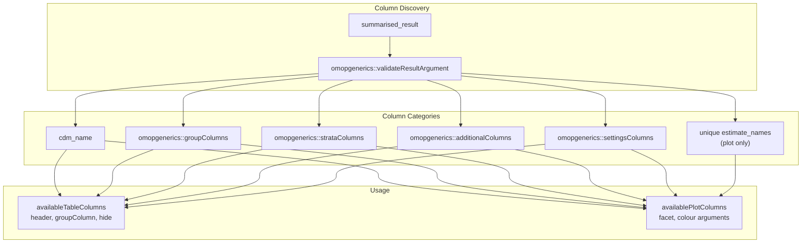
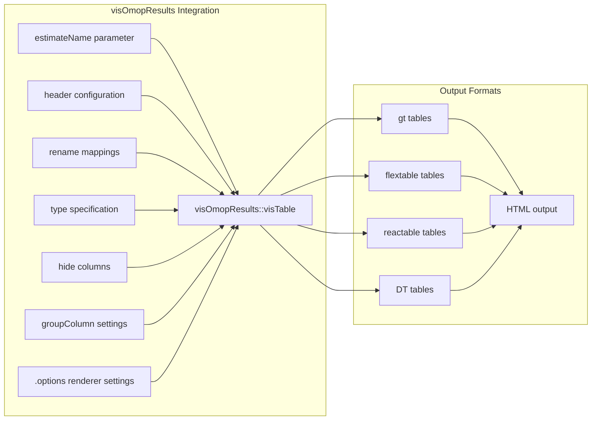
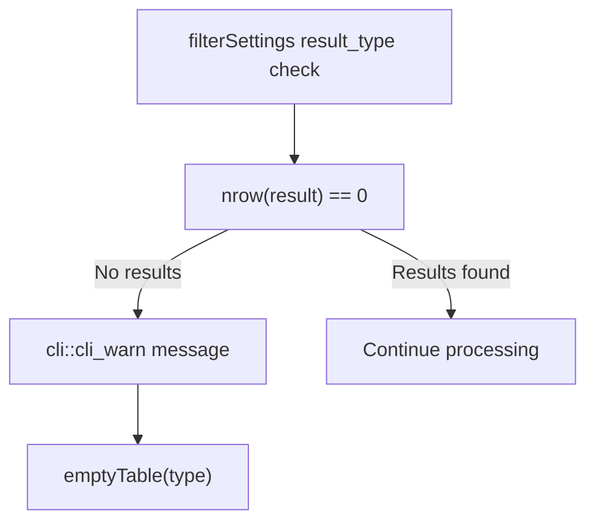

# Page: Attrition Tables

# Attrition Tables

Relevant source files

The following files were used as context for generating this wiki page:

- [MD5](MD5)
- [NEWS.md](NEWS.md)
- [R/table.R](R/table.R)

This document covers the creation of structured tabular reports for cohort attrition analysis using the `tableCohortAttrition` function. Attrition tables provide formatted summaries of subject flow through cohort definitions, displaying exclusion steps and remaining counts in a structured, readable format.

For information about generating attrition summaries, see [Attrition Summarization](#3.2.1). For creating visual flow diagrams of attrition, see [Attrition Visualization](#3.2.2).

## Table Generation Workflow

The attrition table generation follows the standard three-tier analysis pattern, taking summarized attrition results and formatting them into publication-ready tables.

Sources: [R/table.R:60-125](), [R/tableCohortAttrition.R]()

## Function Architecture

The `tableCohortAttrition` function integrates with the package's standardized table generation infrastructure, processing attrition-specific summarised results into formatted tables.

Sources: [R/table.R:70-125](), [R/tableCohortAttrition.R]()

## Input Requirements

Attrition tables require summarised results with specific characteristics:

| Requirement | Description | Code Reference |
|-------------|-------------|----------------|
| **Result Type** | Must have `result_type == "cohort_attrition"` | [R/table.R:78]() |
| **Estimate Names** | Contains attrition-specific estimates (number_records, number_subjects) | [R/summariseCohortAttrition.R]() |
| **Settings** | Valid settings metadata from summarization | [R/table.R:86]() |
| **Structure** | Valid `summarised_result` object | [R/table.R:74]() |

Sources: [R/table.R:74-82]()

## Table Formatting Options

The function provides extensive customization options for table appearance and structure:

### Core Parameters

| Parameter | Type | Purpose | Default |
|-----------|------|---------|---------|
| `header` | character | Column headers structure | Automatic |
| `groupColumn` | character | Grouping column specification | None |
| `hide` | character | Columns to hide from display | "estimate_type" |
| `rename` | named list | Column name mappings | None |
| `type` | character | Output table type | "gt" |

### Advanced Options

Sources: [R/table.R:60-69](), [R/table.R:116-124]()

## Cell Count Privacy Protection

The function implements automatic privacy protection for small cell counts:

Sources: [R/table.R:109-113]()

## Available Column Management

The function integrates with the package's column management system to provide dynamic column options:

| Function | Purpose | Returns |
|----------|---------|---------|
| `availableTableColumns()` | Lists available columns for table functions | Character vector |
| `availablePlotColumns()` | Lists available columns for plot functions | Character vector |

Sources: [R/table.R:18-58]()

## Integration with visOmopResults

The final table rendering leverages the `visOmopResults` package for standardized OMOP result visualization:

Sources: [R/table.R:116-124]()

## Error Handling and Edge Cases

The function includes robust error handling for common edge cases:

### Empty Results

When no attrition results match the specified criteria, the function returns an appropriate empty table:

Sources: [R/table.R:79-82](), [R/table.R:126-129]()

### Version Compatibility

The function includes version checking to ensure compatibility between different package versions:

Sources: [R/table.R:84]()