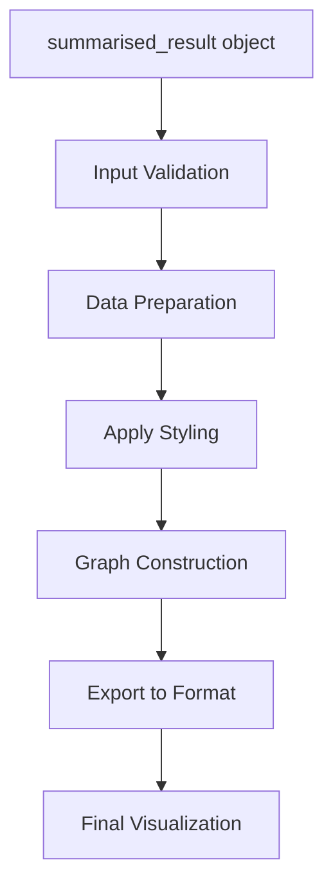
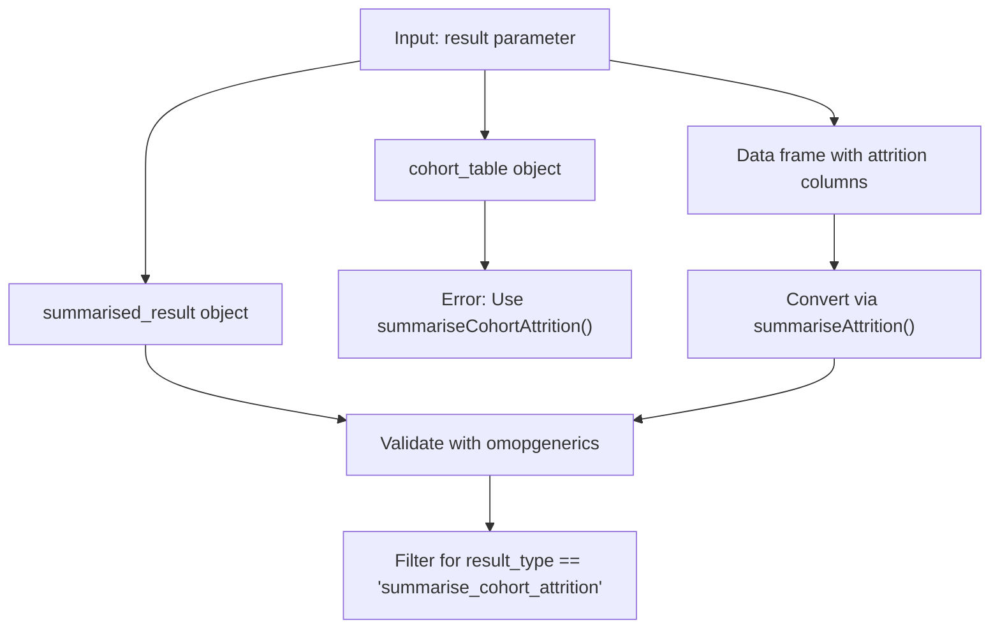
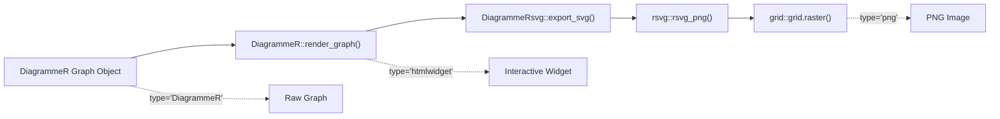
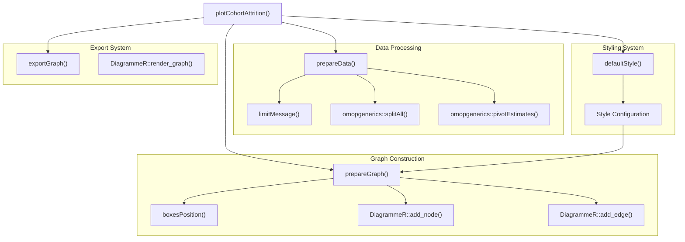
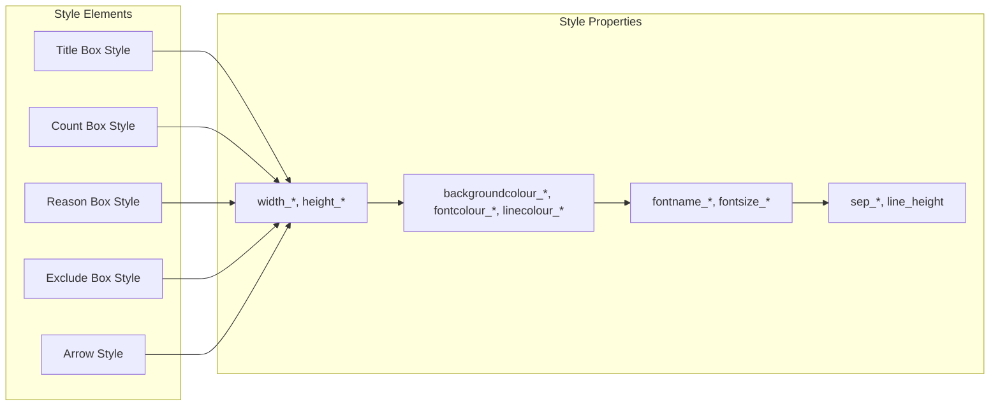
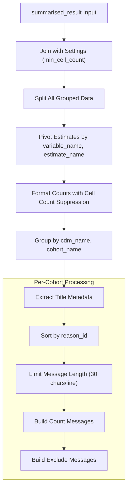

# Page: Attrition Visualization

# Attrition Visualization

Relevant source files

The following files were used as context for generating this wiki page:

- [R/plotCohortAttrition.R](R/plotCohortAttrition.R)
- [man/plotCohortAttrition.Rd](man/plotCohortAttrition.Rd)
- [man/summariseCharacteristics.Rd](man/summariseCharacteristics.Rd)
- [tests/testthat/test-plotCohortAttrition.R](tests/testthat/test-plotCohortAttrition.R)

This document covers the visualization capabilities for cohort attrition analysis, specifically the `plotCohortAttrition()` function and its supporting infrastructure. This function creates flow diagrams that visualize subject and record flow through cohort definition steps, showing exclusions and remaining counts at each stage.

For information about generating attrition summaries, see [Attrition Summarization](#3.2.1). For creating formatted attrition tables, see [Attrition Tables](#3.2.3).

## Function Overview

The `plotCohortAttrition()` function serves as the primary interface for creating attrition flow diagrams. It accepts `summarised_result` objects generated by `summariseCohortAttrition()` and produces interactive flow diagrams using the DiagrammeR package.

**Core Function Signature:**
- `plotCohortAttrition(result, show, type, cohortId)`
- `result`: A `summarised_result` object from attrition analysis
- `show`: Variables to display ("subjects", "records", or both)
- `type`: Output format ("htmlwidget", "png", "svg", "DiagrammeR")
- `cohortId`: Deprecated parameter for cohort filtering

Sources: [R/plotCohortAttrition.R:56-61]()

## Input Requirements

The function expects specific input formats and validates them through multiple pathways:

**Input Validation Process:**
- Rejects `cohort_table` objects directly with error message
- Converts data frames with cohort attrition columns via `summariseAttrition()`
- Validates `summarised_result` objects through `omopgenerics::validateResultArgument()`
- Filters for `result_type == "summarise_cohort_attrition"`

Sources: [R/plotCohortAttrition.R:71-91]()

## Output Formats and Types

The function supports multiple output formats through the `type` parameter, each requiring different processing and dependencies:

| Format | Description | Dependencies | Use Case |
|--------|-------------|--------------|----------|
| `htmlwidget` | Interactive web-based visualization | DiagrammeR | Default interactive output |
| `html` | HTML rendered version | DiagrammeR | Web embedding |
| `png` | Static PNG image | DiagrammeRsvg, rsvg, grid, png | Publication/reports |
| `svg` | Scalable vector graphics | DiagrammeRsvg | High-quality printing |
| `DiagrammeR` | Raw DiagrammeR graph object | DiagrammeR only | Further customization |

**Export Processing Pipeline:**

Sources: [R/plotCohortAttrition.R:308-327]()

## Visualization Architecture

The attrition visualization system uses a modular architecture with distinct responsibilities for data processing, styling, and graph construction:

Sources: [R/plotCohortAttrition.R:94-105](), [R/plotCohortAttrition.R:189-307]()

## Styling and Layout System

The visualization system includes a comprehensive styling framework that controls the appearance and positioning of diagram elements:

**Style Categories:**
- **Dimensions**: Width and height settings for different box types
- **Colors**: Background, font, and line colors for visual distinction
- **Typography**: Font families, sizes for different element types
- **Spacing**: Separation distances between elements

**Default Style Configuration:**
- Background colors: Reason boxes (#F0F8FF), Count boxes (#FFFFFF), Exclude boxes (#F8F8F8)
- Font: Calibri family, size 8 for most elements
- Line height: 0.13 units for text spacing
- Box widths: Title (1), Reason (2), Count (1.2), Exclude (1.2)

Sources: [R/plotCohortAttrition.R:328-368]()

## Data Processing Pipeline

The data preparation process transforms `summarised_result` objects into structured data suitable for diagram construction:

**Key Processing Steps:**
1. **Settings Integration**: Joins result data with min_cell_count settings for suppression
2. **Data Reshaping**: Uses `omopgenerics::splitAll()` and `pivotEstimates()` for structure transformation
3. **Count Formatting**: Applies cell count suppression (`<5`) and number formatting with commas
4. **Message Limiting**: Constrains text to 30 characters per line using `limitMessage()`
5. **Cohort Grouping**: Splits data by database and cohort name for separate diagrams

Sources: [R/plotCohortAttrition.R:151-189]()

## Helper Functions

The visualization system relies on several specialized helper functions that handle specific aspects of diagram construction:

### Message Formatting

The `limitMessage()` function ensures text fits within diagram boxes by implementing intelligent line wrapping:

**Text Wrapping Algorithm:**
- Maximum 30 characters per line
- Word-boundary breaking to preserve readability  
- Special character handling (apostrophes → `\u00b4`)
- Newline joining for multi-line display

### Position Calculation

The `boxesPosition()` function calculates precise coordinates for all diagram elements:

**Positioning Logic:**
- **Title positioning**: Top of diagram with database/cohort metadata
- **Reason boxes**: Left-aligned, vertically stacked with calculated heights
- **Count boxes**: Below reason boxes, showing remaining subjects/records
- **Exclude boxes**: Right-aligned, showing excluded counts between steps
- **Cumulative spacing**: Maintains proper vertical separation between elements

### Graph Construction

The `prepareGraph()` function builds the complete DiagrammeR graph structure:

**Construction Process:**
1. Initialize empty DiagrammeR graph
2. Add title box with cohort metadata
3. Iterate through attrition steps:
   - Add count boxes with remaining subjects/records
   - Add reason boxes with exclusion criteria
   - Add exclude boxes with excluded counts
   - Connect elements with directional arrows
4. Apply consistent styling throughout

Sources: [R/plotCohortAttrition.R:128-150](), [R/plotCohortAttrition.R:369-420](), [R/plotCohortAttrition.R:190-307]()