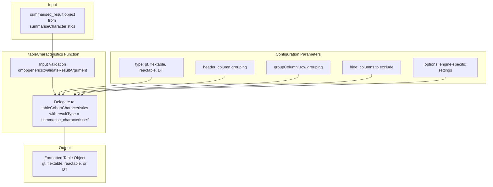
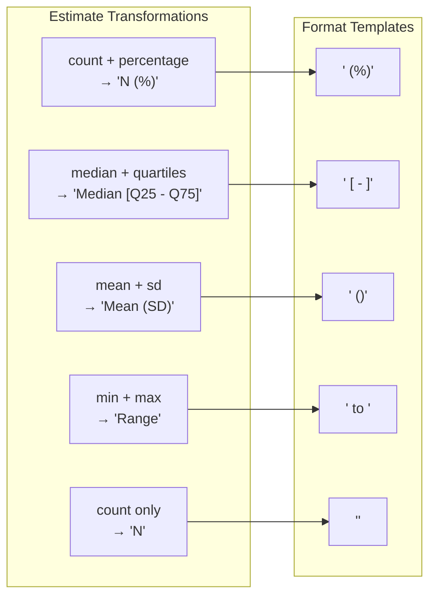
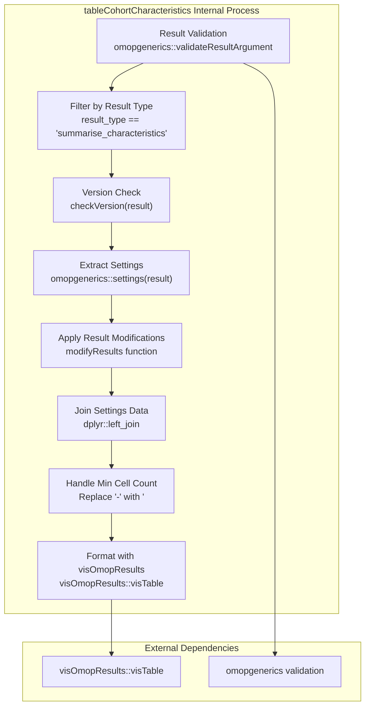
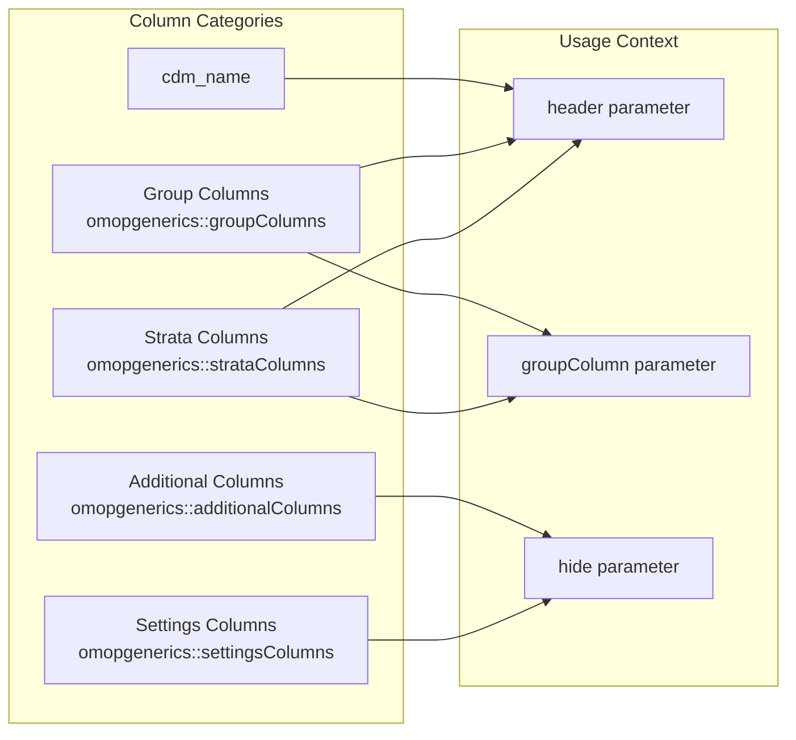

# Page: Characteristics Tables

# Characteristics Tables

Relevant source files

The following files were used as context for generating this wiki page:

- [NEWS.md](NEWS.md)
- [R/table.R](R/table.R)
- [R/tableCharacteristics.R](R/tableCharacteristics.R)

This document covers the table generation functionality for cohort characteristics analysis in the CohortCharacteristics package. The `tableCharacteristics` function formats `summarised_result` objects from characteristics analysis into interactive and static tables using various table rendering engines. This represents the final step in the three-tier analysis pattern (summarise→plot→table).

For information about generating the underlying characteristics data, see [Summarizing Characteristics](#3.1.1). For visualization options, see [Plotting Characteristics](#3.1.2).

## Main Function Overview

The `tableCharacteristics` function serves as the primary interface for converting characteristics analysis results into formatted tables. It accepts `summarised_result` objects and produces tables using different rendering engines.

**Table Generation Architecture**

Sources: [R/tableCharacteristics.R:41-68]()

The function signature includes several key parameters for table customization:

| Parameter | Purpose | Default Value |
|-----------|---------|---------------|
| `result` | Input summarised_result object | Required |
| `type` | Table rendering engine | `"gt"` |
| `header` | Columns for table headers | `c("cdm_name", "cohort_name")` |
| `groupColumn` | Columns for row grouping | `character()` |
| `hide` | Columns to hide from display | `c(additionalColumns(result), settingsColumns(result))` |
| `.options` | Engine-specific formatting options | `list()` |

Sources: [R/tableCharacteristics.R:41-46]()

## Table Customization Options

The function provides extensive customization through its parameters and integration with the `visOmopResults` ecosystem.

### Estimate Name Formatting

The function applies standardized formatting patterns for different types of estimates:

**Estimate Name Mapping and Templates**

Sources: [R/tableCharacteristics.R:58-64]()

### Column Management

The function automatically handles column visibility and organization:

- **Hidden by default**: Additional columns and settings columns via `additionalColumns(result)` and `settingsColumns(result)`
- **Renamed columns**: CDM name column gets user-friendly labeling
- **Filtered estimates**: Density plot data (`density_x`, `density_y`) is excluded from tables

Sources: [R/tableCharacteristics.R:45](), [R/tableCharacteristics.R:54-57]()

## Internal Implementation

The `tableCharacteristics` function delegates to the internal `tableCohortCharacteristics` function, which provides the core table generation logic shared across different analysis types.

**Internal Table Generation Process**

Sources: [R/table.R:60-125]()

### Settings Integration

The function integrates settings metadata from the analysis into the table structure:

- Extracts relevant settings columns excluding internal metadata (`result_id`, `result_type`, `package_name`, etc.)
- Joins settings data with result data for complete context
- Filters to only include settings for results present in the data

Sources: [R/table.R:86-107]()

### Cell Count Handling

The implementation includes special handling for minimum cell count suppression:

- Detects count estimates with suppressed values (marked as `"-"`)
- Replaces with formatted minimum cell count indicators (`"<5"`, etc.)
- Maintains data privacy requirements for small counts

Sources: [R/table.R:109-113]()

## Column Management Utilities

The package provides utility functions to help users understand available table customization options.

### Available Table Columns

The `availableTableColumns` function identifies columns that can be used in table configuration:

**Available Column Categories for Table Configuration**

Sources: [R/table.R:48-58]()

This differs from `availablePlotColumns` which additionally includes estimate names since plots can facet or color by estimate types.

Sources: [R/table.R:18-29]()

## Integration with Visualization Ecosystem

The table generation system integrates tightly with the broader OMOP visualization ecosystem, particularly `visOmopResults`.

### Table Engine Support

The function supports multiple table rendering engines through the `type` parameter:

| Engine | Package | Use Case |
|--------|---------|----------|
| `"gt"` | gt | Publication-quality static tables |
| `"flextable"` | flextable | Office document integration |
| `"reactable"` | reactable | Interactive web tables |
| `"DT"` | DT | Interactive data tables |

### Error Handling

The implementation includes robust error handling for edge cases:

- **No matching results**: Returns empty table when no results match the specified `result_type`
- **Missing dependencies**: Checks for `visOmopResults` installation before proceeding
- **Invalid inputs**: Validates result objects using `omopgenerics` standards

Sources: [R/table.R:71-82](), [R/table.R:126-129]()

The table generation system provides a comprehensive and flexible interface for creating formatted presentations of cohort characteristics analysis results, with strong integration into the OMOP Common Data Model ecosystem and support for multiple output formats.