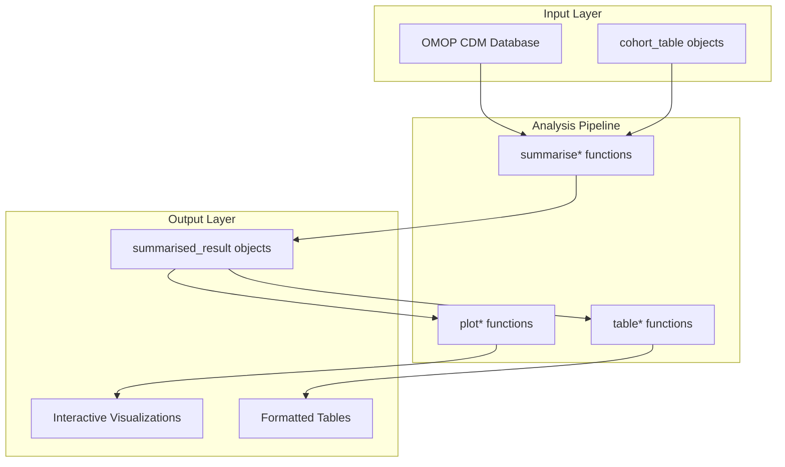
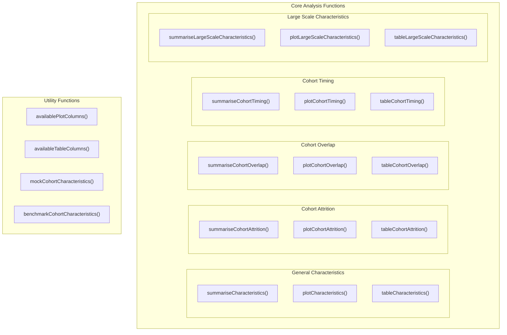
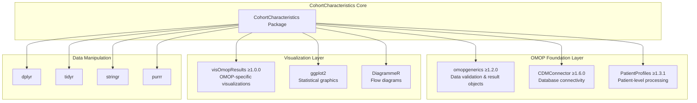
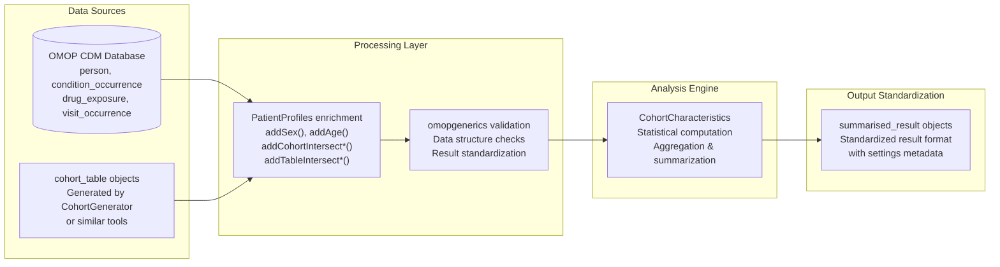

# Page: CohortCharacteristics Overview

# CohortCharacteristics Overview

<details>
<summary>Relevant source files</summary>

The following files were used as context for generating this wiki page:

- [DESCRIPTION](DESCRIPTION)
- [MD5](MD5)
- [NAMESPACE](NAMESPACE)

</details>


## Purpose and Scope

CohortCharacteristics is an R package designed to summarize and visualize characteristics of patient cohorts in data mapped to the Observational Medical Outcomes Partnership (OMOP) Common Data Model (CDM). The package provides a comprehensive toolkit for analyzing patient demographics, cohort overlaps, attrition patterns, temporal relationships, and large-scale characteristic distributions across healthcare datasets.

This document provides a high-level overview of the package architecture, core workflow patterns, and integration with the broader OMOP ecosystem. For detailed information about specific analysis types, see [Analysis Domains](#3). For installation and setup instructions, see [Installation and Setup](#1.2).

## Package Architecture

CohortCharacteristics implements a standardized three-tier analysis pattern that ensures consistency across all analysis types:

### Core Analysis Workflow



**Three-Tier Pattern**: Every analysis domain follows the pattern `summarise*()` → `plot*()` → `table*()`, where summarization creates standardized result objects that feed into visualization and table generation functions.

Sources: [NAMESPACE:23-38](), [DESCRIPTION:23-25]()

### Function Organization by Analysis Domain



Sources: [NAMESPACE:14-38]()

## OMOP Ecosystem Integration

CohortCharacteristics integrates tightly with the OMOP ecosystem through standardized interfaces and data structures:

### Dependency Architecture



**Key Integration Points**:
- `omopgenerics` provides the `summarised_result` class that standardizes all analysis outputs
- `CDMConnector` handles database connections to OMOP CDM instances
- `PatientProfiles` performs patient-level data enrichment before analysis
- `visOmopResults` provides standardized visualization functions for OMOP results

Sources: [DESCRIPTION:29-31](), [DESCRIPTION:39-45]()

## Analysis Domains

The package supports five primary analysis domains, each addressing different aspects of cohort characterization:

### Analysis Domain Overview

| Domain | Primary Function | Purpose |
|--------|------------------|---------|
| **General Characteristics** | `summariseCharacteristics()` | Demographics, intersections, custom variables |
| **Cohort Attrition** | `summariseCohortAttrition()` | Subject flow and exclusion tracking |
| **Cohort Overlap** | `summariseCohortOverlap()` | Subject intersections between cohorts |
| **Cohort Timing** | `summariseCohortTiming()` | Temporal relationships and intervals |
| **Large Scale Characteristics** | `summariseLargeScaleCharacteristics()` | Concept-level analysis across vocabularies |

### Data Flow Through Analysis Domains



**Processing Pattern**: All analyses follow the same data flow where OMOP CDM data and cohort definitions are enriched with patient-level information, validated for structure, processed through domain-specific analysis functions, and standardized into `summarised_result` objects.

Sources: [DESCRIPTION:23-25](), [NAMESPACE:40-52]()

## Core Components

### Result Object Standardization

All analysis functions return `summarised_result` objects that conform to the `omopgenerics` standard:

```mermaid
classDiagram
    class summarised_result {
        +result_id: integer
        +cdm_name: character
        +group_name: character
        +group_level: character
        +strata_name: character
        +strata_level: character
        +variable_name: character
        +variable_level: character
        +estimate_name: character
        +estimate_type: character
        +estimate_value: character
        +additional_name: character
        +additional_level: character
    }
    
    class settings {
        +result_id: integer
        +result_type: character
        +package_name: character
        +package_version: character
        +settings: list
    }
    
    summarised_result ||--|| settings : "linked by result_id"
```

**Standardization Benefits**: The consistent result format enables seamless integration with visualization and table functions across the OMOP ecosystem.

### Utility Infrastructure

The package provides supporting utilities for column management and testing:

| Function | Purpose |
|----------|---------|
| `availablePlotColumns()` | Lists available columns for plot customization |
| `availableTableColumns()` | Lists available columns for table formatting |
| `mockCohortCharacteristics()` | Generates mock data for testing |
| `benchmarkCohortCharacteristics()` | Performance benchmarking utilities |

Sources: [NAMESPACE:3-6](), [NAMESPACE:11-12]()

## Package Metadata

- **Version**: 1.0.0 (CRAN release)
- **License**: Apache License (>= 2)
- **Minimum R Version**: R (>= 4.1)
- **Primary Maintainer**: Marti Catala <marti.catalasabate@ndorms.ox.ac.uk>
- **Development**: Darwin EU initiative for OMOP CDM analytics

Sources: [DESCRIPTION:1-26](), [DESCRIPTION:32-33]()