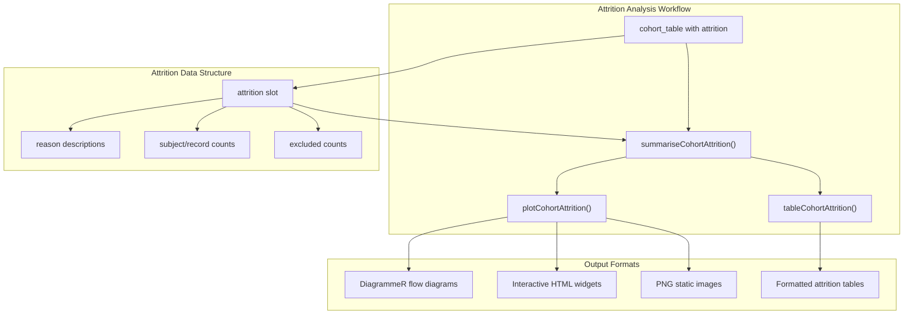
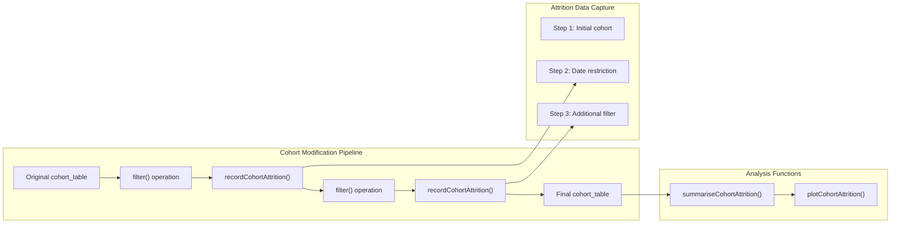
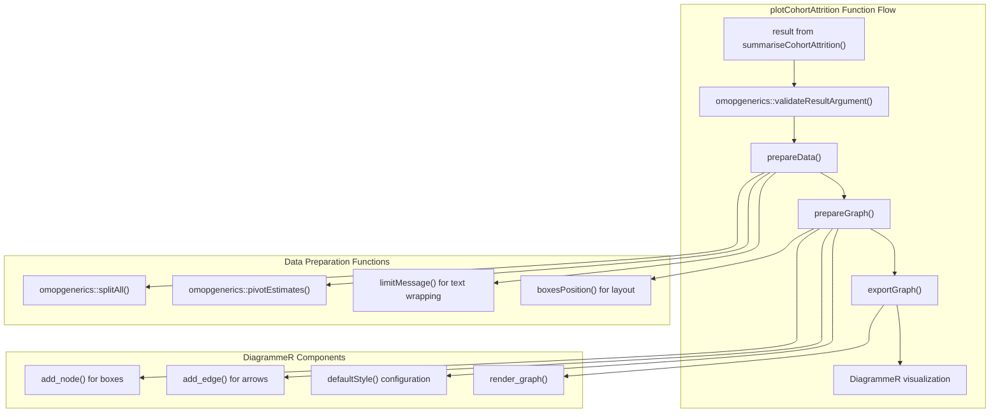
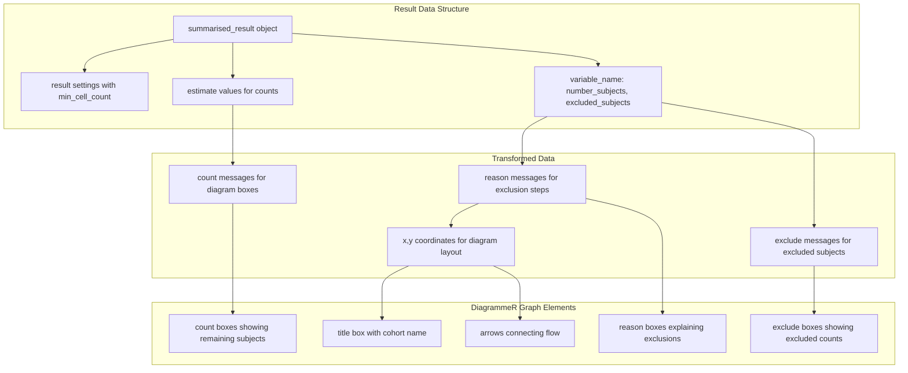

# Page: Cohort Attrition Analysis

# Cohort Attrition Analysis

Relevant source files

The following files were used as context for generating this wiki page:

- [R/plotCohortAttrition.R](R/plotCohortAttrition.R)
- [tests/testthat/test-plotCohortAttrition.R](tests/testthat/test-plotCohortAttrition.R)

Cohort attrition analysis tracks the flow of subjects through cohort definitions, documenting how many subjects and records are excluded at each step of the cohort creation process. This analysis type provides transparency into cohort construction by visualizing the impact of each inclusion/exclusion criterion on the final cohort size.

For detailed information about the summarization functions, see [Attrition Summarization](#3.2.1). For visualization capabilities, see [Attrition Visualization](#3.2.2). For table generation, see [Attrition Tables](#3.2.3).

## Overview

Cohort attrition analysis is essential for understanding how cohorts are constructed and ensuring reproducible research. It documents the step-by-step reduction in cohort size as various inclusion and exclusion criteria are applied. This analysis follows the standard three-tier pattern used throughout the CohortCharacteristics package: summarization, visualization, and table generation.

The attrition tracking leverages the `omopgenerics` package's built-in attrition recording capabilities, where each cohort modification operation can record its impact on subject and record counts. The `CohortCharacteristics` package then processes this attrition data to create standardized flow diagrams and summary tables.

**Sources:** [R/plotCohortAttrition.R:1-421]()

## Attrition Tracking Integration

The cohort attrition analysis integrates with the OMOP ecosystem's standardized attrition tracking mechanism. When cohorts are modified using operations like filtering or joining, these operations can record their impact using `omopgenerics::recordCohortAttrition()`. This creates a structured log of all transformations applied to the cohort.

**Sources:** [tests/testthat/test-plotCohortAttrition.R:4-9](), [R/plotCohortAttrition.R:40-47]()

## Visualization Architecture

The attrition visualization system uses `DiagrammeR` to create flow diagrams that clearly show the progression of subjects through cohort inclusion/exclusion steps. The visualization supports multiple output formats and can display both subject counts and record counts simultaneously.

**Sources:** [R/plotCohortAttrition.R:56-111](), [R/plotCohortAttrition.R:151-189](), [R/plotCohortAttrition.R:190-307]()

## Data Flow and Structure

The attrition analysis processes structured result objects that contain both the numeric data (subject counts, exclusion counts) and metadata (exclusion reasons, cohort names). The data preparation phase transforms this into a format suitable for diagram generation.

| Component | Function | Purpose |
|-----------|----------|---------|
| `prepareData()` | [R/plotCohortAttrition.R:151-189]() | Transforms result data into diagram format |
| `limitMessage()` | [R/plotCohortAttrition.R:128-150]() | Wraps long text for display in diagram boxes |
| `prepareGraph()` | [R/plotCohortAttrition.R:190-307]() | Creates DiagrammeR graph structure |
| `boxesPosition()` | [R/plotCohortAttrition.R:369-417]() | Calculates spatial layout of diagram elements |
| `defaultStyle()` | [R/plotCohortAttrition.R:328-368]() | Defines visual styling parameters |

The visualization supports flexible display options through the `show` parameter, which can display "subjects", "records", or both. The system also handles edge cases like empty results or missing data by generating appropriate warning diagrams.

**Sources:** [R/plotCohortAttrition.R:151-189](), [R/plotCohortAttrition.R:369-417]()

## Output Format Support

The attrition visualization system supports multiple output formats to accommodate different use cases, from interactive exploration to publication-ready static images.

| Format | Type | Use Case |
|--------|------|----------|
| `"htmlwidget"` | Interactive | Default format for RStudio/Jupyter |
| `"png"` | Static Image | Publication figures |
| `"svg"` | Vector Image | Scalable graphics |
| `"DiagrammeR"` | Raw Object | Further programmatic manipulation |

The PNG export functionality uses `DiagrammeRsvg` and `rsvg` packages to convert the vector-based DiagrammeR output into raster format, with automatic width scaling based on the number of cohorts being displayed.

**Sources:** [R/plotCohortAttrition.R:308-327](), [R/plotCohortAttrition.R:56-65]()