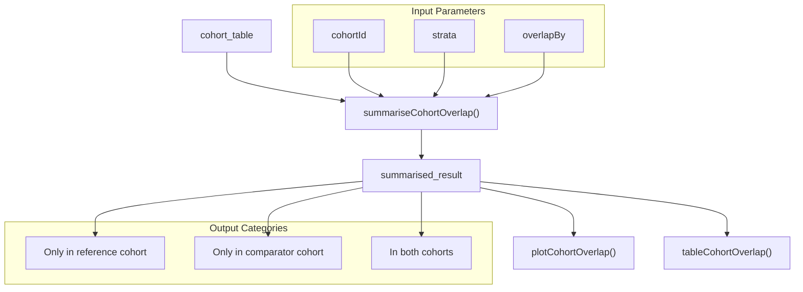
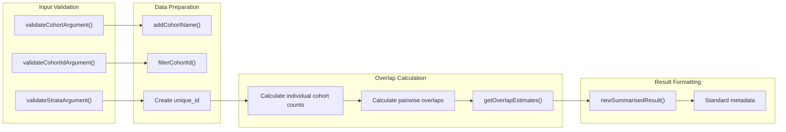
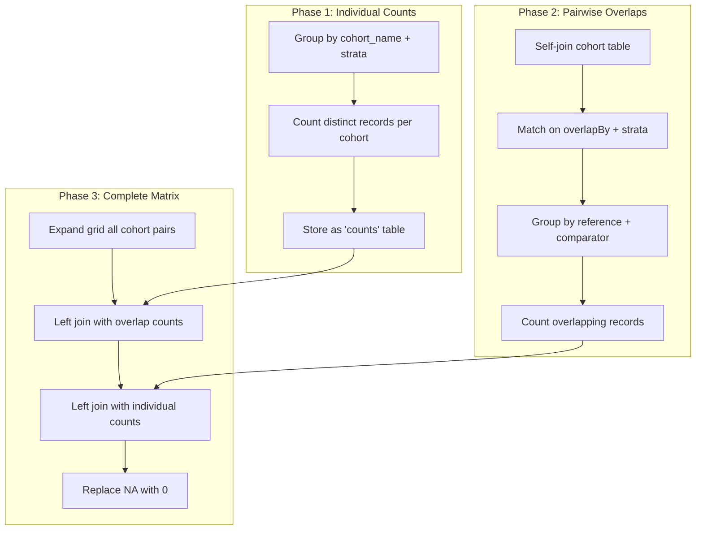
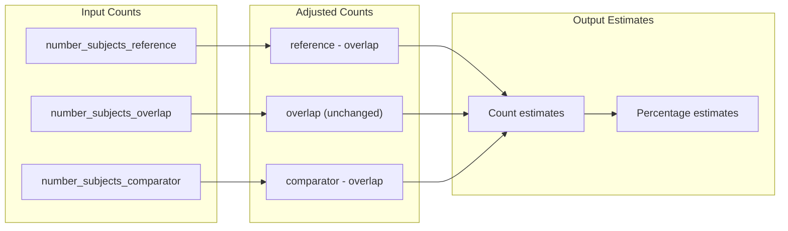
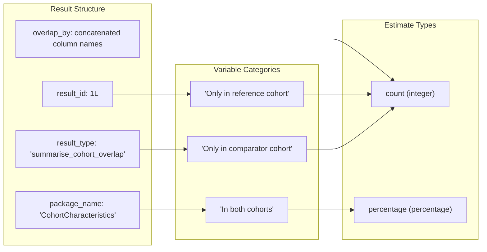

# Page: Cohort Overlap Analysis

# Cohort Overlap Analysis

Relevant source files

The following files were used as context for generating this wiki page:

- [R/summariseCohortOverlap.R](R/summariseCohortOverlap.R)
- [inst/doc/summarise_cohort_overlap.html](inst/doc/summarise_cohort_overlap.html)

Cohort overlap analysis examines the intersection of subjects (or records) between different cohorts within a cohort table. This analysis quantifies how many subjects appear in multiple cohorts, providing insights into cohort composition and potential patient pathway overlaps.

For information about cohort attrition analysis, see [3.2](#3.2). For cohort timing analysis between entry dates, see [3.4](#3.4).

## Purpose and Workflow

The cohort overlap analysis follows the standard three-tier pattern: `summariseCohortOverlap()` generates standardized overlap statistics, which can then be visualized with plotting functions or formatted into tables. The analysis calculates both absolute counts and percentages for subjects appearing exclusively in each cohort versus those appearing in both cohorts.

Sources: [R/summariseCohortOverlap.R:40-189]()

## Core Function Architecture

The `summariseCohortOverlap()` function implements a systematic approach to cohort intersection analysis through several key phases:

Sources: [R/summariseCohortOverlap.R:44-53](), [R/summariseCohortOverlap.R:69-74](), [R/summariseCohortOverlap.R:98-168]()

## Key Parameters and Configuration

### Record Identification Strategy

The `overlapBy` parameter determines how records are matched between cohorts. The default `"subject_id"` identifies unique subjects, but multiple columns can be specified for more granular record matching:

| Parameter | Type | Purpose | Default |
|-----------|------|---------|---------|
| `overlapBy` | `character` | Columns for record identification | `"subject_id"` |
| `cohortId` | `integer` | Specific cohorts to analyze | `NULL` (all) |
| `strata` | `list` | Stratification variables | `list()` |

The function handles multi-column `overlapBy` by creating a unique identifier when `length(overlapBy) > 1`, ensuring proper record matching across cohorts.

Sources: [R/summariseCohortOverlap.R:77-92](), [R/summariseCohortOverlap.R:94]()

## Overlap Calculation Algorithm

The core overlap calculation follows a systematic approach using SQL-based operations for scalability:

Sources: [R/summariseCohortOverlap.R:100-106](), [R/summariseCohortOverlap.R:115-127](), [R/summariseCohortOverlap.R:133-160]()

## Statistical Estimates Generation

The `getOverlapEstimates()` function transforms raw overlap counts into meaningful statistical measures:

The function generates both absolute counts and percentages, where percentages are calculated as proportions of the total unique subjects across both cohorts.

Sources: [R/summariseCohortOverlap.R:191-223](), [R/summariseCohortOverlap.R:194-197](), [R/summariseCohortOverlap.R:209-212]()

## Integration with Package Ecosystem

### Data Dependencies

The overlap analysis relies on key package components for data validation and processing:

- `omopgenerics::validateCohortArgument()` - Ensures proper cohort table structure
- `PatientProfiles::addCohortName()` - Enriches data with human-readable cohort names
- `PatientProfiles::filterCohortId()` - Applies cohort filtering consistently

### Output Standardization

Results conform to the `summarised_result` standard used throughout the package:

Sources: [R/summariseCohortOverlap.R:177-183](), [R/summariseCohortOverlap.R:170-176]()

## Performance and Scalability Considerations

The function implements several optimization strategies for large datasets:

- **Temporary Table Management**: Creates temporary tables using `omopgenerics::uniqueTableName()` and properly cleans them up
- **Lazy Evaluation**: Uses `dplyr::compute()` to materialize intermediate results only when necessary  
- **Efficient Joins**: Performs overlap calculations using database-native join operations rather than R memory operations
- **Unique ID Generation**: Optimizes multi-column `overlapBy` scenarios by creating single-column identifiers

Sources: [R/summariseCohortOverlap.R:65](), [R/summariseCohortOverlap.R:74](), [R/summariseCohortOverlap.R:185-186]()